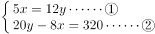
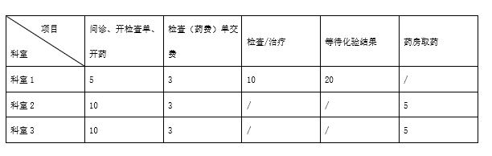
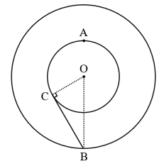
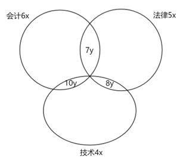

# 2023年北京市公务员录用考试《行测》题（网友回忆版）

> 数量关系 · 20 题 · 北京 2023

## 第 1 题　qid 5484026 · 数学运算

张、王、李三人总共有120本书，张、王的书分别是李的2倍和5倍，则王有多少本书？

- **A**. 65
- **B**. 70
- **C**. 75　✅
- **D**. 80

**答案**：C

**官方解析**

设李有x本书，则张有2x本书，王有5x本书。根据题意可得：x+2x+5x=120，解得：x=15，则王有5x=75本书。
故正确答案为C。

---

## 第 2 题　qid 5484027 · 数学运算

一件商品售价100元/件时，卖出4件的利润与售价80元/件时卖6件的利润相同。则这种商品的成本是多少元/件？

- **A**. 30
- **B**. 40　✅
- **C**. 50
- **D**. 60

**答案**：B

**官方解析**

设这种商品的成本是x元/件，根据题意可得：（100-x）×4=（80-x）×6，解得x=40，即这种商品的成本是40元/件。
故正确答案为B。

---

## 第 3 题　qid 5484028 · 数学运算

某企业甲、乙、丙三个办事处共有100名员工，其中甲办事处有30名员工，乙办事处的员工比甲办事处多20%，则丙办事处的员工比甲办事处：

- **A**. 多4人　✅
- **B**. 多2人
- **C**. 少4人
- **D**. 少2人

**答案**：A

**官方解析**

根据题意，乙办事处有30×（1+20%）=36名员工。根据“甲、乙、丙三个办事处共有100名员工”，可得丙办事处有100-30-36=34名员工，则丙办事处的员工比甲办事处多34-30=4人。
故正确答案为A。

---

## 第 4 题　qid 5484006 · 数学运算

某公司去年的营业额比前年高20%，今年的营业额比去年高360万元，比前年高600万元。这3年的营业额一共是多少万元？

- **A**. 4200
- **B**. 4440　✅
- **C**. 4680
- **D**. 4920

**答案**：B

**官方解析**

设该公司前年的营业额为x万元，去年的营业额为1.2x万元，今年的营业额为（1.2x+360）万元。根据题意可列方程：（1.2x+360）-x=600，解得x=1200，则这3年的营业额一共是x+1.2x+（x+600）=3.2x+600=4440万元。
故正确答案为B。

---

## 第 5 题　qid 5483978 · 数学运算

一块正方形田地的周长是240米，另一块长方形田地的周长比这块正方形田地长60米，面积与这块正方形田地一样。则长方形田地的长比宽长多少米？

- **A**. 60
- **B**. 70
- **C**. 80
- **D**. 90　✅

**答案**：D

**官方解析**

根据“一块正方形田地的周长是240米”，可计算正方形田地的边长为米，则正方形田地的面积为60×60=3600平方米。设长方形田地的长为a米，宽为b米，根据“长方形田地的周长比这块正方形田地长60米”，可列式：2（a+b）=240+60=300，即a+b=150······①；根据“面积与这块正方形田地一样”，可列式：a×b=3600······②。联立①②解得：a=120，b=30，则长方形田地的长比宽长120-30=90米。

故正确答案为D。

---

## 第 6 题　qid 5483981 · 数学运算

企业生产1件甲产品需要20千克A原料，在改进生产技术后，一吨A原料可以生产的甲产品数量比以前多了30件，则生产1件甲产品需要的A原料比之前节约了多少千克？

- **A**. 5
- **B**. 6
- **C**. 7.5　✅
- **D**. 9

**答案**：C

**官方解析**

由一吨=1000千克可知，企业在改进生产技术前，一吨A原料可生产甲产品个，改进生产技术后可生产50+30=80个，那么改进生产技术后，生产1件甲产品需要的A原料为千克。则生产1件甲产品需要的A原料比之前节约了20-12.5=7.5千克。

故正确答案为C。

---

## 第 7 题　qid 5483984 · 数学运算

从A地到B地是下坡路，一辆车从A地开往B地需要三小时，从B地开往A地需要四小时。已知这辆车下坡速度比上坡速度快15千米/小时，则A、B两地之间的距离是多少千米？

- **A**. 120
- **B**. 180　✅
- **C**. 240
- **D**. 300

**答案**：B

**官方解析**

方法一：根据题意上、下坡需要的时间之比为4：3，而路程一定，速度与时间成反比，可得上、下坡的速度之比为3：4。根据“这辆车下坡速度比上坡速度快15千米/小时”，则下坡速度与上坡速度之差为1份=15千米/小时，可得上坡速度=15×3=45千米/小时，下坡速度=15×4=60千米/小时，故A、B两地之间的距离=60×3=180千米。
方法二：设上坡速度为v，则下坡速度为v+15，根据上下坡路程相同可得：3（v+15）=4v，解得v=45千米/小时，故A、B两地之间的距离=45×4=180千米。
故正确答案为B。

---

## 第 8 题　qid 5483987 · 数学运算

某个品牌的洗洁精分为大瓶、小瓶两种包装，5大瓶洗洁精的总容量与12小瓶相同，8大瓶洗洁精的总容量比20小瓶少320毫升，则一大瓶洗洁精的容量是多少毫升？

- **A**. 960　✅
- **B**. 1000
- **C**. 1080
- **D**. 1200

**答案**：A

**官方解析**

设大瓶洗洁精每瓶的容量为x毫升，小瓶洗洁精每瓶的容量为y毫升，根据题意可得：，解得x=960，y=400，则大瓶洗洁精每瓶的容量为960毫升。

故正确答案为A。

---

## 第 9 题　qid 5483989 · 数学运算

某单位有甲、乙两个处室，甲处室有职工14名，如从乙处室调动25%的职工到甲处室，再从甲处室调动2名职工到乙处室后，两个处室人数相同。则乙处室原来有多少名职工？

- **A**. 12
- **B**. 16
- **C**. 20　✅
- **D**. 24

**答案**：C

**官方解析**

设乙处室原来有4x名职工，根据题意可得，解得x=5，则4x=20，即乙处室原来有20名职工。

故正确答案为C。

---

## 第 10 题　qid 5483991 · 数学运算

甲、乙两个工程队被安排实施某个工程。甲工程队先施工，用了15天完成了一半，剩下部分甲、乙合作，比前一半的用时短了9天。则乙工程队独立完成整个工程需要多少天？

- **A**. 10
- **B**. 15
- **C**. 16
- **D**. 20　✅

**答案**：D

**官方解析**

赋值工作总量为60，则甲的工作效率为，甲、乙合作的工作效率为，可知乙的工作效率为5-2=3，故乙工程队独立完成整个工程需要天。

故正确答案为D。

---

## 第 11 题　qid 5483983 · 数学运算

某种农作物原来亩产为600千克，改进种植技术后，亩产增加100千克，且由于品质改善，每千克的售价提高1元，每亩产值比之前增加1100元。则原来每亩产值是多少元?

- **A**. 1800
- **B**. 2100
- **C**. 2400　✅
- **D**. 2700

**答案**：C

**官方解析**

设农作物原来每千克的售价为x元，根据“每亩产值比之前增加1100元”，代入公式：产值=产量×售价，可得：，解得x=4，则原来每亩产值=600千克×4元/千克=2400元。

故正确答案为C。

---

## 第 12 题　qid 5483986 · 数学运算

一个房间地面为4.8×6米的标准长方形，现用30×30厘米或60×60厘米的瓷砖铺满该房间地面，两种情况下瓷砖之间缝隙的总长度分别为x米和y米。则x和y的差值为：

- **A**. 96　✅
- **B**. 48
- **C**. 24
- **D**. 192

**答案**：A

**官方解析**

记房间地面长a=6米，宽b=4.8米，则分情况讨论：

①若用30×30厘米（即0.3×0.3米）的瓷砖铺满地面，则该地面的长和宽分别需要块和块，即瓷砖之间缝隙为19个宽边和15个长边纵横交错，则总长度米；

②若用60×60厘米（即0.6×0.6米）的瓷砖铺满地面，则该地面的长和宽分别需要块和块，即瓷砖之间缝隙为9个宽边和7个长边纵横交错，则总长度米。

则米。

故正确答案为A。

---

## 第 13 题　qid 5483988 · 数学运算

甲和乙两个办公室分别选出2人听一个讲座。如每个办公室均随机选择，则甲办公室员工小刘和小陈同时被选中的概率正好为10%。乙办公室员工小吴被选中的概率为20%，则两个办公室共有多少名员工？

- **A**. 11
- **B**. 15　✅
- **C**. 16
- **D**. 20

**答案**：B

**官方解析**

设甲办公室有x人，乙办公室有y人。根据题意可知：甲办公室随机选择2人共有种情况；小刘和小陈同时被选中为1种情况，则甲办公室同时选中小刘和小陈的概率为，解得x=5，即甲办公室共有5人。乙办公室随机选择2人共有种情况；小吴被选中后，还需要在余下的（y-1）人中随机选择1人，此时有种情况，则乙办公室选中小吴的概率为，根据公式整理可得，解得y=10，即乙办公室共有10人。则两个办公室共有5+10=15名员工。

故正确答案为B。

---

## 第 14 题　qid 5483990 · 数学运算

28名运动员在羽毛球馆打比赛，馆内共有10块羽毛球场地，所有运动员都要上场比赛，或者参加单打比赛，或者参加双打比赛。如果保证每名运动员都在打比赛，且每块羽毛球场地上都有运动员在打比赛，则有多少名运动员参加双打比赛？

- **A**. 20
- **B**. 24
- **C**. 12
- **D**. 16　✅

**答案**：D

**官方解析**

根据题意，设有x块羽毛球场地进行双打比赛，则有（10-x）块羽毛球场地进行单打比赛。每场双打比赛需双方共计4名运动员参加，每场单打比赛需双方共计2名运动员参加，根据运动员总人数为28人，可列方程：4x+2×（10-x）=28，解得x=4，故有4×4=16名运动员参加双打比赛。
故正确答案为D。

---

## 第 15 题　qid 5483993 · 数学运算

小王去医院看病，上午要看3个科室的门诊（已提前完成了挂号取号）。

以下是当天小王在医院发生的所有诊疗相关活动和相应的时间（单位：分钟）。已知同一科室靠左的项目完成后才能进行靠右的项目且每个项目只进行1次，等待化验结果时可以进行其他科室的项目，且多个科室的交费环节或多个科室的取药环节可以合并一次完成。则小王完成所有诊疗活动最少需要多少分钟？

- **A**. 74
- **B**. 63
- **C**. 54
- **D**. 46　✅

**答案**：D

**官方解析**

要想使完成所有诊疗活动所需时间最少，则能合并完成的活动尽量合并完成。对于科室1所需时间为5+3+10+20=38分钟，在等待化验结果的20分钟内，可以顺便完成科室2和科室3的问诊、开检查单、开药这两项活动（共计20分钟）；同时科室2和科室3的检查（药费）单交费活动可以合并完成，只需3分钟；同理科室2和科室3的药房取药活动也可以同时完成，只需5分钟。故小王完成所有诊疗活动最少需要38+3+5=46分钟。
故正确答案为D。

---

## 第 16 题　qid 5483994 · 数学运算

现有6根钢筋，长度分别为4尺、7尺、8尺、9尺、10尺和12尺。现每次抽取3根首尾相连组成一个三角形，则一共能组成多少个不同的三角形？

- **A**. 20
- **B**. 19
- **C**. 18　✅
- **D**. 17

**答案**：C

**官方解析**

方法一：根据题意，从6根钢筋中每次抽取3根，共有种情况，若想构成三角形需满足“两边之和大于第三边，两边之差小于第三边”，任意抽取3根中不满足该条件的有4、7、12以及4、8、12两种情况，则一共能组成20-2=18个不同的三角形。

方法二：根据枚举法，满足题意的情况数分别为：

①当抽取到4和7时，第三边可以为：8、9、10共三种情况；

②当抽取到4和8时，第三边可以为：9、10共两种情况；

③当抽取到4和9时，第三边可以为：10、12共两种情况；

④当抽取到4和10时，第三边可以为：12一种情况；

⑤当抽取到7和8时，第三边可以为：9、10、12共三种情况；

⑥当抽取到7和9时，第三边可以为：10、12共两种情况；

⑦当抽取到7和10时，第三边可以为：12一种情况；

⑧当抽取到8和9时，第三边可以为：10、12共两种情况；

⑨当抽取到8和10时，第三边可以为：12一种情况；

⑩当抽取到9和10时，第三边可以为：12一种情况；

则一共能组成3+2+2+1+3+2+1+2+1+1=18个不同的三角形。

故正确答案为C。

---

## 第 17 题　qid 5483968 · 数学运算

一个半径为120米的圆形人工湖正中有一个半径为60米的圆形人工岛。甲从岛的正北岸边出发，以1米/秒的速度匀速划船前往湖的正南岸边，则最少需要多长时间？

- **A**. 不到3分45秒
- **B**. 3分45秒~4分之间　✅
- **C**. 4分~4分15秒之间
- **D**. 超过4分15秒

**答案**：B

**官方解析**

如图所示，甲从岛的正北岸边A点出发前往湖的正南岸边B点，因“两点之间直线段最短”，因此甲应该尽量多走直线，故最短路径是从A点先沿人工岛的圆弧到达C点，再沿直线到达B点。BC是圆的切线，则，在中， OC=60米，OB=120米，可得米，，则圆弧AC的弧长米。因此甲从A点匀速划船前往B点最少需要秒=3分49.4秒，在B项范围内。

故正确答案为B。

---

## 第 18 题　qid 5483972 · 数学运算

某车库有10个并排的车位，有3辆不同的车要停进这10个车位之中，而且彼此不能相邻，则有多少种不同的停放方法？

- **A**. 336　✅
- **B**. 246
- **C**. 156
- **D**. 66

**答案**：A

**官方解析**

根据题意，3辆车彼此不能相邻，可用插空法。10个车位剩余10-3=7个，形成8个空，停放3辆不同的车，有顺序，则有种不同的停放方法。

故正确答案为A。

---

## 第 19 题　qid 5483977 · 数学运算

某单位3个部门共有员工50人，拥有中级工程师职称的人员比重为40%。其中甲、乙两个部门拥有中级工程师职称的人员比重分别为45％和32%，则丙部门拥有中级工程师职称的人员比重为：

- **A**. 60%　✅
- **B**. 52%
- **C**. 44%
- **D**. 36%

**答案**：A

**官方解析**

根据题意可知，，即甲部门员工总数为20的整数倍；同理可知，，即乙部门员工总数为25的整数倍。因为3个部门共有员工50人，则甲部门员工总数只能为20人，乙部门员工总数只能为25人，故丙部门员工总数=50-20-25=5人，丙部门拥有中级工程师职称人数人。那么所求比重为。

故正确答案为A。

---

## 第 20 题　qid 5483980 · 数学运算

某公司有80人报名参加会计、法律和技术三项培训中的一项或多项，三项培训的报名人数比为6：5：4。已知同时参加会计和法律培训的人数，和同时参加法律和技术培训的人数，分别是同时参加会计和技术培训的人数的70％和80%，且无人同时参加3项培训，则只参加技术培训的有多少人？

- **A**. 4
- **B**. 6
- **C**. 8
- **D**. 10　✅

**答案**：D

**官方解析**

根据题意可知，会计、法律和技术三项培训的报名人数分别为6、5、4的倍数，故设三者分别为6x、5x、4x，同时参加会计和技术培训的人数为10y，则同时参加会计和法律培训的人数为7y，同时参加法律和技术培训的人数为8y。由三集合容斥原理标准型公式：，可得6x+5x+4x-7y-10y-8y+0=80-0，整理可得3x-5y=16。因总人数为80人，则有6x＜80，解得x＜13.3，又因为5y的尾数为0或5，则3x的尾数只能为6或1，故x可取2、7、12。代入如下：

①当x=2时，解得y为负数，不符合题意；

②当x=7时，解得y＝1，只参加技术培训的=4x-10y-8y=10人；

③当x＝12时，解得y＝4，则4x＜10y＋8y，只参加技术培训的为负数，不符合题意。

故正确答案为D。

---
