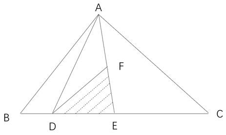
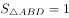
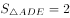
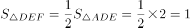
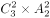
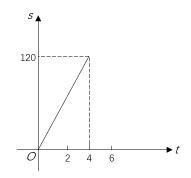
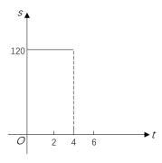
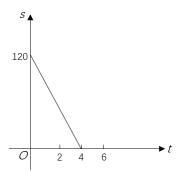
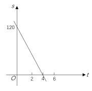

# 2023年吉林省公务员录用考试《行测》题（网友回忆版）

> 数量关系 · 10 题 · 吉林 2023

## 第 1 题　qid 5509706 · 数学运算

轨道交通公司定期进行轨道检修工作，甲、乙两个工程队合作进行需4小时完成，甲队单独完成比乙队单独完成快15小时，则甲队单独完成需要的时间是：

- **A**. 5小时　✅
- **B**. 6小时
- **C**. 7小时
- **D**. 8小时

**答案**：A

**官方解析**

方法一：设甲队的完工时间为x小时，乙队的完工时间为（x+15）小时，赋值工作总量为1，则甲队的效率为，乙队的效率为，根据甲、乙两队合作需4小时可知，甲乙两队效率和为，列方程：，解得x=5或x=-12，其中x=-12不符合题意舍弃，则x=5。

方法二：采用代入排除法。代入A项，甲队的完工时间为5小时，乙队的完工时间为20小时，赋值工作总量为20，则乙队的效率为20÷20=1，甲队的效率为20÷5=4，甲、乙两队合作需20÷（1+4）=4小时，符合题意。

故正确答案为A。

---

## 第 2 题　qid 5509713 · 数学运算

某电子元件制造厂有甲、乙、丙三个车间，甲、乙、丙三个车间的产量分别占总产量的5%、70%、25%，且甲、乙、丙三个车间的次品率依次为4%、3%、2%。任取一件产品，取到次品为乙车间制造的概率是：

- **A**. 15%
- **B**. 45%
- **C**. 75%　✅
- **D**. 85%

**答案**：C

**官方解析**

根据甲、乙、丙三个车间的产量分别占总产量的5%、70%、25%，赋值总产量为1000个，则甲、乙、丙三个车间的产量分别为50个、700个、250个。那么甲车间制造的次品为50×4%=2个，乙车间制造的次品为700×3%=21个，丙车间制造的次品为250×2%=5个。因此取到次品为乙车间制造的概率。

故正确答案为C。

---

## 第 3 题　qid 5509708 · 数学运算

某医院因工作出现特殊情况需要从外科抽调医护人员支援呼吸科，如果少去4名护士，那么参与支援的护士与参与支援的医生人数一样多，如果少去2名医生，那么参与支援的护士人数是参与支援的医生人数的3倍，则外科参与支援呼吸科的医护人员总数是：

- **A**. 8
- **B**. 10
- **C**. 12
- **D**. 14　✅

**答案**：D

**官方解析**

设外科参与支援呼吸科的护士有x人，则参与支援呼吸科的医生有（x-4）人。根据题意可列方程：x=3[（x-4）-2]，解得x=9，则所求=x+（x-4）=2x-4=2×9-4=14人。
故正确答案为D。

---

## 第 4 题　qid 5509710 · 数学运算

为推动产业园和产业集聚区加快转型，某地计划在三角形ABC区域内建设新能源产业园区（如下图所示），三角形DEF是中央工厂区，已知BD：DE：EC=1：2：3，F为AE的中点，则新能源产业园区总面积是中央工厂区面积的：

- **A**. 7倍
- **B**. 6倍　✅
- **C**. 5倍
- **D**. 4倍

**答案**：B

**官方解析**

因为、、高相同，则。赋值，则，，则。因为F为AE中点，则AF=EF，又因为、高相同，所以，则，那么，即新能源产业园区总面积是中央工厂区面积的6倍。

故正确答案为B。

---

## 第 5 题　qid 5509715 · 数学运算

教育平台的网络课程由阅读资料、观看视频、论坛交流、练习作业和问卷考试五部分学习内容组成。学员需先后完成这五部分学习内容，其中论坛交流与练习作业均不能在最先和最后完成，则学员安排学习的顺序共有：

- **A**. 120种
- **B**. 72种
- **C**. 36种　✅
- **D**. 24种

**答案**：C

**官方解析**

先在阅读资料、观看视频和问卷考试3个部分中选2个安排在最先和最后的位置，有种顺序。再在剩下3个位置安排剩余3个部分，有种顺序，总共有种顺序。

故正确答案为C。

---

## 第 6 题　qid 5509622 · 数学运算

在一次“互联网+现代农业”培训会后，为了交流拓展农村电商产业路径，要求各地参会代表一周内每两人互通一次电话，已知他们一周内共打了120次电话，这次参与培训交流的人数是：

- **A**. 20
- **B**. 18
- **C**. 16　✅
- **D**. 15

**答案**：C

**官方解析**

设这次参与培训交流的人数为n人，根据题干“各地参会代表一周内每两人通话一次，一周内共打了120次电话”，可得，解得n=16。

故正确答案为C。

---

## 第 7 题　qid 5509623 · 数学运算

为加快推进县域交通基础设施内畅外联、互联互通，A、B两地新修建了一条高速公路。甲、乙两辆汽车在这条高速公路上同时从A、B两地相向开出，甲车每小时行驶74千米，乙车每小时行驶65千米，两车在距中点18千米处相遇。这条连通A、B两地的高速公路全长是：

- **A**. 139千米
- **B**. 256千米
- **C**. 278千米
- **D**. 556千米　✅

**答案**：D

**官方解析**

设连通A、B两地的高速公路全长是2S千米，则一半为S千米。因甲车速度快于乙车速度，则相遇时甲车行驶的路程为（S+18）千米，乙车行驶的路程为（S-18）千米。根据时间一定，路程与速度成正比，可得：，解得S=278，则这条连通A、B两地的高速公路全长是2S=556千米。

故正确答案为D。

---

## 第 8 题　qid 5509624 · 数学运算

像中国的回文联“洞帘水挂水帘洞，山果花开花果山”一样，如果将一个数的数字倒排后所得的数仍是这个数，这样的数称为回文数，例如11，22，343，565，1881，20102等，在所有三位数中回文数共有：

- **A**. 81个
- **B**. 90个　✅
- **C**. 99个
- **D**. 100个

**答案**：B

**官方解析**

根据题意三位数是回文数的情况数，即百位数字和个位数字相同，且由于三位数的百位数字不能为0，只能是1-9中的任意一个，十位数字可以是0-9中的任意一个，故所有三位数中回文数共有9×10=90个。
故正确答案为B。

---

## 第 9 题　qid 5509632 · 数学运算

一辆大货车由M地匀速驶向相距120千米的N地，它的速度是30千米/小时，则该辆大货车与N地的距离s（千米）和行驶时间t（小时）之间的关系用图像表示应为：

- **A**. 

- **B**. 

- **C**. 

　✅
- **D**. 

**答案**：C

**官方解析**

根据题意，大货车从M地匀速行驶至N地的时间，即当t为4时，大货车与N地的距离s为0，排除A、B两项。又因该货车从M地出发，到N地停止，则s的区间应为0～120，排除D项。

故正确答案为C。

---

## 第 10 题　qid 5509634 · 数学运算

某商场柜台出售一款小家电，如果按定价打九折出售可获得利润70元，如果按定价打九五折出售可获得利润100元，这款小家电进货价格所在区间是：

- **A**. 400-450元
- **B**. 450-500元　✅
- **C**. 500-550元
- **D**. 550-600元

**答案**：B

**官方解析**

设小家电进货价格为x元，定价为y元。根据公式：利润=售价-进价，可得0.9y-x=70······①，0.95y-x=100······②，联立①②，解得x=470，y=600，即小家电进货价格所在区间在450-500元之间。
故正确答案为B。

---
