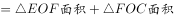
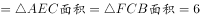
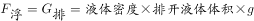
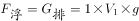
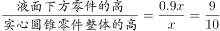
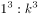

# 2023年国家公务员录用考试《行测》题（副省级网友回忆版）

> 数量关系 · 14 题 · 国考 2023

## 第 1 题　qid 5445874 · 数学运算

商店销售某种商品，打八折销售时卖2件的利润与按定价销售时卖1件的利润相同，相当于降价120元/件销售时卖3件的利润。问该商品的定价为多少元/件？

- **A**. 360
- **B**. 450　✅
- **C**. 540
- **D**. 720

**答案**：B

**官方解析**

设该商品每件定价为x元，成本为y元，根据题意可得：x-y=（80%x-y）×2······①，x-y=（x-120-y）×3······②，联立①②，解得x=450，即该商品的定价为450元/件。
故正确答案为B。

---

## 第 2 题　qid 5445717 · 数学运算

一项工作甲独立完成需要3小时，乙独立完成的用时比其与甲合作完成多4小时，且乙和丙合作完成需要4小时。问丙独立完成需要多少小时？

- **A**. 10
- **B**. 12　✅
- **C**. 6
- **D**. 8

**答案**：B

**官方解析**

赋值工作总量为12，则甲的效率为，乙、丙合作的效率为。设乙的效率为x，根据“乙独立完成的用时比其与甲合作完成多4小时”，可得：，解得：x=2，即乙的效率为2，则丙的效率为3-2=1。因此，丙独立完成需要小时。

故正确答案为B。

---

## 第 3 题　qid 5445938 · 数学运算

工厂生产甲、乙两种设备，需要用到A、B、C三种零件。其中生产1台甲设备需要5个A零件和11个B零件，生产1台乙设备需要4个B零件和9个C零件。工厂某日生产的一批设备共用A、B、C三种零件不超过200个，其中C零件的用量超过100个。问最多可能生产了多少台甲设备？

- **A**. 1
- **B**. 2　✅
- **C**. 3
- **D**. 4

**答案**：B

**官方解析**

要让甲设备数量最多，则需要让乙设备数量最少。因为只有乙设备用到了C零件，根据“生产1台乙设备需要4个B零件和9个C零件······其中C零件的用量超过100个”，则乙设备数量最少为101÷9=11······2，结合题意可知每个C零件均已被用于生产，则乙设备数量最少为11+1=12个，最少用了12×（4+9）=156个零件。结合“设备共用A、B、C三种零件不超过200个”，则生产甲设备可用的零件数量最多为200-156=44个，44÷（5+11）=2······12，即最多可能生产了2台甲设备。
故正确答案为B。

---

## 第 4 题　qid 5445927 · 数学运算

一个三角形公园ABC内的道路如下图中实线所示。已知AE=EF=FB，AD=DC，且黑色部分为人工湖。问公园总面积是人工湖面积的多少倍？

- **A**. 9
- **B**. 12
- **C**. 16
- **D**. 18　✅

**答案**：D

**官方解析**

如图所示，由AE=EF，AD=DC，则ED为的中位线，则，且，则AE：AF=ED：FC=1：2，可推出，且EO：OC=DO：FO=1：2。赋值黑色部分人工湖面积为1，根据面积之比等于相似比的平方，可知面积为4。与，高相同，底边DO：FO=1：2，则面积为2，则面积。由AE=EF=FB，C点向AB的高相同，可知面积，则三角形公园ABC面积为3×6=18。故所求为倍。

故正确答案为D。

---

## 第 5 题　qid 5445725 · 数学运算

某单位有甲和乙2个办公室，分别有职工5人和4人。每周从这9名职工中随机抽取1人下沉社区担任志愿者（同一人有可能被连续、重复选中）。问7月前2周的志愿者均来自甲办公室的概率在以下哪个范围内？

- **A**. 不到25%
- **B**. 25%~35%之间　✅
- **C**. 35%~45%之间
- **D**. 超过45%

**答案**：B

**官方解析**

根据题意可知，7月前2周的志愿者总情况数为种，7月前2周的志愿者均来自甲办公室的情况数为种。因此所求概率，在25%~35%之间。

故正确答案为B。

---

## 第 6 题　qid 5445928 · 数学运算

甲和乙两个实验室共同承接10000份样本的检验工作。甲实验室每小时可检验200份样本，每检验一份样本的费用为100元；乙实验室每小时可检验500份样本，每检验一份样本的费用为200元。问如要求15小时内检验完毕，最低总检验费用比要求18小时内检验完毕时高多少万元？

- **A**. 3
- **B**. 4
- **C**. 5
- **D**. 6　✅

**答案**：D

**官方解析**

根据甲每检验一份样本的费用比乙低，则在一定时间内要想总检验费用最低，甲尽可能多干，即让甲全程参与。
方法一：若要求15小时内检验完毕且总检验费用最低，则甲检验200×15=3000份，乙检验10000-3000=7000份，总检验费用为3000×100+7000×200=300000+1400000=1700000元=170万元；若要求18小时内检验完毕且总检验费用最低，则甲检验200×18=3600份，乙检验10000-3600=6400份，总检验费用为3600×100+6400×200=360000+1280000=1640000元=164万元，故题干所求为170-164=6万元。
方法二：观察18小时和15小时的差异部分。与15小时相比，18小时检验完时，甲多做了3小时即多检验了3×200=600件，则乙少检验了600件，每件费用可节省200-100=100元，共节省了600×100=60000元=6万元。
故正确答案为D。

---

## 第 7 题　qid 5445739 · 数学运算

在一块正方形土地中，画一条经过某个顶点的规划线，将其分割为三角形和梯形两块土地，且梯形土地的面积正好是三角形土地的2倍。问三角形和梯形土地的周长之比是多少？

- **A**. 
1：2

- **B**. 
5：7

- **C**. 

- **D**. 

　✅

**答案**：D

**官方解析**

赋值正方形土地的边长为3，根据题意，梯形土地的面积正好是三角形土地的2倍，则正方形土地的面积是三角形土地的3倍，设三角形土地BE边长为x，则，代入数据得，解得x=2，则ED=BD-BE=3-2=1。根据勾股定理，，则三角形土地的周长，梯形土地的周长，故三角形和梯形土地的周长之比为。

故正确答案为D。

---

## 第 8 题　qid 5445930 · 数学运算

将5个相邻的铺位出租给2家餐厅和2家水果店。要求租完不能有空余铺位，每家餐厅可以租用1个铺位，也可以租用并打通2个相邻的铺位作为其营业场所，每家水果店只能租用1个铺位，且相同类型的两个租户之间至少要间隔1个铺位。问有多少种不同的安排方式？

- **A**. 24
- **B**. 48
- **C**. 8
- **D**. 16　✅

**答案**：D

**官方解析**

根据题意，5个铺位出租给2家餐厅和2家水果店，且每家水果店只能租用1个铺位，则有1家餐厅租用2个相邻的铺位，其余的1家餐厅和2家水果店各租用1个铺位。在2家餐厅中选1家租用2个相邻的铺位，有种情况；因为相同类型的两个租户之间至少要间隔1个铺位，即相同类型的两个租户不相邻，则只能按照（水果店、餐厅、水果店、餐厅）或（餐厅、水果店、餐厅、水果店）的方式排列，有种情况，则共有种不同的安排方式。

故正确答案为D。

---

## 第 9 题　qid 5445877 · 数学运算

社区计划采购10份年货礼包发放给10户独居老人，每户发放1份。年货礼包有100元/份和150元/份的两种供选择，总预算不能超过1250元。如采购了150元/份的年货礼包，则需要优先在3户孤寡老人中选择发放对象。问共有多少种不同的发放方式？

- **A**. 21
- **B**. 28
- **C**. 36　✅
- **D**. 55

**答案**：C

**官方解析**

设购买150元/份的年货礼包x份，则购买100元/份的年货礼包（10-x）份，故可列式：，解得：。因此年货礼包采购数量情况可分为以下6类：

（1）150元的0份，100元的10份，有种发放方式；

（2）150元的1份，100元的9份，有种不同的发放方式；

（3）150元的2份，100元的8份，有种不同的发放方式；

（4）150元的3份，100元的7份，有种发放方式；

（5）150元的4份，100元的6份，有种不同的发放方式；

（6）150元的5份，100元的5份，有种不同的发放方式。

分类用加法，共有1+3+3+1+7+21=36种不同的发放方式。

故正确答案为C。

---

## 第 10 题　qid 5445875 · 数学运算

农科院在某村287名淡水鱼养殖人员中开展防病培训和育种培训。已知参加防病培训的养殖人员中，参加育种培训的人数比未参加的多21%；参加育种培训的养殖人员中，参加防病培训的人数比未参加的多76人。问共有多少人未参加任何一项培训？

- **A**. 21　✅
- **B**. 23
- **C**. 25
- **D**. 27

**答案**：A

**官方解析**

根据“参加防病培训的养殖人员中，参加育种培训的人数比未参加的多21%”，可知只参加防病培训的人数是100的倍数。由于总人数为287人，当只参加防病培训的人数是200人时，参加防病培训的共有200×（1+21%）+200＞287人，排除。则只参加防病培训的人数为100人，此时既参加防病培训又参加育种培训的有100×（1+21%）=121人，只参加育种培训的有121-76=45人。未参加培训的人数=总数-只参加防病培训的人数-只参加育种培训的人数-两者都参加的人数=287-100-45-121=21人，即共有21人未参加任何一项培训。
故正确答案为A。

---

## 第 11 题　qid 5445934 · 数学运算

某次招标活动中，甲、乙、丙、丁、戊和己6家投标企业依次对自己的设计进行讲解。已知甲和乙均不能安排在第一个或最后一个，丙只能安排在第三个或第四个，如在满足以上条件的次序中随机选择一个，则丁和戊的讲解次序相邻的概率为：

- **A**. 

　✅
- **B**. 

- **C**. 

- **D**. 

**答案**：A

**官方解析**

丙只能安排在第三个或第四个，则丙的次序安排有种情况；甲和乙均不能安排在第一个或最后一个，则甲、乙应在第二个到第五个剩余的3个中安排，其次序有种情况；剩余三人全排列，有种情况。故总情况数为种。

现要丁、戊的次序相邻，可根据丙的次序分两类讨论：

第一类：丙安排在第三个时：

当甲、乙在（二、四）时，丁、戊只能在（五、六）才能相邻，有种情况；

当甲、乙在（二、五）时，丁、戊无法相邻，不符合题意；

当甲、乙在（四、五）时，丁、戊只能在（一、二）才能相邻，有种情况。故共有4+4=8种情况。

第二类：丙安排在第四个时，与安排在第三个时的情况类似，同理，也有8种情况。

因此，满足条件的情况数共有8+8=16种，则所求概率。

故正确答案为A。

---

## 第 12 题　qid 5445881 · 数学运算

甲和乙两人8：00同时从A地出发前往B地，其中乙全程匀速，甲出发时的速度是乙的一半，但全程均匀加速。已知10：00甲追上乙，11：00甲到达B地。问乙什么时间到达B地？

- **A**. 11：30
- **B**. 11：45　✅
- **C**. 12：00
- **D**. 12：15

**答案**：B

**官方解析**

赋值出发时甲的速度为1，乙的速度为2。从8：00至10：00，甲和乙的路程相同，即该时段甲的平均速度=乙的速度=2。根据匀加速运动的平均速度，则10：00时甲的速度为2×2-1=3。因此，甲的速度每小时增加，故甲11：00时的速度为3+1=4。根据甲可计算，从A地到B地的路程为，则乙全程所需时间为小时小时=3小时45分钟，即乙在11：45到达B地。

故正确答案为B。

---

## 第 13 题　qid 5445712 · 数学运算

甲、乙、丙三家科技企业2021年的收入之和比2020年提升了20%。其中甲企业的收入上升了400万元，乙企业的收入下降了100万元且是甲企业收入的一半，丙企业的收入上升了30%且其2020年的收入与甲、乙两企业同年收入之和相同。问2020年甲企业的收入比乙企业高多少万元？

- **A**. 900
- **B**. 1100
- **C**. 400
- **D**. 600　✅

**答案**：D

**官方解析**

设2021年乙企业的收入为x万元，则根据题干条件甲、乙、丙三家企业的收入如下表所示：

2021年甲、乙、丙三家企业的收入之和为2x+x+3.9x-390=6.9x-390，2020年甲、乙、丙三家企业的收入之和为。因甲、乙、丙三家企业2021年的收入之和比2020年提升了20%，即，解得x=1100，则2020年甲企业的收入比乙企业高（2x-400）-（x+100）=x-500=600万元。

故正确答案为D。

---

## 第 14 题　qid 5445926 · 数学运算

将一个高度为x的实心圆锥体零件尖部朝下放入密度为1的液体A中，浮出液面的高度为0.1x。如将其尖部朝上放入密度为1.5的液体B中，浮出液面的高度将在以下哪个范围内？

- **A**. 超过0.8x　✅
- **B**. 0.7x~0.8x之间
- **C**. 0.6x~0.7x之间
- **D**. 不到0.6x

**答案**：A

**官方解析**

由于实心圆锥体零件的质量不变且放入液体A、B中均为漂浮状态，则两种放置方式所受浮力相等。根据物理学中浮力公式：，令尖部朝下放入时排出的液体体积为，尖部朝上放入时排出的液体体积为，则，化简得。由于尖部朝下时浮出液面的高度为0.1x，则液体中零件的高度为x-0.1x=0.9x，此时液面下方零件为实心圆锥体， 。根据相似图形结论：当图形相似比为1：k时，其体积之比为，故，赋值零件总体积为1000，则液面下方零件的体积，则。当实心圆锥体零件尖部朝上放入液体中，液面上方零件为实心圆锥体（其与实心圆锥零件整体相似），则体积为1000-486=514。则此时，则，则浮出液体的高度。（，则）

故正确答案为A。

---
