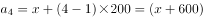

# 2023年国家公务员录用考试《行测》题（地市级网友回忆版）

> 数量关系 · 9 题 · 国考 2023

## 第 1 题　qid 5445874 · 数学运算

商店销售某种商品，打八折销售时卖2件的利润与按定价销售时卖1件的利润相同，相当于降价120元/件销售时卖3件的利润。问该商品的定价为多少元/件？

- **A**. 360
- **B**. 450　✅
- **C**. 540
- **D**. 720

**答案**：B

**官方解析**

设该商品每件定价为x元，成本为y元，根据题意可得：x-y=（80%x-y）×2······①，x-y=（x-120-y）×3······②，联立①②，解得x=450，即该商品的定价为450元/件。
故正确答案为B。

---

## 第 2 题　qid 5445875 · 数学运算

农科院在某村287名淡水鱼养殖人员中开展防病培训和育种培训。已知参加防病培训的养殖人员中，参加育种培训的人数比未参加的多21%；参加育种培训的养殖人员中，参加防病培训的人数比未参加的多76人。问共有多少人未参加任何一项培训？

- **A**. 21　✅
- **B**. 23
- **C**. 25
- **D**. 27

**答案**：A

**官方解析**

根据“参加防病培训的养殖人员中，参加育种培训的人数比未参加的多21%”，可知只参加防病培训的人数是100的倍数。由于总人数为287人，当只参加防病培训的人数是200人时，参加防病培训的共有200×（1+21%）+200＞287人，排除。则只参加防病培训的人数为100人，此时既参加防病培训又参加育种培训的有100×（1+21%）=121人，只参加育种培训的有121-76=45人。未参加培训的人数=总数-只参加防病培训的人数-只参加育种培训的人数-两者都参加的人数=287-100-45-121=21人，即共有21人未参加任何一项培训。
故正确答案为A。

---

## 第 3 题　qid 5445877 · 数学运算

社区计划采购10份年货礼包发放给10户独居老人，每户发放1份。年货礼包有100元/份和150元/份的两种供选择，总预算不能超过1250元。如采购了150元/份的年货礼包，则需要优先在3户孤寡老人中选择发放对象。问共有多少种不同的发放方式？

- **A**. 21
- **B**. 28
- **C**. 36　✅
- **D**. 55

**答案**：C

**官方解析**

设购买150元/份的年货礼包x份，则购买100元/份的年货礼包（10-x）份，故可列式：，解得：。因此年货礼包采购数量情况可分为以下6类：

（1）150元的0份，100元的10份，有种发放方式；

（2）150元的1份，100元的9份，有种不同的发放方式；

（3）150元的2份，100元的8份，有种不同的发放方式；

（4）150元的3份，100元的7份，有种发放方式；

（5）150元的4份，100元的6份，有种不同的发放方式；

（6）150元的5份，100元的5份，有种不同的发放方式。

分类用加法，共有1+3+3+1+7+21=36种不同的发放方式。

故正确答案为C。

---

## 第 4 题　qid 5445879 · 数学运算

甲和乙两个工程队共同承担某项工程的施工任务。两队合作时各自的效率均比单独施工时高20%。已知两队合作施工需要25天完工；如甲先施工15天后乙加入，两队合作15天后剩余工作乙单独施工还需要10天完成。问甲队的效率是乙队的多少倍？

- **A**. 

- **B**. 

- **C**. 

- **D**. 

　✅

**答案**：D

**官方解析**

设甲队和乙队单独施工时的效率分别为x、y，根据题意可知：甲队和乙队合作施工时的效率分别为1.2x、1.2y。根据工程总量相等，则（1.2x+1.2y）×25=15x+（1.2x+1.2y）×15+10y，解得，即甲队的效率是乙队的。

故正确答案为D。

---

## 第 5 题　qid 5445716 · 数学运算

公园里有一片四边形草坪，沿对角线修建的小道相交于O点，O到四个顶点A、B、C、D的距离之比正好为1：2：3：4，一名工人花费1天正好完成AOB区域的修剪，问第二天至少需要额外增加多少名效率相同的工人一起工作，才能在当天内完成剩余草坪的修剪？

- **A**. 8
- **B**. 10　✅
- **C**. 11
- **D**. 12

**答案**：B

**官方解析**

根据题意，设的面积为S。因为与的高相同，底边BO：DO=2：4=1：2，根据结论“两个三角形的高相同，面积之比等于底之比”可得：；同理，与的高相同，底边AO：CO=1：3，则；与的高相同，底边AO：CO=1：3，则。故四边形ABCD的面积=S+2S+6S+3S=12S。根据题意可知，一名工人花费1天正好完成AOB区域的修剪，即一名工人花费1天修剪的面积为S，剩余面积为12S-S=11S，则要在第二天完成修剪至少需要11S÷S=11名效率相同的工人，故至少需要额外增加11-1=10名效率相同的工人一起工作。

故正确答案为B。

---

## 第 6 题　qid 5445881 · 数学运算

甲和乙两人8：00同时从A地出发前往B地，其中乙全程匀速，甲出发时的速度是乙的一半，但全程均匀加速。已知10：00甲追上乙，11：00甲到达B地。问乙什么时间到达B地？

- **A**. 11：30
- **B**. 11：45　✅
- **C**. 12：00
- **D**. 12：15

**答案**：B

**官方解析**

赋值出发时甲的速度为1，乙的速度为2。从8：00至10：00，甲和乙的路程相同，即该时段甲的平均速度=乙的速度=2。根据匀加速运动的平均速度，则10：00时甲的速度为2×2-1=3。因此，甲的速度每小时增加，故甲11：00时的速度为3+1=4。根据甲可计算，从A地到B地的路程为，则乙全程所需时间为小时小时=3小时45分钟，即乙在11：45到达B地。

故正确答案为B。

---

## 第 7 题　qid 5445876 · 数学运算

工厂从某周第一天开始生产某种零件，每周生产7天，从第二天开始每一天都比前一天多生产200件。已知工厂第三周的产量是第一周的2倍，问第几天其日产量第一次达到1万件？

- **A**. 37
- **B**. 38
- **C**. 39
- **D**. 40　✅

**答案**：D

**官方解析**

根据题意可知，每天的零件产量构成等差数列。设第一天的零件产量为x件，根据等差数列通项公式，可得第一周第四天的零件产量件。结合等差数列求和公式，则第一周的零件产量件。同理，第三周第四天的产量（即第18天）的产量件，则第三周的产量件。根据“第三周的产量是第一周的2倍”可列式：7x+23800=2（7x+4200），解得x=2200。设该工厂第n天的日产量第一次达到1万件，则可列式：2200+（n-1）×200=10000，解得n=40，即第40天其日产量第一次达到1万件。

故正确答案为D。

---

## 第 8 题　qid 5445880 · 数学运算

从A地前往B地的道路前40%的路程为上坡路，其余为下坡路。张某驾驶满载的汽车从A地去B地卸货，然后空车返回A地。已知他满载时上坡的速度是下坡速度的一半，空车时上、下坡的速度分别是满载时的1.5倍和1.2倍。问他返程的用时是去程的多少倍？

- **A**. 

- **B**. 

- **C**. 

　✅
- **D**. 

**答案**：C

**官方解析**

赋值去程上坡路段长度为40，则去程下坡路段长度为60；赋值满载时上坡的速度为1，则满载时下坡速度为2。根据题意可知，空车时上坡速度=满载时上坡速度×1.5=1×1.5=1.5，空车时下坡速度=满载时下坡速度×1.2=2×1.2=2.4。去程时间为，返程时间为，则所求倍数。

故正确答案为C。

---

## 第 9 题　qid 5445882 · 数学运算

甲、乙两名职工负责国庆7天长假的值班工作，每天安排1人值班。已知乙至少值了2天班，且在国庆期间任一天结束后，甲的累计值班天数都比乙的多。问两人的值班日期安排有多少种不同的可能？

- **A**. 6
- **B**. 9
- **C**. 10
- **D**. 14　✅

**答案**：D

**官方解析**

因乙至少值了2天班，且在国庆期间任一天结束后，甲的累计值班天数都比乙的多，则乙值班2天或者3天，且乙最早从第三天开始值班。分情况讨论如下：
①乙值班2天：当乙从第三天开始值班时，则剩下的1天可以从第五天、第六天和第七天中选1天，有3种情况；当乙从第四天开始值班时，则剩下的1天可以从第五天、第六天和第七天中选1天，有3种情况；当乙从第五天开始值班时，则剩下的1天可以从第六天和第七天中选1天，有2种情况；当乙从第六天开始值班时，则剩下的1天为第七天，有1种情况，共有3+3+2+1=9种情况；
②乙值班3天：当乙从第三天开始值班时，则剩下的2天可以为第五天和第七天、第六天和第七天，有2种情况；当乙从第四天开始值班时，则剩下的2天可以为第五天和第七天、第六天和第七天，有2种情况；当乙从第五天开始值班时，则剩下的2天为第六天和第七天，有1种情况，共有2+2+1=5种情况。
因此，两人的值班日期安排有9+5=14种不同的可能。
故正确答案为D。

---
