# 2023年国家公务员录用考试《行测》题（行政执法卷网友回忆版）

> 数量关系 · 10 题 · 国考 2023

## 第 1 题　qid 5445717 · 数学运算

一项工作甲独立完成需要3小时，乙独立完成的用时比其与甲合作完成多4小时，且乙和丙合作完成需要4小时。问丙独立完成需要多少小时？

- **A**. 10
- **B**. 12　✅
- **C**. 6
- **D**. 8

**答案**：B

**官方解析**

赋值工作总量为12，则甲的效率为，乙、丙合作的效率为。设乙的效率为x，根据“乙独立完成的用时比其与甲合作完成多4小时”，可得：，解得：x=2，即乙的效率为2，则丙的效率为3-2=1。因此，丙独立完成需要小时。

故正确答案为B。

---

## 第 2 题　qid 5445739 · 数学运算

在一块正方形土地中，画一条经过某个顶点的规划线，将其分割为三角形和梯形两块土地，且梯形土地的面积正好是三角形土地的2倍。问三角形和梯形土地的周长之比是多少？

- **A**. 
1：2

- **B**. 
5：7

- **C**. 
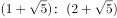

- **D**. 
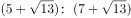
　✅

**答案**：D

**官方解析**

赋值正方形土地的边长为3，根据题意，梯形土地的面积正好是三角形土地的2倍，则正方形土地的面积是三角形土地的3倍，设三角形土地BE边长为x，则，代入数据得，解得x=2，则ED=BD-BE=3-2=1。根据勾股定理，，则三角形土地的周长，梯形土地的周长，故三角形和梯形土地的周长之比为。

故正确答案为D。

---

## 第 3 题　qid 5445722 · 数学运算

已知A、B两种设备定价相同，C设备单价为8000元/台。现A、B两种设备分别打六折、七折促销，购买1台B设备的费用比购买A、C设备各1台的总费用高2万元。问促销期间1000万元预算最多可以购买多少台A设备？

- **A**. 35
- **B**. 51
- **C**. 59　✅
- **D**. 77

**答案**：C

**官方解析**

设A、B两种设备每台定价均为x万元，则促销期间A设备单价为0.6x万元，B设备为0.7x万元。8000元=0.8万元，根据题意，可列方程：0.7x=0.6x+0.8+2，解得x=28，则促销期间A设备单价为28×0.6=16.8万元。促销期间1000万元可以购买台A设备，则最多可以购买59台A设备。

故正确答案为C。

---

## 第 4 题　qid 5445725 · 数学运算

某单位有甲和乙2个办公室，分别有职工5人和4人。每周从这9名职工中随机抽取1人下沉社区担任志愿者（同一人有可能被连续、重复选中）。问7月前2周的志愿者均来自甲办公室的概率在以下哪个范围内？

- **A**. 不到25%
- **B**. 25%~35%之间　✅
- **C**. 35%~45%之间
- **D**. 超过45%

**答案**：B

**官方解析**

根据题意可知，7月前2周的志愿者总情况数为种，7月前2周的志愿者均来自甲办公室的情况数为种。因此所求概率，在25%~35%之间。

故正确答案为B。

---

## 第 5 题　qid 5445716 · 数学运算

公园里有一片四边形草坪，沿对角线修建的小道相交于O点，O到四个顶点A、B、C、D的距离之比正好为1：2：3：4，一名工人花费1天正好完成AOB区域的修剪，问第二天至少需要额外增加多少名效率相同的工人一起工作，才能在当天内完成剩余草坪的修剪？

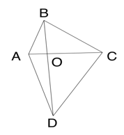

- **A**. 8
- **B**. 10　✅
- **C**. 11
- **D**. 12

**答案**：B

**官方解析**

根据题意，设的面积为S。因为与的高相同，底边BO：DO=2：4=1：2，根据结论“两个三角形的高相同，面积之比等于底之比”可得：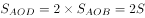；同理，与的高相同，底边AO：CO=1：3，则；与的高相同，底边AO：CO=1：3，则。故四边形ABCD的面积=S+2S+6S+3S=12S。根据题意可知，一名工人花费1天正好完成AOB区域的修剪，即一名工人花费1天修剪的面积为S，剩余面积为12S-S=11S，则要在第二天完成修剪至少需要11S÷S=11名效率相同的工人，故至少需要额外增加11-1=10名效率相同的工人一起工作。

故正确答案为B。

---

## 第 6 题　qid 5445723 · 数学运算

单位将10个培训名额分配给4个分公司，要求在每个分公司至少分配1个名额的所有分配方案中，随机选择1个方案实施，问4个分公司中有3个分配名额数量相同的概率为多少？

- **A**. 

- **B**. 

- **C**. 

- **D**. 

　✅

**答案**：D

**官方解析**

根据题意可知，将10个相同的培训名额分配给4个不同的分公司，每个分公司至少分配1个名额，可使用插板法解题，共有种分配方案。

方法一：4个分公司中有3个分公司分配到的名额数量相同，设3个分公司分配到的名额数量均为a个，另外一个分公司分配到的名额数量为b个，则3a+b=10，且，符合要求的情况有3大类（a=1，b=7；a=2，b=4；a=3，b=1），那么符合条件的情况数有种，则题干所求概率为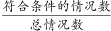。

方法二：根据公式：概率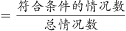，则题目所求概率为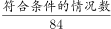，即选项的分母部分为84的因子，结合选项，只有D项符合。

故正确答案为D。

---

## 第 7 题　qid 5445729 · 数学运算

某次会议邀请4所高校每所各2位学者作报告。在某日上午、下午和晚上的三个时间段分别安排3位、3位和2位学者依次作报告，且同一所高校的2位学者不安排在同一时间段内作报告。问8人的报告次序有多少种不同的安排方式？

- **A**. 不到5000种
- **B**. 5000~10000种之间
- **C**. 10001~20000种之间　✅
- **D**. 超过20000种

**答案**：C

**官方解析**

对上午、下午和晚上的三个时间段报告次序进行分步讨论：

第一步，上午需要从4所高校中选3所高校，每所高校各选1位学者进行排序，有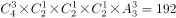种情况；

第二步，下午需要从上午未选高校中选1位学者，再从上午已选3所高校中选2位学者进行排序，有种情况；

第三步，对晚上剩余的2位学者进行排序，有种情况。

则这8人的报告次序共有192×36×2=13824种不同的安排方式，在C项范围内。

故正确答案为C。

---

## 第 8 题　qid 5445731 · 数学运算

一辆汽车从甲地开往乙地，先以40千米/小时的速度匀速行驶一半的路程，然后均匀加速；行驶完剩下路程的一半时，速度达到80千米/小时；此后均匀减速，到达乙地时的速度正好降为0。问其全程的平均速度在以下哪个范围内？

- **A**. 不到44千米/小时　✅
- **B**. 在44~45千米/小时之间
- **C**. 在45~46千米/小时之间
- **D**. 超过46千米/小时

**答案**：A

**官方解析**

如下图所示，A地为甲、乙两地的中点，B地为A地、乙地的中点。由A地到B地汽车均匀加速，则该段的平均速度为千米/小时；由B地到乙地汽车均匀减速，则该段的平均速度为千米/小时。因B地为A地、乙地的中点，根据等距离平均速度公式，可得汽车从A地到乙地的平均速度为千米/小时；又因A地为甲、乙两地的中点，根据等距离平均速度公式，可得汽车全程的平均速度为千米/小时，在A项范围内。

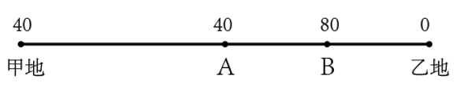

故正确答案为A。

注：匀变速运动的平均速度公式为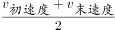，等距离平均速度公式为。

---

## 第 9 题　qid 5445712 · 数学运算

甲、乙、丙三家科技企业2021年的收入之和比2020年提升了20%。其中甲企业的收入上升了400万元，乙企业的收入下降了100万元且是甲企业收入的一半，丙企业的收入上升了30%且其2020年的收入与甲、乙两企业同年收入之和相同。问2020年甲企业的收入比乙企业高多少万元？

- **A**. 900
- **B**. 1100
- **C**. 400
- **D**. 600　✅

**答案**：D

**官方解析**

设2021年乙企业的收入为x万元，则根据题干条件甲、乙、丙三家企业的收入如下表所示：

2021年甲、乙、丙三家企业的收入之和为2x+x+3.9x-390=6.9x-390，2020年甲、乙、丙三家企业的收入之和为。因甲、乙、丙三家企业2021年的收入之和比2020年提升了20%，即，解得x=1100，则2020年甲企业的收入比乙企业高（2x-400）-（x+100）=x-500=600万元。

故正确答案为D。

---

## 第 10 题　qid 5445718 · 数学运算

一个圆柱体零件A和一个圆锥体零件B分别用甲、乙两种合金铸造而成。A的底面半径和高相同，B的底面半径是高的2倍，两个零件的高相同，质量也相同。问甲合金的密度是乙合金的多少倍？

- **A**. 

　✅
- **B**. 

- **C**. 

- **D**. 

**答案**：A

**官方解析**

赋值零件A与零件B的高均为1，则A的底面半径为1，B的底面半径为2，可得零件A的体积为，零件B的体积为。根据公式：质量=密度×体积，可知质量相同时，密度和体积成反比，即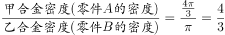。

故正确答案为A。

---
