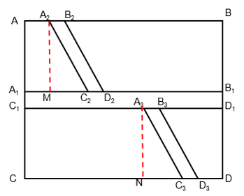

# 2023年宁夏公务员录用考试《行测》题（网友回忆版）

> 数量关系 · 10 题 · 宁夏 2023

## 第 1 题　qid 5509706 · 数学运算

轨道交通公司定期进行轨道检修工作，甲、乙两个工程队合作进行需4小时完成，甲队单独完成比乙队单独完成快15小时，则甲队单独完成需要的时间是：

- **A**. 5小时　✅
- **B**. 6小时
- **C**. 7小时
- **D**. 8小时

**答案**：A

**官方解析**

方法一：设甲队的完工时间为x小时，乙队的完工时间为（x+15）小时，赋值工作总量为1，则甲队的效率为，乙队的效率为，根据甲、乙两队合作需4小时可知，甲乙两队效率和为，列方程：，解得x=5或x=-12，其中x=-12不符合题意舍弃，则x=5。

方法二：采用代入排除法。代入A项，甲队的完工时间为5小时，乙队的完工时间为20小时，赋值工作总量为20，则乙队的效率为20÷20=1，甲队的效率为20÷5=4，甲、乙两队合作需20÷（1+4）=4小时，符合题意。

故正确答案为A。

---

## 第 2 题　qid 5509486 · 数学运算

某学院有新生两百多人，将学生从1开始依次编号，选取编号为3的倍数的学生，正好构成新生运动会开幕式方队，选取编号为m（3＜m＜10，且m为整数）的倍数的学生，恰好构成闭幕式方队，问该学院新生人数有多少人？

- **A**. 242
- **B**. 243
- **C**. 245　✅
- **D**. 246

**答案**：C

**官方解析**

根据题意，选取编号为3的倍数的新生正好构成开幕式方队，方队的人数应为平方数。代入选项，B、C两项除以3的商均为81，即编号为3的倍数的新生有81人，81是平方数，符合题意；A、D两项除以3的商分别为80、82，均不是平方数，排除。
选取编号为m的倍数的新生，恰好构成闭幕式方队，即新生人数除以m的商仍为平方数。3&lt;m&lt;10，且m为整数，则当m=4时，代入B、C两项，除以4的商分别为60、61，均不为平方数，不符合题意；当m=5时，代入B、C两项，除以5的商分别是48、49，48不是平方数，49为平方数，故C项符合题意。
故正确答案为C。

---

## 第 3 题　qid 5509496 · 数学运算

甲、乙两个商场营业日每天是否打折的概率均为。某周，甲商场营业7天，而乙商场营业6天，休业1天。问在这一周，甲商场打折天数比乙商场多的概率为：

- **A**. 

- **B**. 

- **C**. 

　✅
- **D**. 

**答案**：C

**官方解析**

乙商场休业1天，这一天甲商场是营业的，其打折概率为，不打折概率也为。甲、乙共同营业的6天可能会出现的情况共三种：打折天数甲&gt;乙、打折天数甲=乙、打折天数甲&lt;乙，三种情况的概率之和为1。

在共同营业的6天中，甲、乙打折天数可能为0、1、2、3、4、5、6中的任一个，甲大于乙的情况数可能是甲为6乙为0-5中任一个、甲为5乙为0-4中任一个，以此类推；乙大于甲的情况数对等，可能是乙为6甲为0-5中任一个、乙为5甲为0-4中任一个，以此类推。由此可知，在共同营业的6天中，打折天数甲&gt;乙与乙&gt;甲的情况数相同，其对应概率也相同，均设为x；打折天数甲=乙的概率设为y。

符合题意的情况有两种：

①甲单独营业的1天打折，共同营业的6天中打折天数甲&gt;乙或甲=乙，则甲商场打折天数比乙商场多的概率为；

②甲单独营业的1天不打折，共同营业的6天中打折天数甲&gt;乙，则甲商场打折天数比乙商场多的概率为。

因此，所求概率为。

故正确答案为C。

---

## 第 4 题　qid 5509836 · 数学运算

某地计划在连接甲镇和乙镇的长度为60公里的公路上安装限速标志和测速仪器。具体方案是：从距离甲镇3公里处开始安装限速标志，然后每隔4公里再设置一个限速标志；从8公里处开始安装测速仪器，然后每隔9公里再设置一个测速仪器。假设单独安装一个限速标志费用为500元，单独安装一个测速仪器费用为800元，如果限速标志和测速仪刚好在同一个地点安装，则可以节约安装费用，此时安装两种设备总共只需要1000元。问最终安装总费用是多少元？

- **A**. 10600
- **B**. 11200
- **C**. 12000　✅
- **D**. 12300

**答案**：C

**官方解析**

根据题意可知，第a个（）限速标志安装的位置可表示为距离甲镇3+4（a-1）=（4a-1）公里处，第b个（）测速仪器安装的位置可表示为距离甲镇8+9（b-1）=（9b-1）公里处。根据同余定理，第n个（）同一地点安装限速标志和测速仪器的位置距离甲镇（36n-1）公里处（36为4、9的最小公倍数）。根据“连接甲镇和乙镇的长度为60公里的公路”，可列式，解得，则限速标志可安装15个；，解得，则测速仪器可安装6个；，解得，则只有1个地点可同时安装限速标志和测速仪器（距离甲镇35公里处）。故最终安装总费用为（15-1）×500+（6-1）×800+1×1000=12000元。

故正确答案为C。

---

## 第 5 题　qid 5509855 · 数学运算

某地突发森林火灾，现有甲、乙两支消防队离火灾发生地距离相同，但路况不同，假设两支队伍接到命令后同时出发，并且按照一定速度匀速赶往火灾现场参与救援。已知当甲消防队走了路程时，乙消防队走了9公里，当乙消防队走了路程时，甲消防队走了16公里，问甲消防队到达目的地时，乙消防队距离目的地还有多少公里？

- **A**. 9　✅
- **B**. 12
- **C**. 27
- **D**. 36

**答案**：A

**官方解析**

设甲、乙两队离火灾发生地的距离均为S公里，当时间一定时，路程和速度成正比，根据题意可得，解得S=36。根据“当甲消防队走了路程时，乙消防队走了9公里”可得，甲消防队到达目的地时，乙消防队走了3×9=27公里，距离目的地还有36-27=9公里。

故正确答案为A。

---

## 第 6 题　qid 5509544 · 数学运算

如下图所示，某地计划修建一个长50米，宽40米的长方形观光园。现在需要在观光园中修建几条鹅卵石小道供游客行走，其中一条是长为50米，宽为2米的水平直线型小路，另外两条修成斜线型，并且要求这两条斜线型小路任何地方的水平方向宽度都是1米，问修完小路后观光园剩下部分的面积是多少平方米？

- **A**. 1862　✅
- **B**. 1880
- **C**. 1950
- **D**. 1960

**答案**：A

**官方解析**

根据题干，观光园如图所示：

题目所求剩余面积等于。平方米。平方米。由于两个平行四边形底边相同，则平方米。则题目所求剩余面积=2000-100-38=1862平方米。

故正确答案为A。

---

## 第 7 题　qid 5509482 · 数学运算

为了保护生态环境，某单位需要购买一批污水处理设备，总的预算不超过120万元。现有甲、乙两种类型设备可供选择，如果购买2台甲型设备和3台乙型设备，将超出预算10万元；若购买3台甲型设备和2台乙型设备，将结余10万元。若该单位最终购买5台污水处理设备，问共有几种购买方案？

- **A**. 1
- **B**. 2
- **C**. 3　✅
- **D**. 4

**答案**：C

**官方解析**

设甲型设备单价为x万元，乙型设备单价为y万元。

根据题意可得方程：2x+3y=120+10①，3x+2y=120-10②；联立①②解得x=14，y=34。

最终购买5台设备，总费用不超过总预算120万元，

第一种购买方案：5台甲设备，14×5=70&lt;120，符合题意；

第二种购买方案：4台甲设备，1台乙设备，14×4+34=90&lt;120，符合题意；

第三种购买方案：3台甲设备，2台乙设备，14×3+34×2=110&lt;120，符合题意；

第四种购买方案：2台甲设备，3台乙设备，14×2+34×3=130&gt;120，不符合题意；

第五种购买方案：1台甲设备，4台乙设备，14+34×4=150&gt;120，不符合题意；

第六种购买方案：5台乙设备，34×5=170&gt;120，不符合题意。

因此，共有3种购买方案。

故正确答案为C。

---

## 第 8 题　qid 5509542 · 数学运算

某商场一楼到二楼有一部自动扶梯匀速上行，甲、乙二人共同乘梯上楼。甲在乘扶梯同时匀速登梯，乙在恰好半程后，也开始匀速登梯，但登梯速度是甲的。甲乙二人分别登了36级、12级到达二楼，问这部扶梯静止时一楼到二楼的级数是多少？

- **A**. 48
- **B**. 60
- **C**. 66
- **D**. 72　✅

**答案**：D

**官方解析**

根据题意，甲乙二人均是从一楼沿扶梯上二楼，故路程相等，即总级数相等，扶梯的总级数=人行走的级数+扶梯运行的级数。设甲的速度为2v，乙的速度为v，扶梯的速度为，即，整理可得：，解得，故扶梯的总级数。

故正确答案为D。

---

## 第 9 题　qid 5509713 · 数学运算

某电子元件制造厂有甲、乙、丙三个车间，甲、乙、丙三个车间的产量分别占总产量的5%、70%、25%，且甲、乙、丙三个车间的次品率依次为4%、3%、2%。任取一件产品，取到次品为乙车间制造的概率是：

- **A**. 15%
- **B**. 45%
- **C**. 75%　✅
- **D**. 85%

**答案**：C

**官方解析**

根据甲、乙、丙三个车间的产量分别占总产量的5%、70%、25%，赋值总产量为1000个，则甲、乙、丙三个车间的产量分别为50个、700个、250个。那么甲车间制造的次品为50×4%=2个，乙车间制造的次品为700×3%=21个，丙车间制造的次品为250×2%=5个。因此取到次品为乙车间制造的概率。

故正确答案为C。

---

## 第 10 题　qid 5509708 · 数学运算

某医院因工作出现特殊情况需要从外科抽调医护人员支援呼吸科，如果少去4名护士，那么参与支援的护士与参与支援的医生人数一样多，如果少去2名医生，那么参与支援的护士人数是参与支援的医生人数的3倍，则外科参与支援呼吸科的医护人员总数是：

- **A**. 8
- **B**. 10
- **C**. 12
- **D**. 14　✅

**答案**：D

**官方解析**

设外科参与支援呼吸科的护士有x人，则参与支援呼吸科的医生有（x-4）人。根据题意可列方程：x=3[（x-4）-2]，解得x=9，则所求=x+（x-4）=2x-4=2×9-4=14人。
故正确答案为D。

---
