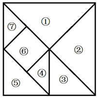
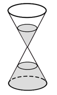
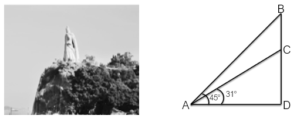
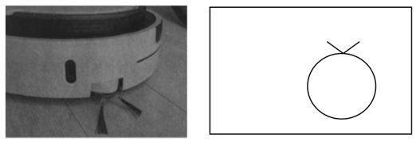
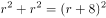
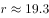
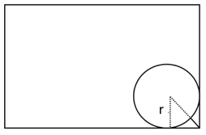
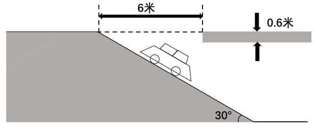

# 2023年安徽省公务员录用考试《行测》题（网友回忆版）

> 数量关系 · 15 题 · 安徽 2023

## 第 1 题　qid 5509969 · 数学运算

某村拟建造一个容积为144立方米，深度为4米的长方体无盖蓄水池。为节约成本，侧面积最小为多少平方米？

- **A**. 24
- **B**. 36
- **C**. 96　✅
- **D**. 132

**答案**：C

**官方解析**

根据长方体体积=长×宽×高，结合水池“容积为144立方米，深度为4米”，可得平方米。题干所求水池侧面积=底面周长×高=4×底面周长，若要侧面积最小，则底面周长最短。因为“长方形面积一定，长宽相等也就是正方形时周长最短”，所以底面周长最短时，长=宽=6，周长=4×6=24米，此时侧面积=4×24=96平方米。

故正确答案为C。

---

## 第 2 题　qid 5509973 · 数学运算

浮雕银杯是我国古代常见的一种盛酒容器，有大银杯和小银杯之分。已知5个大银杯加1个小银杯，可以盛酒3斛（斛，是古代的一种容量单位），5个小银杯加1个大银杯，可以盛酒2斛，则1斛酒至多可以倒满小银杯的数量为：

- **A**. 2个
- **B**. 3个　✅
- **C**. 4个
- **D**. 5个

**答案**：B

**官方解析**

设大银杯容量为x，小银杯容量为y，赋值1斛酒的量为1；根据题意可列方程：5x+y=3······①，5y+x=2······②，联立①②解得，。则1斛酒可倒满的小银杯数量，故至多可以倒满小银杯的数量为3个。

故正确答案为B。

---

## 第 3 题　qid 5509979 · 数学运算

某智慧公共停车场的收费标准如下：停车不超过15分钟，不收费；超过15分钟但不超过60分钟，按1小时计，收费5元；超过1小时后，超过的部分按每30分钟4元收费（不足30分钟，按30分钟计）。若李先生支付停车费17元，则他停车的时长可能为：

- **A**. 2小时
- **B**. 2小时15分钟　✅
- **C**. 2小时45分钟
- **D**. 3小时

**答案**：B

**官方解析**

根据题干“停车不超过15分钟，不收费；超过15分钟但不超过60分钟，按1小时计，收费5元”，李先生支付停车费17元，则停车时长一定超过1小时。扣除前1小时的收费5元，超出1小时部分付款为17-5=12元。根据题干“超过1小时后，超过的部分按每30分钟4元收费（不足30分钟，按30分钟计）”，12元最多可支付12÷4=3个30分钟=1.5小时，则2小时＜李先生的停车时长小时。

故正确答案为B。

---

## 第 4 题　qid 5510000 · 数学运算

某公司自主研发生产的A、B、C三种型号氢燃料电池，解决了该公司今年生产轿车所需电池数量的10%（按一辆车配一块电池计算）。其中A型号氢燃料电池的产量是B型号的2倍，C型号的产量比A、B两种型号的产量之和还多400块。预计该公司今年的轿车总产量是42.4万辆，那么B型号氢燃料电池的产量是：

- **A**. 3500块
- **B**. 7000块　✅
- **C**. 14000块
- **D**. 21400块

**答案**：B

**官方解析**

根据题意，该公司今年自主研发生产的A、B、C三种型号氢燃料电池的产量和为42.4×10000×10%=42400块。已知C型号的产量比A、B两种型号的产量之和还多400块，则A、B两种型号的产量之和为块，A型号氢燃料电池的产量是B型号的2倍，则B型号氢燃料电池的产量为块。

故正确答案为B。

---

## 第 5 题　qid 5510001 · 数学运算

某学习平台收到的征文，将通过两轮评审决定能否采用。先由两位编辑进行初审，若两位编辑评审都通过，则予以采用；若两位编辑都未予通过，则不予采用；若仅有一位编辑初审通过，则再由主编进行复审，若复审通过，则予以采用，否则不予采用。设稿件能通过各初审编辑评审的概率均为0.4，复审的稿件能通过的概率为0.2，各编辑独立评审，则每篇征文被采用的概率为：

- **A**. 0.32
- **B**. 0.256　✅
- **C**. 0.24
- **D**. 0.208

**答案**：B

**官方解析**

根据题意，每篇征文被采用的情况为：①初审两位编辑均通过，概率为：0.4×0.4=0.16；②初审两位编辑仅有一位通过，且主编复审通过，概率为：，分类用加法，故每篇征文被采用的概率为0.16+0.096=0.256。

故正确答案为B。

---

## 第 6 题　qid 5510002 · 数学运算

某小区物业准备了230盒口罩免费派发给10栋楼，要求任意两栋楼派发的口罩数量都不相同，但最多相差不超过1倍。假设口罩不拆盒发放，那么派发口罩数量最少的那栋楼最少可派发口罩：

- **A**. 18盒
- **B**. 15盒
- **C**. 14盒　✅
- **D**. 12盒

**答案**：C

**官方解析**

设派发口罩数量最少的那栋楼最少派发口罩x盒。要让派发口罩数量最少的楼栋派发口罩最少，则其他楼栋口罩派发尽量多，且派发口罩最多的楼栋不超过最少的1倍，即派发口罩最多的楼栋最多派发口罩2x盒。由于任意两栋楼派发口罩数量都不相同，则可列表如下：

根据口罩一共有230盒可列式：2x+2x-1+2x-2+2x-3+2x-4+2x-5+2x-6+2x-7+2x-8+x=230，化简可得：19x-36=230，解得x=14。那么派发口罩数量最少的那栋楼最少可派发口罩14盒。

故正确答案为C。

---

## 第 7 题　qid 5510003 · 数学运算

某市公立小学入学实行摇号方式，依次分别从十个号码球中（内置0至9十个号码）摇号抽取个、十、百位数号码，组成一个数。与该数字相同编号（如001即为1）学生即为第一个中签录取的学生，第二位录取的学生为第一位录取学生的编号+等差数，以此类推确定中签号。参加摇号的学生总人数为950人，若在第一轮摇号中，第一个中签数是270，等差数是8，那么以下哪一个号段中签的人数最多？

- **A**. 100至200
- **B**. 200至300
- **C**. 300至400　✅
- **D**. 400至500

**答案**：C

**官方解析**

由于第一个中签数是270，则
A项：100至200号段中签的人数为0；
B项：200至300号段中签的是270、278、286、294，总人数为4人；
C项：300至400号段，第一个中签的是302，该号段最后一个中签的是302+12×8=398，总人数为1+12=13人；
D项：400至500号段，第一个中签的是406，该号段最后一个中签的是406+11×8=494，总人数为1+11=12人。
综上，300至400号段中签的人数最多。
故正确答案为C。
注：本题不严谨，若按照日常实际情况，需循环1至270号段，则选项中A、B、C项中签人数均为13人。

---

## 第 8 题　qid 5510004 · 数学运算

某空军基地举行飞行训练，有8架歼击机、3架预警直升机、2架反潜直升机参与训练，每架飞机编号不同。训练时，需派出3架歼击机、2架预警直升机、1架反潜直升机进行起降飞行。若每次只能起飞1架飞机，其中3架歼击机必须相邻起飞，2架预警直升机不能相邻起飞，那么不同的起飞方式有多少种？

- **A**. 504
- **B**. 4032
- **C**. 8064
- **D**. 24192　✅

**答案**：D

**官方解析**

先从8架歼击机中选出3架、3架预警直升机中选出2架、2架反潜直升机中选出1架，共有种方法；再根据要求安排起飞顺序，3架歼击机必须相邻起飞可用捆绑法、2架预警直升机不能相邻起飞可用插空法，即先将3架歼击机捆绑后与1架反潜直升机进行排列有种方法，再将2架预警直升机插空有种方法。故满足要求的不同的起飞方式有种。

故正确答案为D。

---

## 第 9 题　qid 5509974 · 数学运算

小林因病入院需挂瓶输液，上午9点开始输液，输液袋上标有“容量300毫升，每毫升15滴”等药液信息。输液开始时，药液滴速为75滴/分钟。输液5分钟后小林感觉身体不适，护士帮忙调整了药液滴速（调整时间不计），又继续输液10分钟，药液还剩235毫升，那么输液结束的时间是：

- **A**. 10点26分
- **B**. 10点18分
- **C**. 10点14分　✅
- **D**. 10点10分

**答案**：C

**官方解析**

根据题意，输液5分钟后剩余的药液为毫升，则调整后药液的滴速为滴/分钟，剩余的235毫升药液还需输液的时间为分钟，则输液的总时间为分钟分钟，即1小时14分钟，上午9点开始输液，则输液结束的时间是10点14分。

故正确答案为C。

---

## 第 10 题　qid 5509971 · 数学运算

世界非物质文化遗产高峰论坛召开记者会，共有10家国内媒体和4家国外媒体参加。组委会从中选出3家媒体回答他们的问题，要求这3家媒体中既有国内媒体又有国外媒体，且国内外媒体交叉提问，则不同的提问方式有：

- **A**. 240种
- **B**. 360种
- **C**. 480种　✅
- **D**. 1440种

**答案**：C

**官方解析**

选出3家媒体中既有国内媒体又有国外媒体，分为两种情况：

情况一：2家国内媒体、1家国外媒体。先从10家国内媒体中选出2家，有种情况，再从4家国外媒体中选出1家，有种情况，由于国内外媒体交叉提问，则国外媒体处于中间位置，2家国内媒体位于头尾位置，有种情况，则有种情况；

情况二：1家国内媒体、2家国外媒体。先从10家国内媒体中选出1家，有种情况，再从4家国外媒体中选出2家，有种情况，由于国内外媒体交叉提问，则国内媒体处于中间位置，2家国外媒体位于头尾位置，有种情况，则有种情况。

综上，不同的提问方式共有360+120=480种。

故正确答案为C。

---

## 第 11 题　qid 5509977 · 数学运算

某产业展洽会主办方融合“七巧板”元素设计了七大展示区域（如下图所示），甲、乙、丙三家参展公司从7块展区中分别选择面积各不相同的一个区域进行布展，则共有多少种选择方案？

- **A**. 48
- **B**. 72　✅
- **C**. 96
- **D**. 192

**答案**：B

**官方解析**

根据七巧板特性，结合所给图形可知，三角形①与三角形②等底同高，两个区域面积相等；三角形③与三角形⑤等底等高，两个区域面积相等；区域⑥为正方形，三角形④与三角形⑦等底等高，两个区域面积相等，且面积是正方形⑥的一半，也是三角形⑤的一半。故面积相等的区域可分为三组：①②、③⑤⑥、④⑦。

从三组中分别选出一个区域，再分配给三家不同的公司，共有种选择方案。

故正确答案为B。

---

## 第 12 题　qid 5509982 · 数学运算

某餐馆承诺25分钟内上齐一桌菜，若超时则未上的菜品免单。每张餐桌上都有一个装满后正好25分钟漏完的圆锥形沙漏（如下图所示）。某位顾客在等待的过程中发现沙漏内上方沙子的高度为原先的一半，此时还差一道菜未上，则再过多久还未上菜，这位顾客将享受免单服务？

- **A**. 不到3分钟
- **B**. 3-4分钟之间　✅
- **C**. 4-5分钟之间
- **D**. 超过6分钟

**答案**：B

**官方解析**

根据几何等比放缩性质，在立体几何中，体积比等于相似比的立方。该顾客在发现“沙漏内上方沙子的高度为原先的一半”时，，即相似比为1：2，则。因所有沙子（8份）漏完需要25分钟，则现在剩余沙子（1份）漏完还需要分钟。即若再过3.125分钟还未上菜，这位顾客将享受免单服务，在B项范围内。

故正确答案为B。

---

## 第 13 题　qid 5509988 · 数学运算

厦门鼓浪屿海滨覆鼎岩上屹立着一尊郑成功雕像。为了测量石像的高度，某测量小组选取的测量点A与覆鼎岩底部D在同一水平线上，如下图所示。已知覆鼎岩高CD为24米，在A处测得石像头顶部B的仰角为，石像底部C的仰角为（参考数据：，，），则石像BC的高度约为：

- **A**. 20米
- **B**. 18米
- **C**. 16米　✅
- **D**. 14米

**答案**：C

**官方解析**

在直角三角形ACD中，已知，CD=24米，，则米。在直角三角形ABD中，已知，可得AD=BD=40米，则石像BC=BD-CD=40-24=16米。

故正确答案为C。

---

## 第 14 题　qid 5509990 · 数学运算

某品牌圆形扫地机器人升级设计方案，是在原有扫地机器人的前端伸出8cm可转动的边刷进行清扫（如下图所示），目的是将无法触及的边边角角都彻底清扫干净，那么，为保证这一效果，该型号扫地机器人圆形机身的最大直径是：（答案取整数位）

- **A**. 30cm
- **B**. 36cm
- **C**. 38cm　✅
- **D**. 40cm

**答案**：C

**官方解析**

根据题意，扫地机器人的前端边刷需要清扫到地面边角，如下图所示，设该型号扫地机器人圆形机身的最大半径为rcm，根据三角形勾股定理可得：，解得，向下取整，即最大半径为19cm，则该型号扫地机器人圆形机身的最大直径为19×2=38cm。

故正确答案为C。

---

## 第 15 题　qid 5509995 · 数学运算

某大型商场的地下停车场入口处横截面如下图所示，入口处斜坡的坡角为30度，下坡起点至入口顶部水平距离为6米，楼板厚为0.6米。商场管理处需在入口处张贴限高标志，以便告知车辆能否安全驶入。若停车场内部的高度均高于入口处汽车可通过的最低高度，则下列限高最为合理的是：

- **A**. 1.8米
- **B**. 2.3米　✅
- **C**. 2.6米
- **D**. 3.2米

**答案**：B

**官方解析**

如图所示，CE为可通过入口的汽车的最大高度。在直角中，AB=6米，，则米，则米。在直角中，，则米。因此停车场入口处汽车可通过的最低高度是2.48米，汽车限高设置米即可，在这个范围内越接近2.48米越合理，结合选项可知B项最为合理。

故正确答案为B。

---
