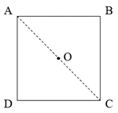
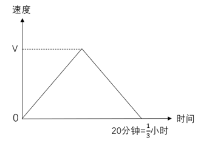
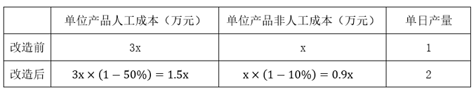

# 2023年山东省公务员录用考试《行测》试题（网友回忆版）

> 数量关系 · 10 题 · 山东 2023

## 第 1 题　qid 5510289 · 数学运算

每周五下午6：00放学后，高一学生小张的母亲会驾车准时在校门口接他回家。某周五下午，放学时间提前了30分钟，小张决定步行回家。他母亲按原时间驾车去接他，在路上遇到小张，即接上他回家，到家时比往常提前了10分钟，问小张步行了多少分钟？

- **A**. 20
- **B**. 25　✅
- **C**. 15
- **D**. 10

**答案**：B

**官方解析**

小张母亲驾车接小张放学是往返的过程。“到家时比往常提前了10分钟”，则小张母亲接到小张的时间比往常提前了5分钟，即下午5：55接到小张。放学时间提前了30分钟，则本周五小张放学时间为下午5：30，故小张步行了25分钟。
故正确答案为B。

---

## 第 2 题　qid 5510293 · 数学运算

某工会组织了一次乒乓球单打比赛，由54名职工参加，比赛规则如下：每轮比赛所有参赛人抽签捉对厮杀，胜者和轮空者进入下一轮，直至决出冠军，问总共要进行多少轮比赛？

- **A**. 4
- **B**. 5
- **C**. 6　✅
- **D**. 7

**答案**：C

**官方解析**

根据题意，54名职工捉对厮杀，则需进行以下几轮比赛：
第一轮，进行27场比赛，27名胜者进入下一轮；
第二轮，进行13场比赛，13名胜者与1名轮空者进入下一轮；
第三轮，进行7场比赛，7名胜者进入下一轮；
第四轮，进行3场比赛，3名胜者与1名轮空者进入下一轮；
第五轮，进行2场比赛，2名胜者进入下一轮；
第六轮，进行1场比赛，胜者即为冠军，比赛结束。
综上，总共要进行6轮比赛。
故正确答案为C。

---

## 第 3 题　qid 5510287 · 数学运算

一个袋子里装了50个苹果，5个香蕉，30个橘子和50个梨，若每次从袋子里随机取出1个水果，问至少需要取多少次能肯定拿出10个相同种类的水果？

- **A**. 10
- **B**. 35
- **C**. 33　✅
- **D**. 32

**答案**：C

**官方解析**

根据问法“至少······能肯定······”，可判定本题为最不利构造问题。要求拿出10个相同种类的水果，则最不利的情况为取9（苹果）+5（香蕉）+9（橘子）+9（梨）=32次，在此基础上随机取出1个水果，就能肯定拿出10个相同种类的水果，即至少需要取32+1=33次。
故正确答案为C。

---

## 第 4 题　qid 5510292 · 数学运算

在边长为2正方形中投入若干石子（石子大小忽略不计），问至少投几个石子才能使这些石子中一定存在距离不超过的两个石子？

- **A**. 5　✅
- **B**. 6
- **C**. 7
- **D**. 8

**答案**：A

**官方解析**

如下图所示，为使石子间的距离最远，先在正方形四个角进行投放，即A、B、C、D四个点各一个石子。连接AC，根据正方形边长为2，可求得，设O点为正方形的中心，则，此时向正方形中任意一处再投入1个石子即可满足石子中一定存在距离不超过的两个石子，故至少投5个石子。

故正确答案为A。

---

## 第 5 题　qid 5510294 · 数学运算

某科研团队中男性占比高于50%，低于60%，问这一团队最少有几人？

- **A**. 5
- **B**. 6
- **C**. 7　✅
- **D**. 8

**答案**：C

**官方解析**

由题意可知，总人数×50%&lt;男性人数&lt;总人数×60%，问最少，考虑从小到大依次代入选项验证：
代入A项，总人数为5人，5×50%&lt;男性人数&lt;5×60%，即2.5&lt;男性人数&lt;3，男性人数非整数，排除；
代入B项，总人数为6人，6×50%&lt;男性人数&lt;6×60%，即3&lt;男性人数&lt;3.6，男性人数非整数，排除；
代入C项，总人数为7人，7×50%&lt;男性人数&lt;7×60%，即3.5&lt;男性人数&lt;4.2，此时男性人数为4，当选。
C项满足全部条件且小于D项，故D项无需验证。
故正确答案为C。

---

## 第 6 题　qid 5510296 · 数学运算

小张从银行贷款60万元，采取等额本金的还款方式，20年还清，贷款年利率4.1%。小张第二个月需还款多少元？

- **A**. 4550.0
- **B**. 4541.5　✅
- **C**. 5137.0
- **D**. 5290.5

**答案**：B

**官方解析**

等额本金是指每月偿还同等数额的本金和剩余贷款在该月所产生的利息。小张每月需偿还本金元，则第二个月贷款余额为600000-2500=597500元，一个月的利息为元，故第二个月需还款（本金+该月利息）=2500+2041.5=4541.5元。

故正确答案为B。

---

## 第 7 题　qid 5510298 · 数学运算

某人甲状腺机能减退，为维持血液中甲状腺素的浓度，医生为他开了处方，每8小时服用60毫克甲状腺素片。若他的肾脏8小时后能够过滤掉60%的药量，问10天后此人体内含药量的范围？

- **A**. 缺失
- **B**. 40毫克　✅
- **C**. 缺失
- **D**. 缺失

**答案**：B

**官方解析**

由题意可知，每24小时服药次，10天后共服药3×10=30次。

第一个8小时此人体内含药量剩余60×（1-60%）=60×0.4毫克；

第二个8小时含药量剩余毫克；

第三个8小时含药量剩余毫克；

······

以此类推，可知：

第30个8小时含药量剩余毫克；

根据等比数列求和公式：，则所求为毫克。

故正确答案为B。

---

## 第 8 题　qid 5510297 · 数学运算

一辆车从甲地行驶到乙地共20千米，用时20分钟，已知该车在匀加速到最大速度后开始匀减速，到乙地时速度恰好为0，问该车行驶的最大速度是多少千米/小时？

- **A**. 100
- **B**. 108
- **C**. 116
- **D**. 120　✅

**答案**：D

**官方解析**

设该车行驶的最大速度为V，根据“该车在匀加速到最大速度后开始匀减速，到乙地时速度恰好为0”，画图如下： 

因为路程=速度×时间，所以图中速度与时间形成的三角形面积即为总路程，，解得V=120千米/小时。

故正确答案为D。

---

## 第 9 题　qid 5510301 · 数学运算

某企业花费3456万元改造了一条自动化生产线，单位产品人工成本降低了50%，非人工成本降低了10%，单日产量扩大了一倍，已知改造前的单位产品人工成本是非人工成本的3倍，改造后每天的人工成本比非人工成本高3.6万元。问多少天后新生产线降低的成本可与花费的改造成本相抵？

- **A**. 480
- **B**. 300
- **C**. 360　✅
- **D**. 540

**答案**：C

**官方解析**

设改造前的单位产品非人工成本为x万元，赋值单日产量为1。该生产线改造前后的情况如下表：

根据“改造后每天的人工成本比非人工成本高3.6万元”，可列等式：，解得x=3。该生产线改造后单位产品每日降低的成本为万元，设n天后新生产线降低的成本可与花费的改造成本相抵，可列等式：4.8×2×n=3456，解得n=360。

故正确答案为C。

---

## 第 10 题　qid 5510302 · 数学运算

甲、乙、丙在400米标准跑道上跑步，甲跑一圈用2分钟，乙用1.5分钟，丙用2.5分钟。若甲、乙、丙按顺序轮流每人半圈接力跑，共跑1600米，问乙一共跑了多少分钟？

- **A**. 2
- **B**. 2.25　✅
- **C**. 3
- **D**. 3.25

**答案**：B

**官方解析**

根据题意，三人共跑1600米，需跑个半圈。甲、乙、丙按顺序轮流每人半圈接力跑，三人每跑3个半圈记为一个循环周期，，即三人跑2个周期，还剩2个半圈。剩下的2个半圈需甲、乙各跑一次，则乙共跑了2+1=3个半圈，乙跑半圈用时为分钟，则乙一共跑了3×0.75=2.25分钟。

故正确答案为B。

---
