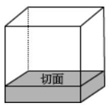
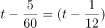
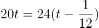
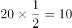
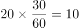

# 2023年广东省公务员录用考试《行测》题（乡镇卷）（网友回忆版）

> 数量关系 · 13 题 · 广东 2023

## 第 1 题　qid 5514806 · 数学运算

11，-13，15，-17，19，（    ）

- **A**. -21　✅
- **B**. -22
- **C**. 21
- **D**. 22

**答案**：A

**官方解析**

观察数列，数字去掉正负号后是公差为2的等差数列，则所求项的绝对值为19+2=21；正负号以周期交替的形式出现，奇数项为正，偶数项为负，则所求项为负数，故所求项为-21。
故正确答案为A。

---

## 第 2 题　qid 5514778 · 数学运算

1.24，2.48，3.612，4.816，（    ）

- **A**. 5.102
- **B**. 6.224
- **C**. 5.1020　✅
- **D**. 6.1224

**答案**：C

**官方解析**

数列各项均为小数，考虑机械划分。整数部分：1，2，3，4，是连续自然数列，则所求项整数部分为5。小数部分起伏较大，考虑将小数部分中的数字分成两个部分：2|4，4|8，6|12，8|16，观察发现：2×2=4，4×2=8，6×2=12，8×2=16，即小数部分中的第一部分×2=第二部分。综上所述，只有C项整数部分为5、小数部分10×2=20，符合规律。
故正确答案为C。

---

## 第 3 题　qid 5514865 · 数学运算

，，，，（    ）

- **A**. 

　✅
- **B**. 

- **C**. 

- **D**. 

**答案**：A

**官方解析**

数列各项均为分数，优先考虑分数数列。观察数列，分子、分母均不单调，考虑反约分。原数列可转化为：，，，，分子部分为常数列，则所求项分子为2；分母部分为自然数列，则所求项分母为12。故原数列所求项。

故正确答案为A。

---

## 第 4 题　qid 5510215 · 数学运算

某社区计划组建多支社工团队，为此招募了一批社工。如果每支团队由3名社工组成，则剩余2名社工；如果每支团队由4名社工组成，同样剩余2名社工，则该社区可能招募了（    ）名社工。

- **A**. 32
- **B**. 34
- **C**. 36
- **D**. 38　✅

**答案**：D

**官方解析**

方法一：根据题意，当3个人一组还剩2人时，即总人数减2是3的倍数，可排除B、C两项；当4个人一组也是还剩2人时，即总人数减2是4的倍数，排除A项，只有D项满足条件。
方法二：根据同余定理：余同取余，最小公倍数做周期。3、4的最小公倍数为12，则社工团队总人数可表示为：（12n+2）人。即总人数减2是12的倍数，只有D项满足条件。
故正确答案为D。

---

## 第 5 题　qid 5514819 · 数学运算

甲、乙两个仓库共存有340吨粮食。如果甲仓库存放的粮食是乙仓库的2倍多10吨，则甲仓库存有粮食（    ）吨。

- **A**. 110
- **B**. 120
- **C**. 230　✅
- **D**. 240

**答案**：C

**官方解析**

设乙仓库存有粮食x吨，则甲仓库存有粮食（2x+10）吨。根据题意可列式：x+（2x+10）=340，解得：x=110，则甲仓库存有粮食2×110+10=230吨。
故正确答案为C。

---

## 第 6 题　qid 5514823 · 数学运算

某单位共有8名安保队员，并根据序号每天安排2名队员轮流值班：第一天由队员1、2负责值班；第二天由队员3、4负责值班······以此类推。如果队员3今天负责了值班，则他将在（    ）天后再次负责值班。

- **A**. 4　✅
- **B**. 5
- **C**. 6
- **D**. 7

**答案**：A

**官方解析**

根据题意可知，每天2名队员轮流值班，8名队员轮一个周期需值天班。如果队员3今天负责值班，则他将在一个周期，即4天后，再次负责值班。

故正确答案为A。

---

## 第 7 题　qid 5514817 · 数学运算

某地有4片果园需要施肥。使用1台无人机为4片果园施肥分别需要1.2、1.3、2、2.5小时。如果使用2台无人机，则完成所有施肥任务至少需要（    ）小时。

- **A**. 2.5
- **B**. 3.5　✅
- **C**. 3.8
- **D**. 4.8

**答案**：B

**官方解析**

使用1台无人机为4片果园全部施肥共需要1.2+1.3+2+2.5=7小时，若想完成所有施肥任务用时尽量少，则2台无人机均应不间歇地工作，至少需小时。

故正确答案为B。

---

## 第 8 题　qid 5510218 · 数学运算

某工厂加工出一批正方体奶酪,抽检时质检员从奶酪中切下了一个厚度为2厘米的长方体（如图所示）。如果剩余奶酪的体积为144立方厘米，则奶酪原本的边长为（    ）厘米。

- **A**. 4
- **B**. 6　✅
- **C**. 8
- **D**. 10

**答案**：B

**官方解析**

设原正方体边长为x厘米，根据题意可知，切下一块厚度为2厘米的长方体奶酪后，剩余部分的高为（x-2）厘米，长和宽均为x厘米。已知剩下体积为144立方厘米，由此可列式：。代入A项：当x=4时，，排除；代入B项：当x=6时，，符合题意，当选。

故正确答案为B。

---

## 第 9 题　qid 5510217 · 数学运算

某单位去年报名参加志愿活动的党员与非党员之比为1∶3。今年的报名总人数提高了20%，党员与非党员之比为1∶2，党员人数比去年多了6人。则今年该单位报名参加志愿活动的党员共有（    ）人。

- **A**. 16　✅
- **B**. 24
- **C**. 32
- **D**. 48

**答案**：A

**官方解析**

设原来党员人数为x人，则原来总人数为（x+3x）=4x人，现在总人数为人。根据题意可知，现在党员人数为人，则有1.6x-x=6人，解得x=10，即现在党员人数为1.6×10=16人。

故正确答案为A。

---

## 第 10 题　qid 5510224 · 数学运算

某牧场的草，匀速生长。如果20头牛来吃，20天可将草吃光；如果10头牛和10只羊来吃，30天可以恰好吃光。已知一头牛每天的吃草量是一只羊的2倍，则30只羊吃该牧场的草，多少天可以吃光？

- **A**. 10
- **B**. 20
- **C**. 30　✅
- **D**. 40

**答案**：C

**官方解析**

方法一：设牧场原有草量为Y，每天生长草量为X，一只羊每天吃草量为1，则根据“一头牛每天的吃草量是一只羊的2倍”，可知一头牛每天吃草量为1×2=2。由牛吃草公式：Y=（N-X）×T，可得：Y=（2×20-X）×20······①，Y=（2×10+1×10-X）×30······②，解得X=10，Y=600。设30只羊吃牧场的草，t天可以吃光，则有600=（30-10）×t，解得t=30，即30只羊吃该牧场的草，30天可以吃光。
方法二：由于一头牛每天吃草的量是一只羊的2倍，则10头牛和10只羊吃草的量=10×2+10=30头羊吃草的量，故30只羊吃该牧场的草，30天可以吃完。
故正确答案为C。

---

## 第 11 题　qid 5510219 · 数学运算

某单位共有员工200人，其中订阅杂志的人数比只订阅报纸的人数多88%。则报纸和杂志均未订阅的员工有（    ）人。

- **A**. 36
- **B**. 56　✅
- **C**. 76
- **D**. 96

**答案**：B

**官方解析**

根据题意可知，，设订阅杂志人数为47x人，则仅订阅报纸人数为25x人，因订阅杂志人数+仅订阅报纸人数=总人数-不订阅报纸和杂志的人数，故47x+25x=200-不订阅报纸和杂志的人数，当x=1时，所求=128，无对应选项；当x=2时，所求=56，对应B项；当x＞2时，47x+25x＞200，不符合题意。

故正确答案为B。

---

## 第 12 题　qid 5514820 · 数学运算

某公司向餐馆订购盒饭，要求每份盒饭包含2种荤菜、2种素菜。如果餐馆共准备了4种荤菜和3种素菜，则最多有（    ）种盒饭。

- **A**. 6
- **B**. 12
- **C**. 18　✅
- **D**. 24

**答案**：C

**官方解析**

先从4种荤菜中选择2种，情况数为种；再从3种素菜中选择2种，情况数为种。分步用乘法，则最多有6×3=18种盒饭。

故正确答案为C。

---

## 第 13 题　qid 5514821 · 数学运算

小明骑车从甲镇前往乙镇。如果骑车的速度为每小时20千米，那么将准时到达。如果骑车的速度为每小时24千米，那么将提早5分钟到达。则甲镇到乙镇的距离为（    ）千米。

- **A**. 8
- **B**. 10　✅
- **C**. 12
- **D**. 16

**答案**：B

**官方解析**

方法一：设小明骑车速度为每小时20千米时，用时为t小时，则骑车速度为每小时24千米时，用时为小时。可列式为：，解得，则甲镇到乙镇的距离为千米。

方法二：根据路程不变，速度与时间成反比可知，两次骑车的速度之比为20：24=5：6，则时间之比为6：5，可知骑车速度为每小时20千米时所用时间为6×5=30分钟。则甲镇到乙镇的距离为千米。

故正确答案为B。

---
