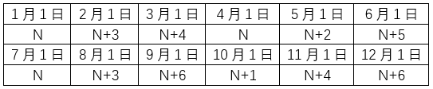

# 2023年度浙江省党政机关选调应届优秀大学毕业生《行测》题（网友回忆版）

> 数量关系 · 15 题 · 浙江 2023

## 第 1 题　qid 5801959 · 数学运算

某网店促销活动中，原价为25元/瓶的洗发水按50元/3瓶出售。理发店以促销价购买了若干瓶洗发水，比按原价购买节约了200元。那么理发店购买了多少瓶洗发水？

- **A**. 18
- **B**. 21
- **C**. 24　✅
- **D**. 27

**答案**：C

**官方解析**

设理发店购买了x瓶洗发水，根据以促销价购买洗发水比按原价购买节约了200元，可列式：，解得x=24。

故正确答案为C。

---

## 第 2 题　qid 5801965 · 数学运算

甲、乙合作完成一项工程，甲的效率是乙的1.5倍。工程开始后，甲先单独工作5天，接着乙单独工作10天，剩余工作还需合作5天完成。如果这项工程全程由甲、乙合作完成，需要多少天？

- **A**. 10
- **B**. 12　✅
- **C**. 15
- **D**. 18

**答案**：B

**官方解析**

赋值乙的效率为2，则甲的效率为2×1.5=3。根据题意，可得工程总量为5×3+10×2+5×（2+3）=60。则这项工程全程由甲、乙合作完成需要天。

故正确答案为B。

---

## 第 3 题　qid 5801974 · 数学运算

小王阅读一本小说，每天均阅读偶数页，前3天共阅读了34页，且第一天、第二天和第三天阅读的页数分别为5的倍数、4的倍数和3的倍数。那前3天他阅读页数最多的一天最多可能阅读了多少页？

- **A**. 16
- **B**. 18
- **C**. 20　✅
- **D**. 24

**答案**：C

**官方解析**

小王每天均阅读偶数页且第一天、第二天和第三天阅读的页数分别为5的倍数、4的倍数和3的倍数，则小王第一天、第二天和第三天阅读的页数应分别为2×5=10的倍数、4的倍数和2×3=6的倍数。细分情况较多，考虑从多到少代入进行验证：
D项：小王阅读页数最多的一天最多阅读了24页，这一天可能是第二天，则第一天和第三天共阅读了34-24=10页，无法满足第一天、第三天阅读的页数分别为5的倍数、3的倍数；这一天可能是第三天，则第一天和第二天共阅读了34-24=10页，无法满足第一天、第二天阅读的页数分别为5的倍数、4的倍数，不符合题意，排除；
C项：小王阅读页数最多的一天最多阅读了20页，这一天可能是第一天，则第二天和第三天共阅读了34-20=14页，当第二天阅读8页、第三天阅读6页时总和恰为14页，符合题意，当选。
因本题所问为阅读页数最多的一天最多可能阅读了多少页，所以无需再验证其他答案。
故正确答案为C。

---

## 第 4 题　qid 5801971 · 数学运算

某角色对战游戏的规则如下：对战双方依次轮流进攻，造成的伤害为进攻方攻击能力减去防御方防御能力且最少伤害为0；生命值先降至0或更低则失败。已知你控制的角色“生命值100，攻击能力10，防御能力10”，那么下面哪个角色你无法战胜？

- **A**. 生命值90，攻击能力16，防御能力5　✅
- **B**. 生命值5，攻击能力150，防御能力0
- **C**. 生命值100，攻击能力21，防御能力0
- **D**. 生命值144，攻击能力12，防御能力7

**答案**：A

**官方解析**

代入各选项，依次进行验证：

A项：我的角色每次进攻对其造成的伤害为10-5=5，需次进攻可将其战胜；对方角色每次对我的角色进攻造成的伤害为16-10=6，生命值，需17次进攻可战胜我的角色。18&gt;17，则我的角色无法战胜该角色，当选。

故正确答案为A。

备注：对其他选项进行代入验证如下。

B项：我的角色每次进攻对其造成的伤害为10-0=10，，需1次进攻可将其战胜；对方角色每次对我的角色进攻造成的伤害为150-10=140，，需1次进攻可战胜我的角色。若我的角色先攻击则可战胜该角色；

C项：我的角色每次进攻对其造成的伤害为10-0=10，需次进攻可将其战胜；对方角色每次对我的角色进攻造成的伤害为21-10=11，生命值，需10次进攻可战胜我的角色。若我的角色先攻击则可战胜该角色；

D项：我的角色每次进攻对其造成的伤害为10-7=3，需次进攻可将其战胜；对方角色每次对我的角色进攻造成的伤害为12-10=2，需次进攻可战胜我的角色。48&lt;50，则我的角色可战胜该角色。

---

## 第 5 题　qid 5801967 · 数学运算

甲从A地，乙从B地同时出发相向而行。甲、乙速度之比为4：3，两人第一次相遇在C处后继续前行，甲到B处、乙到A处后立即返回，两人第二次相遇在D处。已知C、D两地相距20km，那么A、B两地的距离为：

- **A**. 56km
- **B**. 60km
- **C**. 63km
- **D**. 70km　✅

**答案**：D

**官方解析**

甲、乙速度之比为4：3，根据时间相等时，路程和速度成正比，可知AC：BC=4：3。设AC、BC长度分别为4S、3S，BD=BC+CD=3S+20km。两人从第一次相遇到第二次相遇所走路程为第一次相遇所走路程的2倍，则第一次相遇到第二次相遇，甲所走路程为BC+BD=2AC，即3S+3S+20=2×4S，解得S=10km。A、B两地的距离为4S+3S=70km。

故正确答案为D。

---

## 第 6 题　qid 5801999 · 数学运算

A、B、C3个志愿队分别下乡帮扶，A队每隔5天去一次，B队每8天去一次，C队每隔6天去一次，3个队伍周四第一次同时下乡，那么第二次同时下乡后A队周几再去？

- **A**. 周三　✅
- **B**. 周四
- **C**. 周五
- **D**. 周六

**答案**：A

**官方解析**

A队每隔5天去一次，即每6天去一次；B队每8天去一次；C队每隔6天去一次，即每7天去一次，3个队伍下乡周期的最小公倍数为168，即每168天3个队伍相遇一次。3个队伍周四第一次同时下乡，经过周再次相遇，即第二次同时下乡的日期为周四，之后A队间隔5天再去，即周三。

故正确答案为A。

---

## 第 7 题　qid 5801981 · 数学运算

某个小镇的道路如下图所示，其中标注的数字表示经过该条道路所需的时间（单位：分钟）。已知只能向上、左两个方向前进，那么从右下角A点到左上角B点至少需要多少分钟？

- **A**. 28
- **B**. 31　✅
- **C**. 34
- **D**. 37

**答案**：B

**官方解析**

因为只能向上、左两个方向前进，则从右下角A点到左上角B点需要向上走4条道路，向左走5条道路。要想花费时间最短，则向上走的道路和向左走的道路所需时间均应尽量短。观察可知，向左走的道路中所需时间最短的5条依次为5分钟、3分钟、3分钟、2分钟、2分钟，此路径中向上走的道路所需时间依次为1分钟、7分钟、4分钟、4分钟，如图，最短花费时间=5+1+3+3+2+2+7+4+4=31分钟。

故正确答案为B。

---

## 第 8 题　qid 5801979 · 数学运算

某网球比赛是五局三胜制。甲乙两球员在彼此对战中单局胜率分别为57%和43%。如果甲先胜了前两局，那么甲最后获胜的概率：

- **A**. 70%以下
- **B**. 70%~80%
- **C**. 80%~90%
- **D**. 90%以上　✅

**答案**：D

**官方解析**

方法一：根据比赛是五局三胜制，且甲先胜了前两局，分情况讨论如下：

（1）甲第三局胜，概率=57%；

（2）乙第三局胜，甲第四局胜，概率=43%×57%=24.51%；

（3）乙第三局、第四局胜，甲第五局胜，概率。

则甲最后获胜的概率=57%+24.51%+10.54%=92.05%，在D项范围内。

方法二：正面情况较多，从反面考虑。反面情况为乙最后获胜，即后面三局均为乙胜，概率，则甲最后获胜的概率=1-反面概率=1-7.95%=92.05%，在D项范围内。

故正确答案为D。

---

## 第 9 题　qid 5801977 · 数学运算

木块和塑料块的质量均为30克，如果将木块和氦气球绑在一起，称得的重量刚好是绑在氢气球上的塑料块称得的重量的1.5倍，而把氢气球、氦气球都绑在塑料块上，称得的重量正好是15克。那么把木块、塑料块和氦气球绑在一起时称得的重量是多少克？

- **A**. 45
- **B**. 48
- **C**. 54
- **D**. 57　✅

**答案**：D

**官方解析**

受浮力影响，设氦气球可使所称重量下降x克，氢气球可使所称重量下降y克。则木块和氦气球绑在一起称得的重量为（30-x）克，绑在氢气球上的塑料块称得的重量为（30-y）克，结合题意可列式：30-x=1.5（30-y），整理可得1.5y-x=15······①；把氢气球、氦气球都绑在塑料块上，称得的重量为30-y-x=15克，整理可得x+y=15······②，联立①②两式，解得x=3。因此，把木块、塑料块和氦气球绑在一起时称得的重量是30+30-3=57克。
故正确答案为D。

---

## 第 10 题　qid 5802017 · 数学运算

某工厂去年生产某种产品每月盈利20万元。今年1月、2月车间设备升级改造，期间没有盈利且每月额外投入5万元。如果升级改造后，其他成本不变，那么今年3月起，每月盈利比去年提高多少，才能保证今年的总盈利比去年提高10%？

- **A**. 25%
- **B**. 31%
- **C**. 37%　✅
- **D**. 42%

**答案**：C

**官方解析**

设今年3月起，该工厂每月盈利比去年提高x，能保证今年的总盈利比去年提高10%。根据今年还剩12-2=10个月，结合题意可列式：，解得x=37%。

故正确答案为C。

---

## 第 11 题　qid 5801993 · 数学运算

甲、乙两车同时出发匀速从A地前往B地，甲车的速度是乙车的1.5倍。1小时后，甲车因故需要原速返回A地，之后立即提速重新匀速前往B地。已知甲车返回A地时乙车行驶了全程的，甲车比乙车晚30分钟到达B地，那么甲车第二次前往B地的速度是第一次的多少倍？

- **A**. 

　✅
- **B**. 

- **C**. 

- **D**. 

**答案**：A

**官方解析**

设乙车的速度为x，甲车第一次前往B地的速度为1.5x，从A地到B地全程距离为S。根据“1小时后，甲车因故需要原速返回A地”，可得甲车从出发到返回A地用时1×2=2小时，即乙车用时2小时行驶了全程的，即，则S=3x，乙车到达B地用时小时，根据“甲车比乙车晚30分钟到达B地”，可得甲车到达B地用时3.5小时，则甲车第二次前往B地用时3.5小时-2小时=1.5小时，第二次前往B地的速度，所求倍。

故正确答案为A。

---

## 第 12 题　qid 5802007 · 数学运算

兄弟姐妹四人年龄各不相同，大哥和小妹的年龄之和正好是三弟年龄的两倍，大哥和二姐年龄之和比三弟和小妹年龄之和的两倍大2岁，三弟15岁。那么二姐最大多少岁？

- **A**. 18
- **B**. 19
- **C**. 20　✅
- **D**. 21

**答案**：C

**官方解析**

年龄问题，考虑用代入排除法解题，由于求最大，则从大到小依次代入，设大哥、小妹的年龄分别为x岁、y岁。

代入D项：二姐为21岁，则有：x+y=2×15······①，x+21=（15+y）×2+2······②，联立①②，解得、，年龄应为整数，不满足题意，排除；

代入C项：二姐为20岁，则有：x+y=2×15······①，x+20=（15+y）×2+2······②，联立①②，解得x=24、y=6，即大哥、二姐、三弟、小妹的年龄分别为24岁、20岁、15岁、6岁，满足题干所有条件，当选。

故正确答案为C。

---

## 第 13 题　qid 5802064 · 数学运算

3个正方体骰子一起掷，如果朝上的点数都不相同，则计2分：如果朝上的点数有且仅有两个相同，则计3分；如果三个都相同，则计5分。那么连掷两次，共得5分的概率为多少？

- **A**. 

- **B**. 

- **C**. 

　✅
- **D**. 

**答案**：C

**官方解析**

根据题意可知，每掷1个正方体骰子，点数可以为1、2、3、4、5、6，共6种可能，则3个正方体骰子一起掷，连掷两次，总的情况数有种。由于朝上的点数都不相同、朝上的点数有且仅有两个相同、三个都相同包含了连掷两次的所有可能性，故若想共得5分，则满足条件的情况有两种：①第一次得2分、第二次得3分；②第一次得3分、第二次得2分。得2分的情况数有种；得3分时需先从3个骰子中选2个令其点数相同，再从6个点数中选2个，有种，满足条件的情况数有种，所求。

故正确答案为C。

---

## 第 14 题　qid 5802074 · 数学运算

单排队列有5个人，现重新安排他们的位置，要保证至少有1个人的位置与原来不同，且至少有两个原来相邻的人位置不变。那么共有多少种不同的安排法？

- **A**. 11
- **B**. 14
- **C**. 17　✅
- **D**. 18

**答案**：C

**官方解析**

假设队列中的5个人分别为甲、乙、丙、丁、戊，根据题意可知，若要保证至少有1个人的位置与原来不同，且至少有两个原来相邻的人位置不变，则分情况讨论如下：

（1）3个人的位置与原来不同，有种情况；其余2个原来相邻的人位置不变，可以为甲乙、乙丙、丙丁、丁戊位置不变，有4种情况，共有2×4=8种情况；

（2）2个人的位置与原来不同，先从5个人中选2个人，有种情况；除选出来的两人为乙丁，使没有人相邻这1种情况外，均可保证2个或3个原来相邻的人位置不变，共有10-1=9种情况。

综上可知，共有8+9=17种安排法。

故正确答案为C。

---

## 第 15 题　qid 5802069 · 数学运算

如果某个月1号为周一，则该月哪天是周几就可以很快计算出来。那么一年最多能有多少个这样的月份?

- **A**. 2
- **B**. 3　✅
- **C**. 4
- **D**. 5

**答案**：B

**官方解析**

根据每个大月（1月、3月、5月、7月、8月、10月、12月）有31天，，即每经过一个大月，星期数加3；每个小月（4月，6月，9月，11月）有30天，，即每经过一个小月，星期数加2；平年2月有28天，，即每经过一个平年2月，星期数不变；闰年2月有29天，，即每经过一个闰年2月，星期数加1。假设1月1号星期数为N，分情况讨论如下：

（1）若该年为平年，则每个月份1号的星期数情况可列表如下：

则该年中每月1号出现最多的相同星期数为N+3，有2月、3月、11月共3个月，若这3个月1号均为周一，则题目所求情况最多有3个月。

（2）若该年为闰年，则每个月份1号的星期数情况可列表如下：

则该年中每月1号出现最多的相同星期数为N，有1月、4月、7月共3个月，若这3个月1号均为周一，则题目所求情况最多有3个月。

综上可知，一年最多能有3个1号为周一的月份。

故正确答案为B。

---
