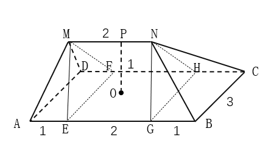
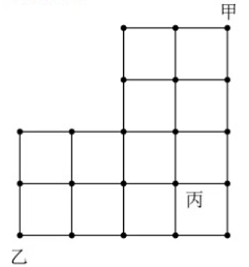
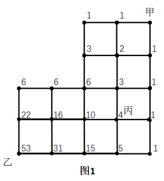
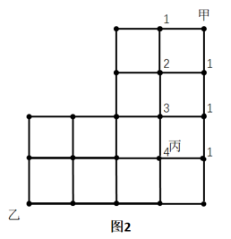
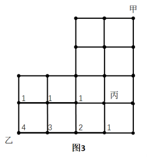
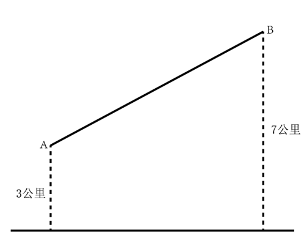

# 2023年新疆公务员录用考试《行测》试题（网友回忆版）

> 数量关系 · 9 题 · 新疆 2023

## 第 1 题　qid 5510179 · 数学运算

下图所示是一种帐篷屋顶的示意图，底面是一个长4米宽3米的长方形，屋顶高1米，上棱长2米且平行于底面，那么该帐篷屋顶的体积是：

- **A**. 5立方米　✅
- **B**. 11立方米
- **C**. 12立方米
- **D**. 24立方米

**答案**：A

**官方解析**

如图所示，过上棱两个端点M、N分别向底面做垂直截面，交底面ABCD于点E、F、G、H，则该帐篷屋顶可拆分为左、右两个四棱锥（M-AEFD和N-BCHG）和中间一个三棱柱（EFM-GHN）。根据公式：；，则

立方米；立方米。则该帐篷屋顶的体积立方米。

故正确答案为A。

---

## 第 2 题　qid 5509974 · 数学运算

小林因病入院需挂瓶输液，上午9点开始输液，输液袋上标有“容量300毫升，每毫升15滴”等药液信息。输液开始时，药液滴速为75滴/分钟。输液5分钟后小林感觉身体不适，护士帮忙调整了药液滴速（调整时间不计），又继续输液10分钟，药液还剩235毫升，那么输液结束的时间是：

- **A**. 10点26分
- **B**. 10点18分
- **C**. 10点14分　✅
- **D**. 10点10分

**答案**：C

**官方解析**

根据题意，输液5分钟后剩余的药液为毫升，则调整后药液的滴速为滴/分钟，剩余的235毫升药液还需输液的时间为分钟，则输液的总时间为分钟分钟，即1小时14分钟，上午9点开始输液，则输液结束的时间是10点14分。

故正确答案为C。

---

## 第 3 题　qid 5509973 · 数学运算

浮雕银杯是我国古代常见的一种盛酒容器，有大银杯和小银杯之分。已知5个大银杯加1个小银杯，可以盛酒3斛（斛，是古代的一种容量单位），5个小银杯加1个大银杯，可以盛酒2斛，则1斛酒至多可以倒满小银杯的数量为：

- **A**. 2个
- **B**. 3个　✅
- **C**. 4个
- **D**. 5个

**答案**：B

**官方解析**

设大银杯容量为x，小银杯容量为y，赋值1斛酒的量为1；根据题意可列方程：5x+y=3······①，5y+x=2······②，联立①②解得，。则1斛酒可倒满的小银杯数量，故至多可以倒满小银杯的数量为3个。

故正确答案为B。

---

## 第 4 题　qid 5510113 · 数学运算

甲乙两地间的纵横道路网如下图所示，若从甲地到乙地沿道路铺设电缆，要使铺设的电缆长度最短，则电缆经过丙地的概率为：

- **A**. 

- **B**. 

- **C**. 

- **D**. 

　✅

**答案**：D

**官方解析**

如图所示，从甲地到乙地沿道路铺设电缆，要使铺设的电缆长度最短，电缆走向只能向下和向左铺设。从甲开始，在每个交点处标出甲到此点的情况数，该点情况数为上方和右方的两个点情况数之和。

如图1所示，从甲到乙铺设电缆共22+31=53种情况。

若要使铺设的电缆经过丙地，则需电缆如图2所示先从甲到丙，共4种情况，再如图3所示从丙到乙，共4种情况，故经过丙地的情况数为4×4=16种。所求概率。

故正确答案为D。

---

## 第 5 题　qid 5510002 · 数学运算

某小区物业准备了230盒口罩免费派发给10栋楼，要求任意两栋楼派发的口罩数量都不相同，但最多相差不超过1倍。假设口罩不拆盒发放，那么派发口罩数量最少的那栋楼最少可派发口罩：

- **A**. 18盒
- **B**. 15盒
- **C**. 14盒　✅
- **D**. 12盒

**答案**：C

**官方解析**

设派发口罩数量最少的那栋楼最少派发口罩x盒。要让派发口罩数量最少的楼栋派发口罩最少，则其他楼栋口罩派发尽量多，且派发口罩最多的楼栋不超过最少的1倍，即派发口罩最多的楼栋最多派发口罩2x盒。由于任意两栋楼派发口罩数量都不相同，则可列表如下：

根据口罩一共有230盒可列式：2x+2x-1+2x-2+2x-3+2x-4+2x-5+2x-6+2x-7+2x-8+x=230，化简可得：19x-36=230，解得x=14。那么派发口罩数量最少的那栋楼最少可派发口罩14盒。

故正确答案为C。

---

## 第 6 题　qid 5510000 · 数学运算

某公司自主研发生产的A、B、C三种型号氢燃料电池，解决了该公司今年生产轿车所需电池数量的10%（按一辆车配一块电池计算）。其中A型号氢燃料电池的产量是B型号的2倍，C型号的产量比A、B两种型号的产量之和还多400块。预计该公司今年的轿车总产量是42.4万辆，那么B型号氢燃料电池的产量是：

- **A**. 3500块
- **B**. 7000块　✅
- **C**. 14000块
- **D**. 21400块

**答案**：B

**官方解析**

根据题意，该公司今年自主研发生产的A、B、C三种型号氢燃料电池的产量和为42.4×10000×10%=42400块。已知C型号的产量比A、B两种型号的产量之和还多400块，则A、B两种型号的产量之和为块，A型号氢燃料电池的产量是B型号的2倍，则B型号氢燃料电池的产量为块。

故正确答案为B。

---

## 第 7 题　qid 5509979 · 数学运算

某智慧公共停车场的收费标准如下：停车不超过15分钟，不收费；超过15分钟但不超过60分钟，按1小时计，收费5元；超过1小时后，超过的部分按每30分钟4元收费（不足30分钟，按30分钟计）。若李先生支付停车费17元，则他停车的时长可能为：

- **A**. 2小时
- **B**. 2小时15分钟　✅
- **C**. 2小时45分钟
- **D**. 3小时

**答案**：B

**官方解析**

根据题干“停车不超过15分钟，不收费；超过15分钟但不超过60分钟，按1小时计，收费5元”，李先生支付停车费17元，则停车时长一定超过1小时。扣除前1小时的收费5元，超出1小时部分付款为17-5=12元。根据题干“超过1小时后，超过的部分按每30分钟4元收费（不足30分钟，按30分钟计）”，12元最多可支付12÷4=3个30分钟=1.5小时，则2小时＜李先生的停车时长小时。

故正确答案为B。

---

## 第 8 题　qid 5510073 · 数学运算

某村拟建造一个容积为144立方米，深度为4米的长方体无盖蓄水池。经测算，蓄水池底部造价为260元/平方米，侧面造价为180元/平方米。那么该水池的最低总造价为：

- **A**. 11440元
- **B**. 25920元
- **C**. 26640元　✅
- **D**. 31680元

**答案**：C

**官方解析**

根据长方体体积=底面积×高，结合水池“容积为144立方米，深度为4米”，可得水池底面长方形面积平方米。底面积一定，要使造价最低，则侧面积要尽量少，假设底面长方形的长和宽分别为a和b，则水池侧面积=2×4a+2×4b=4（2a+2b），若要侧面积最小，则2a+2b最短，即底面周长最短。因为“长方形面积一定，长宽相等也就是正方形时周长最短”，因a×b=36，所以当a=b=6时，a+b最小，此时侧面积=4×（2a+2b）=4×24=96平方米。总造价=底部造价+侧面造价=36×260+96×180=26640元。 

故正确答案为C。

---

## 第 9 题　qid 5510178 · 数学运算

A、B两村在一条笔直公路的同侧，到公路的垂直距离分别是3公里和7公里，两村相距8.5公里，现需在公路边建一个物资集散中心，为节约物资配送成本，集散中心到两个村的直线路程之和应尽可能小，若货车的速度约为60公里/小时，那么货车从集散中心出发，到两村送货后返回中心，路途所花费的最少时间为：

- **A**. 18分钟
- **B**. 21分钟　✅
- **C**. 24分钟
- **D**. 27分钟

**答案**：B

**官方解析**

如图所示：过公路作A点的对称点为，交公路于点M；过B点作公路的垂线，垂点为N；过的垂线，垂点为；过A点作BN的垂线，垂点为D，则四边形ADNM和 为矩形。连接，交MN于点O，根据两点之间线段最短，可知将物资集散中心修建在O点时，到两村的直线路程之和最小。

已知AM=3公里，BN=7公里，则BD=BN-DN=BN-AM=7-3=4公里。在直角中，已知AB=8.5公里，根据勾股定理可得公里，则公里。在直角中，公里，根据勾股定理可得公里。

货车从集散中心出发，到两村送货后返回中心所走最短路程公里，则所需时间约为。

故正确答案为B。

---
