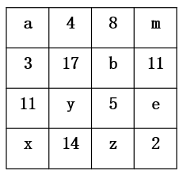

# 2023年江苏省公务员录用考试《行测》题（A类）（网友回忆版）

> 数量关系 · 19 题 · 江苏 2023

## 第 1 题　qid 5746594 · 数学运算

-3，-1，2，7，14，（    ）

- **A**. 22
- **B**. 23
- **C**. 25　✅
- **D**. 26

**答案**：C

**官方解析**

数列无明显特征，考虑多级数列。后项-前项得到新数列：2，3，5，7，（    ），新数列为连续的质数数列，则下一项为11，故所求项=14+11=25。
故正确答案为C。

---

## 第 2 题　qid 5746642 · 数学运算

9，6，5，，，（    ）

- **A**. 
4
　✅
- **B**. 

- **C**. 
3

- **D**. 

**答案**：A

**官方解析**

数列部分为分数，且选项中有分数，考虑分数数列。对数列进行反约分可得：，，，，，（    ），分子部分为：9，12，15，18，21，（    ），是公差为3的等差数列，则下一项为21+3=24；分母部分为连续自然数数列，则下一项为6，故所求项为。

故正确答案为A。

---

## 第 3 题　qid 5697242 · 数学运算

，4，，16，，（    ）

- **A**. 
42

- **B**. 

- **C**. 
49

- **D**. 

　✅

**答案**：D

**官方解析**

观察数列特征，有整数和根号，优先考虑机械划分。将原数列统一形式，可转化为：，，，，，（    ）。整数部分为：1，2，3，4，5，（    ），是连续自然数列，则所求项的整数部分应为6；根号内部分为：3，4，7，16，43，（    ），无明显规律，考虑作差，后项减前项得：1，3，9，27，是公比为3的等比数列，则下一项应为27×3=81，所求项的根号内部分应为43+81=124，故所求项。

故正确答案为D。

---

## 第 4 题　qid 5746606 · 数学运算

1.1，3.1，6.2，5.11，30.2，（    ）

- **A**. 21.4
- **B**. 56.8　✅
- **C**. 63.63
- **D**. 124.4

**答案**：B

**官方解析**

数列各项均为小数，优先考虑机械划分。整数部分和小数部分分开看无规律，考虑整体看，小数部分+整数部分得到新数列：2，4，8，16，32，（    ），是公比为2的等比数列。则所求项小数部分+整数部分=32×2=64，只有B项56+8=64满足。
故正确答案为B。

---

## 第 5 题　qid 5697247 · 数学运算

已知食用西红柿、猪大排、油炸土豆片、牛奶各100克吸收的热量分别为20大卡、388大卡、612大卡、54大卡，快走每30分钟可以消耗热量132大卡。若小红午餐享用了西红柿84克、猪大排120克、油炸土豆片40克和牛奶120克，则她通过快走消耗掉午餐吸收的热量所需的时间是（    ）。

- **A**. 1.5小时
- **B**. 3小时　✅
- **C**. 4.5小时
- **D**. 6小时

**答案**：B

**官方解析**

根据题意可知，每食用1克西红柿吸收的热量为大卡，1克猪大排吸收的热量为大卡，1克油炸土豆片吸收的热量为大卡，1克牛奶吸收的热量为大卡。故小红午餐吸收的热量=84×0.2＋120×3.88＋40×6.12＋120×0.54=792大卡。则通过快走消耗掉午餐吸收的热量所需的时间分钟＝3小时。

故正确答案为B。

---

## 第 6 题　qid 5697248 · 数学运算

甲、乙、丙三个家庭去年的年收入比五年前分别增长了50%、60%、150%。这三个家庭去年的年收入总和为84万元，比五年前多35万元。若去年丙家庭的年收入为20万元，则五年前乙家庭的年收入为（    ）。

- **A**. 16万元
- **B**. 20万元
- **C**. 25万元　✅
- **D**. 36万元

**答案**：C

**官方解析**

根据题意可知，五年前丙家庭的年收入为万元，设五年前甲家庭的年收入为x万元，乙家庭的年收入为y万元，根据题意，可列下表：

可列方程组：，解得x=16，y=25，即五年前乙家庭的年收入为25万元。

故正确答案为C。

---

## 第 7 题　qid 5697253 · 数学运算

一个A型4G基站的地面覆盖半径为1~3千米，一个B型5G基站的地面覆盖半径为100~200米。按此计算，一个A型4G基站的地面覆盖面积为B型5G基站的（    ）。

- **A**. 100~225倍
- **B**. 100~900倍
- **C**. 25~225倍
- **D**. 25~900倍　✅

**答案**：D

**官方解析**

根据圆的面积公式：，可得：一个A型4G基站的地面覆盖面积范围为平方米，一个B型5G基站的地面覆盖面积范围为平方米。则一个A型4G基站的地面覆盖面积最小是B型5G基站的倍，最大是倍 ，因此，一个A型4G基站的地面覆盖面积为B型5G基站的25~900倍。

故正确答案为D。

---

## 第 8 题　qid 5746598 · 数学运算

某高校机械学院有甲、乙、丙三个专业，学生人数之比是8：7：5。已知该学院三个专业学生的男女总人数之比是3：1，甲、乙两个专业学生的男女人数之比分别是7：3和6：1，则丙专业学生的男女人数之比是（    ）。

- **A**. 7：2
- **B**. 4：1
- **C**. 15：4
- **D**. 17：8　✅

**答案**：D

**官方解析**

赋值该学院三个专业学生总人数为200人。根据题意可知，甲专业学生人数为人，乙专业学生人数为人，丙专业学生人数为200-80-70=50人。该学院三个专业的女生总人数为人，甲专业女生人数为人，乙专业女生人数为人。则丙专业女生人数为50-24-10=16人，丙专业男生人数=50-16=34人，则丙专业学生的男女人数之比=34：16=17：8。

故正确答案为D。

---

## 第 9 题　qid 5697257 · 数学运算

某学校的运动场是椭圆形。边界椭圆上一点到中心距离的最小值是20米，两点间距离的最大值为80米。若学生在该运动场上排成方阵，则所排成方阵面积的最大值为（    ）。

- **A**. 1280平方米
- **B**. 1360平方米
- **C**. 1440平方米
- **D**. 1600平方米　✅

**答案**：D

**官方解析**

如下图所示，20米为椭圆的短半轴OB（b），米为椭圆的长半轴OA（a），则椭圆方程应为：。要想让方阵面积最大，则方阵应内接椭圆，根据结论：椭圆内接矩形的面积最大为2ab，则所排成方阵面积的最大值为2×20×40=1600平方米。

故正确答案为D。

---

## 第 10 题　qid 5746601 · 数学运算

小王经营一家鲜花网店，每位顾客均随机获赠一个装有一支康乃馨、玫瑰花或百合花的盲盒，3种盲盒的成本分别为3元、5元、8元。某日该鲜花网店共有顾客24人，赠送盲盒的总成本为127元，则获赠玫瑰花盲盒的顾客最多有：

- **A**. 19人
- **B**. 20人　✅
- **C**. 21人
- **D**. 22人

**答案**：B

**官方解析**

设获赠康乃馨、玫瑰花、百合花盲盒的顾客分别有x人、y人、z人。根据题意可列式：x+y+z=24······①，3x+5y+8z=127······②，②-①×3可得：2y+5z=55。因为5z和55都是5的倍数，所以2y也应是5的倍数，则y是5的倍数，只有B项符合。
故正确答案为B。

---

## 第 11 题　qid 5699117 · 数学运算

某食品企业为丰富产品造型，将一款甜点的外形由圆柱形改为半球形。若圆柱形甜点的底面半径是高的2倍，半球形甜点的体积缩小到圆柱形甜点的，则半球形甜点的底面半径是圆柱形甜点底面半径的（    ）。

- **A**. 

- **B**. 

- **C**. 

- **D**. 

　✅

**答案**：D

**官方解析**

赋值圆柱形甜点的底面半径为4，则高为2，根据公式：，可得。根据公式：，可得，解得R=3，即半球形甜点的底面半径是圆柱形甜点底面半径的。

故正确答案为D。

---

## 第 12 题　qid 5699120 · 数学运算

甲骑自行车，乙步行，同时从A地前往B地。已知A、B两地相距4000米，甲的速度是乙的3倍。途中自行车发生故障，甲修车耽误了一段时间。当乙到达B地时，甲离B地还有400米。在甲修车的时间段内，乙走过的路程为（    ）。

- **A**. 3000米
- **B**. 2800米　✅
- **C**. 2400米
- **D**. 2000米

**答案**：B

**官方解析**

赋值乙的速度为1米/秒，则甲的速度为1×3=3米/秒，设甲修车的时间为t秒，当乙到达B地时，甲离B地还有400米，可知甲骑行的路程为4000-400=3600米。根据题意可知，乙从A地到B地的时间等于甲骑行与修车的时间之和，可列式，解得t=2800，故在甲修车的时间段内，乙走过的路程为2800×1=2800米。

故正确答案为B。

---

## 第 13 题　qid 5699134 · 数学运算

如图所示，纸片ABC的形状为直角三角形，AB=10厘米，BC=8厘米。若将纸片沿AD折叠，直角边AC恰好与斜边AB重叠，则的面积为（    ）。

- **A**. 15平方厘米　✅
- **B**. 16平方厘米
- **C**. 18平方厘米
- **D**. 21平方厘米

**答案**：A

**官方解析**

根据题意可知，为直角三角形，则厘米。设CD为x厘米，由于纸片沿AD折叠且AC恰好与AB重叠，则厘米，。，可列方程：，解得x=3。因此平方厘米。

故正确答案为A。

---

## 第 14 题　qid 5699124 · 数学运算

某博物馆拟举办一次为期4天的文物展览活动，展出的文物共有5类：青铜器、瓷器、玉器、书法、国画。若要求每天仅展出2类文物，每类文物都要展出但不能连续2天展出，且玉器和国画这2类文物不在第1天展出，则不同的展出方式共有（    ）。

- **A**. 72种　✅
- **B**. 120种
- **C**. 216种
- **D**. 360种

**答案**：A

**官方解析**

正向求解较复杂，考虑反向求解。玉器和国画不在第1天展出，不考虑每类文物都要展出的条件，不同的展出方式总情况共有种。不满足条件的情况可分为：①玉器和国画中有1类未展出，有种展出方式；②青铜器、瓷器、书法中有1类未展出，有种展出方式。故满足条件的情况数=总情况数-不满足条件的情况数=81-6-3=72种。

故正确答案为A。

备注：反向求解的总情况数为81种，则满足条件的情况数一定不超过81种，只有A项满足。

---

## 第 15 题　qid 5699127 · 数学运算

甲、乙两个工程队合作完成一项工程，甲每工作3天休息1天，乙每工作5天休息2天。若甲先工作，2天后乙加入，则再用21天完工；若乙先工作，12天后甲加入，则再用15天完工。甲单独完成该项工程需要的天数是（    ）。

- **A**. 43
- **B**. 44
- **C**. 47　✅
- **D**. 48

**答案**：C

**官方解析**

第一种情况：甲工程队从开始到完工共经过2+21=23天，23÷（3+1）=5⋯⋯3，即5个周期还余3天，共工作了5×3+3=18天；乙工程队共经过21天，21÷（5+2）=3，即3个周期，共工作了3×5=15天。

第二种情况：乙工程队从开始到完工共经过12+15=27天，27÷（5+2）=3⋯⋯6，即3个周期还余6天，共工作了3×5+5=20天；甲工程队共经过15天，15÷（3+1）=3⋯⋯3，即3个周期还余3天，共工作了3×3+3=12天。

则根据题意可列式：18甲+15乙=12甲+20乙，整理可得：，赋值甲的效率为5，则乙的效率为6。则工作总量为18×5+15×6=180，甲单独完成该项工程需要工作的天数为180÷5=36天，36÷3=12，即需要11个周期再工作3天，所以共需11×（3+1）+3=47天。

故正确答案为C。

---

## 第 16 题　qid 5699138 · 数学运算

浓度分别为68%、72%、78%的三种酒精溶液的总质量为240克。若将它们全部混合，则可得浓度为74%的酒精溶液；若只将浓度为72%和78%的酒精溶液混合，则可得浓度为76%的酒精溶液。这三种酒精溶液中，浓度为72%的酒精溶液质量为（    ）。

- **A**. 30克
- **B**. 40克
- **C**. 48克
- **D**. 60克　✅

**答案**：D

**官方解析**

由于浓度为72%和78%的酒精溶液混合后的浓度为76%，则三种酒精溶液全部混合可以看成浓度为68%和76%的酒精溶液混合。根据线段法，浓度之差与酒精溶液质量成反比，则

，则浓度为76%的酒精溶液质量克。根据“若只将浓度为72%和78%的酒精溶液混合，则可得浓度为76%的酒精溶液”，可画如下线段：

，则浓度为72%的酒精溶液质量克。

故正确答案为D。

---

## 第 17 题　qid 5699136 · 数学运算

某公司实行弹性工作制，允许居家办公，但要求员工每周的周一到周五至少有两天在公司工作。小王、小李和小陈都是该公司的员工，若他们分别从下周的周一到周五中随机选2天、3天、4天去公司工作，则他们下周三都去公司工作的概率是（    ）。

- **A**. 

- **B**. 

- **C**. 

　✅
- **D**. 

**答案**：C

**官方解析**

小王、小李和小陈分别从下周的周一到周五中随机选2天、3天、4天去公司，分别有、、种情况；满足要求的情况为小王、小李和小陈再从周一、周二、周四、周五中分别选1天、2天、3天去公司，分别有、、种情况，根据分步用乘法，则所求概率。

故正确答案为C。

---

## 第 18 题　qid 5746599 · 数学运算

一个快递分发点的快递员某天人均送件量为220件，最少的送了200件。已知有一名快递员送了260件，除他之外的快递员人均送件量为218件。当天该快递分发点的一名快递员送件量最多为：

- **A**. 542件
- **B**. 560件　✅
- **C**. 582件
- **D**. 596件

**答案**：B

**官方解析**

设该快递分发点共有x名快递员。根据总送件量一定，可列式为：，解得x=21，则这一天该快递分发点的总送件量为220×21=4620件。根据题意可知，若想当天一名快递员送件量最多，则其他快递员送件量应尽可能少。已知最少的送了200件，且有一名快递员送了260件，那么21人中有19人的送件量均为200件时，该快递员送件量达到最多，则最多为4620-260-200×19=4360-3800=560件。

故正确答案为B。

---

## 第 19 题　qid 5746600 · 数学运算

在下表中，小方格中的字母均为整数。若各行之和、各列之和、各对角线之和均相等，则a的值为：

- **A**. 17
- **B**. 18
- **C**. 19
- **D**. 20　✅

**答案**：D

**官方解析**

根据题干可知各行之和、各列之和、各对角线之和均相等。根据第一列之和对角线之和相等可列式：a+3+11+x=a+17+5+2，解得x=10。根据第二行和第三列相等可列式：3+17+b+11=8+b+5+z，解得z=18。可得第四行之和为10+14+18+2=44，第一列之和a+3+11+10=44，解得a=20。
故正确答案为D。

---
