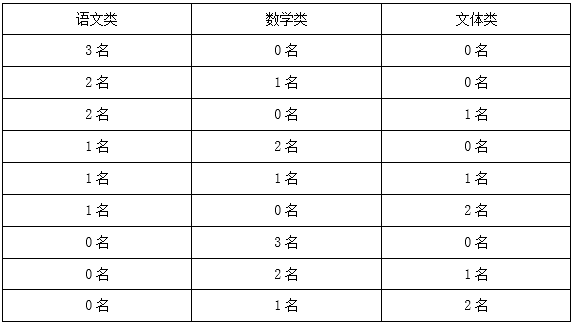

# 2023年河南省公务员录用考试《行测》题（网友回忆版）

> 数量关系 · 10 题 · 河南 2023

## 第 1 题　qid 5509774 · 数学运算

在某应急救援作业中，假设每台机器工作效率相同，如果两台机器配合作业，效率分别提高25%，而三台机器同时合作，每台效率各自提高50%。甲、乙、丙三台机器依次投入救援，直到救援完成。已知甲救援时间为60分钟，乙救援时间为甲的，而丙救援时间为乙的，问仅有一台机器完成该救援作业需要多少分钟？

- **A**. 120
- **B**. 125　✅
- **C**. 130
- **D**. 150

**答案**：B

**官方解析**

赋值甲、乙、丙三台机器单独作业时每分钟的工作效率均为4，则两台机器配合作业时每分钟的工作效率之和为，三台机器同时合作时每分钟的工作效率之和为。根据题意，甲救援时间为60分钟，乙救援时间为分钟，丙救援时间为分钟，则甲单独作业的时间为60-30=30分钟，甲、乙两台机器配合作业的时间为30-10=20分钟，甲、乙、丙三台机器同时合作作业的时间为10分钟，则该救援作业的工作总量为4×30+10×20+18×10=500，故仅有一台机器完成该救援作业需要的时间为500÷4=125分钟。

故正确答案为B。

---

## 第 2 题　qid 5509823 · 数学运算

10名志愿者准备将村民们刚采摘的一堆西瓜平均装上甲、乙两辆运输车，西瓜总数正巧满足每个村民采摘的西瓜个数都等于该村村民数。志愿者们先每人抱一个西瓜放到甲车上，然后每人抱一个西瓜放到乙车上，依次轮流进行，直到所剩西瓜少到容易清点时再平分。当最后1次把10个西瓜放到甲车后，发现所剩西瓜不足10个，于是，不得不从甲车抱出几个与所剩西瓜一起放到乙车上，此时刚好两车所装西瓜一样多。问最后从甲车拿出几个西瓜？

- **A**. 1
- **B**. 2　✅
- **C**. 3
- **D**. 4

**答案**：B

**官方解析**

根据题干信息：西瓜总数正巧满足每个村民采摘的西瓜个数都等于该村村民数，可知西瓜总数为平方数；根据题干信息：最后甲、乙两车所装西瓜一样多，可知西瓜总数为偶数；且由题意可知西瓜总数大于10。所以可从符合条件的数据由小到大依次代入：

当西瓜总数为16时，最后甲、乙两车各装西瓜的数量个，则需从甲车拿出2个西瓜放到乙车。

故正确答案为B。

---

## 第 3 题　qid 5509855 · 数学运算

某地突发森林火灾，现有甲、乙两支消防队离火灾发生地距离相同，但路况不同，假设两支队伍接到命令后同时出发，并且按照一定速度匀速赶往火灾现场参与救援。已知当甲消防队走了路程时，乙消防队走了9公里，当乙消防队走了路程时，甲消防队走了16公里，问甲消防队到达目的地时，乙消防队距离目的地还有多少公里？

- **A**. 9　✅
- **B**. 12
- **C**. 27
- **D**. 36

**答案**：A

**官方解析**

设甲、乙两队离火灾发生地的距离均为S公里，当时间一定时，路程和速度成正比，根据题意可得，解得S=36。根据“当甲消防队走了路程时，乙消防队走了9公里”可得，甲消防队到达目的地时，乙消防队走了3×9=27公里，距离目的地还有36-27=9公里。

故正确答案为A。

---

## 第 4 题　qid 5509486 · 数学运算

某学院有新生两百多人，将学生从1开始依次编号，选取编号为3的倍数的学生，正好构成新生运动会开幕式方队，选取编号为m（3＜m＜10，且m为整数）的倍数的学生，恰好构成闭幕式方队，问该学院新生人数有多少人？

- **A**. 242
- **B**. 243
- **C**. 245　✅
- **D**. 246

**答案**：C

**官方解析**

根据题意，选取编号为3的倍数的新生正好构成开幕式方队，方队的人数应为平方数。代入选项，B、C两项除以3的商均为81，即编号为3的倍数的新生有81人，81是平方数，符合题意；A、D两项除以3的商分别为80、82，均不是平方数，排除。
选取编号为m的倍数的新生，恰好构成闭幕式方队，即新生人数除以m的商仍为平方数。3&lt;m&lt;10，且m为整数，则当m=4时，代入B、C两项，除以4的商分别为60、61，均不为平方数，不符合题意；当m=5时，代入B、C两项，除以5的商分别是48、49，48不是平方数，49为平方数，故C项符合题意。
故正确答案为C。

---

## 第 5 题　qid 5509500 · 数学运算

某高校学生会选拔乡村支教志愿者，初试合格者中，语文类5名，数学类6名，文体类4名，从中选取9名志愿者，但每类至少要选2名。问就9名志愿者的科目类别构成而言，共有几种选拔方式？

- **A**. 6
- **B**. 7
- **C**. 8
- **D**. 9　✅

**答案**：D

**官方解析**

根据题干“就9名志愿者的科目类别构成而言”，可知本题需按照科目选人，即只考虑每个科目的志愿者人数。结合条件“每类至少要选2名”，则每类先选2名志愿者，共6名；还需要再选3名志愿者，采用枚举法：

因此，共有9种选拔方式。

方法二：将9名志愿者的构成情况分类讨论如下：

①按照(2、2、5)的构成方式：从三类里随机选择一类，选5名志愿者, 另外两类各2名。由于文体类只有4名，故只能从语文类和数学类选择，则情况数有种；

②按照(2、3、4)的构成方式：从三类里分别选2名、3名和4名志愿者，全排列即可，则情况数有种；

③按照(3、3、3)的构成方式：每类均选3名，情况数只有1种。

综上，符合题意的选拔方式共有2+6+1=9种。

故正确答案为D。

---

## 第 6 题　qid 5509541 · 数学运算

一家三口年龄各不相同，今年爸爸与妈妈年龄之和是孩子年龄的8倍，而10年后，爸爸与妈妈年龄之和为孩子年龄的5倍。今年爸爸、妈妈的年龄在各种可能组合中乘积最大，问今年妈妈的年龄可能是多少岁？

- **A**. 39　✅
- **B**. 40
- **C**. 50
- **D**. 51

**答案**：A

**官方解析**

设今年爸爸与妈妈年龄之和为x岁，孩子年龄为y岁，则，解得y=10，所以今年爸爸与妈妈年龄之和为80岁。

方法一：根据结论“当两数和为定值时，两数越接近其乘积越大”，又已知“一家三口年龄各不相同”，故爸爸为41岁，妈妈为39岁时，其年龄在各种组合中乘积最大。

方法二：今年爸爸与妈妈年龄之和为80岁。

代入A项，妈妈今年39岁，爸爸今年41岁，其年龄乘积为1599；

代入B项，妈妈今年40岁，爸爸今年也为40岁，与题干条件矛盾，排除；

代入C项，妈妈今年50岁，爸爸今年30岁，其年龄乘积为1500＜1599，排除；

代入D项，妈妈今年51岁，爸爸今年29岁，其年龄乘积为1479＜1599，排除。

故正确答案为A。

---

## 第 7 题　qid 5509543 · 数学运算

一辆出租车的计价器出现故障，显示屏上保留了一个两位数，无法清除，但还能按行驶路程准确地将应付的车费累加上去。小王乘坐该车匀速行驶了2小时，当行驶1小时的时候，计价器上的两个数字刚好交换了位置，在2小时的时候，计价器上的两个数字又交换了位置，但他们中间多了一个0。如车费按里程计，问小王应付多少元车费？

- **A**. 82
- **B**. 86
- **C**. 90　✅
- **D**. 95

**答案**：C

**官方解析**

根据题意，设显示屏最开始保留的两位数为xy，其数值大小为10x+y；
方法一：由于车辆匀速行驶，相同时间内行驶的路程一致且车费金额相等。那么1小时后计价器显示yx，其数值为10y+x；再过1小时后计价器显示x0y，其数值为100x+y。根据金额相等可得10y+x-（10x+y）=100x+y-（10y+x），解得y=6x，由于x、y取值为1~9，则x=1，y=6。所以车费金额为106-16=90元。
方法二：由于最终显示器上显示的数值为100x+y，则需要支付的车费为100x+y-（10x+y）=90x，即车费金额为90的整数倍，只有C项符合。
故正确答案为C。

---

## 第 8 题　qid 5509829 · 数学运算

某围棋队的两位选手小李与小张决定进行1次围棋比赛，两人轮流先手开局，第一局小李先手开局。甲、乙两人分别记录了全程比赛，均显示共比赛18局，结果为10∶8。甲的记录显示为：小李胜10局，小张胜8局，且先手者共胜8局，但乙的记录显示为：先手者共胜6局。问甲、乙两人的记录结果是：

- **A**. 甲错乙对
- **B**. 甲错乙错　✅
- **C**. 甲对乙错
- **D**. 甲对乙对

**答案**：B

**官方解析**

根据题意可知，小李与小张共比赛18局，两人均先手9局，且小张共胜8局。设小李先手时共胜x局，小张先手时共胜y局，则小李先手时小张共胜8-y局。根据题意可列方程：x+8-y=9，整理得：x-y=1。根据奇偶特性，x与y的差值为奇数，则x与y的和也为奇数，即先手者胜的比赛局数（x+y）为奇数，故甲、乙两人的记录结果均错误。
故正确答案为B。
注：本题并未明确指出10：8为小李比小张，但两人不论是谁获胜10局均不影响做题结果。

---

## 第 9 题　qid 5509836 · 数学运算

某地计划在连接甲镇和乙镇的长度为60公里的公路上安装限速标志和测速仪器。具体方案是：从距离甲镇3公里处开始安装限速标志，然后每隔4公里再设置一个限速标志；从8公里处开始安装测速仪器，然后每隔9公里再设置一个测速仪器。假设单独安装一个限速标志费用为500元，单独安装一个测速仪器费用为800元，如果限速标志和测速仪刚好在同一个地点安装，则可以节约安装费用，此时安装两种设备总共只需要1000元。问最终安装总费用是多少元？

- **A**. 10600
- **B**. 11200
- **C**. 12000　✅
- **D**. 12300

**答案**：C

**官方解析**

根据题意可知，第a个（）限速标志安装的位置可表示为距离甲镇3+4（a-1）=（4a-1）公里处，第b个（）测速仪器安装的位置可表示为距离甲镇8+9（b-1）=（9b-1）公里处。根据同余定理，第n个（）同一地点安装限速标志和测速仪器的位置距离甲镇（36n-1）公里处（36为4、9的最小公倍数）。根据“连接甲镇和乙镇的长度为60公里的公路”，可列式，解得，则限速标志可安装15个；，解得，则测速仪器可安装6个；，解得，则只有1个地点可同时安装限速标志和测速仪器（距离甲镇35公里处）。故最终安装总费用为（15-1）×500+（6-1）×800+1×1000=12000元。

故正确答案为C。

---

## 第 10 题　qid 5509542 · 数学运算

某商场一楼到二楼有一部自动扶梯匀速上行，甲、乙二人共同乘梯上楼。甲在乘扶梯同时匀速登梯，乙在恰好半程后，也开始匀速登梯，但登梯速度是甲的。甲乙二人分别登了36级、12级到达二楼，问这部扶梯静止时一楼到二楼的级数是多少？

- **A**. 48
- **B**. 60
- **C**. 66
- **D**. 72　✅

**答案**：D

**官方解析**

根据题意，甲乙二人均是从一楼沿扶梯上二楼，故路程相等，即总级数相等，扶梯的总级数=人行走的级数+扶梯运行的级数。设甲的速度为2v，乙的速度为v，扶梯的速度为，即，整理可得：，解得，故扶梯的总级数。

故正确答案为D。

---
