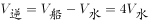
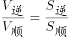
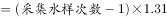
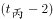
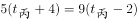
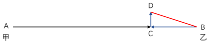
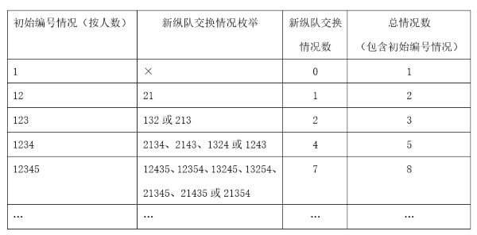

# 2023年浙江省公务员录用考试《行测》题（A类）（网友回忆版）

> 数量关系 · 19 题 · 浙江 2023

## 第 1 题　qid 5430257 · 数学运算

-2，5，0，7，4，（    ）

- **A**. 8
- **B**. 9　✅
- **C**. 12
- **D**. 17

**答案**：B

**官方解析**

观察数列，发现数列变化平缓且无明显规律，优先考虑作差，作差无规律，考虑作和。前项+后项得到新数列：3，5，7，11，（    ），为质数数列，下一项应为13，故所求项为13-4=9。
故正确答案为B。

---

## 第 2 题　qid 5430254 · 数学运算

163，47，22，-19，79，（    ）

- **A**. -256　✅
- **B**. -115
- **C**. 181
- **D**. 223

**答案**：A

**官方解析**

数列无明显特征，且起伏明显，考虑递推数列。圈三数，找规律，计算发现：47-22×3=-19，即第一项-第二项×3=第三项，经验证，163-47×3=22，22-（-19）×3=79，均满足此规律，则所求项为-19-79×3=-256。
故正确答案为A。

---

## 第 3 题　qid 5430262 · 数学运算

2，2，2，，，（    ）

- **A**. 

- **B**. 

- **C**. 

- **D**. 

　✅

**答案**：D

**官方解析**

数列部分为分数且选项均为分数，考虑分数数列。对数列进行反约分可得：，，，，，（    ），分子部分为：4，6，8，9，10，（    ），是连续合数数列，则下一项应为12；分母部分为：2，3，4，5，6，（    ），是公差为1的等差数列，则下一项应为7，故所求项为。

故正确答案为D。

---

## 第 4 题　qid 5430309 · 数学运算

-2，1，0，5，26，17，124，37，（    ）

- **A**. 196
- **B**. 216
- **C**. 278
- **D**. 342　✅

**答案**：D

**官方解析**

观察数列，发现项数较多，考虑多重数列。优先交叉看，奇数项数列：-2，0，26，124，（    ），观察发现各项+1后均是立方数，分别为：，，，，（    ），底数为奇数数列，则下一项应为，故所求项为：343-1=342；偶数项数列：1，5，17，37，各项-1后均是平方数，分别为：，，，，底数为偶数数列。

故正确答案为D。

---

## 第 5 题　qid 5430253 · 数学运算

某部门举行年会抽奖活动。抽奖箱里有80个抽奖券，共20个不同的数字，每个数字均出现4次，且分别对应一份礼品，不同的数字对应的礼品不同。每人当天限抽1次。那么最少多少人当天参加抽奖活动，才能保证至少有3人领取的礼品相同?

- **A**. 41　✅
- **B**. 42
- **C**. 61
- **D**. 62

**答案**：A

**官方解析**

根据问法“最少······才能保证······”，可判定本题为最不利构造型最值问题。20个不同的数字，每个数字对应一种礼品，即共有20种礼品。要求至少有3人领取的礼品相同，则最不利的情况为先让每种礼品都被2人领取，需要20×2=40人。在此基础上再增加1人，就可以保证至少有3人领取的礼品相同，故最少有40+1=41人参加抽奖活动。
故正确答案为A。

---

## 第 6 题　qid 5430255 · 数学运算

将一叠文件分为若干组，每组正好有10份文件。已知其中2组文件中有18份通知，其余每组文件中最多有5份通知，且所有文件中通知占比正好为60%。那么这叠文件最多可能有多少份?

- **A**. 50
- **B**. 60
- **C**. 70
- **D**. 80　✅

**答案**：D

**官方解析**

方法一：假设这叠文件有n组，则总共有10n份文件，其中通知文件有10n×60%=6n份。要想文件总数最多，则n应尽量大，因此6n也应尽量大，即通知文件应尽量多。故除去有18份通知的2组外，让其余每组都有5份通知，可得6n=18+5×（n-2），解得n=8，则这叠文件最多可能有10n=80份。

方法二：根据题意可知，要想文件总数尽量多，则通知文件应尽量多，因此有2组文件中有18份通知，其余x组文件中都应包含5份通知，此时前两组文件中通知的占比为，其余x组文件中通知的占比为，混合之后通知的占比为60%。根据线段法口诀“距离与量成反比”可得，，解得x=6，则共有2+6=8组文件。故这叠文件最多可能有10×8=80份。

故正确答案为D。

---

## 第 7 题　qid 5430258 · 数学运算

某商品上月售价为进价的1.4倍，销售m件。本月该商品进价下降20%，售价不变，销售利润为上月的1.8倍。那么本月的销量为多少件?

- **A**. 1.3m
- **B**. 1.25m
- **C**. 1.2m　✅
- **D**. 1.15m

**答案**：C

**官方解析**

赋值该商品上月进价为10元。根据题意，则上月售价为10×1.4=14元，单件利润为14-10=4元，已知上月销量为m件，则上月总利润为4m元。分析本月销售情况，进价下降为10×（1-20%）=8元，售价不变，则本月单件利润为14-8=6元，因为本月总利润为上月的1.8倍，即4m×1.8=7.2m元，故本月销量=总利润÷单件利润=7.2m÷6=1.2m件。
故正确答案为C。

---

## 第 8 题　qid 5430305 · 数学运算

水文工作人员小张和小刘同时乘坐相同的船，分别从下游的A码头和上游的B码头出发前往对方所在码头，并沿途采集水样。两人出发时各采集第一份水样，往后每行驶1.31千米采集一份水样。两船相遇时，小张正好采集第16份水样。已知船在静水中的速度是水流速度的5倍，那么两人全程一共采集了多少份水样？

- **A**. 38
- **B**. 39
- **C**. 76　✅
- **D**. 78

**答案**：C

**官方解析**

方法一：设水速为1，则船速为5，小张逆水行船的速度为5-1=4，小刘顺水行船的速度为5+1=6，相遇时小张一共行驶了16-1=15个1.31千米，行驶时间。相遇时小刘的路程为，即小刘一共走了22.5个1.31千米，故两个码头之间的总路程为（15+22.5）×1.31=37.5×1.31千米。根据出发时采集一次后每1.31千米采样一次，则每人全程需采样37+1=38次，故两人全程一共采集了38×2=76份水样。

方法二：根据题干条件，小张的逆水速度，小刘的顺水速度；根据行驶时间相同，则，可知全程千米。解得采集水样次数=38.5次，即每人采集水样次数为38次，第39次采样还未进行。故两人全程一共采集了38×2=76份水样。

故正确答案为C。

---

## 第 9 题　qid 5430307 · 数学运算

某停车场有7个连成一排的空车位。现有3辆车随机停在这排车位中，则任意两辆车之间至少间隔一个车位的概率为：

- **A**. 

- **B**. 

　✅
- **C**. 

- **D**. 

**答案**：B

**官方解析**

根据题意，7个车位随机停3辆车，总情况数为种。满足条件的情况为任意两辆车之间至少间隔一个车位，即车辆之间不能相邻，可用插空法。剩下的7-3=4个车位共形成5个空，停放3辆车，情况数为种。因此所求概率。

故正确答案为B。

---

## 第 10 题　qid 5430308 · 数学运算

甲、乙、丙、丁、戊5门课安排在先后4个学期开课，每个学期至少1门。已知甲不与其他任何一门课安排在同一学期，乙和丙均不能在第一个学期或最后一个学期开课，丁必须在戊和甲之后的学期开课，那么这5门课有多少种不同的安排方式？

- **A**. 5
- **B**. 6
- **C**. 7
- **D**. 8　✅

**答案**：D

**官方解析**

根据题意，5门课安排在先后4个学期开课，每个学期至少1门，则有且只有1个学期开2门课。根据乙、丙这2门课进行分析，可分情况讨论如下：

（1）乙和丙在同一学期：此时乙、丙都在第二或第三学期，有种情况；余下3个学期分别安排甲、丁、戊，因为丁必须在戊和甲之后的学期开课，则丁在第四学期，此时甲、戊有种情况，共有种情况。

（2）乙和丙在不同学期：此时乙、丙分别在第二或第三学期，有种情况；丁必须在戊和甲之后的学期开课，且甲不与其他任何一门课安排在同一学期，则甲在第一学期，丁在第四学期，此时戊可以在第二或第三学期，有种情况，共有种情况。

综上所述，这5门课有4+4=8种不同的安排方式。

故正确答案为D。

---

## 第 11 题　qid 5430347 · 数学运算

某地打算在绿地上建两个圆形花坛，如下图所示，大圆的直径为6米，小圆的直径为2米，修建期间暂时在外围设置围栏。已知围栏呈矩形，大圆与围栏的三条边相切，小圆与围栏的两条边相切，且两圆相切，那么矩形围栏的面积是多少平方米？

- **A**. 

　✅
- **B**. 

- **C**. 

- **D**. 

**答案**：A

**官方解析**

如图所示，过大圆的圆心O作平行于矩形长的AB，过小圆的圆心Q作平行于矩形宽的CD，AB与CD相交于G点，为直角三角形。大圆的半径为米，小圆的半径为米。由题干圆与矩形围栏的相切关系可知，CQ=1米，GB=1米，GD=3米，AO=3米，CD=6米，OQ=3+1=4米，QG=CD-CQ-GD=6-1-3=2米。在直角三角形OQG中，米。则矩形围栏的长=AB=AO+OG+GB米，矩形围栏的面积=CD×AB平方米。

故正确答案为A。

---

## 第 12 题　qid 5430348 · 数学运算

某班级对70多名学生进行数学和英语科目摸底测验，有12%的学生两个科目均不及格。已知有的学生英语及格，数学及格的学生比英语多10人，那两科均及格的学生有多少人？

- **A**. 31
- **B**. 37
- **C**. 41
- **D**. 44　✅

**答案**：D

**官方解析**

设班级总共有x名学生，则两个科目均不及格的学生数为12%x，英语及格的学生数为，数学及格的学生数为。根据两集合容斥原理公式：，可得：，即，故x一定为75的倍数，且根据题干可知，x是70多，所以x一定是75。则两科均及格的学生有人。

故正确答案为D。

---

## 第 13 题　qid 5430350 · 数学运算

收割一片稻田，可选择甲、乙、丙3台农机。用丙收割的用时比用甲短4小时，比用乙长2小时。已知甲、乙的收割速度分别为5亩/小时和9亩/小时，那么丙的收割速度在以下哪个范围内？

- **A**. 小于6亩/小时
- **B**. 6~7亩/小时
- **C**. 7~8亩/小时　✅
- **D**. 大于8亩/小时

**答案**：C

**官方解析**

设丙农机收割用时为小时，则甲农机收割用时为小时，乙农机收割用时为小时。因为三台农机收割同一片稻田，根据工作总量相同可列方程：，解得。则稻田总量亩。故丙的收割速度亩/小时，在C项范围内。

故正确答案为C。

---

## 第 14 题　qid 5430277 · 数学运算

公司研发部门共5名员工，年龄各不相同，其中年龄最大的比最小的大10岁。某年，年龄最大的2人年龄之和是最小的2人年龄之和的1.25倍；2年后，除年龄排名居中的1人外其余4人年龄之和为125岁。那么再过2年，年龄排名第三的员工最大可能为多少岁？

- **A**. 33
- **B**. 34
- **C**. 35　✅
- **D**. 36

**答案**：C

**官方解析**

设在某年时，5名员工的年龄从大到小分别为a、b、c、d、e，由题意可知a+b=1.25（d+e）······①，a+b+d+e=125-4×2······②；联立①②解得a+b=65，d+e=52。因年龄各不相同且b&lt;a，可知，即b最大为32，则年龄排名第三的员工最大为b-1=31，此时a=33，e=33-10=23，d=52-23=29，大小顺序符合题意，故4年后年龄排名第三的员工最大为31+4=35岁。

故正确答案为C。

---

## 第 15 题　qid 5430281 · 数学运算

一只闹钟的秒针顶点距离表盘圆心4厘米，分针顶点距离表盘圆心3厘米。小王烧开一壶水的时间内，秒针顶点累计移动了厘米。那么这一时间段内，分针顶点与表盘圆心的连线扫过的扇形面积为多少平方厘米？

- **A**. 

- **B**. 

　✅
- **C**. 

- **D**. 

**答案**：B

**官方解析**

由题意可知，秒针长度为4厘米，秒针转动一圈即1分钟，其顶点移动路程为厘米，现秒针顶点累计移动了厘米，即经过时间分钟。分针每60分钟转一圈，5分钟转圈，半径为3厘米，其扫过的面积为平方厘米。

故正确答案为B。

---

## 第 16 题　qid 5430283 · 数学运算

A、B两地直线距离为320千米，甲车从A地、乙车从B地同时出发相向而行。已知甲车的速度是乙车的3倍，乙车与甲车相遇后，立即右转弯90度并保持原速度继续行驶。那么甲车到达B地时，其与乙车之间的距离：

- **A**. 小于80千米
- **B**. 80~90千米　✅
- **C**. 90~100千米
- **D**. 大于100千米

**答案**：B

**官方解析**

如图所示，乙车与甲车在C地相遇后，乙车沿CD段行驶，甲车继续沿AC方向，即沿CB段行驶，甲车到达B地时与乙车之间的距离，即为BD的距离。

根据“甲车的速度是乙车的3倍”及“时间一定，路程与速度成正比”，可知甲、乙两车相遇时，甲车所走的路程是乙车的3倍，全程为320千米，即千米，BC=320-240=80千米。同理，BC=3CD，即千米，根据勾股定理可得：千米，在B项范围内。

故正确答案为B。

---

## 第 17 题　qid 5430298 · 数学运算

甲以技术入股加入某互联网初创企业，占企业总股份的10%。随后企业先后两次引入外来投资，其中第二次投资的金额是第一次的10倍。在两次投资完成之后，甲持有的股份占企业总股份的比例先后下降到8%和5%。那么第一次投资前公司的估算价值是第二次投资前的百分之几?

- **A**. 24%　✅
- **B**. 28%
- **C**. 32%
- **D**. 36%

**答案**：A

**官方解析**

赋值该互联网企业初始总股份为100股，其中甲持有100×10%=10股。因为两次投资完成之后，甲持有的股份占企业总股份的比例先后下降到8%和5%，所以第一次投资后企业总股数为股、第二次投资后企业总股数为股。设第一次投资前每股估算价值为x元、第二次投资前每股估算价值为y元，可列式：10×(125-100)∙x=(200-125)∙y，整理得：，则第一次投资前公司的估算价值是第二次投资前的。

故正确答案为A。

---

## 第 18 题　qid 5430299 · 数学运算

有30个2克的砝码和8个5克的砝码，如果砝码只能放一边，那么从2克到100克间的整数克质量，有多少个不能用这些砝码称量出来?

- **A**. 0
- **B**. 1
- **C**. 2
- **D**. 3　✅

**答案**：D

**官方解析**

由题意可知，这些砝码质量一共30×2+8×5=100克。1克到100克之间共有100个整数克质量，可拆成（1，99）、（2，98）、（3，97）、（4，96）······（48，52）、（49，51）、（50，50），可知1克、3克不能称量出来，因此99克、97克也不能称量出来，其他每一对质量都可以由2克和5克称量出来。从2克到100克之间共有99个整数克质量，不能称量出来的有3克、97克、99克共3个。
故正确答案为D。
备注：本题在得出3克、97克、99克三个质量不能称量出来时，根据选项最大数据为3便可锁定答案为D项，无需再去验证其他质量能否称量出来。

---

## 第 19 题　qid 5430302 · 数学运算

12个人排成1列纵队，从前到后编为1~12号。现要将他们排成另一个与原来不同的纵队并从前到后重新编号，要求每个人的新号码与原始号码相差不超过1。那么有多少种重新编队的方法?

- **A**. 155
- **B**. 227
- **C**. 232　✅
- **D**. 239

**答案**：C

**官方解析**

根据题意，12个人重新排1列纵队，要求新号码与原来不完全相同且每个人的新号码与原始号码相差，则每个人要么为原号码，要么只能与相邻的人交换号码。故讨论除与原纵队号码一致的情况外，不同人数交换情况，因12人情况较复杂，从1人至多人情况枚举如下：

由上表可知，纵队每增加1人，总情况数构成一个简单的递推和数列，即1、2、3、5、8、13、21、34、55、89、144、233，故12人的纵队加上初始编号情况共有233种。已知重新编队后不能与原纵队的顺序完全一致，则符合题意的情况有233-1=232种。

故正确答案为C。

---
