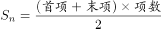
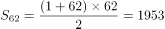
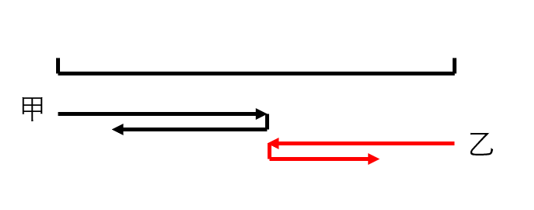
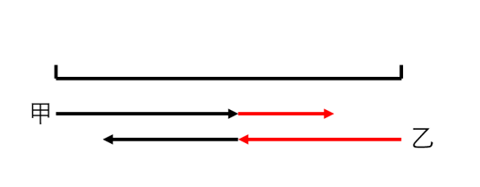
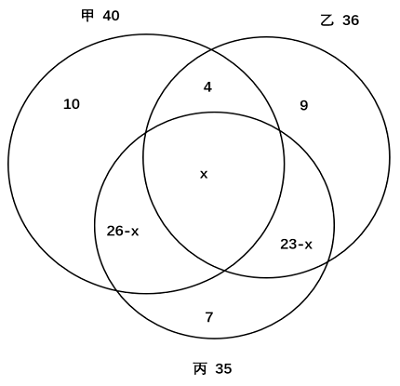
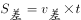
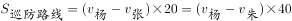
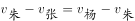
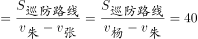

# 2023年深圳市考公务员录用考试《行测》试题（网友回忆版）

> 数量关系 · 11 题 · 深圳市考 2023

## 第 1 题　qid 5521272 · 数学运算

1，1，，，，（    ）

- **A**. 

- **B**. 

- **C**. 

- **D**. 

　✅

**答案**：D

**官方解析**

数列大部分为分数，反约分后无规律，考虑递推。圈三数，找规律，1+1=2，，，观察发现该数列规律为：。则，故所求项。

故正确答案为D。

---

## 第 2 题　qid 5521254 · 数学运算

有一个圆柱体花瓶，装有5cm深的水，花瓶的内底面直径为12cm，现在往花瓶中放入一个玻璃球，当球掉入水底时，水面恰好与玻璃球相切，则玻璃球的半径为（    ）cm。

- **A**. 3　✅
- **B**. 4
- **C**. 5
- **D**. 6

**答案**：A

**官方解析**

由水面恰好与玻璃球相切可知，玻璃球放入花瓶后完全浸入水中。设玻璃球的半径为r，浸入水中后水面的高度为2r，根据原来花瓶中水的体积+玻璃球体积=现在花瓶中水的体积与玻璃球的总体积，可列式：，化简为，解得r=3cm。

故正确答案为A。

---

## 第 3 题　qid 5521260 · 数学运算

小孟有58枚硬币，其中1枚为假，目前已知道真币重量相同，假币重量偏轻。如果小孟手中只有一个天平，则至少称（    ）次一定能找出假币。

- **A**. 4　✅
- **B**. 5
- **C**. 6
- **D**. 7

**答案**：A

**官方解析**

根据天平问题结论：使用n次天平最多可以判定枚硬币，即使用2次天平可以判定最多9枚硬币，使用3次天平可以判定最多27枚硬币，使用4次天平可以判定最多81枚硬币。本题共58枚硬币，则至少要称4次一定能找出假币。

故正确答案为A。

---

## 第 4 题　qid 5521256 · 数学运算

黑脸琵鹭飞行速度较快，为55公里/小时，白琵鹭飞行速度为45公里/小时，黑、白两群琵鹭从距离深圳湾湿地3120公里的黑龙江出发南飞越冬，若不考虑途中停歇，白琵鹭先到达湿地需比黑脸琵鹭至少早起飞（    ）小时。

- **A**. 11
- **B**. 12
- **C**. 13　✅
- **D**. 14

**答案**：C

**官方解析**

根据公式：时间，可得黑脸琵鹭到达湿地的时间小时，白琵鹭到达湿地时间小时，则白琵鹭先到达湿地需比黑脸琵鹭早起飞69.3-56.7=12.6小时，求最少，应向上取整，为13小时。

故正确答案为C。

---

## 第 5 题　qid 5521271 · 数学运算

某书的页码是从1开始的连续自然数，1，2，3，4，······莎莎将该书页码全部相加时，不小心将其中某页码多加了1次，结果和为2003，则被多加的页码为（    ）。

- **A**. 45
- **B**. 50　✅
- **C**. 56
- **D**. 62

**答案**：B

**官方解析**

根据题意可知，全部页码数之和+某页页码数=2003，则全部页码数之和小于2003。设该书共有n页，根据等差数列求和公式：，当n=62时，，最接近且小于2003，此时多加1次的页码数=2003-1953=50。

故正确答案为B。

---

## 第 6 题　qid 5521255 · 数学运算

有甲、乙两种咖啡豆，按照质量比a：b相混合制成一种拼配豆，已知甲咖啡豆每公斤60元，乙咖啡豆每公斤80元，现因产量变化，甲咖啡豆单价上涨15%，乙咖啡豆单价下降15%，以致该拼配咖啡豆的成本上调了5%，则a：b为（    ）。

- **A**. 1：1
- **B**. 5：3
- **C**. 8：3　✅
- **D**. 2：1

**答案**：C

**官方解析**

方法一：根据公式：每公斤成本，可得原拼配豆每公斤的成本元，产量变化后拼配豆每公斤的成本元。根据“该拼配咖啡豆的成本上调了5%”可列式：，解得a：b=8：3。

方法二：由于甲咖啡豆单价上涨15%，乙咖啡豆单价下降15%，拼配咖啡豆成本上调5%，根据线段法：量和距离成反比，可知甲咖啡豆总成本：乙咖啡豆总成本=[5%-(-15%)]：(15%-5%)=2：1。根据重量，可得。

故正确答案为C。

---

## 第 7 题　qid 5521273 · 数学运算

在一个即时战略电子游戏中，电子士兵以每分钟一米的速度沿一条固定路线行军，任意两名士兵相遇后，都会掉头行进；行至路线的起点或终点时，便停止前进并对此地的基地进行无差别攻击。玩家阿坤的基地距离魔王城堡基地9米。游戏开始，他立即派出一名士兵，此后每隔1分钟派出1名士兵，共计7名。一名士兵出发半分钟后，魔王也从城堡基地每隔1分钟派出1名士兵，共计8名。若之后双方均未继续派兵，则游戏开始多少分钟后，所有士兵均已开始攻击？

- **A**. 16.5　✅
- **B**. 17
- **C**. 17.5
- **D**. 18

**答案**：A

**官方解析**

根据题干中电子士兵的行军规则，任意两名电子士兵相遇时会掉头行进，下图为甲、乙两名士兵的行进路线：

但由于每个电子士兵的速度一致，可等价认为这两名士兵在相遇时，只互换身份，仍旧继续向前行进，如下图：

以每名士兵来看，从起点出发，每次与其他人相遇，无需掉头，而是代替对方继续向前直至行进至终点，每名士兵行进整个全程所用时间为分钟。由于魔王晚半分钟派兵且比阿坤多一名士兵，所以魔王最后一名士兵在起点等待0.5+7=7.5分钟，最终到达终点的时间为7.5+9=16.5分钟。所以游戏开始16.5分钟后，所有士兵均已开始攻击。

故正确答案为A。

---

## 第 8 题　qid 5521269 · 数学运算

小明对甲、乙、丙三种手机软件的安装情况进行街头调查。随机选取的一批调查对象中，手机安装了甲、乙、丙三种软件的人数分别是40，36，35，只安装了其中一种软件的人数分别占其中的25%、25%、20%，同时安装了甲、乙两种软件而未安装丙软件的有4人，同时安装了甲、丙两种软件而未安装乙软件的人数比同时安装乙、丙两种软件而未安装甲软件的人数多3人，有（    ）人同时安装了甲、乙、丙三种软件。

- **A**. 15
- **B**. 21　✅
- **C**. 27
- **D**. 33

**答案**：B

**官方解析**

如图所示，根据题意，只安装甲软件的人数为40×25%=10人，只安装乙软件的人数为36×25%=9人，只安装丙软件的人数为35×20%=7人。设有x人同时安装了甲、乙、丙三种软件，则同时安装了甲、丙两种软件而未安装乙软件的人数为40-10-4-x=（26-x）人，同时安装乙、丙两种软件而未安装甲软件的人数为26-x-3=（23-x）人。安装丙软件的人数为（26-x）+x+（23-x）+7=35，解得：x=21，即有21人同时安装了甲、乙、丙三种软件。

故正确答案为B。

---

## 第 9 题　qid 5521270 · 数学运算

作曲人阿伟不久前创作了一首歌，甲、乙两个音乐平台均获得其使用权，甲平台根据该歌曲播放数乘以0.01元给予收益；乙平台除给予10万元基础收益外，另计每次播放收益0.006元，现从甲平台获得的收益比乙平台多10000元，且此时该歌曲在甲平台的播放量比在乙平台高500万次，那么该歌曲在甲平台的播放量为（    ）万次。

- **A**. 1800
- **B**. 2000　✅
- **C**. 2200
- **D**. 2400

**答案**：B

**官方解析**

设该歌曲在甲平台的播放量为x万次，在乙平台的播放量为（x-500）万次。根据“从甲平台获得的收益比乙平台多10000元”，可得，解得x=2000。

故正确答案为B。

---

## 第 10 题　qid 5521268 · 数学运算

博物馆员工周二至周六上班，周日、周一休息。某月有31天，员工小王工作了22天，则该月的4号是周几？

- **A**. 周一
- **B**. 周二
- **C**. 周一或周四　✅
- **D**. 周四或周日

**答案**：C

**官方解析**

该月共有31天，小王工作了22天，则休息了31-22=9天。31天可看成前3天+后28天。后28天为4个整周期，共休息4×2=8天。则前3天休息1天，说明该月的第一天（1号）是周一或者第三天（3号）是周日，若1号是周一，则4号是周四；若3号是周日，则4号是周一。
故正确答案为C。

---

## 第 11 题　qid 5521259 · 数学运算

老杨、老朱和小张三人开展社区巡防工作，巡防路线固定，三人同时同向出发，老杨开车，老朱骑自行车，小张走路。已知老杨每20分钟追上小张一次，每40分钟追上老朱一次，则老朱每（    ）分钟追上小张一次。

- **A**. 30
- **B**. 40　✅
- **C**. 50
- **D**. 60

**答案**：B

**官方解析**

起点相同的环形追及，同时同向出发，每次追上的两人路程差即为整个巡防路线周长。根据环形追及公式：，可得，整理得，故老朱每次追及小张的时间分钟。

故正确答案为B。

---
