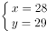
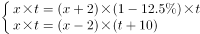
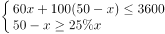
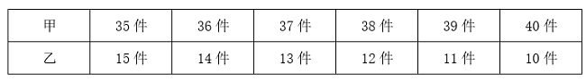

# 2023年湖北省选调生招录考试综合知识和行政职业能力测验试卷（网友回忆版）

> 数量关系 · 10 题 · 湖北 2023

## 第 1 题　qid 5496403 · 数学运算

已知大明小丽俩夫妻有一个儿子，大明和儿子的年龄之积加上小丽的年龄等于85，小丽和儿子年龄之积加上大明的年龄等于86。问大明和小丽年龄之积加上儿子的年龄为多少？

- **A**. 704
- **B**. 814　✅
- **C**. 870
- **D**. 872

**答案**：B

**官方解析**

设大明的年龄为x岁，小丽的年龄为y岁，儿子的年龄为z岁。根据题意可列等式：xz+y=85······① yz+x=86······②，②-①，整理可得：，由于年龄均是正整数，则z-1=1，即z=2，将z的值代入①、②，解得。则大明和小丽年龄之积加上儿子的年龄为xy+z=28×29+2=814。

故正确答案为B。

---

## 第 2 题　qid 5496405 · 数学运算

单位小陈每天都在手机APP上学习英语。有一天，他的学习天数已有200多天，是3的倍数，且第二天的天数是5的倍数，第三天的天数是7的倍数。问第几天的天数将是13的倍数？

- **A**. 9
- **B**. 10　✅
- **C**. 11
- **D**. 12

**答案**：B

**官方解析**

第一天小陈的学习天数已有200多天，且第二天的天数是5的倍数，则第一天小陈的学习天数应为或。第一天的天数是3的倍数，或应为3的倍数，此时学习天数可能为204、234、264、294或219、249、279。由于第三天的天数是7的倍数，上述数字中，只有264+2=266，是7的倍数，符合题干条件，故第一天小陈的学习天数为264天。在选项所给的天数中，第10天时，天数264+9=273为13的倍数。

故正确答案为B。

---

## 第 3 题　qid 5496407 · 数学运算

某公司组织员工到景区旅游，先乘坐大巴1小时，再步行2小时；返回时的路线跟来时不同，需先步行1小时，再乘坐大巴2小时。已知来回途中员工步行速度相同，大巴车速相同，返回的路程是去程的1.5倍。若员工来回均步行，需要多少小时？

- **A**. 15　✅
- **B**. 10
- **C**. 9
- **D**. 8

**答案**：A

**官方解析**

设步行速度为，大巴车速为，根据“返回的路程是去程的1.5倍”，可列等式：，整理可得。赋值步行速度（）为1，大巴车速（）为4，则去时的路程为4×1+1×2=6，返回的路程为6×1.5=9。若员工来回均步行，需要小时。

故正确答案为A。

---

## 第 4 题　qid 5496412 · 数学运算

某市职工篮球赛甲、乙两队决赛，采取7场4胜制（先赢4场者胜，每场没有平局）。若两队水平相当，现在已经比了3场，甲赢了2场，乙赢了1场。问甲获得最后胜利的概率有多少？

- **A**. 

- **B**. 

- **C**. 

- **D**. 

　✅

**答案**：D

**官方解析**

根据“两队水平相当”可知，在每一场比赛中，甲赢的概率为，乙赢的概率也为。比赛是7场4胜制，在前3场中甲已经赢了2场，则甲获得最后胜利还需在后4场中赢2场，可分为以下三种情况：

①篮球赛一共比了5场，甲第4场与第5场都赢，概率为；

②篮球赛一共比了6场，甲在第4场或第5场中赢1场，且第6场赢，概率为；

③篮球赛一共比了7场，甲在第4场、第5场或第6场中赢1场，且第7场赢，概率为。

分类相加，则甲获得最后胜利的概率为。

故正确答案为D。

---

## 第 5 题　qid 5496414 · 数学运算

汽修厂有两个车间（每个车间不能同时维修2辆车），现有并排的5台车等待进入车间维修，它们的修复时间分别为18、30、17、25、20分钟，且每台车等待一分钟会造成该汽修厂服务体验值下降0.1（维修时间也计入等待时间）。问修理完这5台车服务体验值最少下降多少？

- **A**. 16.2
- **B**. 16.3
- **C**. 18.2　✅
- **D**. 18.3

**答案**：C

**官方解析**

修复时间一定，要想体验值下降得最少，需使等待时间之和尽可能少，则修复时间少的车要分配给两个车间先维修。5台车的修复时间从少到多分别为17、18、20、25、30分钟，因此一车间维修顺序为：17、20、30，二车间维修顺序为18、25，则等待的总时间为17+（17+20）+（17+20+30）+18+（18+25）=（17×3+20×2+30）+（18×2+25）=182分钟，故体验值下降0.1×182=18.2。
故正确答案为C。

---

## 第 6 题　qid 5496416 · 数学运算

公司组织员工团建，有6项趣味活动，每个人最多参加三项不同的活动。如果每项活动需12个人参加且至少有8个人只参加本项活动，那么本次团建至少有多少人参加？

- **A**. 56　✅
- **B**. 60
- **C**. 64
- **D**. 72

**答案**：A

**官方解析**

有6项趣味活动，每项活动需12个人参加，共有6×12=72人次。由于每项活动至少有8个人只参加本项活动，所以至少有6×8=48人只参加一项趣味活动，为48人次，剩余人数完成72-48=24人次的活动。本题求团建人数最少值，由于人次数=人数×参加项数，剩余人都参加三项活动，剩余人数最少，最少有人，则本次团建至少有48+8=56人参加。

故正确答案为A。

---

## 第 7 题　qid 5496418 · 数学运算

一家超市按20%的利润率定价出售一批酸奶，还剩下10箱时，因临近保质期按定价的五折卖出，最终实际获利只有预计获利的88%。问这批酸奶共有多少箱？

- **A**. 200
- **B**. 240
- **C**. 250　✅
- **D**. 270

**答案**：C

**官方解析**

方法一：赋值酸奶进价为10元，则售价为10×（1+20%）=12元，五折后为12×0.5=6元。设这批酸奶共有x箱，根据公式：总利润=总售价-总进价，可列式：，解得x=250，即这批酸奶共有250箱。

方法二：实际获利只有预计获利的88%，即实际获利比预计获利少1-88%=12%，原因就在于最后10箱按定价的五折卖出。赋值酸奶进价为10元，则售价为10×（1+20%）=12元，五折后为12×0.5=6元。设这批酸奶共有x箱，则，解得x=250，即这批酸奶共有250箱。

故正确答案为C。

---

## 第 8 题　qid 5496419 · 数学运算

某窗口单位抽调经办人员成立审核组，计划在规定时间内完成一批档案的审核。假如每名经办人员效率相同，如果审核组增加2名经办人员，则可提前12.5%的时间完成；如果审核组减少2名经办人员，则要推迟10天完成。若审核组只增加1名经办人员，能提前多少天完成？

- **A**. 3
- **B**. 4　✅
- **C**. 5
- **D**. 6

**答案**：B

**官方解析**

赋值每名经办人员的效率为1，设审核组原有经办人员x名，计划完成时间为t天。根据题意可得：，解得：x=14，t=60。则若审核组只增加1名经办人员，需要天完成，因此，能提前60-56=4天完成。

故正确答案为B。

---

## 第 9 题　qid 5496421 · 数学运算

甲、乙两种商品，单价分别为每件60、100元。某公司计划购买甲、乙商品作为奖品发给50名员工，每人一件。要求预算不超过3600元，并且获得乙商品的员工人数不低于获得甲商品的25%。问一共有多少种购买方案？

- **A**. 6　✅
- **B**. 8
- **C**. 10
- **D**. 12

**答案**：A

**官方解析**

设需要购买甲商品x件，则需要购买乙商品（50-x）件。根据题意可得：，解得：。则满足要求的购买方案如下表所示：

综上，一共有6种购买方案。

故正确答案为A。

---

## 第 10 题　qid 5496423 · 数学运算

100本书叠放起来，先从上往下数一遍，数到6的倍数在该书上做一个标识，一直数完。再从下往上数一遍，每数到7的倍数在该书上做一个标识，一直数完。问没被标识的书一共有多少本？

- **A**. 70
- **B**. 71
- **C**. 72　✅
- **D**. 73

**答案**：C

**官方解析**

将这100本书先按从上往下的顺序从1-100进行编号，则满足编号是6的倍数的为：6、12、18、24、30、36、42、48、54、60、66、72、78、84、90、96，共16本；再按从下往上的顺序从1-100进行编号，则满足编号是7的倍数的为：7、14、21、28、35、42、49、56、63、70、77、84、91、98，共14本。若同一本书第一次编号为x，则第二次编号为100+1-x=101-x，即两次编号之和为101的是同一本书。观察上述数据发现：24+77=101，66+35=101，共两组数据，即两次均被标识的书共2本。根据两集合容斥原理公式：，可得：16+14-2=100-都不，解得：都不=72。因此，没被标识的书一共有72本。

故正确答案为C。

---
