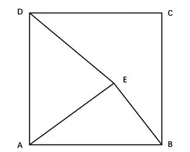
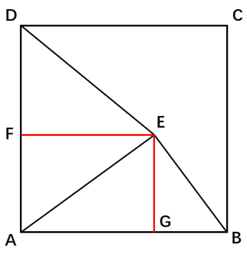

# 2023年福建省公务员录用考试《行测》题（网友回忆版）

> 数量关系 · 10 题 · 福建 2023

## 第 1 题　qid 5509482 · 数学运算

为了保护生态环境，某单位需要购买一批污水处理设备，总的预算不超过120万元。现有甲、乙两种类型设备可供选择，如果购买2台甲型设备和3台乙型设备，将超出预算10万元；若购买3台甲型设备和2台乙型设备，将结余10万元。若该单位最终购买5台污水处理设备，问共有几种购买方案？

- **A**. 1
- **B**. 2
- **C**. 3　✅
- **D**. 4

**答案**：C

**官方解析**

设甲型设备单价为x万元，乙型设备单价为y万元。

根据题意可得方程：2x+3y=120+10①，3x+2y=120-10②；联立①②解得x=14，y=34。

最终购买5台设备，总费用不超过总预算120万元，

第一种购买方案：5台甲设备，14×5=70&lt;120，符合题意；

第二种购买方案：4台甲设备，1台乙设备，14×4+34=90&lt;120，符合题意；

第三种购买方案：3台甲设备，2台乙设备，14×3+34×2=110&lt;120，符合题意；

第四种购买方案：2台甲设备，3台乙设备，14×2+34×3=130&gt;120，不符合题意；

第五种购买方案：1台甲设备，4台乙设备，14+34×4=150&gt;120，不符合题意；

第六种购买方案：5台乙设备，34×5=170&gt;120，不符合题意。

因此，共有3种购买方案。

故正确答案为C。

---

## 第 2 题　qid 5509486 · 数学运算

某学院有新生两百多人，将学生从1开始依次编号，选取编号为3的倍数的学生，正好构成新生运动会开幕式方队，选取编号为m（3＜m＜10，且m为整数）的倍数的学生，恰好构成闭幕式方队，问该学院新生人数有多少人？

- **A**. 242
- **B**. 243
- **C**. 245　✅
- **D**. 246

**答案**：C

**官方解析**

根据题意，选取编号为3的倍数的新生正好构成开幕式方队，方队的人数应为平方数。代入选项，B、C两项除以3的商均为81，即编号为3的倍数的新生有81人，81是平方数，符合题意；A、D两项除以3的商分别为80、82，均不是平方数，排除。
选取编号为m的倍数的新生，恰好构成闭幕式方队，即新生人数除以m的商仍为平方数。3&lt;m&lt;10，且m为整数，则当m=4时，代入B、C两项，除以4的商分别为60、61，均不为平方数，不符合题意；当m=5时，代入B、C两项，除以5的商分别是48、49，48不是平方数，49为平方数，故C项符合题意。
故正确答案为C。

---

## 第 3 题　qid 5509496 · 数学运算

甲、乙两个商场营业日每天是否打折的概率均为。某周，甲商场营业7天，而乙商场营业6天，休业1天。问在这一周，甲商场打折天数比乙商场多的概率为：

- **A**. 

- **B**. 

- **C**. 

　✅
- **D**. 

**答案**：C

**官方解析**

乙商场休业1天，这一天甲商场是营业的，其打折概率为，不打折概率也为。甲、乙共同营业的6天可能会出现的情况共三种：打折天数甲&gt;乙、打折天数甲=乙、打折天数甲&lt;乙，三种情况的概率之和为1。

在共同营业的6天中，甲、乙打折天数可能为0、1、2、3、4、5、6中的任一个，甲大于乙的情况数可能是甲为6乙为0-5中任一个、甲为5乙为0-4中任一个，以此类推；乙大于甲的情况数对等，可能是乙为6甲为0-5中任一个、乙为5甲为0-4中任一个，以此类推。由此可知，在共同营业的6天中，打折天数甲&gt;乙与乙&gt;甲的情况数相同，其对应概率也相同，均设为x；打折天数甲=乙的概率设为y。

符合题意的情况有两种：

①甲单独营业的1天打折，共同营业的6天中打折天数甲&gt;乙或甲=乙，则甲商场打折天数比乙商场多的概率为；

②甲单独营业的1天不打折，共同营业的6天中打折天数甲&gt;乙，则甲商场打折天数比乙商场多的概率为。

因此，所求概率为。

故正确答案为C。

---

## 第 4 题　qid 5509500 · 数学运算

某高校学生会选拔乡村支教志愿者，初试合格者中，语文类5名，数学类6名，文体类4名，从中选取9名志愿者，但每类至少要选2名。问就9名志愿者的科目类别构成而言，共有几种选拔方式？

- **A**. 6
- **B**. 7
- **C**. 8
- **D**. 9　✅

**答案**：D

**官方解析**

根据题干“就9名志愿者的科目类别构成而言”，可知本题需按照科目选人，即只考虑每个科目的志愿者人数。结合条件“每类至少要选2名”，则每类先选2名志愿者，共6名；还需要再选3名志愿者，采用枚举法：

因此，共有9种选拔方式。

方法二：将9名志愿者的构成情况分类讨论如下：

①按照(2、2、5)的构成方式：从三类里随机选择一类，选5名志愿者, 另外两类各2名。由于文体类只有4名，故只能从语文类和数学类选择，则情况数有种；

②按照(2、3、4)的构成方式：从三类里分别选2名、3名和4名志愿者，全排列即可，则情况数有种；

③按照(3、3、3)的构成方式：每类均选3名，情况数只有1种。

综上，符合题意的选拔方式共有2+6+1=9种。

故正确答案为D。

---

## 第 5 题　qid 5509508 · 数学运算

边长为10厘米的正方形ABCD如下图所示，E为正方形中的某一点，已知AE长8厘米，BE长6厘米，问三角形ADE的面积为多少平方厘米？

- **A**. 24
- **B**. 32　✅
- **C**. 44
- **D**. 48

**答案**：B

**官方解析**

作E点关于AD和AB的垂线，分别交于F点和G点，易得AG=FE，如下图所示：

方法1：根据BE=6cm、AE=8cm、AB=10cm，可得为以E为直角顶点的直角三角形。由于且有公共顶角，故，即，代入数据可得，解得AG=FE=6.4cm，。

方法2：观察图像可得，、AG＜AE=8cm，故5cm＜FE＜8cm，代入中可得，仅B项满足。

故正确答案为B。

---

## 第 6 题　qid 5509541 · 数学运算

一家三口年龄各不相同，今年爸爸与妈妈年龄之和是孩子年龄的8倍，而10年后，爸爸与妈妈年龄之和为孩子年龄的5倍。今年爸爸、妈妈的年龄在各种可能组合中乘积最大，问今年妈妈的年龄可能是多少岁？

- **A**. 39　✅
- **B**. 40
- **C**. 50
- **D**. 51

**答案**：A

**官方解析**

设今年爸爸与妈妈年龄之和为x岁，孩子年龄为y岁，则，解得y=10，所以今年爸爸与妈妈年龄之和为80岁。

方法一：根据结论“当两数和为定值时，两数越接近其乘积越大”，又已知“一家三口年龄各不相同”，故爸爸为41岁，妈妈为39岁时，其年龄在各种组合中乘积最大。

方法二：今年爸爸与妈妈年龄之和为80岁。

代入A项，妈妈今年39岁，爸爸今年41岁，其年龄乘积为1599；

代入B项，妈妈今年40岁，爸爸今年也为40岁，与题干条件矛盾，排除；

代入C项，妈妈今年50岁，爸爸今年30岁，其年龄乘积为1500＜1599，排除；

代入D项，妈妈今年51岁，爸爸今年29岁，其年龄乘积为1479＜1599，排除。

故正确答案为A。

---

## 第 7 题　qid 5509542 · 数学运算

某商场一楼到二楼有一部自动扶梯匀速上行，甲、乙二人共同乘梯上楼。甲在乘扶梯同时匀速登梯，乙在恰好半程后，也开始匀速登梯，但登梯速度是甲的。甲乙二人分别登了36级、12级到达二楼，问这部扶梯静止时一楼到二楼的级数是多少？

- **A**. 48
- **B**. 60
- **C**. 66
- **D**. 72　✅

**答案**：D

**官方解析**

根据题意，甲乙二人均是从一楼沿扶梯上二楼，故路程相等，即总级数相等，扶梯的总级数=人行走的级数+扶梯运行的级数。设甲的速度为2v，乙的速度为v，扶梯的速度为，即，整理可得：，解得，故扶梯的总级数。

故正确答案为D。

---

## 第 8 题　qid 5509543 · 数学运算

一辆出租车的计价器出现故障，显示屏上保留了一个两位数，无法清除，但还能按行驶路程准确地将应付的车费累加上去。小王乘坐该车匀速行驶了2小时，当行驶1小时的时候，计价器上的两个数字刚好交换了位置，在2小时的时候，计价器上的两个数字又交换了位置，但他们中间多了一个0。如车费按里程计，问小王应付多少元车费？

- **A**. 82
- **B**. 86
- **C**. 90　✅
- **D**. 95

**答案**：C

**官方解析**

根据题意，设显示屏最开始保留的两位数为xy，其数值大小为10x+y；
方法一：由于车辆匀速行驶，相同时间内行驶的路程一致且车费金额相等。那么1小时后计价器显示yx，其数值为10y+x；再过1小时后计价器显示x0y，其数值为100x+y。根据金额相等可得10y+x-（10x+y）=100x+y-（10y+x），解得y=6x，由于x、y取值为1~9，则x=1，y=6。所以车费金额为106-16=90元。
方法二：由于最终显示器上显示的数值为100x+y，则需要支付的车费为100x+y-（10x+y）=90x，即车费金额为90的整数倍，只有C项符合。
故正确答案为C。

---

## 第 9 题　qid 5509544 · 数学运算

如下图所示，某地计划修建一个长50米，宽40米的长方形观光园。现在需要在观光园中修建几条鹅卵石小道供游客行走，其中一条是长为50米，宽为2米的水平直线型小路，另外两条修成斜线型，并且要求这两条斜线型小路任何地方的水平方向宽度都是1米，问修完小路后观光园剩下部分的面积是多少平方米？

- **A**. 1862　✅
- **B**. 1880
- **C**. 1950
- **D**. 1960

**答案**：A

**官方解析**

根据题干，观光园如图所示：

题目所求剩余面积等于。平方米。平方米。由于两个平行四边形底边相同，则平方米。则题目所求剩余面积=2000-100-38=1862平方米。

故正确答案为A。

---

## 第 10 题　qid 5509545 · 数学运算

桌上整齐摆放着若干只相同玻璃杯，除一只空杯外，其余杯中都放有彩色珠子，共有45颗。如果在有彩色珠子的每个杯中取1颗放入空杯，则只需调整玻璃杯的位置，即可与最初完全一样。问桌上共有几只玻璃杯？

- **A**. 7
- **B**. 8
- **C**. 9
- **D**. 10　✅

**答案**：D

**官方解析**

根据题意，如果在有彩色珠子的每个杯中均取出一颗珠子，则原来各杯中珠子数量均少1。并且此时各杯中珠子数量仍与原先一致，故杯中珠子成等差数列排布且公差为1，每项减1后，数量都与前一项对应。由于有空杯，则，末项，根据等差数列前n项和公式，可得，解得n=10。

故正确答案为D。

---
