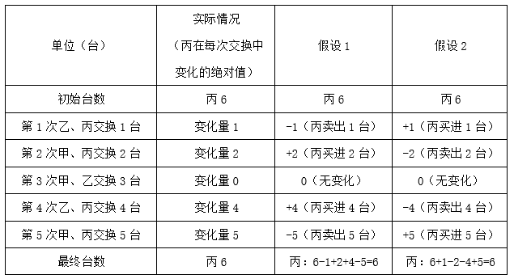
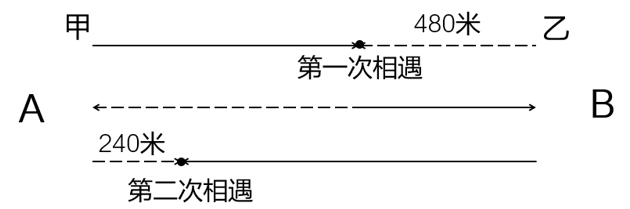
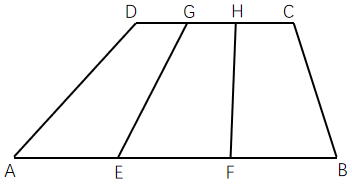

# 2023年重庆市选调优秀大学生到基层工作考试《行测》题

> 数量关系 · 10 题 · 选调 2023

## 第 1 题　qid 13255437 · 数学运算

某单位计划举办一次体育比赛，该单位共有100名员工，比赛项目有三项，分别是跳绳、投篮和跑步，其中参加跳绳的有35人，参加投篮的有48人，参加跑步的有45人，既参加跳绳又参加投篮的有13人，既参加跳绳又参加跑步的有15人，既参加投篮又参加跑步的有16人，有2人三项都没参加，问三项都参加的有多少人?（    ）

- **A**. 12
- **B**. 14　✅
- **C**. 18
- **D**. 20

**答案**：B

**官方解析**

根据题意，设三项都参加的有x人，由三集合容斥原理标准型公式：，可得：35+48+45-13-15-16+x=100-2，解得：x=14人，即三项都参加的有14人。

故正确答案为B。

注：本题存在争议，三项都参加的人数（14人）比既参加跳绳又参加投篮的人数（13人）还多，不符合常理，存在矛盾，应为出题时出现疏漏。考场上建议按公式进行计算。

---

## 第 2 题　qid 13255436 · 数学运算

某中学计划从10名一线教师候选人中投票选出2名优秀教师予以表彰，规定每位投票人只能从10名候选人中选2名。那么该校至少应有多少人参加投票，才能够保证其中至少有2人投了2名相同的候选人?（    ）

- **A**. 46　✅
- **B**. 48
- **C**. 50
- **D**. 52

**答案**：A

**官方解析**

根据每位投票人只能从10名候选人中选2名，则共有种情况。根据最不利原则，至少有2人投了2名相同的候选人的票，最不利的情况是每种情况均有1人投票，此时再有1人投票，必然会出现2人投相同候选人的情况，故至少要1×45+1=46人参加投票。

故正确答案为A。

---

## 第 3 题　qid 13255438 · 数学运算

某地区燃气公司对管辖范围内的居民天然气实行“阶梯式”收费方式，其中规定每月用气量不高于15立方米，按照每立方米4元收费，若用气量超过15立方米，超过部分每立方米加收一部分费用。已知某户居民1月份所交气费是91.5元，9月份所交气费是56元，9月份的用气量是1月份的三分之二，则用气量超过15立方米部分天然气的价格是多少元？（    ）

- **A**. 4.15
- **B**. 4.3
- **C**. 5
- **D**. 5.25　✅

**答案**：D

**官方解析**

根据题意可知，居民用气量15立方米时，收费为15×4=60元，56元&lt;60元，则这户居民9月份的用气量为立方米，1月份的用气量为立方米。1月份的用气量超过15立方米部分为21-15=6立方米，收费为91.5-60=31.5元，则超出15立方米部分天然气的价格是元。

故正确答案为D。

---

## 第 4 题　qid 13255452 · 数学运算

某地火灾被扑灭之后组织了一批环保志愿者上山清运遗留垃圾。假设需要清运的垃圾总量是80吨，开工后由于附近居民的积极参与，实际清运的速度是原计划的4倍，结果提前5小时完成任务。问这批志愿者原计划每小时清运的垃圾吨数是多少？（    ）

- **A**. 10
- **B**. 12　✅
- **C**. 16
- **D**. 18

**答案**：B

**官方解析**

根据题意，垃圾总量一定，原计划清运速度与实际清运速度之比为1：4，则原计划清运时间与实际清运时间之比为4：1，原计划比实际多用的3份时间对应5小时，则原计划清运时间为小时，原计划清运的效率为，即这批志愿者原计划每小时清运垃圾12吨。

故正确答案为B。

---

## 第 5 题　qid 13255456 · 数学运算

为了改善社区医疗卫生条件，某医院计划拆除一部分旧楼，建设新楼。假设拆除旧楼每平方米需要60元，建造新楼每平方米需要600元。原计划拆除旧楼和建造新楼的面积总共为2000平方米，但在施工过程中更改了计划，增加了部分绿化面积，使得新楼建造面积只完成了原计划的90%，而拆除旧楼面积刚好超过了原计划的10%，结果恰好使得拆除旧楼和建造新楼的总面积仍是2000平方米。如果每平方米绿化面积需要100元，则将实际拆除和建造工程中结余的资金用于绿化建设，最多可以绿化多少平方米？（    ）

- **A**. 270
- **B**. 540　✅
- **C**. 980
- **D**. 1200

**答案**：B

**官方解析**

根据题意，设医院拆除旧楼x平方米，建造新楼y平方米，可列式为：x+y=2000······①，（1+10%）x+90%y=2000······②，联立①②两式，解得x=1000，y=1000。原计划拆除和建造工程的总费用为60×1000+600×1000=660000元，实际拆除和建造工程的总费用为60×（1+10%）×1000+600×90%×1000=66000+540000=606000元，则结余的资金为660000-606000=54000元，可以绿化平方米。

故正确答案为B。

---

## 第 6 题　qid 13255442 · 数学运算

某地甲、乙、丙三家企业的库房中都闲置着型号、用途不同的6台设备，决定互相间调剂设备。第1次乙、丙间交换1台，第2次甲、丙间交换2台，第3次甲、乙间交换3台，第4次乙、丙间交换4台，第5次甲、丙间交换5台，经过5次调剂后三家企业刚巧都还有6台设备。如果每次调剂中，都是一方卖给另一方，问在5次调剂中，丙作为买方的有几次？（    ）

- **A**. 0
- **B**. 1
- **C**. 2　✅
- **D**. 3

**答案**：C

**官方解析**

根据题意可知，丙在五次交换中的变化量分别为1台、2台、0台、4台和5台，若要满足调剂后企业设备数不变，则说明丙在这五次交换中作为买方购进设备的总台数与作为卖方卖出设备的总台数相等，观察发现，满足买进总台数和卖出总台数相等的组合只有（1，5）和（2，4），满足1+5=2+4，因此在这个组合中满足题意的情况分析如下：

由上表可知，无论哪种假设，丙作为买方的次数都是2。

故正确答案为C。

---

## 第 7 题　qid 13255446 · 数学运算

甲乙两人分别从A地、B地同时出发晨练，甲从A地骑车到B地，乙从B地跑步到A地。甲乙在离B地480米时相遇，休息2分钟后又同时继续前行，到达终点后均休息5分钟后返回。当他们第二次相遇时，甲距A地240米，如果骑车和跑步均为匀速运动，且骑车速度大于跑步速度，则甲骑车速度与乙跑步速度之比为（    ）。

- **A**. 4：3
- **B**. 3：2　✅
- **C**. 2：1
- **D**. 5：2

**答案**：B

**官方解析**

由于甲、乙在两次相遇过程中休息时间均为2+5=7分钟，且二人同时出发，所以二人去掉休息时间的行进时间相同，具体行进过程如下图（甲行进路线为实线，乙为虚线）：

如图所示，甲、乙第一次相遇时，二人共走；第二次相遇时，二人共走。假设第一次相遇用时为t，由于二人速度不变且匀速，因此第二次相遇时二人去掉休息时间的行进总用时应为3t。对于乙来说，第一次相遇时用t的时间跑步480米，则第二次相遇时用3t的时间应跑步3×480=1440米。根据乙的行进路线（上图虚线部分）可知，，解得米，则第一次相遇时甲骑车路程为1200-480=720米。第一次相遇时，二人所用时间相同，则速度与路程成正比，故，即甲骑车速度与乙跑步速度之比为3：2。

故正确答案为B。

---

## 第 8 题　qid 13255447 · 数学运算

小李每周六到县城学习，学习结束后乘公交车于下午4点到达镇汽车站，此时小李父亲骑自行车刚好到达汽车站接他回家，他们每次都在同一时间回到家中。某周六学习提前结束，小李乘早一班的车提前30分钟到达镇汽车站，于是他先步行回家，直到中途与父亲相遇，再坐自行车回家，结果提前10分钟到家。假定小李父亲无论是否搭乘小李骑车速度都一样，问小李步行了多少分钟与父亲相遇？

- **A**. 20
- **B**. 25　✅
- **C**. 30
- **D**. 40

**答案**：B

**官方解析**

根据“提前10分钟到家”可知，父亲少行驶了10分钟，且少行驶的路程刚好是路程AB的2倍（一去一回），说明父亲行驶AB（单程）用时10÷2=5分钟，则父亲接到小李时比平时提前了5分钟，即4点-5分钟=3点55分接上小李。小李4点-30分钟=3点30分开始步行，与父亲相遇时是3点55分，则他步行的时间是3点55分-3点30分=25分钟。

故正确答案为B。

---

## 第 9 题　qid 13255444 · 数学运算

一次台风袭击了有90户家庭的小岛，造成巨大损失。76户损失了牛群，60户损失了羊群，65户的猪被洪水冲走，70户的粮仓损毁。问在这次灾难中，最多有多少户的牛、羊、猪与粮仓都遭受损失？（    ）

- **A**. 14
- **B**. 30
- **C**. 60　✅
- **D**. 65

**答案**：C

**官方解析**

根据题意可知，要使牛、羊、猪与粮仓都遭受损失的户数最多，需满足牛、羊、猪与粮仓遭受损失的家庭有最大的交集。假设牛、羊、猪与粮仓都遭受损失的户数为x户，则需要同时满足四个条件：、、、，四个条件的交集为，所以最多有60户的牛、羊、猪与粮仓都遭受损失。

故正确答案为C。

---

## 第 10 题　qid 13255450 · 数学运算

已知四边形ABCD，E、F为AB边的三等分点，G、H为CD边的三等分点，则四边形ABCD的面积与四边形EFHG的面积之比是（    ）。

- **A**. 2：1
- **B**. 3：1　✅
- **C**. 3：2
- **D**. 4：3

**答案**：B

**官方解析**

根据题干可知，，；根据图形可知，四边形ABCD与四边形EFHG的高相等。设四边形ABCD与四边形EFHG的高为h，根据梯形面积公式：，则，，即四边形ABCD的面积与四边形EFHG的面积之比是3：1。

故正确答案为B。

---
