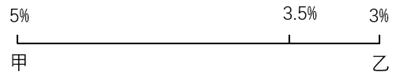

# 2024年吉林省公务员录用考试《行测》题（网友回忆版）

> 数量关系 · 10 题 · 吉林 2024

## 第 1 题　qid 19181356 · 数学运算

一个不透明箱子里面有3个黑球，2个白球，第一次取走2个小球（无顺序）且不放回，第二次取出2个小球与第一次相同的概率为：

- **A**. 

- **B**. 

　✅
- **C**. 

- **D**. 

**答案**：B

**官方解析**

箱子里面有3个黑球，2个白球，要想第二次取出的2个小球与第一次相同，只能每次取的都是1个黑球、1个白球。根据公式：概率，则第一次取出1个黑球、1个白球的概率，第二次取出1个黑球、1个白球的概率，故所求概率。

故正确答案为B。

---

## 第 2 题　qid 10204669 · 数学运算

一项工程，甲单独做完要8天的时间，甲、乙一起做了4天完成了工程的75%，剩余工程由乙独自完成还需要多少天？

- **A**. 4天　✅
- **B**. 8天
- **C**. 12天
- **D**. 16天

**答案**：A

**官方解析**

根据题意，赋值工程总量为8，甲的效率为，甲、乙效率和为，可知乙的效率为1.5-1=0.5，剩余工程量为8×（1-75%）=2，则乙独自完成还需要天。 

故正确答案为A。

---

## 第 3 题　qid 19181362 · 数学运算

现针对50岁（含）以上的一批老人进行为期两年的跟踪调查，在人员不变的情况下，第二年50~60岁的占比降低5％，61~70岁的占比降低4％，则71岁的人员数量为：

- **A**. 4
- **B**. 5
- **C**. 8
- **D**. 9　✅

**答案**：D

**官方解析**

根据题意，跟踪调查的人员不变，第二年50~60岁的占比降低5％，是因为60岁的老人变为61岁，则第二年61岁的老人占比为5%。第二年61~70岁的占比降低4％，是因为60岁老人变成61岁（人数增加），70岁老人变成71岁（人数减少），则5%-第二年71岁的老人占比=-4%，因此第二年71岁的老人占比=9%。，则71岁的人员数量为9的倍数，只有D项符合。

故正确答案为D。

---

## 第 4 题　qid 19181360 · 数学运算

某一年的元旦是星期二，这一年共有53个星期三，则3月27日这一天为：

- **A**. 星期二
- **B**. 星期三
- **C**. 星期四　✅
- **D**. 星期五

**答案**：C

**官方解析**

这一年一定有52个整周（含52个星期三），从星期二到下个星期一为一周，共52×7=364天，因这一年共有53个星期三，还需多出两天（星期二、星期三），则这一年共有364+2=366天，从元旦到3月27日共有31+29+27=87天，周······3天，所以3月27日这一天为星期四。

故正确答案为C。

---

## 第 5 题　qid 19181359 · 数学运算

某商店决定改变销售策略，将球衣打九折出售，结果销售数量比原来增加了50件，但是销售收入减少了200元，则原来的销售数量至少有（    ）件。

- **A**. 301
- **B**. 351
- **C**. 401
- **D**. 451　✅

**答案**：D

**官方解析**

设该球衣原价为x元，原来的销售数量为y件。根据题意可知，打9折出售后，销售数量增加50件，销售收入减少200元，可列式为：，整理得（0.1y-45）x=200。由于x、y均为正数，若使等式成立，则需0.1y-45＞0，解得y＞450，即原来的销售数量至少有451件。

故正确答案为D。

---

## 第 6 题　qid 10204667 · 数学运算

A、B两地相距100米，甲、乙两人分别从AB两地同时出发，匀速相向而行，相遇后，甲原路返回A地，乙继续向A前行，当甲、乙均到A地结束。已知乙的用时是甲的三倍，那么甲的速度是乙的：

- **A**. 2倍
- **B**. 3倍
- **C**. 4倍
- **D**. 5倍　✅

**答案**：D

**官方解析**

设甲、乙第一次相遇用时为，则甲原路返回A地用时也为，共用时；乙的用时是甲的三倍，则乙到达A地用时为。两人在第一次相遇时用时均为，可知乙从两人相遇点到达A地用时为。根据路程相同，时间与速度成反比，可知从A地到相遇点，，即甲的速度是乙的5倍。

故正确答案为D。

---

## 第 7 题　qid 10204668 · 数学运算

AB两地有三种不同的航线飞行时长分别为5、6、7小时，甲乙两人同时从A地出发，到达B地后返回A地，同时返回的飞行方案有几种?

- **A**. 9
- **B**. 11
- **C**. 19　✅
- **D**. 21

**答案**：C

**官方解析**

根据题意可知，甲、乙两人同时从A地出发到达B地后同时返回A地，故两人选择飞行方案总时长相同，具体情况如下：

①两人往返选择同一种航线：甲、乙选择“5、6、7”三种航线中的同一种，则情况数有种；

②两人往返选择两种航线：甲、乙选择“5、6、7”三种航线中的同样两种，则情况数有种；

③两人往返共选择三种航线：若甲选择“5+7”航线，为保证总时长相同，则乙只能选择“6+6”航线，反之成立，则情况数有种。

综上所述，甲、乙二人同时出发同时返回的飞行方案共有3+12+4=19种。

故正确答案为C。

---

## 第 8 题　qid 19181363 · 数学运算

某人买了甲、乙两种金融产品，期限结束后，甲、乙两种金融产品收益率分别是5%和3%，最终收益率为3.5%，那么购买甲、乙两种金融产品的金额比例为：

- **A**. 1：1
- **B**. 1：2
- **C**. 1：3　✅
- **D**. 1：4

**答案**：C

**官方解析**

方法一：设购买甲金融产品的金额为a，购买乙金融产品的金额为b。根据题意可列等式：a×5%+b×3%=(a+b)×3.5%，整理可得：a：b=1：3。

方法二：根据线段法“距离与量成反比”，可得。

故正确答案为C。

---

## 第 9 题　qid 19181361 · 数学运算

一次化学实验中，稀释一定量的盐水，在此盐水中加入100g水后，其浓度变为原来的80%，则原盐水质量为：

- **A**. 200g
- **B**. 300g
- **C**. 400g　✅
- **D**. 500g

**答案**：C

**官方解析**

设原盐水质量为m，浓度为n。根据公式：浓度，可列式：，解得m=400，即原盐水质量为400g。

故正确答案为C。

---

## 第 10 题　qid 19181365 · 数学运算

某工厂去年销售一台机器的利润率为20%，由于生产效率提高，今年成本下降20%，售价不变，今年销售一台机器的利润率为：

- **A**. 30%
- **B**. 40%
- **C**. 50%　✅
- **D**. 60%

**答案**：C

**官方解析**

赋值去年一台机器的成本为100，根据公式：售价=成本×（1+利润率），则去年一台机器的售价为100×（1+20%）=120。今年一台机器的成本为100×（1-20%）=80，一台机器的售价依然为120，故今年销售一台机器的利润率为。

故正确答案为C。

---
