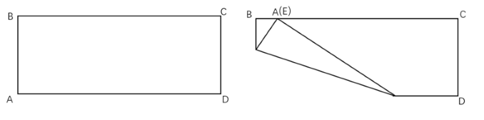
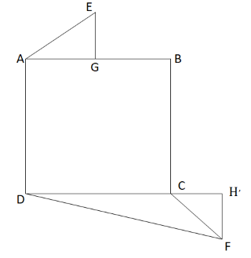
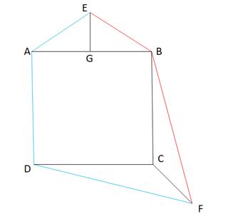

# 2024年四川省公务员录用考试《行测》试题（网友回忆版）

> 数量关系 · 10 题 · 四川 2024

## 第 1 题　qid 12536405 · 数学运算

某单位每名党员每周六都被随机安排到甲、乙、丙三个社区中的一个开展志愿服务（同一个社区可以连续前往）。已知任意连续的3个周六中，都能保证至少3名党员的志愿服务行程完全相同。问该单位至少有多少名党员？

- **A**. 55　✅
- **B**. 52
- **C**. 24
- **D**. 21

**答案**：A

**官方解析**

已知每名党员每周六都被随机安排到甲、乙、丙三个社区，则每名党员每周六有种行程安排。连续的3个周六，共有种行程安排。

要想保证在任意连续的3个周六中，至少有3名党员的志愿服务行程完全相同，考虑最不利情况：任意连续的3个周六中所有的志愿服务行程均各有2名党员选择，在此基础上再加1名党员，即可保证至少3名党员的志愿服务行程完全相同。故该单位至少有27×2+1=55人。

故正确答案为A。

---

## 第 2 题　qid 12536409 · 数学运算

某店开展打折促销活动：满488元打8折，满688元打7折，满988元打6折。小张两次购物分别实际支付400元和630元。问他如果一次性购买所有商品最多可能比分两次购买节省多少元?

- **A**. 100
- **B**. 190
- **C**. 250　✅
- **D**. 412

**答案**：C

**官方解析**

根据题意可知，小张实际支付400元有两种情况，按原价购买或打8折，要想节省更多的钱，则分开支付时优惠力度小，即按原价购买，原价为400元。实际支付630元也有两种情况，打7折或打6折，同理，分开支付时打7折，则原价为元。所有商品的原价为400+900=1300元＞988元，一次性购买可以打6折，需要支付1300×0.6=780元，比分两次购买最多可节省400+630-780=250元。

故正确答案为C。

---

## 第 3 题　qid 12536413 · 数学运算

乙生产线每天比甲生产线多生产5件产品，两条生产线同时开工，乙生产450件产品所用的时间比甲少1天。乙生产450件产品后设备需检修，每天产量比之前减少10件，又生产若干天后结束生产任务，此时两条生产线产量相同。问开始检修后，乙生产线共生产了多少件产品？

- **A**. 240
- **B**. 280
- **C**. 320
- **D**. 360　✅

**答案**：D

**官方解析**

设检修前甲每天生产x件产品，则乙每天生产（x+5）件产品。根据题意，则可列式：，解得x=45。乙生产450件产品需用时天，此时甲生产45×9=405件产品。检修后乙每天生产45+5-10=40件产品，设开始检修后又生产y天结束生产任务，根据题干“此时两条生产线产量相同”，可列式：405+45y=450+40y，解得y=9。故开始检修后，乙生产线共生产了40×9=360件产品。

故正确答案为D。

---

## 第 4 题　qid 12536417 · 数学运算

在一块玉米地中使用甲、乙两台自动播种机进行播种。如只使用甲播种机需要12小时，只使用乙播种机需要20小时，计划同时使用两台播种机完成播种任务。两台播种机共同播种3小时后，乙播种机出现故障用时2小时维修，修好后的效率降低了20%，之后两台播种机共同工作直到任务完成。问实际播种时间比原计划多多长时间？

- **A**. 不到1小时
- **B**. 1小时-1小时20分之间　✅
- **C**. 1小时20分-1小时40分之间
- **D**. 1小时40分以上

**答案**：B

**官方解析**

赋值工作总量为60（12和20的最小公倍数），则甲播种机工作效率为，乙播种机工作效率为，根据题干“计划同时使用两台播种机完成播种任务”，则原计划完成播种任务共需小时。两台播种机3小时共播种（5+3）×3=24，乙播种机维修的2小时中甲播种机播种了5×2=10，剩余60-24-10=26个工作量由甲播种机和修好后的乙播种机共同完成，根据题干“修好后的效率降低了20%”，则此时乙播种机的效率为3×（1-20%）=2.4，剩余工作量还需要小时，则实际完成播种任务所用时间为小时，故所求为小时小时，在B项范围内。

故正确答案为B。

---

## 第 5 题　qid 12536421 · 数学运算

小李开车去某单位办事，计划全程匀速行驶2小时到达目的地。出发后头30分钟按计划速度行驶，此后50分钟交通拥堵，行驶的路程和前面30分钟相同。最后40分钟小李匀加速行驶，最终全程用时2小时到达。问他最后10分钟的平均车速是计划行驶速度的多少倍？

- **A**. 不到1.8倍
- **B**. 不低于1.8倍但低于2.0倍
- **C**. 不低于2.0倍亦不高于2.2倍　✅
- **D**. 高于2.2倍

**答案**：C

**官方解析**

赋值计划行驶速度为100米/分钟，则全程为2×60×100=12000米。根据题意可得，出发后头30分钟的行驶路程为30×100=3000米，此后50分钟的行驶路程也为3000米，则剩余路程为12000-3000-3000=6000米。中间50分钟路程的行驶速度为3000÷50=60米/分钟，即后40分钟匀加速行驶的初始速度为60米/分钟。后40分钟路程的平均速度为6000÷40=150米/分钟，根据公式：平均速度，可得米/分钟。根据匀加速运动公式：，可得加速度，则1小时50分钟时的行驶速度为60+4.5×30=195米/分钟，最后10分钟的平均速度为米/分钟，题干所求倍数为，在C项范围内。

故正确答案为C。

备注：中间50分钟路程默认为匀速运动，否则此题无解。

---

## 第 6 题　qid 12536410 · 数学运算

现有浓度为70%的盐水100克。从中倒出40克，再加入40克浓度为20%的盐水，如此操作共5次后，问盐水的浓度在以下哪个范围内？

- **A**. 低于23%
- **B**. 在23%到25%之间　✅
- **C**. 在25%到27%之间
- **D**. 高于27%

**答案**：B

**官方解析**

根据题意，每次混合过程均为原溶液倒出40克后，将剩余100-40=60克盐水和40克浓度为20%的盐水混合，由于每次混合后的溶液质量均为100克，根据公式：浓度，因此混合后溶质的量即为浓度的数值，故本题只讨论溶质质量的变化即可，第1次至第5次溶质质量分别为：

第1次：60×70%+40×20%=42+8=50克；

第2次：60×50%+40×20%=30+8=38克；

第3次：60×38%+40×20%=22.8+8=30.8克；

第4次：60×30.8%+40×20%=18.48+8=26.48克；

第5次：克。

综上可知，第5次混合后浓度约为，在23%到25%之间。

故正确答案为B。

---

## 第 7 题　qid 12536412 · 数学运算

小周早上8点多开始处理公文，此时发现时钟的时针和分针夹角不超过30度。处理完公文时，发现已经上午10点多，时钟的时针和分针正好重合。那么小周处理公文的时长可能为以下哪个结果？

- **A**. 2小时5分钟
- **B**. 2小时15分钟　✅
- **C**. 2小时25分钟
- **D**. 2小时35分钟

**答案**：B

**官方解析**

分针每分钟转，时针每分钟转，则分针每分钟比时针多转。

方法一：早上8点分针与时针的夹角为，设8点x分开始处理公文，根据此时的时针和分针夹角不超过30度，可知有2种情况：若分针未追上时针，则有，解得；若分针已追上时针，则有，解得，即开始处理公文的时间在8点38.2分~8点49.1分之间。上午10点时针和分针的夹角为，设10点y分时针与分针重合，根据此时的分针比时针多转，可列式：5.5y=300，解得，即处理完公文的时间在10点54.5分。因此，处理公文的时长在10点54.5分-8点49.1分=2小时5.4分钟，到10点54.5分-8点38.2分=2小时16.3分钟之间，结合选项，只有B项满足。

方法二：假设开始处理公文时，时针和分针也重合，则从开始处理公文到处理完，分针比时针恰好多走了2圈（上午8点多到10点多），即。但实际开始处理公文时，时针和分针夹角不超过30度，可知实际分针比时针多走的度数在（）到（）之间。则处理公文的时长在（）分钟到（）分钟之间，即2小时5.5分钟到2小时16.4分钟之间，结合选项，只有B项满足。

故正确答案为B。

---

## 第 8 题　qid 12536420 · 数学运算

一块长13厘米、宽5厘米的长方形纸片如下图所示。将其沿直线折叠后使得点A与BC边上某一点E重合，且折痕分别与纸片的AB边、AD边相交。问BE可能的最大和最小长度相差多少厘米？

- **A**. 3
- **B**. 4　✅
- **C**. 5
- **D**. 6

**答案**：B

**官方解析**

由题意可知，BE最大的长度为BA完全与BC边重合时（如图1所示），即时，此时BE=BA=5厘米；BE最小的长度为AD边完全折起且A与BC边相交于点E（如图2所示），根据勾股定理，厘米，此时BE=13-12=1厘米。故BE可能的最大和最小长度相差5-1=4厘米。

故正确答案为B。

---

## 第 9 题　qid 12536422 · 数学运算

甲和乙进行乒乓球比赛。第一局甲胜乙的概率为70%。往后每局如甲上局取胜，则当局甲的胜率为50%；如乙上局取胜，则当局甲的胜率为70%。问第三局甲取胜的概率在以下哪个范围内？

- **A**. 不到55%
- **B**. 在55%-57%之间
- **C**. 在57%-59%之间　✅
- **D**. 高于59%

**答案**：C

**官方解析**

根据“第一局甲胜乙的概率为70%”可知，第一局甲负乙的概率为1-70%=30%。同理，当甲的胜率分别为50%、70%时，甲负乙的概率分别为1-50%=50%、1-70%=30%，则第三局甲取胜的胜负情况可分为以下四种：

综上可知，甲第三局取胜的概率为17.5%+24.5%+10.5%+6.3%=58.8%，在C项范围内。

故正确答案为C。

---

## 第 10 题　qid 12536428 · 数学运算

正方形水池ABCD的边长为80米。E点在AB边正中的正北30米处，F点在C点东偏南方向，F点到C点距离为米。甲从E点出发前往F点，问他的最短行进距离比途经D点的最短行进距离短多少米？

- **A**. 
30

- **B**. 
50

- **C**. 

- **D**. 
80
　✅

**答案**：D

**官方解析**

方法一：如图，E点出发前往F点的最短距离为E-B-F，即EB+BF。连接EB、BF，过E点作，因“E点在AB边正中的正北30米处”，所以EG=30米，且G点为AB的中点，故GB=40米，根据勾股定理，则米；延长BC至H点，过F点作，因“F点在C点东偏南方向，F点到C点距离为米”，则为等腰直角三角形，米，则BH=80+40=120米，根据勾股定理，则米，则E点到F点的最短行进距离米。

如图，若是途经D点，则最短距离为EA+AD+DF。连接EA、DF，过E点作，延长DC至点，作。同理根据勾股定理可得EA=50米，米，则米，所以E点途经D点到达F点的最短距离=EA+AD+DF米。

故所求米。

方法二：如图，从E点出发到达F点的最短路径为EB+BF；若经过D点，则最短路径为EA+AD+DF。根据“E点在AB边正中的正北30米处”，可知以EG为对称轴，EA和EB对称，则EA=EB；又因BC=DC，，CF为公共边，则，DF=BF，故所求=（EA+AD+DF）-（EB+BF）=AD=80米。

故正确答案为D。

---
