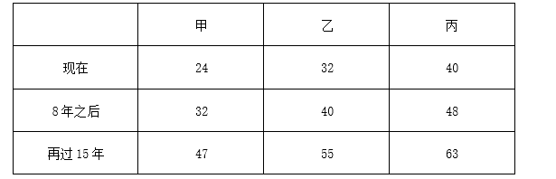
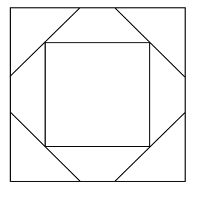
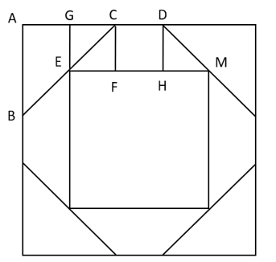
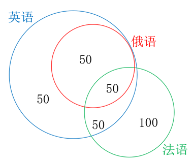

# 2024年国家公务员录用考试《行测》题（副省级网友回忆版）

> 数量关系 · 15 题 · 国考 2024

## 第 1 题　qid 5893586 · 数学运算

甲、乙、丙三人的年龄之比为3：4：5。8年之后，甲、乙的年龄之和是丙的1.5倍，且这一年甲、乙、丙、丁四人的平均年龄为43岁。问再过15年，甲、乙、丙、丁中有几人将超过60岁?

- **A**. 4
- **B**. 3
- **C**. 2　✅
- **D**. 1

**答案**：C

**官方解析**

设甲、乙、丙三人现在的年龄分别为3x岁、4x岁、5x岁。根据“8年之后，甲、乙的年龄之和是丙的1.5倍”，可列式：，解得x=8，则甲、乙、丙现在的年龄分别为3×8=24岁、4×8=32岁、5×8=40岁。如下表，则8年之后、再过15年，甲、乙、丙年龄分别为：

根据“8年之后，甲、乙、丙、丁的平均年龄为43岁”，则8年之后，四人年龄之和为43×4=172岁，此时丁年龄为172-32-40-48=52岁，则再过15年，丁年龄为52+15=67岁。故再过15年，年龄超过60岁的有丙和丁2人。

故正确答案为C。

---

## 第 2 题　qid 5893760 · 数学运算

甲、乙、丙和丁四个汽车租赁公司可用汽车数量比为5：4：3：2，现甲公司调度4辆汽车到丙公司，丁公司调度1辆汽车到乙公司后，丁公司可用汽车数量正好是丙公司的60%。问此时甲公司的可用汽车数量比乙公司：

- **A**. 少22辆
- **B**. 多22辆
- **C**. 少12辆
- **D**. 多12辆　✅

**答案**：D

**官方解析**

设开始时甲公司有可用汽车5x辆，则乙、丙、丁公司分别有可用汽车4x、3x、2x辆。根据题意“甲公司调度4辆汽车到丙公司，丁公司调度1辆汽车到乙公司后，丁公司可用汽车数量正好是丙公司的60%”，则可列式：，解得x=17。那么，此时甲公司的可用汽车数量为5×17-4=81辆，乙公司为4×17+1=69辆，81-69=12辆，即甲公司的可用汽车数量比乙公司多12辆。

故正确答案为D。

---

## 第 3 题　qid 5893761 · 数学运算

市政部门采购了一批灯带用于美化夜景，有30灯珠/条的M型和60灯珠/条的N型两种规格，单价分别是20元/条和30元/条。已知所采购M型灯带的总灯珠数量是N型的2倍，M型灯带的总价比N型多3万元，问共采购灯带多少条？

- **A**. 2400
- **B**. 2700
- **C**. 3000　✅
- **D**. 3300

**答案**：C

**官方解析**

设市政部门采购了M型灯带x条，N型灯带y条。根据“所采购M型灯带的总灯珠数量是N型的2倍”，可得；根据“M型灯带的总价比N型多3万元”，可得，联立①②，解得x=2400，y=600，故共采购灯带2400+600=3000条。

故正确答案为C。

---

## 第 4 题　qid 5893758 · 数学运算

某企业去年全年收入1200万元，支出960万元。今年上半年和下半年，企业支出比去年同期分别减少20%和15%，且全年收入与去年相同，总体盈余（收入-支出）比去年增加172万元。问今年上半年支出比下半年：

- **A**. 少160万元
- **B**. 多160万元
- **C**. 少108万元
- **D**. 多108万元　✅

**答案**：D

**官方解析**

设该企业去年上半年和下半年支出分别为x万元与y万元，可得x+y=960······①，因今年上半年和下半年企业支出比去年同期分别减少20%和15%，且全年收入与去年相同，总体盈余（收入-支出）比去年增加172万元，则今年支出比去年少172万元，可得20%x+15%y=172万元······②，联立①②，解得x=560，y=400。今年上半年支出-下半年支出万元，即今年上半年支出比下半年多108万元。

故正确答案为D。

---

## 第 5 题　qid 5893763 · 数学运算

甲乙两条生产线同一天开始生产某种产品，甲每天比前一天多生产m件，乙每天比前一天少生产2m件，第5天两条生产线的当日产量相同，且前5天乙的累计产量是甲的2倍。问第一天乙的产量是甲的多少倍？

- **A**. 6
- **B**. 7
- **C**. 4　✅
- **D**. 5

**答案**：C

**官方解析**

根据题意可知，甲生产线每天产量是公差为m的等差数列，乙生产线每天产量是公差为-2m的等差数列。设第5天两条生产线的当日产量均为x件，根据等差数列通项公式：，即，则第1天甲生产线产量为件，乙生产线产量为件。根据等差数列求和公式：，可列等式：，解得x=8m，则第1天甲生产线产量为x-4m=8m-4m=4m件，乙生产线产量为x+8m=8m+8m=16m件，故所求为倍。

故正确答案为C。

---

## 第 6 题　qid 5893784 · 数学运算

甲和乙两辆车同时从A地出发匀速开往B地，甲车出发时的速度比乙车快20%，但乙车行驶1个小时后速度加快30千米/小时继续匀速行驶，又用了3小时与甲车同时抵达，问A、B两地相距多少千米（    ）：

- **A**. 540　✅
- **B**. 510
- **C**. 600
- **D**. 570

**答案**：A

**官方解析**

根据题意，设乙车出发时的速度为v，则甲车速度为v×(1+20%)=1.2v，乙车1个小时后速度变为v+30。则A、B两地的距离为，整理可得，则0.8v=90，即千米。

故正确答案为A。

---

## 第 7 题　qid 5893786 · 数学运算

甲、乙、丙三种农产品价格分别为30元/包、24元/包和20元/包。某日销售三种农产品共240包，总销售额为6000元，已知甲的销售量是乙的2倍，问丙销售了多少包？

- **A**. 90　✅
- **B**. 75
- **C**. 60
- **D**. 45

**答案**：A

**官方解析**

设乙的销售量为x包，则甲的销售量为2x包，丙的销售量为240-x-2x=（240-3x）包。根据题意，可列等式：，解得x=50。因此，丙的销售量为240-3×50=90包。

故正确答案为A。

---

## 第 8 题　qid 5893787 · 数学运算

公司有六个编号依次为1—6的研发团队，现安排这6个团队参与甲、乙两个科研课题，要求每个团队参与一个课题。每个课题最少安排2个团队，每个课题安排一个团队负责，且负责团队不能是该课题所有参与团队中编号最小的团队。问有多少种不同的安排方式？

- **A**. 300
- **B**. 340
- **C**. 150
- **D**. 170　✅

**答案**：D

**官方解析**

因每个课题最少安排2个团队，可分成三大类情况：

第一大类：甲课题由2个团队参与，有种情况，其中编号较大的团队负责该课题，有1种情况；乙课题由剩余的4个团队参与，负责团队可为编号较大的3个团队之一，有种情况。故共有15×1×3=45种安排方式。

第二大类：乙课题由2个团队参与，有种情况，其中编号较大的团队负责该课题，有1种情况；甲课题由剩余的4个团队参与，负责团队可为编号较大的3个团队之一，有种情况。故共有15×1×3=45种安排方式。

第三大类：甲课题由3个团队参与，有种情况，负责团队可为编号较大的2个团队之一，有种情况；乙课题由剩余的3个团队参与，负责团队为编号较大的2个团队之一，有种情况。故共有20×2×2=80种安排方式。

分类用加法，满足条件的共有45+45+80=170种不同的安排方式。

故正确答案为D。

---

## 第 9 题　qid 5893789 · 数学运算

某次考试有20道选择题和20道判断题，每题答对得3分，答错得0分，不答得1分。考生小王成绩为82分，且他选择题的答错数比答对数多，问他判断题至少答对了多少道？

- **A**. 17　✅
- **B**. 18
- **C**. 15
- **D**. 16

**答案**：A

**官方解析**

要让判断题答对的尽量少，则判断题的得分应尽量少，成绩82分一定，选择题的得分应尽量多，由于“选择题的答错数比答对数多”，则选择题最多答对9道，答错10道，不答1道，此时选择题得分最多为9×3+1=28分，判断题得分至少为82-28=54分。设判断题答对x道，答错y道，不答z道，可列方程组：。①-②可得：，要想x尽量小，则y尽量小，y最小为0，此时x=17，因此小王判断题至少答对了17道。

故正确答案为A。

---

## 第 10 题　qid 5893774 · 数学运算

某公园内的道路如下图所示，其中AB、BC分别为正南北向和正东西向道路，AB、AC分别长100米和200米。且BCD为正三角形，如要用直线道路连接AD，则该道路的长度为多少米？

- **A**. 

- **B**. 

- **C**. 

　✅
- **D**. 

**答案**：C

**官方解析**

连接AD（如下图）：

由于“AB、BC分别为正南北向和正东西向道路”，故，根据勾股定理可得：米，由于，故三角形ABC为一个锐角为的直角三角形，。由于BCD为正三角形，故米，，故，则三角形ACD为直角三角形，根据勾股定理可得：米。

故正确答案为C。

---

## 第 11 题　qid 5893780 · 数学运算

设计师将一个正方形的大厅分给如下图所示的几个区域，已知所有的三角形都是等腰直角三角形，梯形都是等腰梯形，且所有三角形和梯形面积均相等。在三角形的区域铺设地砖，在中间的正方形区域铺设木地板。问地砖和木地板的面积比是多少？

- **A**. 2：3
- **B**. 4：3
- **C**. 8：9　✅
- **D**. 16：9

**答案**：C

**官方解析**

如图所示，从E点作EG垂直于AC；从C、D两点分别作CF、DH垂直于EM。根据题意可知，三角形都是等腰直角三角形，梯形都是等腰梯形，BE与EC均为梯形的腰，则BE=EC，可知E为BC的中点，那么EG为等腰直角三角形ABC的中位线。赋值EG=1，则EG=CF=DH=1，又，则EG=GC=EF=HM=1，AB=2EG=2。，，根据三角形和梯形面积相等，，可得CD=1，则中间正方形区域的边EM=EF＋FH＋HM=3。三角形的区域铺设地砖，则铺设地砖的面积；中间的正方形区域铺设木地板，则铺设木地板的面积=3×3=9，地砖和木地板的面积比是8：9。

故正确答案为C。

---

## 第 12 题　qid 5893783 · 数学运算

某工程队接到一项任务，甲、乙合作6天后完成总任务量的25%，乙、丙合作15天后又完成剩余任务量的，剩下全部任务由乙单独工作11天完成。已知乙与他人合作时效率比其单独工作时高10%，问甲、乙、丙合作完成这项任务需要多少天？

- **A**. 16
- **B**. 20　✅
- **C**. 24
- **D**. 28

**答案**：B

**官方解析**

由于“乙与他人合作时效率比其单独工作时高10%”，即乙与他人合作时效率为（1+10%）乙=1.1乙，根据题意则有：······①；······②；······③。联立①③可得15甲=11乙，赋值甲的效率为11，乙的效率为15，则工作总量=11×15×4=660，则，所求时间天。

故正确答案为B。

---

## 第 13 题　qid 5893542 · 数学运算

某高校外国语学院中，会俄语的学生都会英语，其中一半还会法语；会英语的学生中有一半会法语；这三种语言都会的学生有50人，只会其中两种语言的有100人，只会其中一种语言的有150人。问会法语的学生有多少人？

- **A**. 100
- **B**. 200　✅
- **C**. 50
- **D**. 150

**答案**：B

**官方解析**

因为“会俄语的学生都会英语”，所以会俄语的学生包含于会英语的学生，因此作图如下：

又因为“会俄语的学生都会英语，其中一半还会法语”，即会俄语的学生的一半三种语言都会，又因为“三种语言都会的学生有50人”，所以会俄语的学生的一半是50人，另一半只会俄语和英语的有50人。又因为“只会其中两种语言的有100人”，所以只会英语和法语的学生有100-50=50人，会英语的学生中有50+50=100人会法语，结合“会英语的学生中有一半会法语”，可得会英语的学生共有100×2=200人，其中只会英语的学生有200-50-100=50人。根据“只会其中一种语言的有150人”，可得只会法语的学生有150-50=100人，则会法语的学生有100+50+50=200人。

故正确答案为B。

---

## 第 14 题　qid 5893759 · 数学运算

甲、乙等36人分为6个小组参加某项活动，要求任意2组人数不同，每个组都不少于3人，且任何一组人数不得超过另一组的3倍。问甲和乙至少有1人分到人数第二多的小组的概率为（    ）。

- **A**. 35%
- **B**. 40%　✅
- **C**. 25%
- **D**. 30%

**答案**：B

**官方解析**

根据题干“6个小组任意2组人数不同，每个组不少于3人”，可先给6个小组分别分3人、4人、5人、6人、7人、8人，共3+4+5+6+7+8=33人，还剩余36-33=3人。根据题干“任何一组人数不得超过另一组的3倍”，则人数最多的组不能超过9人，故剩余的3人只能分到人数最多的三个小组且每个小组分1人，此时人数第二多的小组有7+1=8人。总情况数为从36人中选8人分到人数第二多的小组，有种情况。

方法一：满足题意要求的情况较复杂，优先考虑反面情况。反面情况为甲和乙两人均未分到人数第二多的小组，即从剩余34人中选8人分到该小组，有种情况，则所求概率。

方法二：将满足题意要求的情况分类讨论如下：

①甲、乙其中1人分到人数第二多的小组，再从剩余34人中选7人分到该小组，有种情况；

②甲和乙都分到人数第二多的小组，再从剩余34人中选6人分到该小组，有种情况。

分类用加法，则所求概率。

故正确答案为B。

---

## 第 15 题　qid 5893551 · 数学运算

小张每周二、周五和周日固定参加骑行社团活动。某年9月和10月，小张分别参加了13次和14次活动。问当年他最后一次参加活动是在哪一天？

- **A**. 12月31日　✅
- **B**. 12月30日
- **C**. 12月29日
- **D**. 12月28日

**答案**：A

**官方解析**

由题意可知，小张连续7天参加3次社团活动，9月有30天，前28天参加次社团活动，则后2天需参加13-12=1次；同理，10月有31天，后28天也参加12次社团活动，则前3天需满足参加14-12=2次，即9月29日-10月3日连续5天内需满足参加3次社团活动。

若9月29日为周一，连续5天内只有2天参加社团活动，不满足题意；

若9月29日为周二，连续5天内只有2天参加社团活动，不满足题意；

若9月29日为周三，连续5天内只有2天参加社团活动，不满足题意；

若9月29日为周四，连续5天内只有2天参加社团活动，不满足题意；

若9月29日为周五，连续5天内有3天参加社团活动，满足题意；

若9月29日为周六，连续5天内只有2天参加社团活动，不满足题意；

若9月29日为周日，连续5天内只有2天参加社团活动，不满足题意。

综上可知，9月29日只能是周五，则9月30日为周六，10-12月共31+30+31=92天，天，则12月31日为周日，恰好为当年小张最后一次参加社团活动。

故正确答案为A。

---
