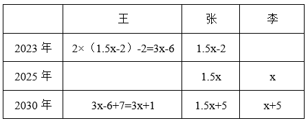
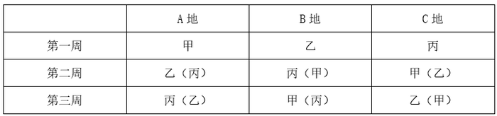
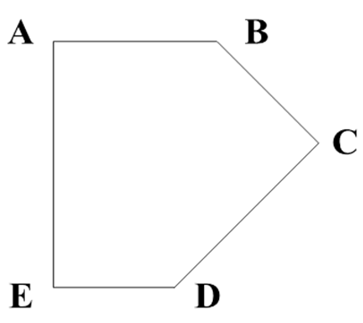
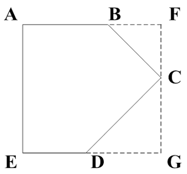

# 2024年国家公务员录用考试《行测》题（地市级网友回忆版）

> 数量关系 · 9 题 · 国考 2024

## 第 1 题　qid 5893532 · 数学运算

某企业招聘笔试参考人员均来自甲、乙、丙三所高校。笔试结束后，在进入面试的100人中，来自甲高校人员占比从笔试时的50%下降至当前的40%，乙高校人员占比下降了15个百分点，丙高校的有50人。问笔试时来自甲、乙、丙三所高校的人员比例是多少？

- **A**. 2：1：1　✅
- **B**. 2：3：2
- **C**. 3：1：2
- **D**. 3：2：1

**答案**：A

**官方解析**

根据题意，进入面试的100人中，来自甲高校的人员占比为40%，来自丙高校的有50人，占比为，故来自乙高校的人员占比为1-40%-50%=10%。根据“乙高校人员占比下降了15个百分点”，可得笔试参考人员中来自乙高校的人员占比为10%+15%=25%。根据题意，笔试参考人员中来自甲高校的人员占比为50%，则来自丙高校的人员占比为1-50%-25%=25%，故笔试时来自甲、乙、丙三所高校的人员比例为50%：25%：25%=2：1：1。

故正确答案为A。

---

## 第 2 题　qid 5893827 · 数学运算

甲、乙分别从一个环形跑道的A、B两点同时出发，分别以顺时针、逆时针方向匀速跑步，甲跑15秒后与乙相遇，又跑了20秒后到达B点，又跑了45秒后回到A点，问此时乙还要跑多久才能再次回到B点（    ）。

- **A**. 40秒　✅
- **B**. 50秒
- **C**. 20秒
- **D**. 30秒

**答案**：A

**官方解析**

设甲的速度为，乙的速度为。由题意可知，甲由A点到B点共需要15+20=35秒，根据相遇公式：，可知，解得：。已知甲由A点到B点再回到A点，即甲跑完一圈所需时间为15+20+45=80秒。当路程相等时，速度与时间成反比，则，所以乙跑完一圈所需时间为秒。故当甲回到A点时，乙再次回到B点需要60×2-80=40秒。

故正确答案为A。

---

## 第 3 题　qid 5893787 · 数学运算

公司有六个编号依次为1—6的研发团队，现安排这6个团队参与甲、乙两个科研课题，要求每个团队参与一个课题。每个课题最少安排2个团队，每个课题安排一个团队负责，且负责团队不能是该课题所有参与团队中编号最小的团队。问有多少种不同的安排方式？

- **A**. 300
- **B**. 340
- **C**. 150
- **D**. 170　✅

**答案**：D

**官方解析**

因每个课题最少安排2个团队，可分成三大类情况：

第一大类：甲课题由2个团队参与，有种情况，其中编号较大的团队负责该课题，有1种情况；乙课题由剩余的4个团队参与，负责团队可为编号较大的3个团队之一，有种情况。故共有15×1×3=45种安排方式。

第二大类：乙课题由2个团队参与，有种情况，其中编号较大的团队负责该课题，有1种情况；甲课题由剩余的4个团队参与，负责团队可为编号较大的3个团队之一，有种情况。故共有15×1×3=45种安排方式。

第三大类：甲课题由3个团队参与，有种情况，负责团队可为编号较大的2个团队之一，有种情况；乙课题由剩余的3个团队参与，负责团队为编号较大的2个团队之一，有种情况。故共有20×2×2=80种安排方式。

分类用加法，满足条件的共有45+45+80=170种不同的安排方式。

故正确答案为D。

---

## 第 4 题　qid 5893536 · 数学运算

甲、乙、丙三个研发团队共有研发人员300多人，其中甲的人数比乙多26%。现丙调3人去乙后，两个团队人数相同。问此时甲至少调多少人去丙后，才能保证丙的人数是甲的2倍以上？

- **A**. 49
- **B**. 35
- **C**. 50　✅
- **D**. 40

**答案**：C

**官方解析**

由于甲的人数比乙多26%，可得：，则甲的人数是63的倍数，乙的人数是50的倍数，设乙的人数为50x人，则甲的人数为63x人。根据丙调3人去乙后，两个团队人数相同，可得：丙-3=50x+3，则丙=（50x+6）人。根据三个研发团队共有研发人员300多人，可得：300&lt;63x+50x+50x+6&lt;400，解得：x=2，即甲的人数为63x=63×2=126人，丙原来的人数为50x+6=50×2+6=106人。丙调3人去乙后，此时丙的人数为106-3=103人。设此时甲调y人去丙，可得：103+y&gt;2×（126-y），解得：，向上取整，则y取50，即此时甲至少调50人去丙后，才能保证丙的人数是甲的2倍以上。

故正确答案为C。

---

## 第 5 题　qid 5893829 · 数学运算

2023年王的年龄比张的年龄的2倍小2岁，2025年张的年龄是李的年龄的1.5倍，2030年张和李的年龄之和与王的年龄相同。问3人的年龄之和在哪一年第一次超过120岁？

- **A**. 2037年
- **B**. 2036年
- **C**. 2035年
- **D**. 2034年　✅

**答案**：D

**官方解析**

设2025年李的年龄为x岁，根据题意列表如下：

根据“2030年张和李的年龄之和与王的年龄相同”，可列式：3x+1=1.5x+5+x+5，解得x=18，则2030年3人的年龄之和为岁。设从2030年起，再过n年3人的年龄之和超过120岁，则有110+3n&gt;120，解得，取整为4年，即3人的年龄之和在2030+4=2034年第一次超过120岁。

故正确答案为D。

---

## 第 6 题　qid 5893559 · 数学运算

甲、乙、丙三人未来3周均要去A、B、C三个地方调研，每人每个地方调研时长为1周，如每个人随机安排顺序，则每周三个人去的地方都不同的概率为：

- **A**. 

- **B**. 

- **C**. 

　✅
- **D**. 

**答案**：C

**官方解析**

由题意可知，甲未来3周分别要去A、B、C三个地方调研，则甲的情况数为种情况，同理乙、丙的情况数均为6种情况，则总情况数为6×6×6=216种情况。要满足每周三个人去的地方都不同，先考虑第一周，甲、乙、丙三人对应A、B、C三个地方，则第一周三人的情况数为种情况。以甲、乙、丙分别去A、B、C三个地方为例，讨论第二周及第三周情况，如下表所示：

如表格所示，若第一周A地点由甲调研时，则第二周A地点可以从乙、丙二人中选择，有种情况，若第二周A地点人员确定，即其余地点和时间的人员均确定，则满足要求的情况数为6×2=12种情况。根据概率，则每周三个人去的地方都不同的概率。

故正确答案为C。

---

## 第 7 题　qid 5893542 · 数学运算

某高校外国语学院中，会俄语的学生都会英语，其中一半还会法语；会英语的学生中有一半会法语；这三种语言都会的学生有50人，只会其中两种语言的有100人，只会其中一种语言的有150人。问会法语的学生有多少人？

- **A**. 100
- **B**. 200　✅
- **C**. 50
- **D**. 150

**答案**：B

**官方解析**

因为“会俄语的学生都会英语”，所以会俄语的学生包含于会英语的学生，因此作图如下：

又因为“会俄语的学生都会英语，其中一半还会法语”，即会俄语的学生的一半三种语言都会，又因为“三种语言都会的学生有50人”，所以会俄语的学生的一半是50人，另一半只会俄语和英语的有50人。又因为“只会其中两种语言的有100人”，所以只会英语和法语的学生有100-50=50人，会英语的学生中有50+50=100人会法语，结合“会英语的学生中有一半会法语”，可得会英语的学生共有100×2=200人，其中只会英语的学生有200-50-100=50人。根据“只会其中一种语言的有150人”，可得只会法语的学生有150-50=100人，则会法语的学生有100+50+50=200人。

故正确答案为B。

---

## 第 8 题　qid 5893551 · 数学运算

小张每周二、周五和周日固定参加骑行社团活动。某年9月和10月，小张分别参加了13次和14次活动。问当年他最后一次参加活动是在哪一天？

- **A**. 12月31日　✅
- **B**. 12月30日
- **C**. 12月29日
- **D**. 12月28日

**答案**：A

**官方解析**

由题意可知，小张连续7天参加3次社团活动，9月有30天，前28天参加次社团活动，则后2天需参加13-12=1次；同理，10月有31天，后28天也参加12次社团活动，则前3天需满足参加14-12=2次，即9月29日-10月3日连续5天内需满足参加3次社团活动。

若9月29日为周一，连续5天内只有2天参加社团活动，不满足题意；

若9月29日为周二，连续5天内只有2天参加社团活动，不满足题意；

若9月29日为周三，连续5天内只有2天参加社团活动，不满足题意；

若9月29日为周四，连续5天内只有2天参加社团活动，不满足题意；

若9月29日为周五，连续5天内有3天参加社团活动，满足题意；

若9月29日为周六，连续5天内只有2天参加社团活动，不满足题意；

若9月29日为周日，连续5天内只有2天参加社团活动，不满足题意。

综上可知，9月29日只能是周五，则9月30日为周六，10-12月共31+30+31=92天，天，则12月31日为周日，恰好为当年小张最后一次参加社团活动。

故正确答案为A。

---

## 第 9 题　qid 5893562 · 数学运算

某小区内部的道路如下图所示，道路转弯处的、、均为直角，。已知AB、CD、EA的长度分别为40米、50米、60米，问整圈道路的总长度在以下哪个范围内？

- **A**. 在200~210米之间
- **B**. 在210~220米之间　✅
- **C**. 不到200米
- **D**. 超过220米

**答案**：B

**官方解析**

延长AB、ED，作C点关于AB和ED的垂线，分别交于F点、G点，如下图所示：

因五边形内角和为，则，即。又因为直角，则为等腰直角三角形，CD=50米，则米。同理，为等腰直角三角形，设BF=FC=x米，则米。因FG=AE，则，解得米，即米。因AF=EG，则AB+BF=ED+DG，即，解得米。故道路总长度为米，在B项范围内。

故正确答案为B。

备注：根据多边形内角和公式：n边形内角和，可知五边形内角和。

---
