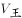
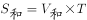
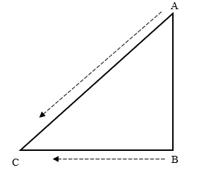

# 2024年山东省公务员录用考试《行测》试题（网友回忆版）

> 数量关系 · 10 题 · 山东 2024

## 第 1 题　qid 5908580 · 数学运算

山东手造精品众多，某展览会有叶雕、皮影、风筝、麦秸画、柳编、葫芦画、锡雕、鲁班枕8个展厅。因时间原因，一名参观者决定从8个展厅中随机选取3个进行参观。问叶雕和皮影展厅至少一个被选中的概率是多少？

- **A**. 

- **B**. 

- **C**. 

　✅
- **D**. 

**答案**：C

**官方解析**

方法一：从8个展厅中选取3个进行参观，有种情况。叶雕和皮影展厅至少一个被选中，包括两种情况：①叶雕或皮影展厅只选中1个，从其他6个展厅中选取2个，有种情况；②叶雕和皮影展厅都被选中，从其他6个展厅中选取1个，有种情况，共有30+6=36种情况。根据公式：概率，叶雕和皮影展厅至少一个被选中的概率为。

方法二：正面情况更多可以从反面考虑，叶雕和皮影展厅至少一个被选中的反面为叶雕和皮影两个展厅都没有被选中，从其他6个展厅中选取3个，有种情况，总情况数为种，所求概率为。

故正确答案为C。

---

## 第 2 题　qid 5908585 · 数学运算

某医院积极响应国家号召，组建医疗小分队赴西部地区开展对口支援工作。该医院现有6名男医生和3名女医生报名，现从9人中抽取一组男女医生都有的3人小分队。问有多少种不同的组队方式？

- **A**. 63　✅
- **B**. 70
- **C**. 73
- **D**. 60

**答案**：A

**官方解析**

由题意可知，该3人小分队中需要男女医生都有，则可能的情况有2种：①2男1女种情况；②2女1男种情况。分类用加法，则共有45+18=63种不同的组队方式。

故正确答案为A。

---

## 第 3 题　qid 5908590 · 数学运算

某科技创新项目有6人投资，共筹资110万元。投资额度有10万元、20万元和30万元三种。已知投资10万元的比投资20万元的多2人，问投资30万元的有多少人？

- **A**. 2　✅
- **B**. 3
- **C**. 4
- **D**. 5

**答案**：A

**官方解析**

设投资20万元的有x人，投资30万元的有y人，则投资10万元的有（x+2）人。根据题意，可列方程组为（x+2）+x+y=6······①；······②。解得x=1，y=2。则投资30万元的有2人。

故正确答案为A。

---

## 第 4 题　qid 5908589 · 数学运算

甲、乙、丙三个工程队共同承担一项市政工程。甲队独立完成需要30天，乙队效率比甲队高20%。丙队仅提供技术支持，即能够为其他队伍提高效率，其与甲队或乙队合作时效率可提高120%，三个队伍合作时效率可提高200%。甲、乙两队合作3天后，丙队加入，最后两天乙队休息。问该工程耗时约多少天？

- **A**. 7
- **B**. 8　✅
- **C**. 9
- **D**. 10

**答案**：B

**官方解析**

赋值甲队效率为5，则乙队效率为5×（1+20%）=6，工程总量为5×30=150。设甲、乙、丙三队合作了x天，可列方程：，解得：，取3天才可保证完成该工程，因此该工程耗时约3+3+2=8天。

故正确答案为B。

---

## 第 5 题　qid 5908591 · 数学运算

若干职员参加某次强国知识竞赛，每人的得分均不相同且为整数，分数排名相邻的2人分差均为5分。已知有3人成绩低于70分，且超过70分的职员平均分为82分。问所有职员中竞赛成绩超过70分的人数占比在下列哪个范围内？

- **A**. 低于50%
- **B**. 50%-60%之间
- **C**. 60%-70%之间　✅
- **D**. 高于70%

**答案**：C

**官方解析**

由题意可知，成绩构成公差为5的等差数列。设成绩超过70分的人数为n，若n为偶数时，平均分82分等于排名居中的两位职员得分平均数，公差为5时，这两位职员的得分均为小数，与“得分均为整数”矛盾。若n为奇数时，82分是数列的中间项，超过70分的得分分别为72、77、82、87、92，共5人。故所有职员中竞赛成绩超过70分的人数占比，在C项范围内。

故正确答案为C。

---

## 第 6 题　qid 5908601 · 数学运算

小王和小李同时从山脚A点出发匀速登山，小王距山顶还有路程时小李刚走完上山路程的，小王到达山顶后立即原路返回，10分钟后遇到上山途中的小李。已知两人下山的速度为各自上山速度的1.5倍，问小李比小王晚多少分钟到达山脚A点？

- **A**. 30
- **B**. 40
- **C**. 50　✅
- **D**. 60

**答案**：C

**官方解析**

设小王上山的速度为，小李上山的速度为。当时间相同时，速度比=路程比，则，赋值，，则小王下山的速度为8×1.5=12，小李下山的速度为6×1.5=9。设总路程为24S，当小王到达山顶时，小李距离山顶。根据相遇公式：，可知：6S=（6+12）×10，解得S=30，则总路程=24×30=720。则小王往返一次的时间为分钟；小李往返一次的时间为分钟。故小李比小王晚200-150=50分钟到达山脚A点。

故正确答案为C。

---

## 第 7 题　qid 5908602 · 数学运算

某市举办高校足球比赛，每所高校都要与其余所有参赛高校各进行一场比赛。积分规则为：胜一场积3分，平一场积1分，负一场积0分。已知此次比赛的冠军积分为14分，其中取胜场次比平局场次多2场，平局场次是告负场次的2倍。问参加这次足球比赛的高校有多少所？

- **A**. 7
- **B**. 8　✅
- **C**. 9
- **D**. 10

**答案**：B

**官方解析**

设此次比赛的冠军告负x场，则平局2x场，取胜（2x+2）场。根据“积分规则”及“此次比赛的冠军积分为14分”，可得（2x+2）×3+2x=14，解得x=1，即此次比赛的冠军告负1场、平局2场、取胜4场，共比赛1+2+4=7场。根据“每所高校都要与其余所有参赛高校各进行一场比赛”，可得参加这次足球比赛的高校有7+1=8所。
故正确答案为B。

---

## 第 8 题　qid 5908577 · 数学运算

某线上店铺将进货单价为8元的商品按每件10元出售，每天可销售100件。该店铺计划提高售价增加利润，若每件商品售价每提高1元，每天销售量就要减少10件，为保证每天至少获利350元，问该商品售价应为多少？

- **A**. 不到13元
- **B**. 13~15元之间　✅
- **C**. 15~17元之间
- **D**. 17元以上

**答案**：B

**官方解析**

方法一：选项范围各不相同，可分别选取各选项范围内的特定数字代入验证。代入A项：假设售价为12元，即售价提高12-10=2元，则每天获利为（12-8）×（100-10×2）=320元&lt;350元，排除；代入B项，假设售价为14元，即售价提高14-10=4元，则每天获利为（14-8）×（100-10×4）=360元&gt;350元，满足条件，B项当选，无需再验证C、D两项。

方法二：根据题意，每天获利最高时一定满足大于等于350元的情况，又因为选项范围各不相同，因此可验证每天获利最高时的售价。设该商品售价提高了x元，每天获利为y元。根据题意，可列方程：，即，令y=0，解得，，当时，y最大为（2+4）×（100-10×4）=360元&gt;350，满足条件，此时商品售价为10+4=14元，在B项范围内。

方法三：设该商品售价提高了x元，根据题意，可列方程：，化简可得，则当时满足题干要求，即该商品售价应在10+3=13元和10+5=15元之间。

故正确答案为B。

---

## 第 9 题　qid 5908584 · 数学运算

某单位给车加油，可以用两种方式：第一种不考虑油价的升降，每次加200元的油；第二种也不考虑油价的升降，每次加20升油。若该单位加油两次，采用第一种方式加油的平均价格为x元/升，第二种方式加油的平均价格为y元/升，下列选项正确的是：

- **A**. 
x&gt;y

- **B**. 

- **C**. 
x&lt;y

- **D**. 

　✅

**答案**：D

**官方解析**

方法一：根据题意，两次加油的油价可以相等也可以不相等，且没有给出具体的油价，因此可对两次的油价赋值。若两次加油价格不相等：赋值第一次加油的平均价格为10元/升，第二次加油的平均价格为5元/升。根据平均价格，若采用第一种方式加油，可知，若采用第二种方式加油，可知，则x&lt;y；若两次加油价格相等：赋值两次加油的平均价格均为10元/升。根据平均价格，若采用第一种方式加油，可知，若采用第二种方式加油，可知，则x=y；综上可知，。

方法二：设第一次加油的平均价格为a元/升，第二次加油的平均价格为b元/升。根据平均价格，若采用第一种方式加油，可知，若采用第二种方式加油，可知。则，由于，且2（a+b）&gt;0，可知，即。

故正确答案为D。

---

## 第 10 题　qid 5908592 · 数学运算

某巡逻艇在海域A点发现正南方30千米处的B点有一艘可疑船只正匀速向正西方行驶，巡逻艇以比该可疑船只快的速度沿某一方向直线追击，两船恰好在C点相遇。问B、C两点之间的距离约为多少千米？

- **A**. 26
- **B**. 28
- **C**. 30
- **D**. 34　✅

**答案**：D

**官方解析**

由题意可知，可疑船只和巡逻艇的行驶路线为下图所示，可疑船只在C点被追上。

根据时间相同，路程与速度成正比，可知，设AC=4x千米、BC=3x千米，根据勾股定理可列式：，即，解得，则，结合选项只有D项符合。

故正确答案为D。

---
