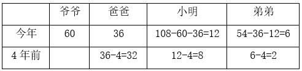
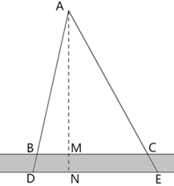
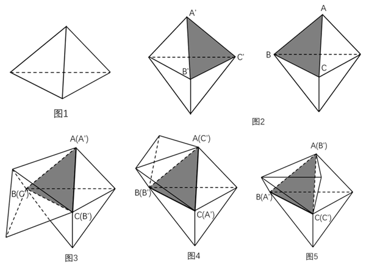

# 2024年山西省县级纪委监委公务员录用考试《行测》题（网友回忆版）

> 数量关系 · 10 题 · 山西 2024

## 第 1 题　qid 17097787 · 数学运算

小张骑车从A地前往1千米外的B地，出发后从静止状态开始均匀加速，到5米/秒后保持匀速骑行，全程用时3分35秒。则他在出发后的前10秒骑行了多少米？

- **A**. 不到9米　✅
- **B**. 9~11米之间
- **C**. 11~13米之间
- **D**. 13米以上

**答案**：A

**官方解析**

设均匀加速行驶的时间为秒，根据公式：匀加速运动平均速度，可得均匀加速行驶路段的平均速度为米/秒，根据全程为1千米（1000米），用时3分35秒（215秒），可列式：，解得。根据匀加速运动公式：，可得加速度米/秒，则出发10秒后速度达到米/秒，出发后前10秒的平均速度为米/秒，故小张在出发后的前10秒骑行了米米，在A项范围内。

故正确答案为A。

---

## 第 2 题　qid 17097791 · 数学运算

某手工艺人制作4件工艺品和12件底座共需24天，制作4件工艺品和6件展示柜需要24天。则他制作工艺品、底座和展示柜各10件共需多少天？

- **A**. 45
- **B**. 50
- **C**. 55
- **D**. 60　✅

**答案**：D

**官方解析**

设工艺品、底座、展示柜的单件制作时间分别为x、y、z天，根据题意可列式：4x+12y=24······①，4x+6z=24······②。
方法一：①+②×2可得：12x+12y+12z=72，化简可得：x+y+z=6。则所求=10x+10y+10z=10（x+y+z）=10×6=60天。
方法二：因为x、y、z是时间，不一定是整数，所以本题属于非限定性不定方程组，可以采用赋零法，赋值x=0，原方程组转化为：12y=24······③，6z=24······④，解得y=2，z=4。则所求=10x+10y+10z=10×0+10×2+10×4=60天。
故正确答案为D。

---

## 第 3 题　qid 17097786 · 数学运算

某装有酒精溶液的容器中，若再倒入浓度为5%的酒精溶液800克后，浓度会变为20%。实际操作时先倒入800克水，之后又倒入第三种酒精溶液400克，浓度也变为20%。则第三种酒精溶液的浓度是多少？

- **A**. 24%
- **B**. 30%　✅
- **C**. 36%
- **D**. 42%

**答案**：B

**官方解析**

方法一：设容器中原有酒精溶液x克，其中纯酒精为y克，第三种酒精溶液的浓度为z。根据公式：浓度，可列式：······①，······②，由①式可得：x=5y-600······③，将③式代入到②式中，解得：z=30%。

方法二：实际操作可看成倒入800+400=1200克的酒精溶液；若在原计划“倒入浓度为5%的酒精溶液800克”的基础上，继续倒入400克浓度为20%的酒精溶液，得到的酒精溶液浓度仍然保持在20%，此时倒入的酒精溶液总质量与实际操作倒入的酒精溶液总质量相同，均为1200克，其中纯酒精为800×5%+400×20%=120克。说明在实际操作中，也需要倒入120克纯酒精，则第三种酒精溶液的浓度是。

故正确答案为B。

---

## 第 4 题　qid 17097793 · 数学运算

某公司3个部门共有180名员工，现从中选出若干人参加运动会。如选派生产部的、销售部的和后勤部的参加，则没有参加运动会的有130人；如选派生产部的、销售部的和后勤部的参加，则没有参加运动会的有129人。则销售部有多少人？

- **A**. 36
- **B**. 48　✅
- **C**. 60
- **D**. 72

**答案**：B

**官方解析**

设生产部有12x名员工，销售部有12y名员工，后勤部有12z名员工，根据“3个部门共有180名员工”，可列方程：12x+12y+12z=180，化简得x+y+z=15······①；根据“选派生产部的、销售部的和后勤部的参加，则没有参加运动会的有130人”，可列方程：，化简得3x+3y+4z=50······②；根据“选派生产部的、销售部的和后勤部的参加，则没有参加运动会的有129人”，可列方程：，化简得4x+3y+3z=51······③。②-①×3，解得z=5；③-①×3，解得x=6；将z=5、x=6代入①，解得y=4，则销售部有12y=48人。

故正确答案为B。

---

## 第 5 题　qid 17097789 · 数学运算

今年爷爷、爸爸和小明的年龄之和为108岁，且三者年龄成等差数列；而今年爸爸、小明和弟弟的年龄之和为54岁，且4年前爸爸、小明和弟弟的年龄成等比数列。则爷爷今年多少岁？

- **A**. 60　✅
- **B**. 62
- **C**. 66
- **D**. 68

**答案**：A

**官方解析**

方法一：根据等差数列求和公式：，则108=今年爸爸的年龄×3，故今年爸爸的年龄岁。设今年爷爷、爸爸和小明的年龄所成等差数列的公差为d，可列表如下：

根据“4年前爸爸、小明和弟弟的年龄成等比数列”，可列方程：，解得，（不满足条件，排除），故爷爷今年36+24=60岁。

方法二：根据等差数列求和公式：，则108=今年爸爸的年龄×3，故今年爸爸的年龄岁。年龄问题，考虑用代入排除法解题。代入选项可列表如下：

A项：

由于，则满足条件“4年前爸爸、小明和弟弟的年龄成等比数列”，故满足题干所有条件，当选。

故正确答案为A。

---

## 第 6 题　qid 17097808 · 数学运算

某电商平台包邮销售整箱装的苹果，一次购买不少于3箱可在定价基础上打九折、一次购买不少于5箱可在九折基础上再打九折。张某分3次购买这种苹果2箱、3箱和5箱，共花费770元。若他一次性购买可比分3次购买节省多少元？

- **A**. 57.2　✅
- **B**. 67.5
- **C**. 72.9
- **D**. 81.0

**答案**：A

**官方解析**

设每箱苹果的定价为x元，根据题干“分3次购买这种苹果2箱、3箱和5箱，共花费770元”，可列式：，解得x=88。若是一次性购买2+3+5=10箱苹果，，则需花费10×88×0.9×0.9=712.8元，可比分3次购买节省770-712.8=57.2元。

故正确答案为A。

---

## 第 7 题　qid 17097795 · 数学运算

一条由东向西且宽为1.5米的水渠如下图中灰色部分所示，其中B、C为水渠北岸边相距50米的2个点。AB和AC连线的延长线分别与水渠南岸相交于D、E两点，且DE的距离为50.4米。则A点到水渠南岸的最短距离为多少米？

- **A**. 186
- **B**. 187
- **C**. 188
- **D**. 189　✅

**答案**：D

**官方解析**

如图所示，过A点向水渠南岸作垂线，交南岸于N点，线段AN即为A点到水渠南岸的最短距离。根据题意可知，，根据三角形相似性质可得，，即，解得AM=187.5米，则所求AN=187.5+1.5=189米。

故正确答案为D。

---

## 第 8 题　qid 17097799 · 数学运算

在一块边长为20米的正方形土地中随机选择1个点，则选中的点与这块土地4个顶点的距离均大于10米的概率在以下哪个范围内？

- **A**. 不到0.2
- **B**. 0.2~0.25之间　✅
- **C**. 0.25~0.3之间
- **D**. 超过0.3

**答案**：B

**官方解析**

如图所示，在正方形ABCD中，分别以4个顶点为圆心，以10米为半径画圆，与正方形相交的阴影部分即为距离4个顶点不都大于10米的区域，空白部分为距离4个顶点均大于10米的区域。根据正方形面积公式：（a为正方形的边长），可得正方形土地的面积为平方米。根据题意，阴影部分可组成1个半径为10米的圆，根据圆的面积公式：，可得阴影部分的面积为平方米，则空白部分的面积为（）平方米。所求概率，在B项范围内。

故正确答案为B。

---

## 第 9 题　qid 17097796 · 数学运算

B地在A地正北方向3千米处，C地在A地正西方向4千米处。直线甲连接B、C两地，从A地出发的直线乙正好经过直线甲的中点。张某从C地出发，直线行走了2.6千米后正好到直线乙上的某一点。则他到达的位置与直线甲、乙交点的最短距离为多少千米？

- **A**. 0.3　✅
- **B**. 0.4
- **C**. 0.5
- **D**. 0.6

**答案**：A

**官方解析**

如图所示，AB=3千米，AC=4千米，根据勾股定理可得，千米。根据题意，直线乙上E、F两点距离C地2.6千米，显然DE＜DF（D、E两点位于EF中点的同一侧），则DE为题目所求的最短距离。由D、E两点分别向AC作垂线交于G、H两点，因D点为BC的中点，则DG为的中位线，千米，千米，AD为直角三角形ABC斜边上的中线，长度为斜边的一半，即2.5千米。设DE为x千米，则AE=2.5-x千米，在和中，，，，则与相似，可得，即，则千米，千米，CH=AC-AH=4-（2-0.8x）=2+0.8x千米。在中，根据勾股定理可得，，即，正向求解较复杂，依次代入选项进行验证，代入A项，x=0.3，则千米，符合题意。

故正确答案为A。

---

## 第 10 题　qid 17097801 · 数学运算

将两个同样大小的正四面体零件焊接为一个六面体，再将两个这种六面体零件焊接为十面体。则最多可以得到几种不同的十面体？

- **A**. 2
- **B**. 3　✅
- **C**. 4
- **D**. 5

**答案**：B

**官方解析**

正四面体（如图1所示）每个面均相同，将两个同样大小的正四面体任选一个面作为焊接面，焊接为六面体只有一种情况。此六面体的每个面均相同，将六面体任选一个面，顶点依次标记为A、B、C。同理，另一个六面体任选一个面，顶点依次标记为、、（如图2所示）。将这两面作为焊接面进行焊接，可考虑A点与点对应，如图3所示；也可考虑A点与点对应，如图4所示；也可考虑A点与点对应，如图5所示。所以最多可以得到3种不同的十面体。

故正确答案为B。

---
