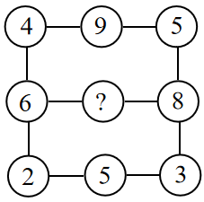
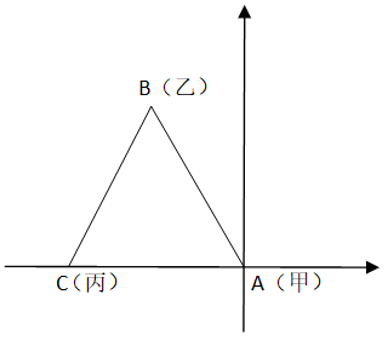

# 2024年广东省公务员录用考试《行测》题（网友回忆版）

> 数量关系 · 14 题 · 广东 2024

## 第 1 题　qid 16593265 · 数学运算

- **A**. 13
- **B**. 14　✅
- **C**. 15
- **D**. 16

**答案**：B

**官方解析**

题干出现图形，判定为图形数阵。观察图形发现，第一行4+5=9，第三行2+3=5，即规律为每行第一个数字+第三个数字=第二个数字。则第二行6+8=？，故？=14。
故正确答案为B。

---

## 第 2 题　qid 16593248 · 数学运算

，，，，（    ），

- **A**. 

- **B**. 

- **C**. 

　✅
- **D**. 

**答案**：C

**官方解析**

数列均为分数，考虑分数数列。原数列可转化为：，，，，（    ），。分子部分：，1，3，9，（    ），81，可转化为：，，，，（    ），，即分子部分是底数为3、指数为连续自然数的幂次数列，则所求项的分子为；分母部分：，，10，40，（    ），640，是公比为4的等比数列，则所求项的分母为40×4=160，故所求项。

故正确答案为C。

---

## 第 3 题　qid 16593279 · 数学运算

21.98，18.77，17.49，14.55，（    ）

- **A**. 12.26　✅
- **B**. 13.66
- **C**. 14.26
- **D**. 15.66

**答案**：A

**官方解析**

数列各项均为小数，优先考虑机械划分。观察发现，21-（9+8）=4，18-（7+7）=4，17-（4+9）=4，14-（5+5）=4，即整数部分-小数部分各位数字之和=4。代入选项，只有A项12-（2+6）=4满足。
故正确答案为A。

---

## 第 4 题　qid 16593275 · 数学运算

5，-7，16，-50，202，（    ）

- **A**. 1012
- **B**. -1012　✅
- **C**. 1122
- **D**. -1122

**答案**：B

**官方解析**

数列无明显特征，作差作和均无规律，考虑递推数列。数列符号正负交替，所求项应为负数，排除A、C两项。数列取绝对值得到新数列：5，7，16，50，202，（    ），观察发现：5×1+2=7，7×2+2=16，16×3+2=50，50×4+2=202，规律为：前一项×n+2=后一项，n为1，2，3，4······是首项为1、公差为1的等差数列，故下一项为5，则新数列下一项为202×5+2=1012，故所求项为-1012。
故正确答案为B。

---

## 第 5 题　qid 16593261 · 数学运算

档案室需要整理300份档案，要求每天整理的档案数量相同，且规定了完成的期限。如果要提前一天完成，那么每天需要多整理10份档案。则规定的期限为（    ）天。

- **A**. 6　✅
- **B**. 7
- **C**. 8
- **D**. 9

**答案**：A

**官方解析**

方法一：代入A项，若规定的期限为6天，则原计划每天整理份档案，提前一天需每天整理份档案，较原计划每天多整理10份档案，符合全部条件，无需验证其它选项。

方法二：设规定的期限为x天，根据题意可得，化简得x（x-1）=30，解得x=6。

故正确答案为A。

---

## 第 6 题　qid 16593268 · 数学运算

某家政公司承诺以低于市场价20％的价格为小区业主提供服务。如果有业主向该公司支付了服务费4000元，则与市场价相比优惠了（    ）元。

- **A**. 400
- **B**. 600
- **C**. 800
- **D**. 1000　✅

**答案**：D

**官方解析**

设市场价为x元，根据题意可列式：（1-20%）x=4000，解得x=5000。故实际支付比市场价优惠5000-4000=1000元。
故正确答案为D。

---

## 第 7 题　qid 16593258 · 数学运算

甲、乙、丙三艘船在海上航行。某一时刻，甲观测到乙位于它的北偏西方向，甲、乙相距6千米；甲观测到丙位于它的正西方向，甲、丙相距6千米，则乙与丙之间的距离为（    ）千米。

- **A**. 3
- **B**. 4
- **C**. 5
- **D**. 6　✅

**答案**：D

**官方解析**

甲、乙、丙位置如图所示，根据题意可知，，又因AB=AC=6千米，则为等边三角形，故乙与丙之间的距离BC也为6千米。

故正确答案为D。

---

## 第 8 题　qid 16593271 · 数学运算

某企业在展销会上销售甲、乙两种产品。已知甲产品的库存比乙产品多100件，展销会结束后，甲产品全部售完，乙产品售出库存的60%，两种产品共售出1260件，则甲、乙两种产品原有总库存（    ）件。

- **A**. 1450
- **B**. 1500
- **C**. 1550　✅
- **D**. 1600

**答案**：C

**官方解析**

设乙产品库存为x件，则甲产品库存为（100+x）件。根据题意可得，100+x+60%x=1260，解得x=725，故甲、乙两种产品的库存分别为825件、725件，原有总库存为825+725=1550件。
故正确答案为C。

---

## 第 9 题　qid 16593240 · 数学运算

只有在星期六，小王才会去图书馆。如果某年3月小王一共有5天去过图书馆，则当年4月1日可能是（    ）。

- **A**. 星期二　✅
- **B**. 星期三
- **C**. 星期五
- **D**. 星期六

**答案**：A

**官方解析**

每连续7天会出现1次星期六，则连续28天会出现4次星期六，3月共31天，根据“小王一共有5天去过图书馆”，则3月剩下的3天还会出现1次星期六。若3月29日为星期六，4月1日为星期二；若3月30日为星期六，4月1日为星期一；若3月31日为星期六，4月1日为星期日。只有A项符合。
故正确答案为A。

---

## 第 10 题　qid 16593242 · 数学运算

某高校中文系计划从3名男生和3名女生中选派4名学生参加暑期支教活动。如果选派的女生不少于2名，则选派方案共有（    ）种。

- **A**. 4
- **B**. 8
- **C**. 12　✅
- **D**. 16

**答案**：C

**官方解析**

要求选派的4名学生中女生不少于2名，则女生有2名或3名，对应的男生分别为2名和1名，共有种选派方案。

故正确答案为C。

---

## 第 11 题　qid 16593247 · 数学运算

甲、乙、丙3人参加专业测试，考试包含10道题，答对每题得10分，不答或答错不得分。已知每道题3人中至少有2人答对，没有人得100分且任意2人总分都不相同。则最多有（    ）道题3人都答对。

- **A**. 3
- **B**. 4　✅
- **C**. 5
- **D**. 6

**答案**：B

**官方解析**

根据题意可知，要求3人都答对的题目数多，则3人都尽量多答对题目，根据“没有人得100分”，则3人中最高得分为90分即答对9题。由于任意2人总分都不相同，且使其答对题量最多，则3人分别答对9题、8题、7题，出错题量分别为1题、2题、3题，共6题出错。由于每道题3人中至少有2人答对，即每道题只有1人出错或无人出错，共出错6题无交叉，则最多有4道题3人都答对。
故正确答案为B。

---

## 第 12 题　qid 16593285 · 数学运算

某个障碍跑项目需要在100米长的跑道上布置障碍（起点和终点均不布置）。如果从起点开始，每隔4米布置一个甲障碍，每隔6米布置一个乙障碍，甲、乙障碍的重合点则不布置甲障碍。则跑道上总共布置（    ）个甲障碍。

- **A**. 16　✅
- **B**. 17
- **C**. 24
- **D**. 25

**答案**：A

**官方解析**

布置甲障碍，由于起点和终点均不布置，甲障碍布置数量个。

乙障碍每隔6米布置一个，甲、乙障碍重合点每12米一个（4和6的最小公倍数）。 ，由于存在余数每段的右侧均可以布置障碍，甲、乙重合障碍取8个。

跑道上甲障碍布置数量=甲障碍布置数量-甲、乙障碍布置重合点数量=24-8=16个。

故正确答案为A。

---

## 第 13 题　qid 16593262 · 数学运算

小李从山脚开始登顶，匀速走了1小时后到达一个凉亭，并在凉亭休息了半小时。继续走500米后，恰好完成登顶路程的一半。从山顶沿原路匀速返回时，他走了1小时又到了这个凉亭，继续走半小时回到了山脚。则登顶路程为（    ）米。

- **A**. 2000
- **B**. 3000　✅
- **C**. 3600
- **D**. 4000

**答案**：B

**官方解析**

根据题意，从山脚到凉亭上山需要1个小时，从凉亭到山脚下山需要半小时，上、下山需要的时间之比为1：0.5=2：1，而路程一定，速度与时间成反比，可得上、下山的速度之比为1：2。设上山的速度为v，则下山的速度为2v。可列式为：（v+500）×2=2v×1.5，解得v=1000米/小时，则登顶的路程为2×1000×1.5=3000米。
故正确答案为B。

---

## 第 14 题　qid 16593264 · 数学运算

某社区计划组织志愿者为社区内的独居老人提供服务。按已有志愿者的数量，如果每位志愿者服务10位老人，则有5位老人无人提供服务；如果增加2位志愿者，则每位志愿者最多服务8位老人就能为所有老人提供服务。那么该社区最多有（    ）位独居老人。

- **A**. 50
- **B**. 55　✅
- **C**. 60
- **D**. 65

**答案**：B

**官方解析**

本题为余数问题，优先用代入排除法。题干所求为最多多少人，故从最大项依次代入。
D项：当独居老人为65人时，志愿者人数为（65-5）÷10=6人，按照题意增加2人后变为6+2=8人，8×8=64＜65，服务人员数＜独居老人数，排除；
C项：当独居老人为60人时，志愿者人数为（60-5）÷10=5.5人，求得人数为非整数，排除；
B项：当独居老人为55人时，志愿者人数为（55-5）÷10=5人，按照题意增加2人后变为5+2=7人，7×8=56＞55，满足题干所有条件，当选。
故正确答案为B。

---
