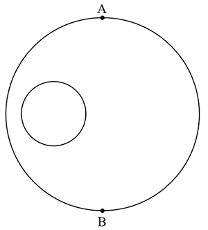
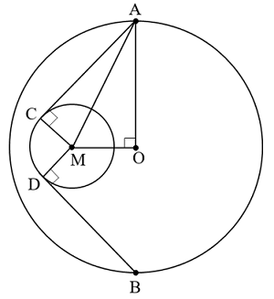

# 2024年广西区考公务员录用考试《行测》题（网友回忆版）

> 数量关系 · 10 题 · 广西 2024

## 第 1 题　qid 10204486 · 数学运算

甲、乙两工厂共同完成某个生产订单需要12天。现两工厂共同生产8天后，再由乙单独生产7天，一共完成了订单总量的90%。若整个订单由乙单独生产，那么需要多少天完成？

- **A**. 20
- **B**. 23
- **C**. 26
- **D**. 30　✅

**答案**：D

**官方解析**

根据题意，甲、乙两工厂的工作效率满足：8（甲+乙）+7乙=12（甲+乙）×90%，整理可得甲、乙两工厂的工作效率之比为3：2。赋值甲的工作效率为3，乙的工作效率为2，则该订单的工作总量为12×（3+2）=60，故所求为天。

故正确答案为D。

---

## 第 2 题　qid 16593096 · 数学运算

运动会招募志愿者，第一次招募了不到100人，其中男女比例为11：7；补招若干女性志愿者后，男女比例变为4：3。问最多可能补招了多少名女性志愿者？

- **A**. 3
- **B**. 5　✅
- **C**. 6
- **D**. 10

**答案**：B

**官方解析**

根据“男女比例为11：7”“补招若干女性志愿者后，男女比例变为4：3”可知，男生人数既是11的倍数，又是4的倍数，男生人数为44n。结合“第一次招募了不到100人”可知，男生人数是44人，原来女生人数为44÷11×7=28人；补招后女生人数变为44÷4×3=33人。可知女生最多可能补招人数为33-28=5人。
故正确答案为B。

---

## 第 3 题　qid 16593107 · 数学运算

从甲地到乙地的全价机票为2000元，购买全价或折扣机票，每张都要支付120元税费，从甲地到乙地的高铁票价为680元，企业要安排20人当日从甲地前往乙地出差，单程总预算不超过2万元，已知当日高铁票、机票都充足，2折、3折和5折机票分别还剩余2张、3张和5张，其余为全价机票，问在预算范围内最多能安排多少人乘飞机前往乙地？

- **A**. 11
- **B**. 12
- **C**. 13　✅
- **D**. 14

**答案**：C

**官方解析**

题干要求预算范围内安排乘飞机前往乙地的人数最多，结合选项可知乘飞机的人数大于折扣机票的剩余张数2+3+5=10张，则题干中的折扣机票应全部购买，购买折扣机票的费用为2000×0.2×2+2000×0.3×3+2000×0.5×5+120×10=8800元；设购买全价机票的人数为n人，根据题意可列方程：，解得，则n=3人。故在预算范围内最多能安排乘飞机前往乙地的人数为10+3=13人。

故正确答案为C。

---

## 第 4 题　qid 16593102 · 数学运算

某校园围墙外的道路形成一个边长为300米的正方形（如图所示），甲、乙两人分别从正方形的两个对角沿逆时针方向同时出发，甲、乙的步行速度比为9：7。问甲、乙两人第一次处于同一条边是在哪一条边上？

- **A**. AB
- **B**. BC
- **C**. CD
- **D**. DA　✅

**答案**：D

**官方解析**

根据题意，设甲的速度为9v，则乙的速度为7v。甲、乙初始路程差为CD+DA=300+300=600米，若甲、乙两人第一次处于同一条边，即两人路程差米。根据追及公式：，当甲与乙相差300米时，可列式：300=（9v-7v）×t，解得vt=150，则此时甲所走路程=9v×t=1350米（走完一圈300×4=1200米多150米），甲在CD中点；此时乙所走路程=7v×t=1050米（还差150米走完一圈），乙在DA中点。因，故当甲到达D点时，乙未到达A点，此时甲、乙两人均在DA边，且为第一次处于同一条边。

故正确答案为D。

---

## 第 5 题　qid 16593098 · 数学运算

c地为a、b两地直线道路上的一点，甲、乙两人9：00分别自a、b两地同时出发匀速相向而行，甲的速度是乙的1.5倍，甲9：40到达c地休息10分钟后继续向b地前进；乙全程不休息，在10：40到达c地，问甲、乙相遇的时间为：

- **A**. 10：00
- **B**. 10：10　✅
- **C**. 10：20
- **D**. 10：30

**答案**：B

**官方解析**

方法一：赋值甲每分钟的速度为3，乙每分钟的速度为2。根据甲9：40到达c地，则；乙全程不休息，在10：40到达c地，则，因此ab的路程。设甲、乙两人从9：00开始出发t分钟后相遇，则，解得t=70，因此甲、乙相遇的时间为9：00+70分钟=10：10。

方法二：赋值甲每分钟的速度为3，乙每分钟的速度为2。根据乙9：00出发，在10：40到达c地，可得乙从b地到c地的路程为2×100=200。当甲9：50离开c地继续向b地前进时，乙已走的路程为2×50=100，此时甲、乙继续相向而行所需的相遇时间分钟，则甲、乙相遇时间为9：50+20分钟=10：10。

故正确答案为B。

---

## 第 6 题　qid 10204488 · 数学运算

某餐饮店接到一份粽子订单，张师傅与李师傅同时工作8小时可完成。现张师傅先独自包粽子3小时，李师傅接着独自包了1小时，还剩订单总数的没完成。已知张师傅每小时比李师傅多包14个粽子。问这份订单粽子的总数是多少个？

- **A**. 224　✅
- **B**. 296
- **C**. 320
- **D**. 416

**答案**：A

**官方解析**

根据题意可得，张师傅和李师傅的效率关系为：3×张+1×李=8×（张+李）×（），整理可得，张：李=3：1，设张师傅的效率为每小时3x个，李师傅的效率为每小时x个。根据“张师傅包粽子比李师傅每小时多14个”可得，3x-x=14，解得x=7，则一共有8×（3×7+1×7）=8×28=224个粽子。

故正确答案为A。

---

## 第 7 题　qid 16593103 · 数学运算

安排A、B、C、D共4个研发团队参与甲、乙、丙3个课题的研究，要求每个课题至少有1个团队参与，每个团队必须且只能参与1个课题，如甲课题参与的团队数超过1个，则A、B都不参与甲课题，问共有多少种不同的安排方式？

- **A**. 24
- **B**. 26　✅
- **C**. 36
- **D**. 42

**答案**：B

**官方解析**

根据题意可知，甲课题参与的团队数可能为1个或2个，分情况讨论如下：

（1）甲课题参与的团队数为1个，先从4个研发团队中任意选择1个有种情况，再让剩下3个团队参与乙、丙2个课题有种情况，分步用乘法，共有4×6=24种情况。

（2）甲课题参与的团队数为2个，则只能C、D参与甲课题，剩下A、B2个团队参与乙、丙2个课题有种情况。

分类用加法，则共有24+2=26种安排方式。

故正确答案为B。

---

## 第 8 题　qid 16593095 · 数学运算

企业将12个技术培训名额分配给甲、乙、丙三个研发团队。要求乙团队分配的培训名额比甲团队少，但比丙团队多，且每个团队至少分配1个名额。问有多少种不同的分配方式？

- **A**. 6
- **B**. 7　✅
- **C**. 36
- **D**. 42

**答案**：B

**官方解析**

根据题干条件，各团队分配的培训名额甲&gt;乙&gt;丙，采用枚举法，情况如下：

由上表可知，共有7种不同的分配方式。

故正确答案为B。

---

## 第 9 题　qid 10204499 · 数学运算

一个半径300米的圆形湖泊中有一个半径100米的圆形人工岛，该人工岛的中心在湖泊中心的正西方150米处。甲从湖正北的A点开船出发，绕行人工岛西侧到达正南的B点。如果保持最短路线行驶，那么行驶多少米后甲到达人工岛的岸边？

- **A**. 

- **B**. 
300

- **C**. 

　✅
- **D**. 

**答案**：C

**官方解析**

如下图所示，要保持最短路线行驶，甲开船行驶的路线为线段AC-弧线CD-线段DB，其中线段AC、DB与圆形人工岛相切。则甲从A点开船出发至到达人工岛岸边的路线为线段AC，根据勾股定理可知，，且，则，即。

故正确答案为C。

---

## 第 10 题　qid 16593104 · 数学运算

一个白色圆柱体零件的底面半径是高的1.5倍，现将其表面涂上黑漆之后，沿下图所示虚线方向切割为4个完全相同的部分。问单个部分的黑色面积是白色面积的多少倍？（）

- **A**. 不到1.1倍
- **B**. 1.1-1.2倍之间　✅
- **C**. 1.2-1.3倍之间
- **D**. 1.3倍以上

**答案**：B

**官方解析**

根据题意，赋值该圆柱零件高为2，则底面半径为3，；切割后单个部分如图所示，其黑色面积，其白色面积，则所求倍数为倍，在B项范围内。

故正确答案为B。

---
