# 2024年度浙江省党政机关选调应届优秀大学毕业生《行测》题（网友回忆版）

> 数量关系 · 15 题 · 浙江 2024

## 第 1 题　qid 18385378 · 数学运算

某单位组织100多名员工在周一、周三、周五晚上参加夜跑。每人至少参加1次，跑1次的人数是跑2次及以上的2.5倍，跑2次的人数是跑3次的10倍。那么该单位仅参加1次夜跑的有多少人？

- **A**. 80
- **B**. 105
- **C**. 110　✅
- **D**. 154

**答案**：C

**官方解析**

设跑3次的有x人，则跑2次的有10x人，跑1次的有人。

方法一：根据题意，该单位参加夜跑的人数=跑1次的人数+跑2次的人数+跑3次的人数，则共有27.5x+10x+x=38.5x人，结合题干条件该单位有100多名员工参加夜跑，即100&lt;38.5x&lt;200，且38.5x为整数，则x=4，故该单位仅参加1次夜跑的有27.5×4=110人。

方法二：该单位仅参加1次夜跑的有27.5x人，即人，那么所求人数一定为55的整数倍，观察选项，只有C项符合。

故正确答案为C。

---

## 第 2 题　qid 18385374 · 数学运算

甲地在乙地正南15千米处，在丙地正东10千米处。小张和小王分别从乙、丙两地同时出发，分别向正西和正南方向匀速行进。已知小张的速度为5千米/小时且30分钟后两人的直线距离为19.5千米。那么小张到达小王的正北方时，两人的直线距离为多少千米？

- **A**. 21
- **B**. 22
- **C**. 25
- **D**. 27　✅

**答案**：D

**官方解析**

如图所示，A、B、C三点分别表示甲地、乙地、丙地，根据题意可知，AB=15千米，AC=10千米。小张和小王分别从B点、C点同时出发，30分钟后分别到达D点、E点，两人的直线距离即DE=19.5千米，则BD千米。在直角三角形DEF中，EF=AC-BD=10-2.5=7.5千米，DF=AB+CE=（15+CE）千米，根据勾股定理可得：，则CE=3千米，即小王30分钟行进3千米，那么速度为千米/小时。小张从出发直至到达小王的正北方，即图中G点，共用时小时，此时小王到达图中H点，行进距离为CH=2×6=12千米，故两人的直线距离为GH=AB+CH=15+12=27千米。

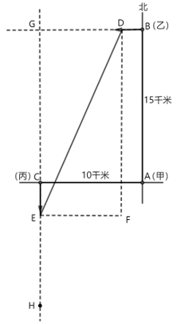

故正确答案为D。

---

## 第 3 题　qid 18385391 · 数学运算

有600克盐、1架天平、1个60克和1个10克的砝码，最少用天平称多少次可以将这些盐平均分为3份？

- **A**. 2
- **B**. 3　✅
- **C**. 4
- **D**. 5

**答案**：B

**官方解析**

第1次称重，在天平一侧放60克砝码，然后将600克盐分成2份放入天平两侧并使天平平衡，此时2份盐分别为270克和330克。第2次称重，天平一侧放60克和10克砝码，称出270克盐中的70克，此时270克盐还剩200克。第3次称重，将200克盐放在天平一侧，称出330克盐中的200克，将剩余的130克盐与第2次称出的70克盐组成200克，则最少用天平称3次可以将这些盐平均分为3份。
故正确答案为B。

---

## 第 4 题　qid 18385394 · 数学运算

某工厂有2个车间，A车间有2名师傅7名学徒，学徒的生产效率是师傅的60%；B车间有3名师傅9名学徒，学徒的生产效率是师傅的70%。两个车间每天各能完成372件产品。某天工厂组织所有师傅集中培训半天，那么这天两个车间的总产量比平时下降的比例在以下哪个区间？

- **A**. 不到20%　✅
- **B**. 20%~25%
- **C**. 25%~30%
- **D**. 超过30%

**答案**：A

**官方解析**

设A车间师傅每天的生产效率为10x件，则学徒每天的生产效率为10x×60%=6x件；B车间师傅每天的生产效率为10y件，则学徒每天的生产效率为10y×70%=7y件。

方法一：根据题意可列等式：2×10x+7×6x=372，解得x=6；3×10y+9×7y=372，解得y=4。工厂组织所有师傅集中培训半天，则这天两个车间的总产量下降了件，比平时下降的比例为，在A项区间内。

方法二：工厂组织所有师傅集中培训半天，A车间的产量下降了件，比平时下降的比例为；B车间的产量下降了件，比平时下降的比例为。两车间产量下降的比例相同，则培训这天两个车间的总产量比平时下降的比例也为，在A项区间内。

故正确答案为A。

---

## 第 5 题　qid 18385404 · 数学运算

下图中共有25个方格，把3粒相同的棋子放在方格里，要求每行每列最多出现1粒棋子，共有多少种不同的放法?

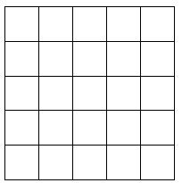

- **A**. 100
- **B**. 300
- **C**. 600　✅
- **D**. 36

**答案**：C

**官方解析**

根据题意先放第一粒棋子，25个方格可随意放置，有种放法；放置第二粒棋子时，排除第一粒棋子所在的一行一列共9个位置，则剩余25-9=16个位置可随意放置，有种放法；同理，放置第三粒棋子时，排除前两粒棋子所在的两行两列共16个位置，则剩余25-16=9个位置可随意放置，有种放法。因为3粒棋子相同，故不考虑放入的先后顺序，总共有种不同的放法。

故正确答案为C。

---

## 第 6 题　qid 18385393 · 数学运算

某党史知识竞赛预赛有10题，甲能答对其中8题，乙能答对其中6题。预赛从10道题中任意抽3题，答对2题或以上可进入下一轮，那么甲、乙都晋级的概率是：

- **A**. 

　✅
- **B**. 

- **C**. 

- **D**. 

**答案**：A

**官方解析**

根据公式：概率。从10道题中任意抽3题，总的情况数有种。要求答对2题或以上可进入下一轮，则答对2题和答对3题均可进入下一轮。甲答对2题的情况数有种，答对3题的情况数有种，则甲晋级的概率为；乙答对2题的情况数有种，答对3题的情况数有种，则乙晋级的概率为。分步用乘法，甲、乙都晋级的概率为。

故正确答案为A。

---

## 第 7 题　qid 18385398 · 数学运算

观察下面数列的规律，8/88是这列数中的第几个？
1/1；2/1，1/2；3/1，2/2，1/3；4/1，3/2，2/3，1/4；···

- **A**. 3909
- **B**. 4553　✅
- **C**. 4568
- **D**. 4659

**答案**：B

**官方解析**

根据题意可知，第1组有1个数，内部加和为2；第2组有2个数，每个数内部加和均为3；第3组有3个数，每个数内部加和均为4；第4组有4个数，每个数内部加和均为5······即规律为第n组有n个数，每个数内部加和为n+1。8/88加和为8+88=96，属于第96-1=95组，该组有95个数。每组中数的个数构成公差为1的等差数列。

方法一：根据等差数列求和公式：，则前94组共有个数。每组数中，第m个数的右半部分为m，则8/88是所在组中第88个数，则8/88是这列数中第4465+88=4553个数。

方法二：前94组共有4465个数，前95组共有4465+95=4560个数，8/88在第95组数中，则8/88一定在第4466~4560个数之间，结合选项，只有B项满足。

故正确答案为B。

---

## 第 8 题　qid 18385385 · 数学运算

幼儿园给小朋友送贴纸，包括动物类贴纸3种、卡通人物类贴纸4种、水果类贴纸4种，每种贴纸各不相同。已知每位小朋友每类贴纸各选择2种，那么这个幼儿园至少有多少个小朋友，才能保证有3个小朋友的贴纸完全相同？

- **A**. 109
- **B**. 110
- **C**. 216
- **D**. 217　✅

**答案**：D

**官方解析**

根据题意可知，每个小朋友选择动物类贴纸的情况数有种，选择卡通人物类贴纸的情况数有种，选择水果类贴纸的情况数有种。分步用乘法，每个小朋友选择贴纸的情况数共有3×6×6=108种。

要想保证有3个小朋友的贴纸完全相同，且人数尽量少，最不利情况为上述计算的每种情况均有2个小朋友选择，在此基础上再加1个小朋友，即可保证至少有3个小朋友的贴纸完全相同。故该幼儿园至少有108×2+1=217个小朋友。

故正确答案为D。

---

## 第 9 题　qid 18385403 · 数学运算

甲、乙两人完成同一项实验，甲需要11-14小时（实验完成时间为均匀分布，下同），乙需要13-15小时。那么乙比甲更快完成实验的概率是多少？

- **A**. 

- **B**. 

- **C**. 

- **D**. 

　✅

**答案**：D

**官方解析**

设甲完成实验需要的时间为x，乙完成实验需要的时间为y，则只有当x＞y时，乙比甲更快完成实验。即x＞y、、重叠的区域（如下图所示），只有在阴影部分区域乙才能比甲更快完成实验，本题所求概率即为阴影部分面积占整个长方形ABCD面积的比例。假设每小时对应的长度为1，则长方形ABCD的面积为3×2=6，阴影部分为一个等腰直角三角形，面积为，阴影部分面积占总面积的，即乙比甲更快完成实验的概率是。

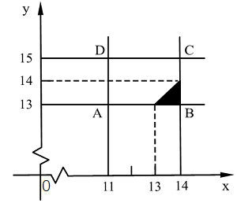

故正确答案为D。

---

## 第 10 题　qid 18385390 · 数学运算

一项考试每人需参加8次测验，最终成绩为去掉最高分与最低分后剩余成绩的平均值。小张参加这项考试，每次测验分数各不相同且均为大于70、小于90的整数。已知前3次的平均分比前5次的高2分，后3次的平均分比后5次的低2分，第4次和第5次平均分为80分，第2次和第7次成绩被去掉。那么第2次和第7次的成绩最少差多少分？

- **A**. 10
- **B**. 11
- **C**. 12　✅
- **D**. 18

**答案**：C

**官方解析**

设小张前3次测验的平均分为x分，根据“前3次的平均分比前5次的高2分”，可列方程：，解得x=85。设小张后3次测验的平均分为y分，根据“后3次的平均分比后5次的低2分”，可列方程：，解得y=75。因前3次平均分&gt;第4、5次平均分&gt;后3次平均分，且“第2次和第7次成绩被去掉”，可推测第2次成绩最高、第7次成绩最低。要想第2次和第7次成绩相差最少，则第2次成绩应尽可能低、第7次成绩尽可能高。前3次平均分为85，则第2次成绩最低为86，其余为85、84；后3次平均分为75，则第7次成绩最高为74，其余为75、76。第2次和第7次的成绩差=86-74=12。

备注：此时，第4、5次成绩可为81、79；82、78；83、77，均满足题干要求。

故正确答案为C。

---

## 第 11 题　qid 18385425 · 数学运算

某公司在甲、乙、丙3个仓库间调运大米。如果将甲仓库的大米运至乙仓库，则乙仓库的大米变为丙仓库的1.5倍；如果将乙仓库的大米运至丙仓库，则丙仓库的大米比甲仓库的多70吨；如果将丙仓库的大米运至甲仓库，则甲仓库的大米比乙仓库的少20吨。那么调运前，大米最多的仓库比最少的仓库多多少吨?

- **A**. 60
- **B**. 80　✅
- **C**. 100
- **D**. 120

**答案**：B

**官方解析**

根据题意可列方程组：，联立解得：甲=300，乙=360，丙=280。故调运前，大米最多的仓库（乙）比最少的仓库（丙）多360-280=80吨。

故正确答案为B。

---

## 第 12 题　qid 18385409 · 数学运算

纸牌游戏斗地主有3个人参加，包括1个地主和2个农民，结果只有地主获胜或农民获胜。某游戏平台十万场比赛数据显示，所有玩家平均胜率为47%，那么这十万场比赛的玩家“抢”到地主时的胜率在以下哪个区间？

- **A**. 35%~45%
- **B**. 45%~55%
- **C**. 55%~65%　✅
- **D**. 65%~75%

**答案**：C

**官方解析**

根据题意可知，玩家“抢”到地主的概率为、农民的概率为。设这十万场比赛的玩家“抢”到地主时的胜率为x，则农民的胜率为1-x，所有玩家平均胜率为，解得x=59%，在C项范围内。

故正确答案为C。

---

## 第 13 题　qid 18385392 · 数学运算

有11张椅子摆放成一个圆形，逆时针依次编号为1-11。刚开始，某同学坐在1号椅子上，每过1分钟，他需要从顺时针移动1个位子、逆时针移动1个位子、原地不动中选择一项，且不能在一张椅子上连续坐超过2分钟。那么8分钟后，有多少种情况能使他坐在6号椅子上？

- **A**. 89
- **B**. 105　✅
- **C**. 112
- **D**. 148

**答案**：B

**官方解析**

根据题意，该同学不能在一张椅子上连续坐超过2分钟，则不能连续选择原地不动。如图所示，该同学从1号椅子移动到6号椅子，需要逆时针移动5个位置或顺时针移动6个位置，8分钟需要做出8次选择，分情况讨论：

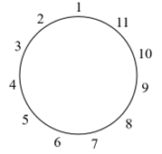

（1）逆时针移动5次，原地不动3次：由于不能连续选择原地不动，则在逆时针移动5次形成的6个空位中，选择3个空位插入原地不动，有种情况；

（2）逆时针移动6次，顺时针移动1次，原地不动1次：在8次中选择1次顺时针移动、1次原地不动，有种情况；

（3）顺时针移动6次，原地不动2次：由于不能连续选择原地不动，则在顺时针移动6次形成的7个空位中，选择2个空位插入原地不动，有种情况；

（4）顺时针移动7次，逆时针移动1次：在8次中选择1次逆时针移动，有种情况。

综上所述，8分钟后共有20+56+21+8=105种情况能使他坐在6号椅子上。

故正确答案为B。

---

## 第 14 题　qid 18385469 · 数学运算

公园里有一座灯塔，底部为边长12米的正六边形，甲乙分别从对角处沿六边形的边按顺时针方向同时出发（如下图所示）。甲每秒钟走3米，乙每秒钟走2米，经过每个顶点时，两人都要停下站立1秒。那么甲出发后经过多少秒才能看到乙？（甲、乙不在同一边上不能看见）

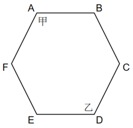

- **A**. 29
- **B**. 34　✅
- **C**. 35
- **D**. 39

**答案**：B

**官方解析**

根据题意，甲每秒钟走3米，秒走1条边，加上在顶点站立1秒，共需4+1=5秒走完1条边；乙每秒钟走2米，秒走1条边，加上在顶点站立1秒，共需6+1=7秒走完1条边。问“甲出发后经过多少秒才能看到乙”，即甲能看到乙的最短时间，从小到大代入选项：

代入A项：甲：，4秒刚好又走了1条边，共走了6条边，站在A点；乙：，共走完4条边，最后1秒走在BC边上。则甲不能看到乙。

代入B项：甲：，4秒刚好又走了1条边，共走了7条边，站在B点；乙：，6秒刚好又走了1条边，站在C点。则甲乙在同一条边BC上，甲能看到乙。

C、D两项均大于B项，无需代入，即甲出发后经过34秒才能看到乙。

故正确答案为B。

---

## 第 15 题　qid 18385406 · 数学运算

如下图所示，在5×3的长方形中，每个小正方形面积为1，以交点为三角形的顶点可画出面积是4的三角形的数量在以下哪个范围？

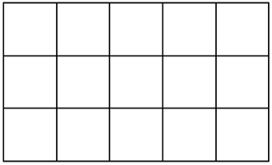

- **A**. 不到60
- **B**. 60~80
- **C**. 81~100　✅
- **D**. 超过100

**答案**：C

**官方解析**

根据三角形面积公式：，要画出面积是4的三角形，则三角形的底×高=8。，分情况讨论：

（1）当底为4，高为2时，从横向4条线段中任选1条，每条可选出2段长度为4的线段作为底边，每个底边满足条件的高有6个，则共有个；

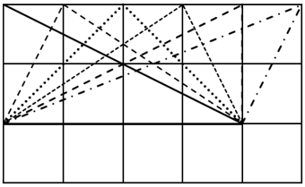

（2）当底为2，高为4时，从纵向线段中选择，为满足高为4，只能选左侧2条和右侧2条竖线段，每条可选出2段长度为2的线段作为底边，去掉与情况（1）重复的直角三角形，每个底边满足条件的高有2个，则共有个；

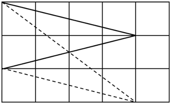

（3）当底为，高为时，按锐角三角形、直角三角形、钝角三角形分类讨论。

①锐角三角形：，且，则，满足题意，向右平移，此方向共有3个三角形符合题意。在这3个三角形的基础上分别进行水平翻转、垂直翻转、水平翻转后再垂直翻转，则共有3×4=12个。

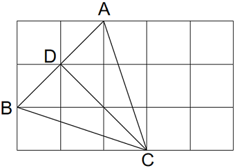

②直角三角形：，此情况已包含在底为4，高为2的情况中，不再重复计算。

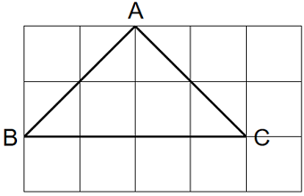

③钝角三角形：，且，则，满足题意，向下平移此方向共有2个三角形符合题意。在这2个三角形的基础上分别进行水平翻转、垂直翻转、水平翻转后再垂直翻转，则共有2×4=8个。

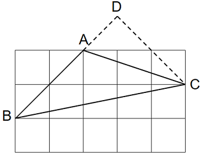

故面积是4的三角形共有48+16+12+8=84个。

故正确答案为C。

---
