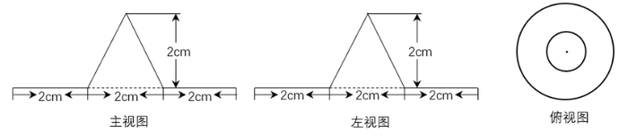
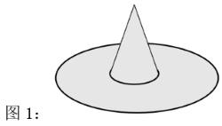
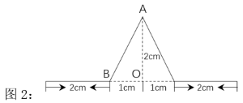
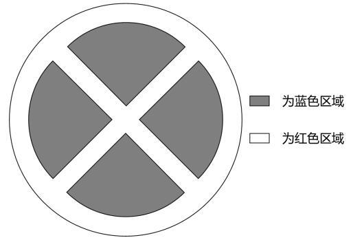
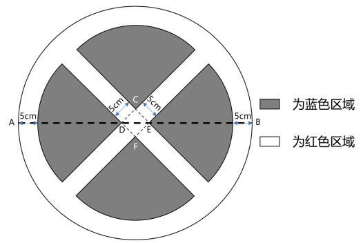
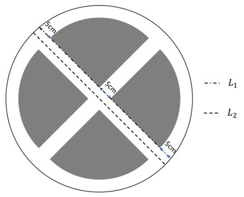

# 2024年新疆公务员录用考试《行测》试题（网友回忆版）

> 数量关系 · 15 题 · 新疆 2024

## 第 1 题　qid 16191106 · 数学运算

甲买一支笔差6元，…，仍差1元，问这笔多少钱?

- **A**. ​8元
- **B**. 9元　✅
- **C**. 10元
- **D**. 11元

**答案**：B

**官方解析**

略

---

## 第 2 题　qid 16592970 · 数学运算

某社区服务中心拟引入优质资源为本社区45名老人提供居家养老服务。已知老人的年龄构成如下（设老人的年龄为x）：有17人，有12人，有11人，90岁及以上有5人。现从该社区中随机抽取两名老人了解居家养老服务情况，那么这两名老人恰好都在80岁以上（含80岁）的概率是：

- **A**. 

　✅
- **B**. 

- **C**. 

- **D**. 

**答案**：A

**官方解析**

根据概率问题公式，概率。总情况数为45名老人随机选两人，共有种情况。满足要求的情况数为在80岁以上（含80岁）的11+5=16人中随机选两人，共有种情况。则所求概率。

故正确答案为A。

---

## 第 3 题　qid 16592955 · 数学运算

某农产品基地对外供应一批农副产品。假设这批农副产品每天都有定量的自然损耗，如果提货方每天运走1.5吨产品，则50天运完；如果提货方每天运走2吨产品，则40天运完。那么这批农副产品有多少吨?

- **A**. 75
- **B**. 80
- **C**. 100　✅
- **D**. 110

**答案**：C

**官方解析**

根据题意，设每天定量的自然损耗为x吨，根据农副产品总量不变可列式：1.5×50+50x=2×40+40x，解得x=0.5，即每天定量的自然损耗为0.5吨，故这批农副产品有1.5×50+0.5×50=100吨。
故正确答案为C。

---

## 第 4 题　qid 16592946 · 数学运算

大学生创业主要集中在高科技、智力服务、连锁加盟和自媒体运营四个领域。某学院今年选择创业的大学毕业生不到50人，其中选择智力服务领域、连锁加盟领域和自媒体运营领域的分别占，和。那么该学院今年选择高科技领域创业的大学毕业生有多少人?

- **A**. 1　✅
- **B**. 3
- **C**. 5
- **D**. 7

**答案**：A

**官方解析**

根据“其中选择智力服务领域、连锁加盟领域和自媒体运营领域的分别占，和”可知，总人数是7、2、3的倍数，又因7、2、3互质，所以总人数为7×2×3=42的倍数。由于选择创业的大学毕业生不到50人，则总人数为42人。因此选择智力服务领域、连锁加盟领域和自媒体运营领域的人数分别为：人、人、人，则选择高科技领域创业的大学毕业生有42-6-21-14=1人。

故正确答案为A。

---

## 第 5 题　qid 16592933 · 数学运算

某公司开展迎新春三分球投篮比赛。3个部门分别派出2、4、4个选手共计10人参加。规则要求同一个部门的选手顺序相连、全部投完再安排另一个部门的人员开始投篮，则这10人不同的投篮顺序种数的范围是：

- **A**. 小于1000
- **B**. 1000~5000
- **C**. 5001~10000　✅
- **D**. 10000以上

**答案**：C

**官方解析**

根据题意，要求同一部门的选手顺序相连，故可先将同一部门的选手捆绑起来，再对三个部门进行排序。因同一部门的选手有先后之分，则3个部门分别有、、种排列方式，3个部门共有种排列方式。故一共有2×24×24×6=6912种不同的投篮顺序，在C项范围内。

故正确答案为C。

---

## 第 6 题　qid 10204649 · 数学运算

一个机器零部件的三视图如下图所示。为防生锈，要给其内部以及外表面均匀涂抹机油，若零件厚度忽略不计，则涂抹机油的面积为多少平方厘米？

- **A**. 

　✅
- **B**. 

- **C**. 

- **D**. 

**答案**：A

**官方解析**

根据三视图可知，零件的形状为一个四周为圆环，中间为圆锥状凸起的薄片（类似尖顶草帽形状，如下图1所示）。

要求内部以及外表面均匀涂抹机油，则需要涂抹机油的位置由圆环的上、下两面和圆锥的侧面积内、外两面组成。由于零件厚度忽略不计，则圆环的上、下两面的面积相等，圆锥的侧面积内、外两面的面积相等，因此所求面积=（圆环面积+圆锥侧面积）×2。根据主视图及左视图可知，圆环的大圆直径=2+2+2=6cm，小圆直径=2cm，则大、小圆半径分别为3cm和1cm。根据圆环面积公式：，则所求。结合勾股定理可计算圆锥母线l（AB）长度cm（如下图2所示）。

根据圆锥侧面积公式：，则所求。故涂抹机油的面积。

故正确答案为A。

---

## 第 7 题　qid 16592959 · 数学运算

原油A每吨的价格为0.3万元，可提炼苯乙烯0.5吨，提炼过程中每吨原油产生的废气量为0.4吨；原油B每吨的价格为0.4万元，可提炼苯乙烯0.7吨，提炼过程中每吨原油产生的废气量为0.3吨。若要提炼至少1.9吨的苯乙烯且产生的废气量不超过1吨，则购买原油的最低费用为多少万元？

- **A**. 1
- **B**. 1.1　✅
- **C**. 1.2
- **D**. 1.3

**答案**：B

**官方解析**

根据题意可知，原油A提炼出1吨苯乙烯的成本为万元，原油B提炼出1吨苯乙烯的成本为万元，因此购买原油B提炼苯乙烯的费用更低；每吨A、B原油产生的废气量分别为0.4吨、0.3吨，原油B产生废气量更少，综合考虑应尽可能多购买原油B。提炼1.9吨的苯乙烯，优先购买原油B：······0.5（注：默认每类原油都购买整数吨），即最多购买2吨原油B，提炼剩下的0.5吨的苯乙烯还需要购买1吨原油A，此时共产生废气量为2×0.3+0.4=1吨，符合题干要求，则最低费用为2×0.4+0.3=1.1万元。

故正确答案为B。

备注：本题若不默认按整数吨购买，计算为万元，也需选择B项。 

---

## 第 8 题　qid 16593220 · 数学运算

某公园绿化管理部门采购了100片围栏，每片长1米且不可弯折。现拆分拟围成5块周长相等且互不相邻的矩形花卉区域。若不考虑拼接间隙，那么这5块区域的最大与最小面积最多可相差多少平方米？

- **A**. 10
- **B**. 12
- **C**. 16　✅
- **D**. 25

**答案**：C

**官方解析**

根据题意，这5块矩形花卉区域周长相等，则每块矩形的周长为米。因为围栏不可弯折，则矩形的宽最小为1米，那么：

当宽为1米时，长为米，面积为1×9=9平方米；

当宽为2米时，长为米，面积为2×8=16平方米；

当宽为3米时，长为米，面积为3×7=21平方米；

当宽为4米时，长为米，面积为4×6=24平方米；

当宽为5米时，长为米，面积为5×5=25平方米。

综上可得，面积最大为25平方米，最小为9平方米，最多相差25-9=16平方米。

故正确答案为C。

---

## 第 9 题　qid 16592950 · 数学运算

为弘扬耕读文化，某校打造多样化“校外+校内”耕读文化教育基地，有种植、绘画、编织、美食四个主题基地供同学们选学。假设每位学生选择1个主题基地参与学习，那么甲、乙、丙、丁4名学生中至少有3名学生选择不同主题基地的方法有多少种？

- **A**. 24
- **B**. 60
- **C**. 144
- **D**. 168　✅

**答案**：D

**官方解析**

根据题干条件，甲、乙、丙、丁4名学生中至少有3名学生选择不同主题基地的方法可分为以下两种情况：

①有4名学生选择不同主题基地，情况数为：种；

②有3名学生选择不同主题基地，则其中存在2名学生选择的主题基地相同，先从4名学生中选2名学生选择相同的主题基地，情况数有种，剩余2名学生可从剩下的3个主题基地中选择其中两个，情况数有种，则有3名学生选择不同主题基地的情况数为：24×6=144种。

故总的情况数为：24+144=168种。

故正确答案为D。

---

## 第 10 题　qid 16592964 · 数学运算

中秋节前夕，小赵买了6个外观相同的月饼，其中有3个是蛋黄馅的。回到家后，小赵从中任取3个月饼，里面恰好有1个是蛋黄馅的概率是：

- **A**. 

　✅
- **B**. 

- **C**. 

- **D**. 

**答案**：A

**官方解析**

根据题意可知，总情况数为小赵从6个月饼中选择3个，共有种情况。满足条件情况数为小赵从3个蛋黄馅月饼中选择1个，从余下3个月饼中选择2个，共有种情况。则所求概率P。

故正确答案为A。

---

## 第 11 题　qid 16592942 · 数学运算

A、D两地设有通信基站（如下图所示），发射信号范围分别是以A、D为圆心，AE和DB为半径的圆形区域，小林从B地出发，沿与DB垂直的BA方向匀速行进，步行速度为4千米/小时，那么步行约多少分钟后小林的手机能够重新接收到信号？（）

- **A**. 8
- **B**. 10
- **C**. 12　✅
- **D**. 14

**答案**：C

**官方解析**

根据题意可知，扇形AEC和扇形DEB分别被A、D两地的通信基站发射的信号所覆盖，故小林由B点出发后，手机就不能接收到信号，沿与DB垂直的BA方向匀速行进到C点后手机可以重新接收到信号。根据勾股定理可得km，又由DE=DB=1km，可得km，故km；根据题意，需要计算小林步行走BC的时间，步行速度为4km/小时，BC=0.77km，故所需时间为分钟。

故正确答案为C。

---

## 第 12 题　qid 16592948 · 数学运算

某单位为解决职工暑期“带娃难”的问题，开设了暑托班。开班时男孩与女孩的比例为3：4，后来有2个男孩、1个女孩退出暑托班，此时男孩与女孩的比例为2：3。那么开班时女孩有多少人?

- **A**. 10
- **B**. 12
- **C**. 14
- **D**. 16　✅

**答案**：D

**官方解析**

方法一：设开班时男孩有3x人，女孩有4x人，后来有2个男孩、1个女孩退出，可得，解得x=4，则开班时女孩有16人。

方法二：开班时男孩、女孩的比例为3：4，则开班时女孩为4的倍数，排除A、C两项；后来女孩退出1人后为3的倍数，将B项代入12-1=11，不满足3的倍数，排除；D项16-1=15，满足3的倍数，当选。

故正确答案为D。

---

## 第 13 题　qid 16592953 · 数学运算

某旅游公司定制甲、乙两种纪念品，第一次共定制50个。试销后根据反馈，第二次定制两种纪念品共70个，其中乙纪念品个数是第一次的。已知甲纪念品单价为15元，第一次定制花费1150元，那么第二次定制花费多少元?

- **A**. 1150　✅
- **B**. 1725
- **C**. 2300
- **D**. 2875

**答案**：A

**官方解析**

根据题意，第二次定制的乙变为第一次的，假设第二次定制的甲也变为第一次的，则第二次总定制数量为个，第二次总金额为元。此时比实际第二次定制少了70-12.5＝57.5个甲，总金额少了57.5×15＝862.5元，所以实际第二次定制花费287.5+862.5=1150元。

故正确答案为A。

---

## 第 14 题　qid 16592952 · 数学运算

中国空间站主体由天和核心舱、问天实验舱、梦天实验舱构成。某次实验需要5名宇航员同时在三个舱中开展，每个人只能去一个舱，每个舱至少安排1名宇航员，其中甲宇航员只能去问天实验舱和梦天实验舱中的一个，则不同的安排方法有多少种？

- **A**. 72
- **B**. 88
- **C**. 100　✅
- **D**. 144

**答案**：C

**官方解析**

根据题意，5名宇航员安排到三个舱，每个舱至少安排1名宇航员，那么三个舱中的人数有两种情况：

①人数分别为1人、2人、2人。

若甲在1人舱，甲有种情况，剩下4人平均安排到剩下2个舱有种情况，则共有种情况；

若甲在2人舱，甲有种情况，剩余4人选1人和甲同一舱有种情况，还剩下3人安排到剩下2个舱，其中一个1人，另一个2人，有种情况，则共有种情况；

②人数分别为1人、1人、3人。

若甲在1人舱，甲有种情况，剩下4人安排到剩下2个舱，其中一个1人，另一个3人，有种情况，则共有种情况；

若甲在3人舱，甲有种情况，剩余4人选2人和甲同一舱有种情况，还剩下2人平均安排到剩下2个舱有种情况，则共有种情况；

综上共有12+48+16+24=100种情况。

故正确答案为C。

---

## 第 15 题　qid 16593223 · 数学运算

某单面圆形交通禁停标志牌如图所示，标志牌直径为60cm，牌中各处红色区域宽度均为5cm，某工厂承接30个该种标志牌的喷绘业务，已知每个标志牌的蓝色区域喷绘价格是112.5元，红蓝区域喷绘单价相同（价格仅按面积计算），那么30个标志牌喷绘共需：

- **A**. 3375元
- **B**. 6000元
- **C**. 6750元　✅
- **D**. 8437.5元

**答案**：C

**官方解析**

如图所示，连接四块蓝色扇形区域的顶点DCEF构成一个边长为5cm的正方形，对角线DE的长度为cm。蓝色区域可平移拼成一个完整的圆形，蓝色圆形的直径则=大圆直径AB-5cm-5cm-DE=60cm-5cm-5cm-7cm=43cm。

方法一：蓝色圆形的面积为，整个标志牌的面积为，因为红蓝区域喷绘单价相同，则整个标志牌的喷绘单价相同，整个标志牌的喷绘价格为元，30个标志牌的喷绘总价为219×30=6570元，根据选项选择最为接近的，对应C项。

方法二：根据面积比等于相似比的平方，蓝色圆形和标志牌的直径比为43：60，则面积比为，蓝色面积的喷绘价格为112.5元，则整个标志牌的喷绘价格为112.5×2=225元，30个标志牌的总价为225×30=6750元，对应C项。

故正确答案为C。

备注：1.如下图所示，为大圆直径=60，。本题容易将误认为60，误将小圆直径理解为60-5-5-5=45cm，进而计算误选B项。

2.本题方法一是较为精准的计算，选项无直接答案，C项接近；方法二为估算，估算结果刚好是C项。可能本题考查的思维就是估算，也可能就是命题有误。

---
