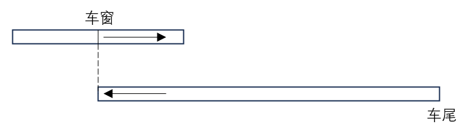
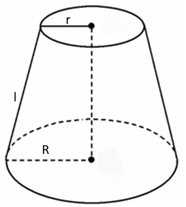
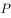
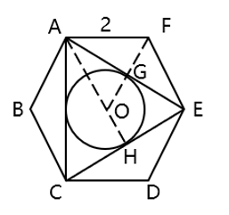

# 2024年江苏省公务员录用考试《行测》题（A类）（网友回忆版）

> 数量关系 · 19 题 · 江苏 2024

## 第 1 题　qid 5919074 · 数学运算

-6，-2，-10，6，-26，（    ）

- **A**. -90
- **B**. 90
- **C**. -38
- **D**. 38　✅

**答案**：D

**官方解析**

观察数列，无明显特征，优先考虑多级数列。后一项减前一项得到新数列：4，-8，16，-32，（    ），是公比为-2的等比数列，则下一项为（-32）×（-2）=64。故题干所求项为（-26）+64=38。
故正确答案为D。

---

## 第 2 题　qid 5919077 · 数学运算

1.1，2.3，5.8，13.21，34.55，（    ）

- **A**. 89.144　✅
- **B**. 89.151
- **C**. 99.144
- **D**. 99.151

**答案**：A

**官方解析**

观察数列，各项均为小数，优先考虑机械划分数列。整数部分和小数部分分开看无规律，考虑整体看。观察发现，后一项整数部分=前一项整数部分+前一项小数部分，则所求项整数部分为34+55=89；后一项小数部分=前一项小数部分+后一项整数部分，则所求项小数部分为55+89=144。故题干所求项为89.144。
故正确答案为A。

---

## 第 3 题　qid 5919079 · 数学运算

，，9，18，，（    ）

- **A**. 
27

- **B**. 

- **C**. 

　✅
- **D**. 
54

**答案**：C

**官方解析**

方法一：观察数列，出现根号，将原数列统一转化为根号形式：，，，，，（    ），根号内数字变化趋势较大，可以考虑拆分。则原数列可转化为，，，，，（    ）。根号内数列的左子列分别为1，2，3，4，5，（    ），是自然数数列，则下一项为6；右子列分别为3，9，27，81，243，（    ），是公比为3的等比数列，则下一项为。故题干所求项为。

方法二：数列局部之间存在明显的倍数关系，优先考虑作商数列。后一项除以前一项得到新数列：，，2，，（    ），进一步可转化为，，，，（    ）。根号内分母部分分别为1，2，3，4，（    ），是自然数数列，则下一项分母部分为5；根号内分子部分分别为6，9，12，15，（    ），是公差为3的等差数列，则下一项分子部分为15+3=18。因此新数列下一项为。故题干所求项为。

故正确答案为C。

---

## 第 4 题　qid 5919082 · 数学运算

，，，，，（    ）。

- **A**. 

- **B**. 

- **C**. 

　✅
- **D**. 

**答案**：C

**官方解析**

数列各项均为分数，考虑分数数列。分子、分母分开看无明显规律，考虑整体看。各项分子、分母相加得到新数列：3，6，12，24，48，（    ），是公比为2的等比数列，则新数列下一项为48×2=96，即所求项分子、分母之和为96，观察选项，只有C项47+49=96满足。
故正确答案为C。

---

## 第 5 题　qid 5919083 · 数学运算

某厂推出含酒的新品种巧克力，每颗的质量为10克，其中含酒2%，售价为17.5元，若酒的密度为0.9克/毫升，则500毫升酒做成的巧克力销售额为（    ）。

- **A**. 35875元
- **B**. 36375元
- **C**. 37625元
- **D**. 39375元　✅

**答案**：D

**官方解析**

根据公式：质量=密度×体积，可得500毫升酒的质量=0.9×500=450克，每颗巧克力含酒质量=10×2%=0.2克。则500毫升酒做成的巧克力销售额元。

故正确答案为D。

---

## 第 6 题　qid 5919084 · 数学运算

一列长为210米的动车以180千米/小时的速度行驶。某乘客拍窗外风景视频时，恰好拍到平行铁轨上一列长420米、相向而行的高速列车，该高速列车经过窗户的时间是3.6秒。若不计窗户长度，则该高速列车的速度为（    ）。

- **A**. 210千米/时
- **B**. 240千米/时　✅
- **C**. 450千米/时
- **D**. 630千米/时

**答案**：B

**官方解析**

如下图所示，乘客拍到该高速列车即为车窗与平行列车的车头相对重合，该高速列车完全经过即为车窗与平行列车的车尾相对重合，则本题可转化为车窗与平行列车车尾的相遇问题，相遇距离即为平行列车的车长。根据相遇公式：，可得千米/时，则该高速列车的速度=420-180=240千米/时。

故正确答案为B。

---

## 第 7 题　qid 5919085 · 数学运算

某商店购进一款无线路由器，进价100元/个，加价30%出售，半年后将剩下的打7折全部售出，共盈利7410元。若成本利润率为19%，则打7折售出的无线路由器共有（    ）。

- **A**. 90个
- **B**. 100个
- **C**. 105个
- **D**. 110个　✅

**答案**：D

**官方解析**

设打7折售出的无线路由器数量为x个，打折前售出的无线路由器数量为y个。根据题意则有：；，整理可得：30y-9x=7410⋯⋯①；x+y=390⋯⋯②，解得x=110。

故正确答案为D。

---

## 第 8 题　qid 15121118 · 数学运算

市社保中心引进机器人提高服务效率。某岗位小张、小王和小李完结一单任务分别需要6分钟、5分钟和4分钟，3人一天最多可完结259单。机器人处理一单仅需2分钟，处理工单中的80%可正常完结，剩余的20%仍需人工重新办理。若某天小张出差，则当天小王、小李和机器人（机器人与人的工作时间相同）最多可以完结的工单总量为：

- **A**. 357单　✅
- **B**. 399单
- **C**. 427单
- **D**. 469单

**答案**：A

**官方解析**

根据题意可知，小张、小王和小李每小时完结任务的单数分别为单、单和单，3人一天最多可完结259单，则一天工作时间为小时。已知机器人每小时可处理单，处理工单中的80%可正常完结，剩余20%仍需人工重新办理，若机器人剩余工单由人工重新办理，那么在相同时间内，人工少做的单数与其相同，故无需考虑机器人处理失败的单数，由此可得当天小王、小李和机器人最多可完结30×7×80%+7×（12+15）=7×（24+27）=357单。

故正确答案为A。

---

## 第 9 题　qid 5919088 · 数学运算

某超市为回馈消费者，将举办购物抽奖活动。每人只能抽奖一次，奖金有三种：一等奖888元，二等奖88元，三等奖8元。若前100个中奖者的奖金总额为2480元，则其中获得三等奖的最少有：

- **A**. 95人
- **B**. 89人
- **C**. 79人　✅
- **D**. 69人

**答案**：C

**官方解析**

设获得一、二、三等奖的人数分别为x人、y人、z人，根据前100个中奖者的奖金总额为2480元，可列方程组：，整理可得：，①×11-②得到：10z-100x=790，即z=10x+79。若想要获得三等奖的人数z最少，则x应尽量小，则当x=0时，z=79，即获得三等奖的最少有79人。

故正确答案为C。

---

## 第 10 题　qid 5919089 · 数学运算

已知某家族4位成员的年龄总和为142岁，且他们的年龄恰好成等差数列，若其中一位的年龄为47岁，则这4人中最年长者的年龄为（    ）。

- **A**. 65岁
- **B**. 70岁　✅
- **C**. 83岁
- **D**. 90岁

**答案**：B

**官方解析**

根据选项可知，47岁不是最年长者的年龄。又根据等差数列性质可知，4位成员中，第二大和第三大的年龄和为岁，且由于，则47岁应是第二大的年龄，那么第三大的年龄为71-47=24岁，年龄公差为47-24=23岁，故这4人中最年长者的年龄为47+23=70岁。

故正确答案为B。

---

## 第 11 题　qid 5919090 · 数学运算

小王去超市买办公用品，经费恰好可以买18个计算器或者买30个订书机或者买50个档案盒，若购买了6个计算器、8个订书机后，剩下的经费全部购买了档案盒，则他购买档案盒的个数是：

- **A**. 10
- **B**. 14
- **C**. 20　✅
- **D**. 26

**答案**：C

**官方解析**

方法一：赋值小王购买办公用品的经费为450（18、30和50的最小公倍数）元，则每个计算器为元，每个订书机为元，每个档案盒为元。若小王购买了6个计算器、8个订书机，则剩余经费为450-25×6-15×8=180元，还可购买档案盒个。

方法二：设小王购买办公用品的经费为a元，计算器的价格为x元/个，订书机的价格为y元/个，档案盒的价格为z元/个。根据题意可得：a=18x=30y=50z，即，，。若小王购买了6个计算器、8个订书机，则剩余经费为元，还可购买档案盒个。

故正确答案为C。

---

## 第 12 题　qid 5919092 · 数学运算

某品牌奶茶所用纸杯均为圆台型。已知M型纸杯的上、下口直径分别为70毫米、50毫米，高为80毫米；N型纸杯的上、下口直径分别为60毫米、45毫米，高为60毫米。则M型纸杯与N型纸杯的侧面积之比为（    ）。

- **A**. 16：7
- **B**. 32：21　✅
- **C**. 48：35
- **D**. 64：49

**答案**：B

**官方解析**

本题考查求圆台的侧面积，，其中r和R分别为上、下底面的半径，l为侧面母线长（如下图所示）。M型纸杯：毫米，毫米，则毫米；N型纸杯：r=22.5毫米，R=30毫米，则毫米。故所求比例为。

故正确答案为B。

---

## 第 13 题　qid 5919095 · 数学运算

小张所在单位共有4个科室，现以科室为单位组织文艺演出，每个科室出2个节目。演出结束后，因8个节目都非常精彩，决定从中随机选3个节目参加上级组织的汇演。则小张所在科室出的节目至少有一个被选送参加汇演的概率是：

- **A**. 

- **B**. 

- **C**. 

- **D**. 

　✅

**答案**：D

**官方解析**

根据题意，总情况是从8个节目中随机选出3个，情况数为种；符合条件的情况是小张所在科室出的2个节目中至少有一个被选送，即有1个节目或者2个节目被选送。正面情况较复杂，可从反面分析。反面情况为3个选送节目均不来自小张所在的科室，则从另外8-2=6个节目中随机选出3个，情况数为种。故题干所求概率。

故正确答案为D。

---

## 第 14 题　qid 5919097 · 数学运算

某夫妇拟从2023年12月1日（星期五）起实施健身计划。妻子的计划是当天的日期为质数就游泳，丈夫的计划是每周一、三、五游泳。按该夫妇的计划，他们2023年12月同日游泳的天数是（    ）。

- **A**. 5
- **B**. 4
- **C**. 3　✅
- **D**. 2

**答案**：C

**官方解析**

因丈夫每周一、三、五游泳，且2023年12月1日为周五，所以2023年12月丈夫前三次游泳的日期为1日（周五）、4日（周一）、6日（周三），以7天一星期的周期进行推算，2023年12月丈夫游泳的日期如下表所示：

其中日期为质数的有11日、13日、29日，共3天，即该夫妇2023年12月同日游泳的天数是3天。

故正确答案为C。

---

## 第 15 题　qid 5919099 · 数学运算

甲、乙、丙三人合作完成一项任务。乙先做9天，再和甲合作6天，完成了任务的60%，剩下的任务，若由丙做，恰好10天完成。甲、乙、丙三人的工作效率之比是：

- **A**. 5：4：6　✅
- **B**. 6：4：5
- **C**. 10：15：12
- **D**. 12：15：10

**答案**：A

**官方解析**

根据题意可得，9×乙+6×（甲+乙）=60%×工作总量······①，10×丙=（1-60%）×工作总量······②，①÷②可得：，则2甲+5乙=5丙，依次代入选项：

A项：赋值甲、乙、丙三人的工作效率分别为5、4、6，则2×5+5×4=30=5×6，满足题干条件，当选；

B项：赋值甲、乙、丙三人的工作效率分别为6、4、5，则，不满足题干条件，排除；

C项：赋值甲、乙、丙三人的工作效率分别为10、15、12，则，不满足题干条件，排除；

D项：赋值甲、乙、丙三人的工作效率分别为12、15、10，则，不满足题干条件，排除。

故正确答案为A。

---

## 第 16 题　qid 5919100 · 数学运算

某公司派出5名人力资源专员去2个一线城市和2个二线城市参加秋季招聘会。若每名专员只去其中1个城市，每个一线城市至少派1名专员，每个二线城市只派1名专员，则不同的派出方法共有（    ）。

- **A**. 60种
- **B**. 72种
- **C**. 120种　✅
- **D**. 144种

**答案**：C

**官方解析**

5名专员分配到4个城市，其中每个一线城市至少派1名专员，每个二线城市只派1名专员，则5名专员中有3名专员分配到2个一线城市（分别为2名专员和1名专员），其余2名专员分配到2个二线城市（各1名专员）。从5名专员中选出2名专员，再从剩下3名专员中选出1名专员，这两组人分配到2个一线城市，有种；剩下2名专员分配到2个二线城市，有种。分步用乘法，则不同的派出方法共有60×2=120种。

故正确答案为C。

---

## 第 17 题　qid 5919101 · 数学运算

小陆参加植树活动，他到达植树地点时，第一排预设点位中的9个已有人在植树，若他在第一排剩余的任意点位上植树，都恰好有一个相邻点位有人在植树，则该植树点第一排的预设点位最多有：

- **A**. 27个　✅
- **B**. 28个
- **C**. 29个
- **D**. 30个

**答案**：A

**官方解析**

根据题意，小陆在第一排剩余的任意点位上植树，都恰好有一个相邻点位有人在植树，且要求预设点位数尽可能多，则每个已有人在植树的点位之间应该有两个无人植树的点位，如下图所示。（圆形和三角形分别代表无人植树和已有人在植树的点位）

为使预设点位数尽可能多，则第一个已有人在植树的点位左侧最多可安排一个无人植树的点位，最后一个已有人在植树的点位右侧最多可安排一个无人植树的点位，如下图所示。

即相当于每3个点位为一个周期，每个周期中有1个已有人在植树的点位，且位于中间位置。根据已有人在植树的点位有9个，则该植树点第一排最多有9×3=27个预设点位。 

故正确答案为A。

---

## 第 18 题　qid 5919108 · 数学运算

某基层工会共有180名会员，举行甲、乙两项工会活动，60%的会员参加甲活动，50%的会员参加乙活动，若只参加甲活动的会员有80人，则只参加乙活动的会员有（    ）。

- **A**. 10人
- **B**. 28人
- **C**. 62人　✅
- **D**. 72人

**答案**：C

**官方解析**

根据题意可得，参加甲活动的会员人数为180×60%=108人，参加乙活动的会员人数为180×50%=90人，根据“只参加甲活动的会员有80人”，可得甲、乙两项活动都参加的会员人数为108-80=28人，如下图所示：

则只参加乙活动的会员有90-28=62人。

故正确答案为C。

---

## 第 19 题　qid 5919119 · 数学运算

如图所示，ABCDEF是一个边长为2的正六边形，圆O是的内切圆，则圆O的面积是（    ）。

- **A**. 

　✅
- **B**. 

- **C**. 

- **D**. 

**答案**：A

**官方解析**

方法一：由于ABCDEF是正六边形，可得AC=CE=EA，即为正三角形，则内切圆的圆心O即为正六边形ABCDEF的中心。作的中线AH，连接FO，为正三角形，如下图所示：

已知AF=FE=2，且正六边形内角，则，。在直角中，，，且AO=AF=2，所以所求圆半径OH=AH-AO=3-2=1，所求圆面积。

方法二：如下图所示，连接AO、FO，为正三角形，由于AO为的中线且，则，AG为的中线，即所求圆半径，所求圆面积。

故正确答案为A。

---
