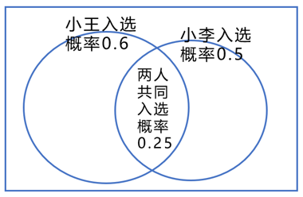

# 2024年江苏省公务员录用考试《行测》题（B类）（网友回忆版）

> 数量关系 · 19 题 · 江苏 2024

## 第 1 题　qid 5919133 · 数学运算

-9，-1，11，29，56，（    ）。

- **A**. 78.5
- **B**. 93
- **C**. 96.5　✅
- **D**. 100

**答案**：C

**官方解析**

数列无明显特征，优先考虑多级数列。后项-前项可得新数列：8，12，18，27，（    ），是公比为1.5的等比数列，则新数列下一项为27×1.5=40.5。故所求项=56+40.5=96.5。
故正确答案为C。

---

## 第 2 题　qid 15121096 · 数学运算

65.11，72.9，83.11，98.17，117.9，（    ）。

- **A**. 140.17
- **B**. 140.5　✅
- **C**. 148.13
- **D**. 148.17

**答案**：B

**官方解析**

数列各项均为小数，优先考虑机械划分。整数部分形成数列：65，72，83，98，117，（    ），作差后得到新数列：7，11，15，19，（    ），是公差为4的等差数列，则整数部分下一项为117+19+4=140，排除C、D两项；观察发现，小数部分为整数部分的各位数字相加，只有B项（1+4+0=5）满足。
故正确答案为B。

---

## 第 3 题　qid 15121123 · 数学运算

，，，，，（    ）。

- **A**. 

- **B**. 

- **C**. 

- **D**. 

　✅

**答案**：D

**官方解析**

观察数列，有开方数和被开方数，优先考虑机械划分。原数列可转化为：，，，，，（    ）。被开方数形成数列：3，5，9，17，33，（    ），后项减前项得到：2，4，8，16，（    ），是公比为2的等比数列，下一项为16×2=32，则所求项被开方数为33+32=65。开方数形成数列：2，5，10，17，26，（    ），后项减前项得到：3，5，7，9，（    ），是公差为2的等差数列，下一项为9+2=11，则所求项开方数为26+11=37。故所求项为。

故正确答案为D。

---

## 第 4 题　qid 5919082 · 数学运算

，，，，，（    ）。

- **A**. 

- **B**. 

- **C**. 

　✅
- **D**. 

**答案**：C

**官方解析**

数列各项均为分数，考虑分数数列。分子、分母分开看无明显规律，考虑整体看。各项分子、分母相加得到新数列：3，6，12，24，48，（    ），是公比为2的等比数列，则新数列下一项为48×2=96，即所求项分子、分母之和为96，观察选项，只有C项47+49=96满足。
故正确答案为C。

---

## 第 5 题　qid 5919083 · 数学运算

某厂推出含酒的新品种巧克力，每颗的质量为10克，其中含酒2%，售价为17.5元，若酒的密度为0.9克/毫升，则500毫升酒做成的巧克力销售额为（    ）。

- **A**. 35875元
- **B**. 36375元
- **C**. 37625元
- **D**. 39375元　✅

**答案**：D

**官方解析**

根据公式：质量=密度×体积，可得500毫升酒的质量=0.9×500=450克，每颗巧克力含酒质量=10×2%=0.2克。则500毫升酒做成的巧克力销售额元。

故正确答案为D。

---

## 第 6 题　qid 5919084 · 数学运算

一列长为210米的动车以180千米/小时的速度行驶。某乘客拍窗外风景视频时，恰好拍到平行铁轨上一列长420米、相向而行的高速列车，该高速列车经过窗户的时间是3.6秒。若不计窗户长度，则该高速列车的速度为（    ）。

- **A**. 210千米/时
- **B**. 240千米/时　✅
- **C**. 450千米/时
- **D**. 630千米/时

**答案**：B

**官方解析**

如下图所示，乘客拍到该高速列车即为车窗与平行列车的车头相对重合，该高速列车完全经过即为车窗与平行列车的车尾相对重合，则本题可转化为车窗与平行列车车尾的相遇问题，相遇距离即为平行列车的车长。根据相遇公式：，可得千米/时，则该高速列车的速度=420-180=240千米/时。

故正确答案为B。

---

## 第 7 题　qid 5919085 · 数学运算

某商店购进一款无线路由器，进价100元/个，加价30%出售，半年后将剩下的打7折全部售出，共盈利7410元。若成本利润率为19%，则打7折售出的无线路由器共有（    ）。

- **A**. 90个
- **B**. 100个
- **C**. 105个
- **D**. 110个　✅

**答案**：D

**官方解析**

设打7折售出的无线路由器数量为x个，打折前售出的无线路由器数量为y个。根据题意则有：；，整理可得：30y-9x=7410⋯⋯①；x+y=390⋯⋯②，解得x=110。

故正确答案为D。

---

## 第 8 题　qid 15121118 · 数学运算

市社保中心引进机器人提高服务效率。某岗位小张、小王和小李完结一单任务分别需要6分钟、5分钟和4分钟，3人一天最多可完结259单。机器人处理一单仅需2分钟，处理工单中的80%可正常完结，剩余的20%仍需人工重新办理。若某天小张出差，则当天小王、小李和机器人（机器人与人的工作时间相同）最多可以完结的工单总量为：

- **A**. 357单　✅
- **B**. 399单
- **C**. 427单
- **D**. 469单

**答案**：A

**官方解析**

根据题意可知，小张、小王和小李每小时完结任务的单数分别为单、单和单，3人一天最多可完结259单，则一天工作时间为小时。已知机器人每小时可处理单，处理工单中的80%可正常完结，剩余20%仍需人工重新办理，若机器人剩余工单由人工重新办理，那么在相同时间内，人工少做的单数与其相同，故无需考虑机器人处理失败的单数，由此可得当天小王、小李和机器人最多可完结30×7×80%+7×（12+15）=7×（24+27）=357单。

故正确答案为A。

---

## 第 9 题　qid 15121125 · 数学运算

新华书店在售的某书籍有精装本和平装本，精装本售价80元/本，平装本售价50元/本，每购买20本精装本赠送1本平装本。若某单位花12100元购买了200本（含赠送的平装本），则其中精装本有：

- **A**. 75本　✅
- **B**. 77本
- **C**. 79本
- **D**. 81本

**答案**：A

**官方解析**

由选项可知，购买精装本的数量并非20的整数倍，考虑代入排除法解题，设购买了x本平装本。

代入A项：若精装本有75本，由，可知赠送了3本平装本。由此可列式：75+x+3=200，解得x=122，买这些书籍共花费75×80+122×50=12100元，满足题意，无需验证其他选项。

故正确答案为A。

---

## 第 10 题　qid 5919089 · 数学运算

已知某家族4位成员的年龄总和为142岁，且他们的年龄恰好成等差数列，若其中一位的年龄为47岁，则这4人中最年长者的年龄为（    ）。

- **A**. 65岁
- **B**. 70岁　✅
- **C**. 83岁
- **D**. 90岁

**答案**：B

**官方解析**

根据选项可知，47岁不是最年长者的年龄。又根据等差数列性质可知，4位成员中，第二大和第三大的年龄和为岁，且由于，则47岁应是第二大的年龄，那么第三大的年龄为71-47=24岁，年龄公差为47-24=23岁，故这4人中最年长者的年龄为47+23=70岁。

故正确答案为B。

---

## 第 11 题　qid 15121231 · 数学运算

某公司6个部门共192名员工，其中5个部门的员工人数之比为2：3：4：5：6。现将6个部门合并成3个，每个部门都由原来的两个部门合并而成。若合并后3个部门的员工人数之比为3：4：5，则合并前人数最少的部门的员工有：

- **A**. 16人　✅
- **B**. 17人
- **C**. 18人
- **D**. 19人

**答案**：A

**官方解析**

设其中5个部门的员工人数分别为2x、3x、4x、5x、6x，另外1个部门的员工人数为a，则有2x+3x+4x+5x+6x+a=192，整理可得20x+a=192。合并前人数最少的部门员工人数为2x或a，因人数为整数，则20x的尾数为0，a的尾数为2-0=2，观察选项尾数均不满足，则可判断合并前人数最少的部门为2x人，根据所求应为2的倍数，可排除B、D两项。由于求人数最少，则从小到大代入。代入A项，2x=16，解得x=8，即其中5个部门的员工人数分别为16、24、32、40、48，则a=192-20x=32。设合并后3个部门的员工人数分别为3y、4y、5y，则有3y+4y+5y=192，解得y=16，即合并后3个部门的员工人数分别为48、64、80，因16+32=48，24+40=64，48+32=80，满足题干所有条件，当选。
故正确答案为A。

---

## 第 12 题　qid 5919092 · 数学运算

某品牌奶茶所用纸杯均为圆台型。已知M型纸杯的上、下口直径分别为70毫米、50毫米，高为80毫米；N型纸杯的上、下口直径分别为60毫米、45毫米，高为60毫米。则M型纸杯与N型纸杯的侧面积之比为（    ）。

- **A**. 16：7
- **B**. 32：21　✅
- **C**. 48：35
- **D**. 64：49

**答案**：B

**官方解析**

本题考查求圆台的侧面积，，其中r和R分别为上、下底面的半径，l为侧面母线长（如下图所示）。M型纸杯：毫米，毫米，则毫米；N型纸杯：r=22.5毫米，R=30毫米，则毫米。故所求比例为。

故正确答案为B。

---

## 第 13 题　qid 15121256 · 数学运算

财务部推荐本部门员工小王和小李参加公司最佳员工评选。若小王、小李成功入选的概率分别为0.6和0.5，两人都成功入选的概率为0.25，则财务部有员工被评为公司最佳员工的概率为：

- **A**. 0.6
- **B**. 0.75
- **C**. 0.8
- **D**. 0.85　✅

**答案**：D

**官方解析**

方法一：由，说明小王、小李各自成功入选并非相互独立事件，两人分别入选的概率包含了两人同时入选的概率。

由两人都成功入选的概率为0.25，小王入选的概率为0.6，则只有小王入选的概率为0.6-0.25=0.35；同理，只有小李入选的概率为0.5-0.25=0.25。则所求“有员工被评为公司最佳员工”的概率即为至少有1人入选的概率，根据分类用加法，则有员工被评为公司最佳员工的概率=只有小王入选的概率+只有小李入选的概率+两人都入选的概率=0.35+0.25+0.25=0.85。

方法二：本题可将总概率视为1，由于小王、小李各自成功入选并非相互独立事件，两人分别入选的概率包含了两人同时入选的概率，故可用容斥思维分析，如下图所示：

有员工被评为公司最佳员工的概率=至少有一人入选的概率，根据两集合容斥原理公式：。

故正确答案为D。

---

## 第 14 题　qid 5919097 · 数学运算

某夫妇拟从2023年12月1日（星期五）起实施健身计划。妻子的计划是当天的日期为质数就游泳，丈夫的计划是每周一、三、五游泳。按该夫妇的计划，他们2023年12月同日游泳的天数是（    ）。

- **A**. 5
- **B**. 4
- **C**. 3　✅
- **D**. 2

**答案**：C

**官方解析**

因丈夫每周一、三、五游泳，且2023年12月1日为周五，所以2023年12月丈夫前三次游泳的日期为1日（周五）、4日（周一）、6日（周三），以7天一星期的周期进行推算，2023年12月丈夫游泳的日期如下表所示：

其中日期为质数的有11日、13日、29日，共3天，即该夫妇2023年12月同日游泳的天数是3天。

故正确答案为C。

---

## 第 15 题　qid 15121202 · 数学运算

一项工程由甲、乙、丙三个工程队合作完成，他们的工作效率之比为5：6：4。已知甲、乙合作需60天完成，现两人合作若干天后，剩余工程由丙单独完成，共用74天，则甲、乙合作的天数是：

- **A**. 52　✅
- **B**. 53
- **C**. 54
- **D**. 55

**答案**：A

**官方解析**

根据题意，赋值甲、乙、丙三个工程队的工作效率分别为5、6、4，已知甲、乙合作需60天完成，则工作总量为60×（5+6）=660。设现甲、乙两人合作x天，则剩余工程由丙单独完成需要（74-x）天，可得：，解得：x=52，即甲、乙合作的天数为52天。

故正确答案为A。

---

## 第 16 题　qid 5919100 · 数学运算

某公司派出5名人力资源专员去2个一线城市和2个二线城市参加秋季招聘会。若每名专员只去其中1个城市，每个一线城市至少派1名专员，每个二线城市只派1名专员，则不同的派出方法共有（    ）。

- **A**. 60种
- **B**. 72种
- **C**. 120种　✅
- **D**. 144种

**答案**：C

**官方解析**

5名专员分配到4个城市，其中每个一线城市至少派1名专员，每个二线城市只派1名专员，则5名专员中有3名专员分配到2个一线城市（分别为2名专员和1名专员），其余2名专员分配到2个二线城市（各1名专员）。从5名专员中选出2名专员，再从剩下3名专员中选出1名专员，这两组人分配到2个一线城市，有种；剩下2名专员分配到2个二线城市，有种。分步用乘法，则不同的派出方法共有60×2=120种。

故正确答案为C。

---

## 第 17 题　qid 15121168 · 数学运算

某高校运动会开幕式的学生表演方阵中，有3排是研究生，其余都是本科生。若本科生的人数是270，则研究生的人数是：

- **A**. 42
- **B**. 45
- **C**. 54　✅
- **D**. 171

**答案**：C

**官方解析**

设本科生有x排，则方阵为（x+3）排、（x+3）列，故研究生人数，本科生人数，因直接计算较复杂，考虑代入排除法。

A项：研究生人数，解得x=11，再验证本科生人数，排除；

B项：同理，，解得x=12，验证，排除；

C项：同理，，解得x=15，验证，当选；

D项：同理，，解得x=54，验证，排除。

故正确答案为C。

---

## 第 18 题　qid 5919108 · 数学运算

某基层工会共有180名会员，举行甲、乙两项工会活动，60%的会员参加甲活动，50%的会员参加乙活动，若只参加甲活动的会员有80人，则只参加乙活动的会员有（    ）。

- **A**. 10人
- **B**. 28人
- **C**. 62人　✅
- **D**. 72人

**答案**：C

**官方解析**

根据题意可得，参加甲活动的会员人数为180×60%=108人，参加乙活动的会员人数为180×50%=90人，根据“只参加甲活动的会员有80人”，可得甲、乙两项活动都参加的会员人数为108-80=28人，如下图所示：

则只参加乙活动的会员有90-28=62人。

故正确答案为C。

---

## 第 19 题　qid 5919119 · 数学运算

如图所示，ABCDEF是一个边长为2的正六边形，圆O是的内切圆，则圆O的面积是（    ）。

- **A**. 

　✅
- **B**. 

- **C**. 

- **D**. 

**答案**：A

**官方解析**

方法一：由于ABCDEF是正六边形，可得AC=CE=EA，即为正三角形，则内切圆的圆心O即为正六边形ABCDEF的中心。作的中线AH，连接FO，为正三角形，如下图所示：

已知AF=FE=2，且正六边形内角，则，。在直角中，，，且AO=AF=2，所以所求圆半径OH=AH-AO=3-2=1，所求圆面积。

方法二：如下图所示，连接AO、FO，为正三角形，由于AO为的中线且，则，AG为的中线，即所求圆半径，所求圆面积。

故正确答案为A。

---
