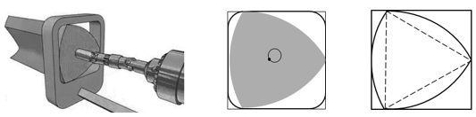
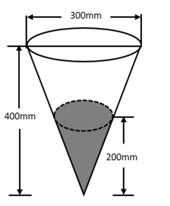
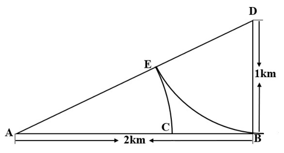
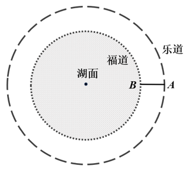

# 2024年河北省公务员录用考试《行测》题（网友回忆版）

> 数量关系 · 15 题 · 河北 2024

## 第 1 题　qid 16592946 · 数学运算

大学生创业主要集中在高科技、智力服务、连锁加盟和自媒体运营四个领域。某学院今年选择创业的大学毕业生不到50人，其中选择智力服务领域、连锁加盟领域和自媒体运营领域的分别占，和。那么该学院今年选择高科技领域创业的大学毕业生有多少人?

- **A**. 1　✅
- **B**. 3
- **C**. 5
- **D**. 7

**答案**：A

**官方解析**

根据“其中选择智力服务领域、连锁加盟领域和自媒体运营领域的分别占，和”可知，总人数是7、2、3的倍数，又因7、2、3互质，所以总人数为7×2×3=42的倍数。由于选择创业的大学毕业生不到50人，则总人数为42人。因此选择智力服务领域、连锁加盟领域和自媒体运营领域的人数分别为：人、人、人，则选择高科技领域创业的大学毕业生有42-6-21-14=1人。

故正确答案为A。

---

## 第 2 题　qid 16592964 · 数学运算

中秋节前夕，小赵买了6个外观相同的月饼，其中有3个是蛋黄馅的。回到家后，小赵从中任取3个月饼，里面恰好有1个是蛋黄馅的概率是：

- **A**. 

　✅
- **B**. 

- **C**. 

- **D**. 

**答案**：A

**官方解析**

根据题意可知，总情况数为小赵从6个月饼中选择3个，共有种情况。满足条件情况数为小赵从3个蛋黄馅月饼中选择1个，从余下3个月饼中选择2个，共有种情况。则所求概率P。

故正确答案为A。

---

## 第 3 题　qid 16592955 · 数学运算

某农产品基地对外供应一批农副产品。假设这批农副产品每天都有定量的自然损耗，如果提货方每天运走1.5吨产品，则50天运完；如果提货方每天运走2吨产品，则40天运完。那么这批农副产品有多少吨?

- **A**. 75
- **B**. 80
- **C**. 100　✅
- **D**. 110

**答案**：C

**官方解析**

根据题意，设每天定量的自然损耗为x吨，根据农副产品总量不变可列式：1.5×50+50x=2×40+40x，解得x=0.5，即每天定量的自然损耗为0.5吨，故这批农副产品有1.5×50+0.5×50=100吨。
故正确答案为C。

---

## 第 4 题　qid 16593220 · 数学运算

某公园绿化管理部门采购了100片围栏，每片长1米且不可弯折。现拆分拟围成5块周长相等且互不相邻的矩形花卉区域。若不考虑拼接间隙，那么这5块区域的最大与最小面积最多可相差多少平方米？

- **A**. 10
- **B**. 12
- **C**. 16　✅
- **D**. 25

**答案**：C

**官方解析**

根据题意，这5块矩形花卉区域周长相等，则每块矩形的周长为米。因为围栏不可弯折，则矩形的宽最小为1米，那么：

当宽为1米时，长为米，面积为1×9=9平方米；

当宽为2米时，长为米，面积为2×8=16平方米；

当宽为3米时，长为米，面积为3×7=21平方米；

当宽为4米时，长为米，面积为4×6=24平方米；

当宽为5米时，长为米，面积为5×5=25平方米。

综上可得，面积最大为25平方米，最小为9平方米，最多相差25-9=16平方米。

故正确答案为C。

---

## 第 5 题　qid 16592948 · 数学运算

某单位为解决职工暑期“带娃难”的问题，开设了暑托班。开班时男孩与女孩的比例为3：4，后来有2个男孩、1个女孩退出暑托班，此时男孩与女孩的比例为2：3。那么开班时女孩有多少人?

- **A**. 10
- **B**. 12
- **C**. 14
- **D**. 16　✅

**答案**：D

**官方解析**

方法一：设开班时男孩有3x人，女孩有4x人，后来有2个男孩、1个女孩退出，可得，解得x=4，则开班时女孩有16人。

方法二：开班时男孩、女孩的比例为3：4，则开班时女孩为4的倍数，排除A、C两项；后来女孩退出1人后为3的倍数，将B项代入12-1=11，不满足3的倍数，排除；D项16-1=15，满足3的倍数，当选。

故正确答案为D。

---

## 第 6 题　qid 16592950 · 数学运算

为弘扬耕读文化，某校打造多样化“校外+校内”耕读文化教育基地，有种植、绘画、编织、美食四个主题基地供同学们选学。假设每位学生选择1个主题基地参与学习，那么甲、乙、丙、丁4名学生中至少有3名学生选择不同主题基地的方法有多少种？

- **A**. 24
- **B**. 60
- **C**. 144
- **D**. 168　✅

**答案**：D

**官方解析**

根据题干条件，甲、乙、丙、丁4名学生中至少有3名学生选择不同主题基地的方法可分为以下两种情况：

①有4名学生选择不同主题基地，情况数为：种；

②有3名学生选择不同主题基地，则其中存在2名学生选择的主题基地相同，先从4名学生中选2名学生选择相同的主题基地，情况数有种，剩余2名学生可从剩下的3个主题基地中选择其中两个，情况数有种，则有3名学生选择不同主题基地的情况数为：24×6=144种。

故总的情况数为：24+144=168种。

故正确答案为D。

---

## 第 7 题　qid 16592959 · 数学运算

原油A每吨的价格为0.3万元，可提炼苯乙烯0.5吨，提炼过程中每吨原油产生的废气量为0.4吨；原油B每吨的价格为0.4万元，可提炼苯乙烯0.7吨，提炼过程中每吨原油产生的废气量为0.3吨。若要提炼至少1.9吨的苯乙烯且产生的废气量不超过1吨，则购买原油的最低费用为多少万元？

- **A**. 1
- **B**. 1.1　✅
- **C**. 1.2
- **D**. 1.3

**答案**：B

**官方解析**

根据题意可知，原油A提炼出1吨苯乙烯的成本为万元，原油B提炼出1吨苯乙烯的成本为万元，因此购买原油B提炼苯乙烯的费用更低；每吨A、B原油产生的废气量分别为0.4吨、0.3吨，原油B产生废气量更少，综合考虑应尽可能多购买原油B。提炼1.9吨的苯乙烯，优先购买原油B：······0.5（注：默认每类原油都购买整数吨），即最多购买2吨原油B，提炼剩下的0.5吨的苯乙烯还需要购买1吨原油A，此时共产生废气量为2×0.3+0.4=1吨，符合题干要求，则最低费用为2×0.4+0.3=1.1万元。

故正确答案为B。

备注：本题若不默认按整数吨购买，计算为万元，也需选择B项。 

---

## 第 8 题　qid 16592933 · 数学运算

某公司开展迎新春三分球投篮比赛。3个部门分别派出2、4、4个选手共计10人参加。规则要求同一个部门的选手顺序相连、全部投完再安排另一个部门的人员开始投篮，则这10人不同的投篮顺序种数的范围是：

- **A**. 小于1000
- **B**. 1000~5000
- **C**. 5001~10000　✅
- **D**. 10000以上

**答案**：C

**官方解析**

根据题意，要求同一部门的选手顺序相连，故可先将同一部门的选手捆绑起来，再对三个部门进行排序。因同一部门的选手有先后之分，则3个部门分别有、、种排列方式，3个部门共有种排列方式。故一共有2×24×24×6=6912种不同的投篮顺序，在C项范围内。

故正确答案为C。

---

## 第 9 题　qid 16592954 · 数学运算

莱洛三角形是以等边三角形三个顶点为圆心，边长为半径，在顶点的对边画弧所得的封闭图形，这种形状的钻头可钻出四角为圆弧的正方形的孔洞（如左下图所示）。现将某莱洛三角形钻头所钻孔洞近似为正方形，测得该正方形孔洞截面积为（如右下图所示），则该钻头的截面积为：

- **A**. 

- **B**. 

- **C**. 

- **D**. 

　✅

**答案**：D

**官方解析**

如下图所示，扇形GEF与AC相切于点H，连接GH，则，且三角形GEF为正三角形，则GE=GF=EF=GH=AB，即三角形GEF的边长与正方形ABDC的边长相等。已知，则EF=AB=5cm，。由于正三角形内角为，，则所求钻头的截面积。

故正确答案为D。

---

## 第 10 题　qid 16592957 · 数学运算

气象学中，24小时内降落在某面积上的雨水深度叫做日降雨量（不考虑渗漏、蒸发、流失等损耗，单位：mm），将日降雨量记为w，其等级划分如下：小雨（），中雨（），大雨（），暴雨（）。某地某日用一个圆锥形容器接了24小时的雨水（如下图所示），则该地日降雨量等级是：

- **A**. 暴雨
- **B**. 大雨
- **C**. 中雨　✅
- **D**. 小雨

**答案**：C

**官方解析**

由题意可得，总降雨量为圆锥CDE的体积，本题所求日降雨量w是降落在直径为300mm面积上的水深。如图，，所以，由此可得mm，总降雨量。则所求日降雨量 ，求得mm，在中雨范围内。

故正确答案为C。

---

## 第 11 题　qid 16592942 · 数学运算

A、D两地设有通信基站（如下图所示），发射信号范围分别是以A、D为圆心，AE和DB为半径的圆形区域，小林从B地出发，沿与DB垂直的BA方向匀速行进，步行速度为4千米/小时，那么步行约多少分钟后小林的手机能够重新接收到信号？（）

- **A**. 8
- **B**. 10
- **C**. 12　✅
- **D**. 14

**答案**：C

**官方解析**

根据题意可知，扇形AEC和扇形DEB分别被A、D两地的通信基站发射的信号所覆盖，故小林由B点出发后，手机就不能接收到信号，沿与DB垂直的BA方向匀速行进到C点后手机可以重新接收到信号。根据勾股定理可得km，又由DE=DB=1km，可得km，故km；根据题意，需要计算小林步行走BC的时间，步行速度为4km/小时，BC=0.77km，故所需时间为分钟。

故正确答案为C。

---

## 第 12 题　qid 16592952 · 数学运算

中国空间站主体由天和核心舱、问天实验舱、梦天实验舱构成。某次实验需要5名宇航员同时在三个舱中开展，每个人只能去一个舱，每个舱至少安排1名宇航员，其中甲宇航员只能去问天实验舱和梦天实验舱中的一个，则不同的安排方法有多少种？

- **A**. 72
- **B**. 88
- **C**. 100　✅
- **D**. 144

**答案**：C

**官方解析**

根据题意，5名宇航员安排到三个舱，每个舱至少安排1名宇航员，那么三个舱中的人数有两种情况：

①人数分别为1人、2人、2人。

若甲在1人舱，甲有种情况，剩下4人平均安排到剩下2个舱有种情况，则共有种情况；

若甲在2人舱，甲有种情况，剩余4人选1人和甲同一舱有种情况，还剩下3人安排到剩下2个舱，其中一个1人，另一个2人，有种情况，则共有种情况；

②人数分别为1人、1人、3人。

若甲在1人舱，甲有种情况，剩下4人安排到剩下2个舱，其中一个1人，另一个3人，有种情况，则共有种情况；

若甲在3人舱，甲有种情况，剩余4人选2人和甲同一舱有种情况，还剩下2人平均安排到剩下2个舱有种情况，则共有种情况；

综上共有12+48+16+24=100种情况。

故正确答案为C。

---

## 第 13 题　qid 16592953 · 数学运算

某旅游公司定制甲、乙两种纪念品，第一次共定制50个。试销后根据反馈，第二次定制两种纪念品共70个，其中乙纪念品个数是第一次的。已知甲纪念品单价为15元，第一次定制花费1150元，那么第二次定制花费多少元?

- **A**. 1150　✅
- **B**. 1725
- **C**. 2300
- **D**. 2875

**答案**：A

**官方解析**

根据题意，第二次定制的乙变为第一次的，假设第二次定制的甲也变为第一次的，则第二次总定制数量为个，第二次总金额为元。此时比实际第二次定制少了70-12.5＝57.5个甲，总金额少了57.5×15＝862.5元，所以实际第二次定制花费287.5+862.5=1150元。

故正确答案为A。

---

## 第 14 题　qid 16592970 · 数学运算

某社区服务中心拟引入优质资源为本社区45名老人提供居家养老服务。已知老人的年龄构成如下（设老人的年龄为x）：有17人，有12人，有11人，90岁及以上有5人。现从该社区中随机抽取两名老人了解居家养老服务情况，那么这两名老人恰好都在80岁以上（含80岁）的概率是：

- **A**. 

　✅
- **B**. 

- **C**. 

- **D**. 

**答案**：A

**官方解析**

根据概率问题公式，概率。总情况数为45名老人随机选两人，共有种情况。满足要求的情况数为在80岁以上（含80岁）的11+5=16人中随机选两人，共有种情况。则所求概率。

故正确答案为A。

---

## 第 15 题　qid 16592938 · 数学运算

某地人工湖景区开辟了沿湖福道和环湖乐道两条圆形观景道供市民休闲健身（如下图所示）。小李和他的妈妈分别沿乐道和福道从A、B两地同时同向而行（A、B两点间距离为50米），小李骑自行车的速度是妈妈步行速度的6倍，已知妈妈步行速度为每小时5千米，妈妈沿福道步行一周的时间是小李骑行乐道时间的4倍，那么这个湖面的面积约多少万平方米?（圆周率取3）

- **A**. 2
- **B**. 3　✅
- **C**. 4
- **D**. 6

**答案**：B

**官方解析**

设小李骑行外圆（乐道）的半径为R、妈妈步行内圆（福道）的半径为r，如下图所示：

设小李骑行外圆一周的时间为t，则妈妈步行内圆一周的时间为4t。因两人的路程分别为内外两圆的周长，则可列式：······①，······②，根据A、B两点间距离为50米，即R=r+50，联立①②式，解得r=100米，则湖面面积（图中内圆面积）。

故正确答案为B。

---
