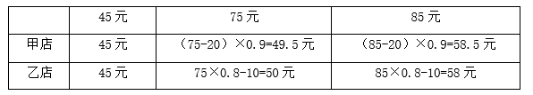
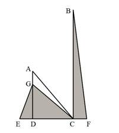
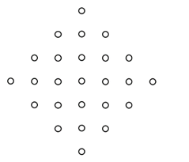
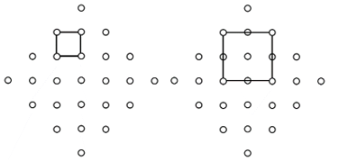
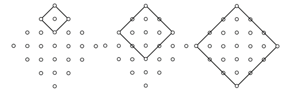
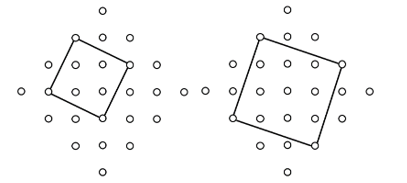
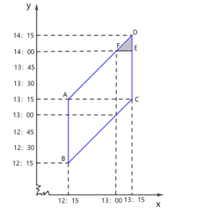
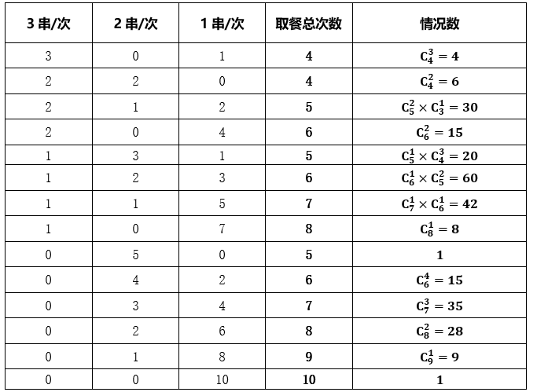

# 2024年浙江省公务员录用考试《行测》题（C类）（网友回忆版）

> 数量关系 · 14 题 · 浙江 2024

## 第 1 题　qid 5911176 · 数学运算

3，-5，6，-9，11，-15，18，-23，（    ）

- **A**. -33
- **B**. 27　✅
- **C**. 35
- **D**. 45

**答案**：B

**官方解析**

观察发现数列项数较多，考虑多重数列。优先交叉看，奇数项数列：3，6，11，18，（    ），无明显特征，考虑作差，后项减前项可得：3，5，7，（    ），是公差为2的等差数列，下一项为7+2=9，故所求项为9+18=27；偶数项数列：-5，-9，-15，-23，无明显特征，考虑作差，后项减前项可得：-4，-6，-8，是公差为-2的等差数列。
故正确答案为B。

---

## 第 2 题　qid 5911193 · 数学运算

，729，9，81，27，（    ）

- **A**. 

　✅
- **B**. 
36

- **C**. 

- **D**. 
45

**答案**：A

**官方解析**

数列变化起伏较大，且存在典型幂次数，优先考虑幂次数列。原数列可转化为：，，，，，（    ）。数列的底数均为3，指数依次为：-2，6，2，4，3，（    ），无明显特征，考虑作差，后项减前项得到新数列：8，-4，2，-1，（    ），是公比为的等比数列，则所求项的指数为。故所求项为。

故正确答案为A。

---

## 第 3 题　qid 5911213 · 数学运算

9，18，，，，（    ）

- **A**. 

- **B**. 

- **C**. 

- **D**. 

　✅

**答案**：D

**官方解析**

数列大部分为分数，考虑分数数列。观察无明显规律，考虑作差。后项减前项得到新数列：9，，，，（    ），将新数列转化为：，，，，（    ）。新数列分子部分：9，27，81，243，（    ），是公比为3的等比数列，则下一项分子部分为243×3=729；新数列分母部分：1，2，4，8，（    ），是公比为2的等比数列，则下一项分母部分为8×2=16，故新数列下一项为。所求项为。

故正确答案为D。

---

## 第 4 题　qid 5911197 · 数学运算

1.4，4.2，21，147，1323，（    ）

- **A**. 12043
- **B**. 13042
- **C**. 14553　✅
- **D**. 16048

**答案**：C

**官方解析**

数列相邻两项之间有明显的倍数关系，优先考虑作商。后项÷前项得到新数列：3，5，7，9，（    ），是公差为2的等差数列，则新数列下一项为9+2=11。故所求项为1323×11=14553。
故正确答案为C。

---

## 第 5 题　qid 5911220 · 数学运算

时钟的分针顶点距离圆心5厘米，现在时间为7：30，那么接下来时针和分针第三次成直角的时候，分针顶点走过的长度累计为多少厘米？

- **A**. 

- **B**. 

　✅
- **C**. 

- **D**. 

**答案**：B

**官方解析**

由题意可知，7：30至8：00之间会有一次直角，根据每小时有两次时针和分针成直角的情况，可知8：00至9：00之间会有两次直角，故第三次时针和分针成直角的时间是9：00。7：30到9：00经过1.5小时，分针每小时走1个圆周，因此分针共走了1.5个圆周。根据公式：周长，可知分针顶点走过的长度累计为厘米。

故正确答案为B。

---

## 第 6 题　qid 5911185 · 数学运算

有一批零件，如果由甲、乙两人加工，20小时可以完成，需要支付酬劳1200元；如果由甲、丙两人加工，15小时可以完成，需要支付酬劳1350元；如果由乙、丙两人加工，12小时可以完成，需要支付酬劳1320元。现在安排3人都参与加工，并要求在13小时以内完成，那么最少需要支付酬劳多少元？

- **A**. 1270　✅
- **B**. 1280
- **C**. 1290
- **D**. 1300

**答案**：A

**官方解析**

赋值工作总量为20、15、12的最小公倍数60。根据题意，可列式为；；，联立解得：，，。已知甲、乙合作20小时支付酬劳1200元，甲、丙合作15小时支付酬劳1350元，乙、丙合作12小时支付酬劳1320元，可列式为：······①；······②；······③。解得甲的酬劳为20元/小时，乙的酬劳为40元/小时，丙的酬劳为70元/小时。若要支付酬劳最少，则单位效率酬劳低的人尽可能多干。甲、乙、丙单位效率的酬劳分别为；；，可知单位效率下，甲和乙所需酬劳更少。应让甲、乙尽可能多做，丙尽可能少做。由于要求在13小时以内完成，即让甲、乙工作满13小时，二人工作量为（1+2）×13=39，剩余工作量为60-39=21，由丙完成即可，则最少需要支付酬劳元。

故正确答案为A。

---

## 第 7 题　qid 5911189 · 数学运算

小张和小王的年龄之和为45岁。5年之后小李的年龄比小张的3倍少16岁。已知小张的年龄比小王小，那么再过5年，3人的平均年龄最大可能为多少岁？

- **A**. 45　✅
- **B**. 48
- **C**. 50
- **D**. 54

**答案**：A

**官方解析**

设小张今年x岁，则5年后小李3（x+5）-16=（3x-1）岁。再过5年，即10年后，小张和小王的年龄之和为45+10+10=65岁，小李年龄为3x-1+5=（3x+4）岁，则3人的平均年龄为岁。要想3人的平均年龄最大，则x取最大值。根据“小张和小王的年龄之和为45岁”且“小张的年龄比小王小”，可知小张的年龄岁，可得x最大为22，因此再过5年，3人的平均年龄最大为22+23=45岁。

故正确答案为A。

---

## 第 8 题　qid 5911191 · 数学运算

甲、乙两店同时开展促销活动，甲店单件商品的标价超过50元可以立减20元后再打9折，乙店单件商品的标价超过50元可以打8折后再立减10元。现两家店都在销售3种商品，相同商品在两店价格相同，分别为45元、75元、85元，某人准备购买其中两种商品各一件，最少的花费在以下哪个范围之内？

- **A**. 90元以下
- **B**. 90~93元
- **C**. 93~96元　✅
- **D**. 96元以上

**答案**：C

**官方解析**

根据题意，购买3种商品在甲、乙两店的花费如下表：

比较可得，购买其中两种商品各一件，最少花费45+49.5=94.5元，在C项范围内。

故正确答案为C。

备注：同一家店，85元商品的花费一定高于75元商品，实际计算时算出75元商品在甲、乙两店的花费均大于45元，即可确定花费最少的情况，无须再计算85元商品进行比较。

---

## 第 9 题　qid 5911203 · 数学运算

甲、乙两人以相同速度一起骑车从A地前往B地。同行1小时后，两人休息20分钟，然后甲继续原速出发，此时乙发现有重要物品未带，原速返回A地去取，到达A地后立即开车前往B地。最终乙比甲提前12分钟到达B地。已知开车速度是骑行速度的5倍，那么甲全程用了多少分钟？

- **A**. 165
- **B**. 175
- **C**. 185　✅
- **D**. 195

**答案**：C

**官方解析**

题干中只给出时间，没有具体的速度和路程，考虑用赋值法解题，赋值甲、乙两人骑车的速度均为1，则乙开车的速度为5。根据“乙原速返回A地”，可知乙返回A地需要1小时，此时甲骑行了1+1=2小时=120分钟。设从A地前往B地乙开车的时间为t分钟，则甲骑行的时间为（120+t+12）分钟，根据公式：路程=速度×时间，可得1×（120+t+12）=5×t，解得t=33，则甲全程用时=骑行时间+休息时间=（120+33+12）+20=185分钟。
故正确答案为C。

---

## 第 10 题　qid 5911186 · 数学运算

某公司招聘员工，来应聘的男女人数比是18：17，最后被录取的有280人，其中男女人数比是3：4，未被录取的男女人数比是6：5。问来应聘的共有多少人？

- **A**. 630
- **B**. 720
- **C**. 1050　✅
- **D**. 1400

**答案**：C

**官方解析**

方法一：由于被录取的有280人，其中男女人数比是3：4，可知被录取的男女人数分别为：人、280-120=160人。设来应聘的男性人数为18x人、女性人数为17x人，根据未被录取的男女人数比是6：5，可知，解得x=30。则来应聘的共有人。

方法二：来应聘的男女人数比是18：17，可知来应聘的总人数是18+17=35的倍数，选项720不是35的倍数，排除B项。根据未被录取的男女人数比是6：5，可知未被录取人数是6+5=11的倍数。而应聘总人数-录取人数=未被录取人数，代入剩余选项：A项，630-280=350，不是11倍数，排除；D项、1400-280=1120，不是11倍数，排除。C项，1050-280=770，是11倍数，当选。

故正确答案为C。

---

## 第 11 题　qid 5911194 · 数学运算

一块空地如下图所示，AD、BC均与底边垂直，三角形ACD为等腰直角三角形，且AG、DE、CF长度均相等。现在图中阴影部分种上草皮，已知DF长80米，BC长160米，那么草皮面积为多少平方米？

- **A**. 3200　✅
- **B**. 3600
- **C**. 4000
- **D**. 4800

**答案**：A

**官方解析**

设AG、DE、CF长度均为x米，则DC=DF-CF=（80-x）米，EC=DE+DC=x+（80-x）=80米。根据题意，AD=DC，则GD=AD-AG=（80-x）-x=（80-2x）米。根据公式：，则平方米；平方米。故草皮面积平方米。

故正确答案为A。

---

## 第 12 题　qid 5911206 · 数学运算

如图所示有25个点，行、列都以相等的间隔排列。用其中4个点作为顶点连接成正方形，那么有多少种不同边长的正方形？

- **A**. 4
- **B**. 5
- **C**. 6
- **D**. 7　✅

**答案**：D

**官方解析**

将同一行、同一列两点之间的距离赋值为1。要求选出4个点作为顶点连接成正方形，对正方形在一条边上的两个点分情况讨论：

（1）在一条边上的两个点在同一行或列上，正方形边长有1、2共2种情况，如下图所示。

（2）在一条边上的两个点在同一条斜线上，正方形边长有、 、共3种情况，如下图所示。

（3）在一条边上的两个点既不在同一行或列上，也不在同一条斜线上，正方形边长有、共2种情况，如下图所示。

综上，共有2+3+2=7种不同边长的正方形。

故正确答案为D。

---

## 第 13 题　qid 5911219 · 数学运算

某同学在某天12：15-13：15内随机一个时刻开始午睡，午睡时长为0-1小时内的随机时间。问该同学在14：00之后起床的概率为：

- **A**. 

- **B**. 

　✅
- **C**. 

- **D**. 

**答案**：B

**官方解析**

设该同学开始午睡的时间为x，起床的时间为y。如下图所示，直线，围成的平行四边形ABCD区域即为该同学可能的起床时间。结合题意，午睡时长为0-1小时，要想满足该同学在14：00之后起床，则开始午睡的时间要在13：00-13：15之间，最晚的起床时间对应14：00-14：15之间，即图中三角形DEF对应的阴影区域。假设每分钟对应的长度为1，则，，故所求概率为。

故正确答案为B。

---

## 第 14 题　qid 5911232 · 数学运算

某自助餐厅提供羊肉串，小王怕浪费每次最多只拿3串。已知他正好吃了10串，那么他共有多少种不同的拿法？

- **A**. 44
- **B**. 81
- **C**. 149
- **D**. 274　✅

**答案**：D

**官方解析**

方法一：根据题意可知，小王每次只能拿1串、2串或3串，一共吃了10串。若有3次拿了3串，1次拿了1串，则一共取餐4次，即这4次取餐中有3次是拿了3串，有种不同的取餐情况。同理，不同拿法可列表如下：

则所求总情况共有4+6+30+15+20+60+42+8+1+15+35+28+9+1=274种。

方法二：爬楼梯模型。本题可以理解为一共爬了10级台阶，每次可以爬1至3级。

先对简单情况进行讨论：

①爬上1级台阶，只有一次上了1级，共1种情况；

②爬上2级台阶，上楼梯的情况有（1，1）、（2），共2种情况；

③爬上3级台阶，上楼梯的情况有（1，1，1）、（1，2）、（2，1）、（3），共4种情况；

④爬上4级台阶，可以对最后一次上的台阶数进行分类讨论：

a.最后一次爬了3级，则需先爬了1级台阶，同①有1种情况；

b.最后一次爬了2级，则需先爬了2级台阶，同②有2种情况；

c.最后一次爬了1级，则需先爬了3级台阶，同③有4种情况；

所以爬4级台阶的情况数为a.b.c.三类情况数之和，即等于爬1级、2级、3级的情况数之和，共1+2+4=7种情况。

以此类推，由于最后一次可以爬1至3级台阶，所以爬上n（n＞3）级台阶情况数等于爬n-3级、n-2级、n-1级的情况数之和，则有：

爬上5级台阶的情况数等于爬2级、3级、4级的情况数之和，共2+4+7=13种情况；

爬上6级台阶的情况数等于爬3级、4级、5级的情况数之和，共4+7+13=24种情况；

爬上7级台阶的情况数等于爬4级、5级、6级的情况数之和，共7+13+24=44种情况；

爬上8级台阶的情况数等于爬5级、6级、7级的情况数之和，共13+24+44=81种情况；

爬上9级台阶的情况数等于爬6级、7级、8级的情况数之和，共24+44+81=149种情况；

爬上10级台阶的情况数等于爬7级、8级、9级的情况数之和，共44+81+149=274种情况，即题目所求情况为274种。

故正确答案为D。

【考场思维】因为每次最多能拿3串，所以最后一次取的串数只有3、2、1串，则前面几次需要取的串数应为7、8、9串，因此拿10串的方法数等于拿7串、8串、9串的情况数之和。观察选项数字A+B+C=D，大胆推测前三个选项分别为拿7串、8串、9串的情况数，则D项为答案。

---
