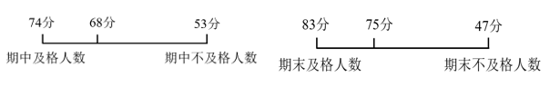
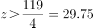
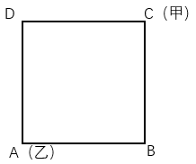
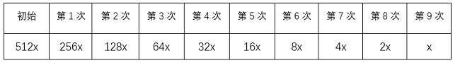

# 2024年海南省公务员录用考试《行测》题（网友回忆版）

> 数量关系 · 14 题 · 海南 2024

## 第 1 题　qid 10204667 · 数学运算

A、B两地相距100米，甲、乙两人分别从AB两地同时出发，匀速相向而行，相遇后，甲原路返回A地，乙继续向A前行，当甲、乙均到A地结束。已知乙的用时是甲的三倍，那么甲的速度是乙的：

- **A**. 2倍
- **B**. 3倍
- **C**. 4倍
- **D**. 5倍　✅

**答案**：D

**官方解析**

设甲、乙第一次相遇用时为，则甲原路返回A地用时也为，共用时；乙的用时是甲的三倍，则乙到达A地用时为。两人在第一次相遇时用时均为，可知乙从两人相遇点到达A地用时为。根据路程相同，时间与速度成反比，可知从A地到相遇点，，即甲的速度是乙的5倍。

故正确答案为D。

---

## 第 2 题　qid 10204668 · 数学运算

AB两地有三种不同的航线飞行时长分别为5、6、7小时，甲乙两人同时从A地出发，到达B地后返回A地，同时返回的飞行方案有几种?

- **A**. 9
- **B**. 11
- **C**. 19　✅
- **D**. 21

**答案**：C

**官方解析**

根据题意可知，甲、乙两人同时从A地出发到达B地后同时返回A地，故两人选择飞行方案总时长相同，具体情况如下：

①两人往返选择同一种航线：甲、乙选择“5、6、7”三种航线中的同一种，则情况数有种；

②两人往返选择两种航线：甲、乙选择“5、6、7”三种航线中的同样两种，则情况数有种；

③两人往返共选择三种航线：若甲选择“5+7”航线，为保证总时长相同，则乙只能选择“6+6”航线，反之成立，则情况数有种。

综上所述，甲、乙二人同时出发同时返回的飞行方案共有3+12+4=19种。

故正确答案为C。

---

## 第 3 题　qid 16593096 · 数学运算

运动会招募志愿者，第一次招募了不到100人，其中男女比例为11：7；补招若干女性志愿者后，男女比例变为4：3。问最多可能补招了多少名女性志愿者？

- **A**. 3
- **B**. 5　✅
- **C**. 6
- **D**. 10

**答案**：B

**官方解析**

根据“男女比例为11：7”“补招若干女性志愿者后，男女比例变为4：3”可知，男生人数既是11的倍数，又是4的倍数，男生人数为44n。结合“第一次招募了不到100人”可知，男生人数是44人，原来女生人数为44÷11×7=28人；补招后女生人数变为44÷4×3=33人。可知女生最多可能补招人数为33-28=5人。
故正确答案为B。

---

## 第 4 题　qid 10204498 · 数学运算

一块直角三角形绿地的三边均铺有长度为整数米的水管，其中一条直角边外的水管长7米。若在水管上随机任选1个点做标记，则该标记点在斜边上的概率在以下哪个范围内？（忽略水管直径）

- **A**. 小于0.35
- **B**. 在0.35~0.42之间
- **C**. 在0.42~0.50之间　✅
- **D**. 大于0.50

**答案**：C

**官方解析**

根据题意，若直角三角形一条直角边为a，a=7米，设另外一条直角边为b，斜边长为c，根据勾股定理可知，即（c+b）×（c-b）=49×1，可得：c+b=49······①，c-b=1······②，联立①②两式，解得：b=24米，c=25米。根据公式：概率，若在水管上随机任选1个点做标记，则该标记点在斜边上的概率为，在C项范围内。

故正确答案为C。

---

## 第 5 题　qid 16593094 · 数学运算

高校管理学院某期培训班有不到100名学员参加，期中、期末两次考试平均分分别为68分和75分，期中考试不及格学员平均分为53分，及格学员平均分为74分；期末考试不及格学员平均分为47分、及格学员平均分为83分。问这期培训班有多少名学员参加？

- **A**. 42
- **B**. 54
- **C**. 63　✅
- **D**. 77

**答案**：C

**官方解析**

方法一：设该期培训班期中考试及格人数和不及格人数分别为x、y人，期末考试及格人数和不及格人数分别为a、b人，根据题意可知，期中考试总成绩为74x+53y=68（x+y），化简可得2x=5y，所以，则总人数x+y为7的倍数；期末考试总成绩为83a+47b=75（a+b），化简可得2a=7b，所以，则总人数a+b为9的倍数。综上，总人数为7和9的公倍数，即为63的倍数，结合总人数不到100人，则总人数为63人。

故正确答案为C。

方法二：由期中考试不及格学员平均分为53分，及格学员平均分为74分，期中考试平均分为68分，根据线段法口诀“距离与量成反比”可得，，解得，则总人数为7的倍数；由期末考试不及格学员平均分为47分、及格学员平均分为83分，期末考试平均分为75分，根据线段法口诀“距离与量成反比”可得，，解得，则总人数为9的倍数。综上，总人数为7和9的公倍数，即为63的倍数，结合总人数不到100人，则总人数为63人。

故正确答案为C。

---

## 第 6 题　qid 16593097 · 数学运算

商店销售甲、乙、丙、丁四种商品，每件分别盈利15元、9元、4元和1元。某日销售这四种商品共40件，共盈利201元。四种商品每种至少销售1件，且甲、丁商品销量相同。问当天丙商品的销量为多少件？

- **A**. 21
- **B**. 27
- **C**. 29
- **D**. 31　✅

**答案**：D

**官方解析**

根据“甲、丁商品销量相同”，设甲、乙、丙、丁四种商品销量分别为x件、y件、z件、x件。根据“这四种商品共40件”可得，2x+y+z=40······①；根据“共盈利201元”可得，15x+9y+4z+x=201······②。令①×8-②可消去x，得4z-y=119。因为四种商品每种至少销售1件，可得4z＞119，即，排除A、B、C三项。代入D项验证，若z=31，则y=4z-119=124-119=5，2x=40-31-5=4，x=2，符合题干所有条件。

故正确答案为D。

---

## 第 7 题　qid 16593104 · 数学运算

一个白色圆柱体零件的底面半径是高的1.5倍，现将其表面涂上黑漆之后，沿下图所示虚线方向切割为4个完全相同的部分。问单个部分的黑色面积是白色面积的多少倍？（）

- **A**. 不到1.1倍
- **B**. 1.1-1.2倍之间　✅
- **C**. 1.2-1.3倍之间
- **D**. 1.3倍以上

**答案**：B

**官方解析**

根据题意，赋值该圆柱零件高为2，则底面半径为3，；切割后单个部分如图所示，其黑色面积，其白色面积，则所求倍数为倍，在B项范围内。

故正确答案为B。

---

## 第 8 题　qid 16593102 · 数学运算

某校园围墙外的道路形成一个边长为300米的正方形（如图所示），甲、乙两人分别从正方形的两个对角沿逆时针方向同时出发，甲、乙的步行速度比为9：7。问甲、乙两人第一次处于同一条边是在哪一条边上？

- **A**. AB
- **B**. BC
- **C**. CD
- **D**. DA　✅

**答案**：D

**官方解析**

根据题意，设甲的速度为9v，则乙的速度为7v。甲、乙初始路程差为CD+DA=300+300=600米，若甲、乙两人第一次处于同一条边，即两人路程差米。根据追及公式：，当甲与乙相差300米时，可列式：300=（9v-7v）×t，解得vt=150，则此时甲所走路程=9v×t=1350米（走完一圈300×4=1200米多150米），甲在CD中点；此时乙所走路程=7v×t=1050米（还差150米走完一圈），乙在DA中点。因，故当甲到达D点时，乙未到达A点，此时甲、乙两人均在DA边，且为第一次处于同一条边。

故正确答案为D。

---

## 第 9 题　qid 10204486 · 数学运算

甲、乙两工厂共同完成某个生产订单需要12天。现两工厂共同生产8天后，再由乙单独生产7天，一共完成了订单总量的90%。若整个订单由乙单独生产，那么需要多少天完成？

- **A**. 20
- **B**. 23
- **C**. 26
- **D**. 30　✅

**答案**：D

**官方解析**

根据题意，甲、乙两工厂的工作效率满足：8（甲+乙）+7乙=12（甲+乙）×90%，整理可得甲、乙两工厂的工作效率之比为3：2。赋值甲的工作效率为3，乙的工作效率为2，则该订单的工作总量为12×（3+2）=60，故所求为天。

故正确答案为D。

---

## 第 10 题　qid 16593098 · 数学运算

c地为a、b两地直线道路上的一点，甲、乙两人9：00分别自a、b两地同时出发匀速相向而行，甲的速度是乙的1.5倍，甲9：40到达c地休息10分钟后继续向b地前进；乙全程不休息，在10：40到达c地，问甲、乙相遇的时间为：

- **A**. 10：00
- **B**. 10：10　✅
- **C**. 10：20
- **D**. 10：30

**答案**：B

**官方解析**

方法一：赋值甲每分钟的速度为3，乙每分钟的速度为2。根据甲9：40到达c地，则；乙全程不休息，在10：40到达c地，则，因此ab的路程。设甲、乙两人从9：00开始出发t分钟后相遇，则，解得t=70，因此甲、乙相遇的时间为9：00+70分钟=10：10。

方法二：赋值甲每分钟的速度为3，乙每分钟的速度为2。根据乙9：00出发，在10：40到达c地，可得乙从b地到c地的路程为2×100=200。当甲9：50离开c地继续向b地前进时，乙已走的路程为2×50=100，此时甲、乙继续相向而行所需的相遇时间分钟，则甲、乙相遇时间为9：50+20分钟=10：10。

故正确答案为B。

---

## 第 11 题　qid 10204488 · 数学运算

某餐饮店接到一份粽子订单，张师傅与李师傅同时工作8小时可完成。现张师傅先独自包粽子3小时，李师傅接着独自包了1小时，还剩订单总数的没完成。已知张师傅每小时比李师傅多包14个粽子。问这份订单粽子的总数是多少个？

- **A**. 224　✅
- **B**. 296
- **C**. 320
- **D**. 416

**答案**：A

**官方解析**

根据题意可得，张师傅和李师傅的效率关系为：3×张+1×李=8×（张+李）×（），整理可得，张：李=3：1，设张师傅的效率为每小时3x个，李师傅的效率为每小时x个。根据“张师傅包粽子比李师傅每小时多14个”可得，3x-x=14，解得x=7，则一共有8×（3×7+1×7）=8×28=224个粽子。

故正确答案为A。

---

## 第 12 题　qid 16593103 · 数学运算

安排A、B、C、D共4个研发团队参与甲、乙、丙3个课题的研究，要求每个课题至少有1个团队参与，每个团队必须且只能参与1个课题，如甲课题参与的团队数超过1个，则A、B都不参与甲课题，问共有多少种不同的安排方式？

- **A**. 24
- **B**. 26　✅
- **C**. 36
- **D**. 42

**答案**：B

**官方解析**

根据题意可知，甲课题参与的团队数可能为1个或2个，分情况讨论如下：

（1）甲课题参与的团队数为1个，先从4个研发团队中任意选择1个有种情况，再让剩下3个团队参与乙、丙2个课题有种情况，分步用乘法，共有4×6=24种情况。

（2）甲课题参与的团队数为2个，则只能C、D参与甲课题，剩下A、B2个团队参与乙、丙2个课题有种情况。

分类用加法，则共有24+2=26种安排方式。

故正确答案为B。

---

## 第 13 题　qid 10204639 · 数学运算

因自然灾害产生泄漏，某河流出现A物质污染。根据环保部门要求，自然水源中A物质的浓度不得高于x。经应急处置后，水中的A物质浓度每24小时下降一半。自应急处置时开始，环保部门每24小时对河流水质进行1次检测，在216小时后首次检测到河流中A物质浓度达标。问应急处置前A物质可能的最高浓度在以下哪个范围内？

- **A**. 不到300x
- **B**. 300x~600x　✅
- **C**. 600x~1200x
- **D**. 超过1200x

**答案**：B

**官方解析**

根据题意可知，A物质浓度每24小时下降一半，以24小时为一个周期，则216小时后首次达标时共下降了次，每次下降前是下降后的2倍。若想使应急处置前A物质的浓度最高，则应使9次检测后首次达标时的A物质浓度最高，即正好等于x，向前倒推即可得到A物质的初始浓度为512x，在B项范围内。如下表所示：

故正确答案为B。

---

## 第 14 题　qid 10204669 · 数学运算

一项工程，甲单独做完要8天的时间，甲、乙一起做了4天完成了工程的75%，剩余工程由乙独自完成还需要多少天？

- **A**. 4天　✅
- **B**. 8天
- **C**. 12天
- **D**. 16天

**答案**：A

**官方解析**

根据题意，赋值工程总量为8，甲的效率为，甲、乙效率和为，可知乙的效率为1.5-1=0.5，剩余工程量为8×（1-75%）=2，则乙独自完成还需要天。 

故正确答案为A。

---
