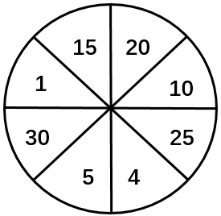
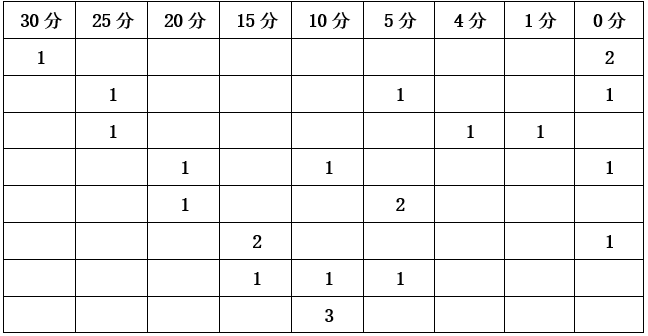
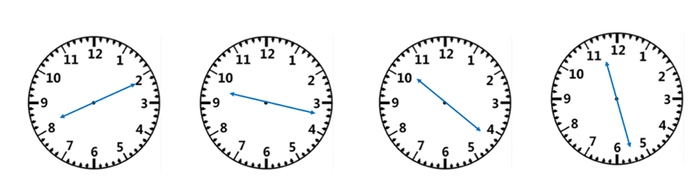
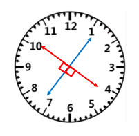
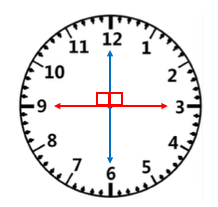

# 2024年深圳市考公务员录用考试《行测》试题（网友回忆版）

> 数量关系 · 13 题 · 深圳市考 2024

## 第 1 题　qid 12536540 · 数学运算

25，4，1，，（    ）

- **A**. 
0

- **B**. 

- **C**. 

- **D**. 
1
　✅

**答案**：D

**官方解析**

数列均为幂次数，优先考虑幂次数列。将原数列转化为：，，，，数列底数为：5，4，3，2，是公差为-1的等差数列，则所求项底数为1；指数为：2，1，0，-1，是公差为-1的等差数列，则所求项指数为-2。故所求项为。

故正确答案为D。

---

## 第 2 题　qid 12536527 · 数学运算

（3，4，5），（6，6，12），（12，8，28），（21，24，51），（    ）

- **A**. （33，48，63）
- **B**. （27，32，85）
- **C**. （36，48，108）
- **D**. （33，64，95）　✅

**答案**：D

**官方解析**

数列各项均三三分组，考虑多重数列。每组中的第一项分别为：3，6，12，21，（    ），后项减前项得到新数列：3，6，9，（    ），是公差为3的等差数列，下一项为12，则所求项中的第一项为21+12=33，排除B、C两项；每组中的三项加和分别为：12，24，48，96，（    ），是公比为2的等比数列，则所求项中的三项加和为96×2=192，排除A项。
故正确答案为D。

---

## 第 3 题　qid 12536542 · 数学运算

4，，1，，，（    ）

- **A**. 

- **B**. 

- **C**. 

　✅
- **D**. 

**答案**：C

**官方解析**

数列部分为分数且选项均为分数，考虑分数数列。对数列进行反约分可得：，，，，，（    ），分子部分为：4，6，9，13，18，（    ），后项减前项可得：2，3，4，5，（    ），为连续自然数列，下一项为6，则分子的下一项为18+6=24；分母部分为：1，4，9，16，25，（    ），均为幂次数，分别为，，，，，（    ），则分母的下一项为。故所求项为。

故正确答案为C。

---

## 第 4 题　qid 12536545 · 数学运算

老刘家有100亩草场，平均每亩草场年产草料4吨。草场上饲养了羊、驴、牛共252头，平均每头羊年需草料1吨，每头驴年需草料2吨，每头牛年需草料5吨。去年老刘家草场恰好能满足草料需求，今年老刘没有饲养羊，但驴和牛的数量都翻了一倍，草场仍恰好满足草料需求，则老刘家去年饲养了（    ）头牛。

- **A**. 32　✅
- **B**. 33
- **C**. 34
- **D**. 35

**答案**：A

**官方解析**

根据题意可知，草场每年可生产草料100×4=400吨。设老刘家去年饲养羊、驴、牛分别为x头、y头、z头，根据“饲养了羊、驴、牛共252头”，可列式：x+y+z=252①；根据去年和今年草场均恰好满足草料需求，且今年没有饲养羊，驴和牛的数量都翻了一倍，可列式：x+2y+5z=400②；2×2y+2×5z=400③。联立方程①、②、③式可解得：x=200、y=20、z=32，则老刘家去年饲养了32头牛。
故正确答案为A。

---

## 第 5 题　qid 12536529 · 数学运算

某早餐店推出“10元2件”套餐，顾客花费10元即可在白粥、豆浆、油条、蛋饼、叉烧包、云吞面6个品类中任选2件，既可以选相同的，也可以选不同的。则至少售出（    ）份该套餐时，一定有2份套餐的搭配完全一致。

- **A**. 15
- **B**. 16
- **C**. 21
- **D**. 22　✅

**答案**：D

**官方解析**

根据题干“至少······一定有”，可判定本题为最不利构造问题。根据题意可知该套餐中共有6个品类可供选择，若选出的2件为相同品类，共有种搭配；若选2件为不同品类，共有种搭配。则最不利情况为每种搭配售出1份，共计6+15=21份。则在此基础上再售出1份，一定有2份套餐的搭配完全一致，故至少售出21+1=22份。

故正确答案为D。

---

## 第 6 题　qid 12536559 · 数学运算

有只松鼠在某处发现了90粒松子，欲搬回25米远的家中储存，但这只松鼠每次最多只能携带45粒，且其往返途中每走1米必须要吃1粒松子。那么松鼠最多能搬（    ）粒松子回家。

- **A**. 0
- **B**. 10
- **C**. 35　✅
- **D**. 40

**答案**：C

**官方解析**

方法一：根据题意可知，松鼠在搬运的往返途中始终要消耗松子，要使松鼠搬回家的松子尽量多，则松鼠需每次出发时携带最多数量的松子，且累计路程尽量少。若松鼠第一次携带45粒松子直接返回家中，则剩余45-25=20粒，不足以返回发现处，故松鼠需在中途中转一次，放下一些松子，再返回发现处搬运剩余的45粒松子。
设松鼠在距离发现处x米处A点中转，第一次携带45粒松子到A点还剩余（45-x）粒松子，返回发现处还需x粒松子，则此时在A点放置（45-2x）粒松子；第二次从发现处携带剩余45粒返回A点，还剩余（45-x）粒松子。此时A地松子累计量为（45-2x）+（45-x）=90-3x，该累计量为松鼠能携带的最大值45粒时，可使剩余量最大，即90-3x=45，解得x=15，则距离家剩余25-15=10米，还需消耗10粒松子，那么松鼠最多能搬45-10=35粒松子回家。
方法二：设松鼠在距离发现松子处x米中转。松鼠总共搬运90粒松子，途中共消耗（2x+25）粒松子。则最多搬运到家的松子数为90-（2x+25）=（65-2x）粒，其中2x为偶数，则（65-2x）一定为奇数，只有C项满足。
故正确答案为C。

---

## 第 7 题　qid 12536535 · 数学运算

某单位制定了年度部门预算，但年中进行了预算调整，行政管理费及人员经费压缩了50万元，这笔钱占原行政管理费及人员经费预算的40%，而原行政管理费及人员经费预算占原部门总预算的25%。则当前该单位部门预算是（    ）万元。

- **A**. 450　✅
- **B**. 125
- **C**. 500
- **D**. 75

**答案**：A

**官方解析**

方法一：根据题意，原行政管理费及人员经费预算为50÷40%=125万元，原部门总预算为125÷25%=500万元，则当前该单位部门预算是500-50=450万元。

方法二：根据题意，，则，可得当前该单位部门预算为9的倍数，只有A项满足。

故正确答案为A。

---

## 第 8 题　qid 12536548 · 数学运算

有如下图所示的飞镖盘，当飞镖落到数字标示的扇形区域，可得相应分数，否则记0分，每个区域可落有多支飞镖。若一次性射出三支飞镖，恰好得到30分，则共有（    ）种得分组合。

- **A**. 6
- **B**. 7
- **C**. 8　✅
- **D**. 9

**答案**：C

**官方解析**

根据题意，三支飞镖得分之和为30分，每支可以得30分、25分、20分、15分、10分、5分、4分、1分、0分，并且每个区域可落有多支飞镖。选项数据不大，采用枚举法求解，如下表所示：

因为问的是得分组合，所以三支飞镖没有顺序，共8种得分组合。

故正确答案为C。

---

## 第 9 题　qid 12536566 · 数学运算

小朗和小峰每晚都会绕着体育场跑步。某晚，小朗、小峰分别从体育场的一号门、三号门同时出发匀速跑步，6分钟后，两人迎面相遇，相遇后，两人继续匀速前进。小峰又跑了5分钟到达一号门并由此进入体育场，横穿体育场从三号门跑出，沿与小朗相同的方向继续跑。已知小朗跑到三号门时，小峰距三号门还有180米，小峰又经过6分钟追上了小朗。则小朗的跑步速度为（    ）千米/小时。

- **A**. 6
- **B**. 7.2
- **C**. 9　✅
- **D**. 10.8

**答案**：C

**官方解析**

小朗从一号门跑到两人迎面相遇的位置用时6分钟，小峰从两人迎面相遇的位置跑到一号门用时5分钟，根据“路程相同，速度与时间成反比”，则，设小朗速度为5v，小峰速度为6v。小朗跑到三号门时，小峰距离三号门还有180米，且小峰又经过6分钟追上小朗，根据追及公式，可列式：180=（6v-5v）×6，解得v=30米/分钟，则小朗速度为5v=5×30=150米/分钟=9千米/小时。

故正确答案为C。

---

## 第 10 题　qid 10718192 · 数学运算

某同城速递平台给予骑手每单a元基础收益（a为整数），且该平台在鼓励骑手多劳多得的同时，还鼓励其关注个人健康，在完成一定数量的订单后及时休息，并为此设定了每日基础接单量和健康临界接单量。骑手在完成基础接单量后，超出的订单每单收益平台补贴1.5元（a+1.5）；但若持续接单，超出健康临界接单量的订单每单收益平台扣除1元（a-1）。已知某骑手某日完成30单，共获得247.5元；第二日完成40单，共获得315元。若该骑手仅第二日超出了健康临界接单量，则扣除后的每单收益为（    ）元。

- **A**. 5
- **B**. 6　✅
- **C**. 7
- **D**. 8

**答案**：B

**官方解析**

根据题意可得，骑手完成每单的基础收益a元为整数，则第一日完成30单时收益247.5元，平均每单价格为元，非整数，说明30单已超出每日基础接单量，但由题意可知30单未超过健康临界接单量，即这30单中每单收益可以分为a和（a+1.5）两类。则根据混合比例居中，可得：a&lt;8.25&lt;a+1.5，解得6.75&lt;a&lt;8.25，则5.75&lt;a-1&lt;7.25，排除A、D选项。

该骑手第一日完成30单时收益247.5元，第二日完成40单时收益315元，相差40-30=10单，收益相差315-247.5=67.5元，由题意可知这10单中每单收益可以分为（a+1.5）和（a-1）两类。

方法一：设这10单中每单收益（a+1.5）元的有x单，则每单收益（a-1）元的有（10-x）单。代入选项验证：

B项：若a-1=6元，则a+1.5=6+1+1.5=8.5元。8.5x+6（10-x）=67.5，解得x=3，满足条件。

C项：若a-1=7元，则a+1.5=7+1+1.5=9.5元。9.5x+7（10-x）=67.5，解得x=-1，不符合题意，排除。

方法二：两天相差的10单平均每单收益=6.75元，根据混合比例居中，可得：a-1&lt;6.75&lt;a+1.5，解得5.25&lt;a&lt;7.75，则4.25&lt;a-1&lt;6.75，排除C选项。

故正确答案为B。

---

## 第 11 题　qid 12536567 · 数学运算

某高校法学院对学生毕业后就职于司法机关、律所、企业的意愿进行调查，共725名学生参与调查，可选其中0至3项。结果显示，选择司法机关、律所、企业的学生分别有360人、380人、237人，3项都选的学生有60人，3项都不选的学生有8人，则仅选择其中1项的学生有（    ）人。

- **A**. 517　✅
- **B**. 516
- **C**. 515
- **D**. 514

**答案**：A

**官方解析**

根据三集合容斥原理非标准型公式：A+B+C-满足两项-2×满足三项=总数-都不，可列式：360+380+237-选择其中两项的学生人数-2×60=725-8，解得：选择其中两项的学生人数=140人。根据三集合常识型公式：满足一项+满足两项+满足三项=总数-都不，可列式：仅选择其中1项的学生人数+140+60=725-8，解得：仅选择其中1项的学生人数=517人。
故正确答案为A。

---

## 第 12 题　qid 12536568 · 数学运算

某灯光秀表演中，无人机群先排列成红、绿两个正方形实心方阵，然后融合并变换灯光，形成一个黄色的正方框形空心方阵。原红方阵最外侧每边有8架无人机，且原红方阵恰好可填满黄方阵的空心，原绿方阵最外侧每边的无人机数量比黄方阵少4架。则参加灯光秀表演的无人机共有（    ）架。

- **A**. 260　✅
- **B**. 233
- **C**. 196
- **D**. 185

**答案**：A

**官方解析**

设原绿方阵最外侧每边有n架无人机，则黄色正方框空心方阵最外侧每边有n+4架无人机，根据“原红方阵恰好可填满黄方阵的空心”可得：黄色正方框空心方阵共有架无人机。根据题意可知，黄色方阵为红、绿两个正方形方阵融合而成，即黄色无人机数量=红色无人机数量+绿色无人机数量，可列式：，解得n=14。则无人机总数=红色无人机数量+绿色无人机数量架。

故正确答案为A。

---

## 第 13 题　qid 10718160 · 数学运算

阿学的爸爸上午七点多出门钓鱼时，发现家里墙上时钟的时针与分针夹角为，中午十二点多回家吃饭时，发现墙上时钟的时针与分针夹角依然为，阿学的爸爸外出期间，时针与分针呈至多有（    ）次。

- **A**. 4
- **B**. 5　✅
- **C**. 6
- **D**. 7

**答案**：B

**官方解析**

根据钟表问题结论：每1小时，时针与分针构成1次，结合题意可知，上午七点多到中午十二点多，必定有4次时针与分针呈（上午八点-中午十二点），具体情况如下图所示：

根据题意，要想次数尽可能多，则阿学的爸爸出门应尽量早，回家应尽量晚。根据上午七点多出门钓鱼时，时针与分针夹角为（即下图红色剪头所示），可知从阿学的爸爸出门到上午八点时，时针与分针不可能呈。

根据中午十二点多回家时，时针与分针夹角依然为（即下图红色剪头所示），可知从中午十二点到下午一点，至多有1次时针与分针呈。

综上，阿学的爸爸外出期间，时针与分针呈至多有5次。

故正确答案为B。

---
