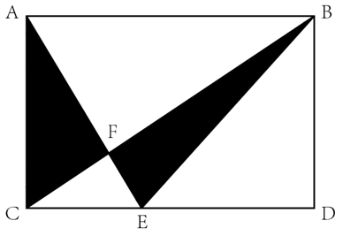
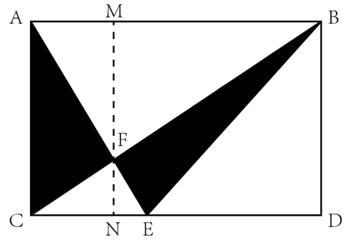
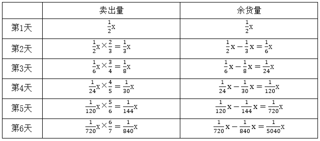

# 2024年湖北省选调生招录考试综合知识和行政职业能力测验试卷（网友回忆版）

> 数量关系 · 10 题 · 湖北 2024

## 第 1 题　qid 17764836 · 数学运算

甲、乙两个单位的岗位分为管理岗和普通岗。已知甲公司的普通岗人数是管理岗的17倍，乙公司的普通岗人数是管理岗的22倍。若两个公司共有300人，那么甲公司的管理岗人数比乙公司：

- **A**. 多3人　✅
- **B**. 少3人
- **C**. 多5人
- **D**. 少5人

**答案**：A

**官方解析**

设甲公司管理岗有x人，普通岗有17x人；乙公司管理岗有y人，普通岗有22y人。根据题意可列方程：17x+x+22y+y=300，即18x+23y=300，由于18和300均为6的整数倍，则23y一定为6的整数倍，即y为6的整数倍。当y=6时，x=9；当y=12时，x不是整数；当时，x为负数，则只有x=9，y=6满足条件。故甲公司的管理岗人数比乙公司多9-6=3人。

故正确答案为A。

---

## 第 2 题　qid 17764862 · 数学运算

一件工作，甲单独完成需要36天，乙单独完成需要54天，丙单独完成需要72天。现在甲、乙合作2天后，甲因有事离开，丙加入进来，乙、丙合作a天后，乙因有事离开，甲加入进来，最后丙、甲合作a+4天后正好完成该工作。请问完成该工作共花费了多少天？

- **A**. 22
- **B**. 24
- **C**. 26　✅
- **D**. 28

**答案**：C

**官方解析**

根据题意，赋值工作总量为36、54、72的最小公倍数216，则甲的工作效率为，乙的工作效率为，丙的工作效率为。根据题意可列方程：（6+4）×2+（4+3）×a+（6+3）×（a+4）=216，解得a=10，则完成该工作共花费了2+10+10+4=26天。

故正确答案为C。

---

## 第 3 题　qid 17764835 · 数学运算

某森林有三棵树A、B、C，其树龄成等比数列（树龄都为整数且A&lt;B&lt;C），已知它们的树龄之和为129，且公比为整数。请问多少年后C的树龄是B的树龄的2倍?

- **A**. 72　✅
- **B**. 80
- **C**. 98
- **D**. 100

**答案**：A

**官方解析**

设A的树龄为a岁，等比数列的公比为n。则B的树龄为na岁，C的树龄为岁。根据“三棵树A、B、C的树龄之和为129”，可列式：，即，由于树龄、公比均为整数，则将129因式分解为：129=1×129=3×43。若a=1或129，则n不为整数；若a=43，则n=1，不满足A&lt;B&lt;C。故a只能取3，即，解得n=6，则三棵树A、B、C的树龄分别为3岁、18岁、108岁。设x年后C的树龄是B的树龄的2倍，可列式：108+x=2×（18+x），解得x=72，则72年后C的树龄是B的树龄的2倍。

故正确答案为A。

---

## 第 4 题　qid 17764843 · 数学运算

某联谊会组织4名男生和4名女生相亲，安排他们围坐一8座圆桌，每个座位编号不同。要求每两个女生之间恰好有一个男生，请问有多少种不同坐法？

- **A**. 768
- **B**. 1152　✅
- **C**. 1200
- **D**. 1440

**答案**：B

**官方解析**

根据“每两个女生之间恰好有一个男生”，则女生的座位编号为1、3、5、7或者2、4、6、8，则女生的情况数为种；再考虑男生，4名男生选择剩余的4个座位，则男生的情况数为种。分步用乘法，则一共有48×24=1152种不同坐法。

故正确答案为B。

---

## 第 5 题　qid 17764839 · 数学运算

某篮球联赛总决赛采取5场3胜制，即首先获得3场比赛胜利的球队获得冠军。已知甲、乙两队参加总决赛，假设每场比赛甲队赢得比赛的事件是相互独立的，且概率为40%，请问甲队获得冠军的概率在以下哪个范围内？

- **A**. 20%~25%
- **B**. 25%~30%
- **C**. 30%~35%　✅
- **D**. 35%~40%

**答案**：C

**官方解析**

根据题意，甲队赢得比赛的概率为40%，则没赢的概率为1-40%=60%，若想甲队获得冠军，则存在以下3种情况：

①3场比赛后甲队获得冠军，即前3场均为甲队赢，概率为：40%×40%×40%=0.064；

②4场比赛后甲队获得冠军，即甲队在前3场中赢2场且第4场赢，概率为：；

③5场比赛后甲队获得冠军，即甲队在前4场中赢2场且第5场赢，概率为：。

综上，甲队获得冠军的概率为，在C项范围内。

故正确答案为C。

---

## 第 6 题　qid 17764856 · 数学运算

某小区有一块长方形空地。如下图所示，小区将该空地划为五块。已知2DE=3EC。为美化小区，现将阴影部分种植上草坪。请问阴影部分面积与原长方形空地面积之比为多少?

- **A**. 2：5
- **B**. 2：7　✅
- **C**. 1：4
- **D**. 1：7

**答案**：B

**官方解析**

如图所示，过点F作垂线分别交AB、CD于点M、N，则MN=AC=BD且。已知2DE=3EC，即，赋值CE=2，DE=3，则AB=CD=CE+DE=5。根据题意可知，，则、。又有，则，则，设FN=2x，FM=5x，则AC=BD=MN=FN+FM=7x。根据三角形面积公式：，可得阴影部分面积。根据长方形面积公式：S=ab，可知原长方形空地面积，则所求面积之比=10x：35x=2：7。

故正确答案为B。

---

## 第 7 题　qid 17764851 · 数学运算

甲、乙两车每天同时从A、B两地出发相向而行，已知甲车的速度为60千米/小时，乙车的速度为80千米/小时，两车每天都准时在途中相遇，有一天甲车因故提前半小时出发，乙车由于车况速度降为70千米/小时，最后两车依然在相同的时间相遇。问A、B两地的距离为多少千米?

- **A**. 350
- **B**. 390
- **C**. 420　✅
- **D**. 455

**答案**：C

**官方解析**

设两车相遇所需时间为t小时，根据题意可得：（60+80）t=60×0.5+（60+70）t，解得：t=3。则A、B两地相距（60+80）×3=420千米。
故正确答案为C。

---

## 第 8 题　qid 17764869 · 数学运算

某大型超市购进了若干斤蔬菜进行售卖，第一天卖掉了库存的，第二天卖掉了剩下库存的······第n天卖掉了剩下库存的，直到卖到少于进货量的后停止售卖，请问能售卖几天？

- **A**. 7
- **B**. 6　✅
- **C**. 5
- **D**. 4

**答案**：B

**官方解析**

方法一：设该大型超市购进了x斤蔬菜进行售卖。已知卖到少于进货量的后停止售卖，即当天卖出量后停止售卖。每天的卖出量与余货量可列表如下：

通过上表可知，第6天余货量，则停止售卖，即能售卖6天。

方法二：根据第n天卖掉了剩下库存的，可知第n天库存剩余量为前一天剩余量的，则可推导出余货量的公式为：第n天余货量。根据选项数字为4至7，则依次代入：第4天余货量为，第5天余货量为，第6天余货量为，则停止售卖，即能售卖6天。

故正确答案为B。

备注：本题表述存在歧义，“直到卖到少于进货量的后停止售卖”若理解为“卖到当天售卖的量少于则停止售卖”，则第七天的售卖量，停止售卖，即能售卖7天，则答案为A选项。

---

## 第 9 题　qid 17764852 · 数学运算

小明购买一本书，发现该书的总页数p是一平方数，且p-2和p+2都是质数，已知该书在100-400页之间，小明打算每个星期读书不超过75页，请问至少需要多少个星期才能把书读完?

- **A**. 5
- **B**. 4
- **C**. 3　✅
- **D**. 2

**答案**：C

**官方解析**

因p-2和p+2都是质数，故p只能是奇数。则满足在100-400之间、是奇数的平方数分别为、、、、。依次验证如下：

若，p+2=123=3×41，不是质数，排除；

若，p+2=171=3×57，不是质数，排除；

若，p+2=227，p-2=223，都是质数，满足题干所有条件即为答案，其他情况无需继续验证。则该书的总页数p为225页，至少需要个星期才能把书读完。

故正确答案为C。

---

## 第 10 题　qid 17764848 · 数学运算

某单位成立突击队，上午9点开展铲雪清障活动。突击队分为甲、乙两队，他们同时从同一地点背向而行各自进行工作。最初，乙队清理的速度比甲队慢25%，中途乙曾用10分钟去换工具，而后工作效率比原来提高了一倍。10点整，突击队完成了铲雪清障任务，且两队清理的长度相同。请问乙队什么时间去换的工具？

- **A**. 9：10
- **B**. 9：20　✅
- **C**. 9：30
- **D**. 9：40

**答案**：B

**官方解析**

根据“最初，乙队清理的速度比甲队慢25%”，可知乙队初始效率是甲队的，赋值乙队初始效率为3，甲队效率为4，则乙队换新工具后的效率为3×2=6。从9点至10点为60分钟，其中乙队实际清理时间为60-10=50分钟，设乙队用旧工具清理的时间为t，根据“两队清理的长度相同”，可列式：4×60=3t+6（50-t），解得t=20，即乙队在9：20去换的工具。

故正确答案为B。

---
