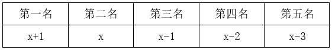
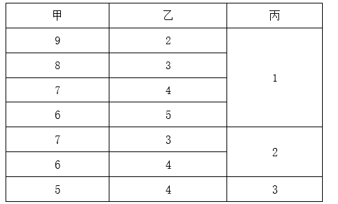

# 2024年湖南省公务员录用考试《行测》题（网友回忆版）

> 数量关系 · 10 题 · 湖南 2024

## 第 1 题　qid 10204486 · 数学运算

甲、乙两工厂共同完成某个生产订单需要12天。现两工厂共同生产8天后，再由乙单独生产7天，一共完成了订单总量的90%。若整个订单由乙单独生产，那么需要多少天完成？

- **A**. 20
- **B**. 23
- **C**. 26
- **D**. 30　✅

**答案**：D

**官方解析**

根据题意，甲、乙两工厂的工作效率满足：8（甲+乙）+7乙=12（甲+乙）×90%，整理可得甲、乙两工厂的工作效率之比为3：2。赋值甲的工作效率为3，乙的工作效率为2，则该订单的工作总量为12×（3+2）=60，故所求为天。

故正确答案为D。

---

## 第 2 题　qid 16593096 · 数学运算

运动会招募志愿者，第一次招募了不到100人，其中男女比例为11：7；补招若干女性志愿者后，男女比例变为4：3。问最多可能补招了多少名女性志愿者？

- **A**. 3
- **B**. 5　✅
- **C**. 6
- **D**. 10

**答案**：B

**官方解析**

根据“男女比例为11：7”“补招若干女性志愿者后，男女比例变为4：3”可知，男生人数既是11的倍数，又是4的倍数，男生人数为44n。结合“第一次招募了不到100人”可知，男生人数是44人，原来女生人数为44÷11×7=28人；补招后女生人数变为44÷4×3=33人。可知女生最多可能补招人数为33-28=5人。
故正确答案为B。

---

## 第 3 题　qid 16593100 · 数学运算

部队射击比赛中，5名参赛的战士共击中了88次目标。已知任意2人击中的目标数量均互不相同，问射击成绩排前两名的战士至少击中了多少次目标？

- **A**. 37
- **B**. 39　✅
- **C**. 58
- **D**. 82

**答案**：B

**官方解析**

根据题意，要使排前两名的战士击中的次数尽可能少，则其他战士击中的次数要尽可能多。设第二名击中x次，又因任意2人击中的目标数量均互不相同，可得击中次数如下：

根据“5名战士共击中了88次目标”，可列式：x+1+x+x-1+x-2+x-3=88，解得x=18.6，则第二名至少击中19次目标，第一名为x+1=20次，可得前两名至少击中了20+19=39次目标。

故正确答案为B。

---

## 第 4 题　qid 16593107 · 数学运算

从甲地到乙地的全价机票为2000元，购买全价或折扣机票，每张都要支付120元税费，从甲地到乙地的高铁票价为680元，企业要安排20人当日从甲地前往乙地出差，单程总预算不超过2万元，已知当日高铁票、机票都充足，2折、3折和5折机票分别还剩余2张、3张和5张，其余为全价机票，问在预算范围内最多能安排多少人乘飞机前往乙地？

- **A**. 11
- **B**. 12
- **C**. 13　✅
- **D**. 14

**答案**：C

**官方解析**

题干要求预算范围内安排乘飞机前往乙地的人数最多，结合选项可知乘飞机的人数大于折扣机票的剩余张数2+3+5=10张，则题干中的折扣机票应全部购买，购买折扣机票的费用为2000×0.2×2+2000×0.3×3+2000×0.5×5+120×10=8800元；设购买全价机票的人数为n人，根据题意可列方程：，解得，则n=3人。故在预算范围内最多能安排乘飞机前往乙地的人数为10+3=13人。

故正确答案为C。

---

## 第 5 题　qid 16593101 · 数学运算

王师傅加工零件，他可同时操作4台仪器对零件进行抛光，每个零件需2面抛光才能加工完成，抛光1面需2分钟，问6个零件最少用多少分钟才能加工完成（换零件时间不计）？

- **A**. 5
- **B**. 6　✅
- **C**. 7
- **D**. 8

**答案**：B

**官方解析**

根据题意，6个零件共需抛光6×2=12面，4台仪器同时工作，每次共抛光4面，耗时2分钟。至少需要抛光12÷4=3次，即最少用2×3=6分钟加工完成。
故正确答案为B。

---

## 第 6 题　qid 16593095 · 数学运算

企业将12个技术培训名额分配给甲、乙、丙三个研发团队。要求乙团队分配的培训名额比甲团队少，但比丙团队多，且每个团队至少分配1个名额。问有多少种不同的分配方式？

- **A**. 6
- **B**. 7　✅
- **C**. 36
- **D**. 42

**答案**：B

**官方解析**

根据题干条件，各团队分配的培训名额甲&gt;乙&gt;丙，采用枚举法，情况如下：

由上表可知，共有7种不同的分配方式。

故正确答案为B。

---

## 第 7 题　qid 10204639 · 数学运算

因自然灾害产生泄漏，某河流出现A物质污染。根据环保部门要求，自然水源中A物质的浓度不得高于x。经应急处置后，水中的A物质浓度每24小时下降一半。自应急处置时开始，环保部门每24小时对河流水质进行1次检测，在216小时后首次检测到河流中A物质浓度达标。问应急处置前A物质可能的最高浓度在以下哪个范围内？

- **A**. 不到300x
- **B**. 300x~600x　✅
- **C**. 600x~1200x
- **D**. 超过1200x

**答案**：B

**官方解析**

根据题意可知，A物质浓度每24小时下降一半，以24小时为一个周期，则216小时后首次达标时共下降了次，每次下降前是下降后的2倍。若想使应急处置前A物质的浓度最高，则应使9次检测后首次达标时的A物质浓度最高，即正好等于x，向前倒推即可得到A物质的初始浓度为512x，在B项范围内。如下表所示：

故正确答案为B。

---

## 第 8 题　qid 16593102 · 数学运算

某校园围墙外的道路形成一个边长为300米的正方形（如图所示），甲、乙两人分别从正方形的两个对角沿逆时针方向同时出发，甲、乙的步行速度比为9：7。问甲、乙两人第一次处于同一条边是在哪一条边上？

- **A**. AB
- **B**. BC
- **C**. CD
- **D**. DA　✅

**答案**：D

**官方解析**

根据题意，设甲的速度为9v，则乙的速度为7v。甲、乙初始路程差为CD+DA=300+300=600米，若甲、乙两人第一次处于同一条边，即两人路程差米。根据追及公式：，当甲与乙相差300米时，可列式：300=（9v-7v）×t，解得vt=150，则此时甲所走路程=9v×t=1350米（走完一圈300×4=1200米多150米），甲在CD中点；此时乙所走路程=7v×t=1050米（还差150米走完一圈），乙在DA中点。因，故当甲到达D点时，乙未到达A点，此时甲、乙两人均在DA边，且为第一次处于同一条边。

故正确答案为D。

---

## 第 9 题　qid 16593097 · 数学运算

商店销售甲、乙、丙、丁四种商品，每件分别盈利15元、9元、4元和1元。某日销售这四种商品共40件，共盈利201元。四种商品每种至少销售1件，且甲、丁商品销量相同。问当天丙商品的销量为多少件？

- **A**. 21
- **B**. 27
- **C**. 29
- **D**. 31　✅

**答案**：D

**官方解析**

根据“甲、丁商品销量相同”，设甲、乙、丙、丁四种商品销量分别为x件、y件、z件、x件。根据“这四种商品共40件”可得，2x+y+z=40······①；根据“共盈利201元”可得，15x+9y+4z+x=201······②。令①×8-②可消去x，得4z-y=119。因为四种商品每种至少销售1件，可得4z＞119，即，排除A、B、C三项。代入D项验证，若z=31，则y=4z-119=124-119=5，2x=40-31-5=4，x=2，符合题干所有条件。

故正确答案为D。

---

## 第 10 题　qid 16593103 · 数学运算

安排A、B、C、D共4个研发团队参与甲、乙、丙3个课题的研究，要求每个课题至少有1个团队参与，每个团队必须且只能参与1个课题，如甲课题参与的团队数超过1个，则A、B都不参与甲课题，问共有多少种不同的安排方式？

- **A**. 24
- **B**. 26　✅
- **C**. 36
- **D**. 42

**答案**：B

**官方解析**

根据题意可知，甲课题参与的团队数可能为1个或2个，分情况讨论如下：

（1）甲课题参与的团队数为1个，先从4个研发团队中任意选择1个有种情况，再让剩下3个团队参与乙、丙2个课题有种情况，分步用乘法，共有4×6=24种情况。

（2）甲课题参与的团队数为2个，则只能C、D参与甲课题，剩下A、B2个团队参与乙、丙2个课题有种情况。

分类用加法，则共有24+2=26种安排方式。

故正确答案为B。

---
