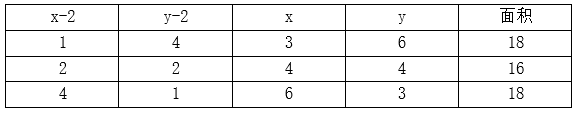
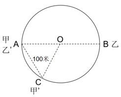
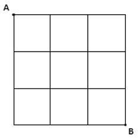
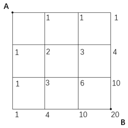

# 2024年重庆市定向选调优秀大学生到基层工作考试《行测》题

> 数量关系 · 15 题 · 选调 2024

## 第 1 题　qid 14993549 · 数学运算

一块长和宽都是整数的矩形土地，若其周长在数值上刚巧等于土地面积，则该块土地面积有多少种可能性？（    ）

- **A**. 2　✅
- **B**. 3
- **C**. 4
- **D**. 5

**答案**：A

**官方解析**

设该块土地的长和宽分别为x、y，x、y均为正整数，根据题意可列式：xy=2（x+y），整理可得：（x-2）（y-2）=4，则该矩形土地的长、宽及面积有以下几种情况：

综上，该块土地面积可能是18、16，共计2种可能性。

故正确答案为A。

---

## 第 2 题　qid 14993537 · 数学运算

已知某车间工人全部出勤可用24小时完成生产任务。若最初只有1人上班，工作t小时后才有第2个人来上班，再过t小时才来第3人······依次类推，直到完成任务，刚巧第1人工作时间是最后1人的11倍。问第1位工人工作了多少小时？（    ）

- **A**. 22
- **B**. 33
- **C**. 44　✅
- **D**. 55

**答案**：C

**官方解析**

设该车间的工人有n人，最后1位工人工作时间为x小时，则第1位工人工作时间为11x小时。根据题意，每工作t小时后均加入员工1人，从最后1人到第1人的工作时间构成公差为t的等差数列，根据等差数列求和公式：，可得这些工人总的工作时间小时。赋值该车间的工人每人每小时的工作量为1，因工作总量相同可得：，解得x=4，则第1位工人工作了小时。

故正确答案为C。

---

## 第 3 题　qid 14993540 · 数学运算

羽毛球运动员练习接发球，甲每天练习1000次，乙第一天练习600次且往后每天都比前一天多练习100次。整个训练周期内乙总共比甲多练习2600次。问训练周期共多少天？（    ）

- **A**. 12
- **B**. 13　✅
- **C**. 14
- **D**. 15

**答案**：B

**官方解析**

根据题意，设训练周期共n天，则训练周期内甲总共练习1000n次；乙的练习次数构成首项为600、公差为100的等差数列，根据公式：，则乙总共练习次。可列式：，整理可得，即（n-13）（n+4）=0，解得n=13或-4（舍去）。

故正确答案为B。

---

## 第 4 题　qid 14993546 · 数学运算

A汽车在B汽车前方10千米处以80千米/小时的速度行驶。B汽车的初始速度为120千米/小时，均匀减速行驶1小时后刚好静止，问两车行驶过程中的最短距离在（    ）范围内。(单位：千米）

- **A**. 0
- **B**. 0~2.5之间
- **C**. 2.5~5之间　✅
- **D**. 超过5

**答案**：C

**官方解析**

根据题意，B汽车做匀减速运动，两车之间的距离逐渐减小，直到B汽车的速度小于A汽车，因此当两车速度相等，即B汽车速度为80km/h时，两车之间的距离最小。根据匀加速瞬时速度公式：，可得加速度，则B汽车速度为80km/h时行驶了小时。根据匀变速运动平均速度，可得B汽车行驶前小时的平均速度为km/h，路程为km，A汽车行驶路程为km，此时两车之间的距离为km，在C项范围内。

故正确答案为C。

---

## 第 5 题　qid 14993552 · 数学运算

C地为连接A、B两地道路中的某一点。甲和乙开车分别从A、B两地同时出发匀速相向而行，到达对方的出发点后立刻原速折返。已知出发2小时后甲经过C地，又过1小时后乙经过C地，又过了4小时20分后均已折返的甲、乙两人迎面相遇。问甲、乙两人的速度比为（    ）。

- **A**. 2：3
- **B**. 3：2
- **C**. 4：5
- **D**. 5：4　✅

**答案**：D

**官方解析**

设A、B两地的距离为S。根据“出发2小时后甲经过C地，又过1小时后乙经过C地”，则，。故；根据直线两端多次相遇公式：，可列式：，化简可得：。

故正确答案为D。

---

## 第 6 题　qid 14993538 · 数学运算

4个工厂每天共可装配120台机器，且任意两个工厂的生产效率都不同。已知甲工厂每天可装配的机器数量是乙、丙工厂之和的，丙工厂每天可装配的机器数量是乙、丁工厂的平均值，乙工厂每天可装配37台机器。问效率最高的工厂每天可以装配的机器数量比效率最低的工厂多多少台？（    ）

- **A**. 12
- **B**. 17
- **C**. 22
- **D**. 27　✅

**答案**：D

**官方解析**

根据题意，甲工厂每天可装配的机器数量是乙、丙工厂之和的，故。设甲工厂每天可装配的机器数量为2x台，则乙+丙=3x台，丙=（3x-37）台。根据“4个工厂每天共可装配120台机器”，即丁=120-甲-（乙+丙）=120-2x-3x=（120-5x）台。根据“丙工厂每天可装配的机器数量是乙、丁工厂的平均值”，可列式：，解得x=21，则甲工厂每天可装配2×21=42台，丙工厂每天可装配3×21-37=26台，丁工厂每天可装配120-5×21=15台，故甲为效率最高的工厂，丁为效率最低的工厂，甲工厂每天可以装配的机器数量比丁工厂多42-15=27台。

故正确答案为D。

---

## 第 7 题　qid 14993562 · 数学运算

一条圆形跑道长米，甲和乙从直线距离200米的两点同时出发顺时针跑步。已知甲的速度比乙快，5分钟后乙第二次到达甲的出发位置，此时甲与乙的直线距离为100米，且甲在跑步过程中始终未超过乙。问甲的速度在（    ）范围内。（）

- **A**. 不到12千米/小时
- **B**. 12~13千米/小时之间
- **C**. 13~14千米/小时之间　✅
- **D**. 超过14千米/小时

**答案**：C

**官方解析**

根据题意可得圆形跑道半径为米，则甲和乙分别在直径的两端出发。因5分钟后乙第二次到达甲的出发位置，且甲在跑步过程中始终未超过乙，则此时甲应到达过一次但尚未第二次到达自己的出发位置，且此时甲、乙二人的直线距离为100米，如图所示。因为AC=OA=OC=100米，则为等边三角形，，弧长米。故5分钟甲跑步的距离为米，甲的速度为米/小时千米/小时=13.816千米/小时，在C项范围内。

故正确答案为C。

---

## 第 8 题　qid 14993545 · 数学运算

小李和小赵进行乒乓球比赛，约定先胜4局者获胜。已知小李每局比赛对小赵的胜率都是60%，问小李在5局获胜的概率与小李在6局获胜的概率相差（    ）。

- **A**. 不到1个百分点　✅
- **B**. 1~3个百分点之间
- **C**. 3~5个百分点之间
- **D**. 超过5个百分点

**答案**：A

**官方解析**

根据“小李每局比赛对小赵的胜率都是60%”可知，小李每局比赛对小赵输的概率都是1-60%=40%。先胜4局者获胜，若小李在5局获胜，则前4局中输1局，概率为；若小李在6局获胜，则前5局中输2局，概率为。相差，在A项范围内。

故正确答案为A。

---

## 第 9 题　qid 14993541 · 数学运算

一艘游轮从A城到B城顺流行驶用了5小时，到达目的地后返回，以同样功率匀速逆流而行用了7小时。假如从A城出发时在河中放一木排。问游轮与木排相遇时，木排漂流了多少小时？

- **A**. 8
- **B**. 9
- **C**. 10　✅
- **D**. 11

**答案**：C

**官方解析**

赋值路程为5和7的最小公倍数35千米，根据公式：路程=速度×时间,则顺流速度为千米/小时，逆流速度为千米/小时。根据流水行船公式可知，船速=顺流速度-流水速度=逆流速度+流水速度，则有7-流水速度=流水速度+5，解得流水速度=1。当游轮从B城返回时，木排已经漂流了5小时，漂流距离为5×1=5千米，又漂流了小时与游轮相遇，故木排一共漂流了5+5=10小时。

故正确答案为C。

---

## 第 10 题　qid 14993544 · 数学运算

某村有A、B两块待收割麦田，其中A的面积为B的2倍。现安排x名村民8：00开始在A收割，12：00开始将0.5x名村民调到B，14：00撤走在B收割的村民，只保留1人继续工作且A、B分别于当天16：00和22：00完成收割。已知所有村民的工作效率相同，问x的值为多少？

- **A**. 4　✅
- **B**. 8
- **C**. 12
- **D**. 16

**答案**：A

**官方解析**

赋值每名村民的工作效率为1。根据A麦田为x名村民从8：00工作到12：00（4小时），后由x-0.5x=0.5x名村民从12：00工作到16：00（4小时），可知A麦田的面积为；B麦田为0.5x名村民从12:00工作到14：00（2小时），后由1人从14：00工作到22：00（8小时），则B麦田的面积为。根据“A的面积为B的2倍”，可知，解得x=4。

故正确答案为A。

---

## 第 11 题　qid 14993543 · 数学运算

已知甲的年龄是一个两位数，且个位数比十位数大3。乙比甲大27岁，且恰好是甲的个位数和十位数对调。问甲、乙的年龄之和最小可能是（    ）岁。

- **A**. 33
- **B**. 44
- **C**. 55　✅
- **D**. 66

**答案**：C

**官方解析**

方法一：根据题意可知，乙-甲=27······①，根据奇偶特性，乙年龄与甲年龄的差为奇数，则甲、乙年龄之和也一定为奇数，排除B、D项，剩二代一，问最小，从最小代入。
代入A项，甲+乙=33······②，联立①②解得：甲=3，不是两位数，排除；
代入C项，甲+乙=55······③，联立①③解得：甲=14，乙=41，满足题干所有条件，当选。
方法二：设甲年龄十位数字为a，则个位数字为（a+3）；乙年龄的十位数字为（a+3），个位数字为a。甲、乙的年龄之和为10a+（a+3）+10（a+3）+a=（22a+33）岁，要想两人的年龄之和最小，则a应尽量小，最小为1，则甲、乙的年龄之和最小为22×1+33=55岁。
方法三：要想甲、乙的年龄之和最小，则甲和乙的年龄均应尽量小，甲最小为14岁，此时乙的年龄为14+27=41岁，满足题意，则甲、乙的年龄之和最小为14+41=55岁。
故正确答案为C。

---

## 第 12 题　qid 14993553 · 数学运算

甲、乙两企业各出资万元（n为正整数），共购买若干台单价为10万元的大型机械和1台单价更低的小型机械。如最终乙企业分得小型机械，甲企业分得的大型机械比乙企业多1台且向乙企业支付差价补偿。问补偿金额为多少万元？（    ）

- **A**. 2　✅
- **B**. 3
- **C**. 4
- **D**. 4.5

**答案**：A

**官方解析**

设小型机械的单价为x万元（0＜x＜10）。甲、乙两企业各出资万元，则两企业出资总数为万元，即出资总数为平方数。根据甲企业分得的大型机械比乙企业多1台，从最少的情况分析：乙分得1台大型机械，甲分得2台大型机械，则出资总数为，即，由于0＜x＜10，则只有x=6时，满足题意，此时甲企业应向乙企业补偿万元。

故正确答案为A。

---

## 第 13 题　qid 14993550 · 数学运算

在下面3x3方格图中（每个小方格边长为1厘米），质点每次只能沿方格向下或向右移1厘米，问质点由A移动到B有多少种方案？（    ）

- **A**. 14
- **B**. 16
- **C**. 20　✅
- **D**. 28

**答案**：C

**官方解析**

方法一：根据题意可知，从A移动到B每次移动1厘米，必然要经过6条线段，由于只能向右或者向下，所以向右需要3条线段，向下需要3条线段，只要在6条线段中选择3条向右移动即可，则有种方案。

方法二：根据题意，质点由A移动到B，每次只能沿方格向下或向右移动1厘米，可利用描点法解题，如下图所示：

因此共有20种方案。

故正确答案为C。

---

## 第 14 题　qid 14993556 · 数学运算

某车间原计划生产产品M（290&lt;M&lt;300）件，平均分装成若干箱，已知M为奇数且不是3的倍数。现扩大产能，产品增加到900件，装箱增加12箱，每箱比原计划多装N件，问N是多少？（    ）

- **A**. 10
- **B**. 11
- **C**. 12
- **D**. 13　✅

**答案**：D

**官方解析**

根据题意可知，290&lt;M&lt;300，M为奇数且不是3的倍数，则符合的情况有293、295、299。因产品可平均分装成若干箱，故可将这三个数因式分解为：293=1×293；295=1×295=5×59；299=1×299=13×23。设原计划每箱装x件，装有y箱。根据题意可列式为：（x+N）×（y+12）=900。结合选项可知N最小为10，则x和y取这三个数中任意一个数的1和其本身的约数时，结果都远大于900，不符合题意，故只有295=5×59和299=13×23两种情况，分别讨论如下：

①295=5×59：当x=5，y=59时，则有（5+N)×（59+12）=900，解得，排除；当x=59，y=5时，则有（59+N）×(5+12）=900，解得，排除；

②299=13×23：当x=13，y=23时，则有（13+N）×（23+12）=900，解得，排除；当x=23，y=13时，则有（23+N）×（13+12）=900，解得N=13。

故正确答案为D。

---

## 第 15 题　qid 14993555 · 数学运算

一个正整数n，各位数之和恰好为2023。当n为最小时，问该正整数有多少位？

- **A**. 223
- **B**. 225　✅
- **C**. 234
- **D**. 246

**答案**：B

**官方解析**

根据题意可知，n为最小时，该正整数的位数应尽可能少，且当位数确定时，高位上的数尽可能小，其余位数上取9。2023÷9=224······7，即有224位取9，首位取7，故该正整数共有224+1=225位。
故正确答案为B。

---
