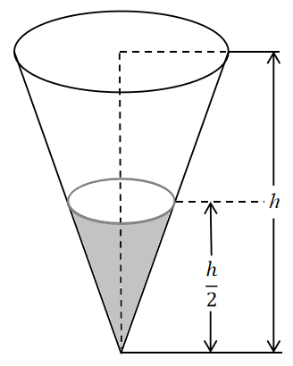

# 2024年黑龙江省公务员录用考试《行测》题（网友回忆版）

> 数量关系 · 15 题 · 黑龙江 2024

## 第 1 题　qid 11880956 · 数学运算

某农场有一批水稻收割任务，第一天收割了计划的，第二天收割了余下的，若第三天收割50公顷，则这三天收割的水稻将比计划多15公顷。问计划收割水稻（    ）公顷。

- **A**. 50
- **B**. 100
- **C**. 120
- **D**. 150　✅

**答案**：D

**官方解析**

设计划收割水稻30x公顷，则第一天收割了公顷，第二天收割了公顷。根据题意，可列等式：，解得，计划收割水稻30×5=150公顷。

故正确答案为D。

---

## 第 2 题　qid 10204613 · 数学运算

某中学举办教职工趣味运动会，需要准备一些球类道具，必须同时满足每2人合用一个毽球，每3人合用一个乒乓球，每4人合用一个排球，这样工作人员一共准备了26个球类道具。问参加本次运动会的教职工最多有：

- **A**. 12人
- **B**. 20人
- **C**. 24人　✅
- **D**. 26人

**答案**：C

**官方解析**

根据题意，每2人合用一个毽球，每3人合用一个乒乓球，每4人合用一个排球，故教职工总数能同时被2、3、4整除，即总人数为12的倍数，排除B、D两项。

剩余A、C两项中，结合题干人数最多的要求优先代入最大的C项：当教职工为24人时，共需要准备球类道具个，符合题干所有条件，C项当选。

故正确答案为C。

---

## 第 3 题　qid 11881057 · 数学运算

某客轮对乘客携带行李的超重部分按每公斤收取固定费用。甲乙两位乘客共携带70公斤行李乘坐该客轮，乘客甲的行李超重部分需要交费10元，乘客乙的行李超重部分需要交费2元。如果这两位乘客的行李全部由其中1位乘客携带，则超重部分需要交费20元。问乘坐该客轮每位乘客可以免费携带行李（    ）公斤。

- **A**. 10
- **B**. 15
- **C**. 20　✅
- **D**. 25

**答案**：C

**官方解析**

设乘坐该客轮每位乘客可以免费携带行李公斤，甲乘客行李重公斤，乙乘客行李重公斤。根据题意可知，由其中一人携带全部行李时，超重部分比两人单独携带多公斤，费用多20-10-2=8元，则超出重量每公斤价格为元，此时可得：······①、······②，联立①②，解得：、。根据题意可知：，即，解得：。

故正确答案为C。

---

## 第 4 题　qid 10204586 · 数学运算

某包装车间包装甲、乙两种规格的袋装杂粮，甲、乙两袋杂粮的重量之比为5：2，如果从甲袋中称出2公斤放入乙袋后，甲、乙两袋杂粮的重量之比变为4：3。问甲袋杂粮原来重量为：

- **A**. 8公斤
- **B**. 10公斤　✅
- **C**. 12公斤
- **D**. 15公斤

**答案**：B

**官方解析**

设原来甲、乙两袋杂粮的重量分别为5x公斤和2x公斤，根据题意可列式：，解得x=2。则甲袋杂粮原来重量为5x=5×2=10公斤。

故正确答案为B。

---

## 第 5 题　qid 10204637 · 数学运算

甲、乙两个圆柱容器底面积之比为3：4，分别盛有7厘米高和10厘米高的液体，现在向两个容器内注入同样多的液体，直至两个容器内液体的高度相等，问甲容器内液面上升至：

- **A**. 9厘米
- **B**. 12厘米
- **C**. 15厘米
- **D**. 19厘米　✅

**答案**：D

**官方解析**

赋值甲、乙两个圆柱容器底面积分别为3平方厘米、4平方厘米，设两个容器注入液体后的高均为h。根据题意，两个容器内注入的液体同样多，及，可列式：3h-3×7=4h-4×10，解得h=19厘米，即甲容器内液面上升至19厘米。

故正确答案为D。

---

## 第 6 题　qid 11880961 · 数学运算

有一组数按如下规律排列：第一个数是1，第二个数是2，从第三个数起，每一个数恰好是其前两个数之和。问这列数中第2024个数除以4所得的余数是（    ）。

- **A**. 3
- **B**. 2　✅
- **C**. 1
- **D**. 0

**答案**：B

**官方解析**

根据题意可知，这个数列为：1，2，3，5，8，13，21，34，55······，该数列从第一项起每项除以4所得的余数分别为：1，2，3，1，0，1，1，2，3······，余数构成一个以1，2，3，1，0，1为循环的周期数列，则第2024项共有个周期······2，即原数列中第2024个数除以4所得的余数是第338周期中的第二个数字，为2。

故正确答案为B。

---

## 第 7 题　qid 10204583 · 数学运算

有一批零件，如果甲车间单独完成需要50小时，乙车间单独完成需要30小时，在甲车间单独完成若干小时后，由于要承担其他紧急任务，剩余的任务由乙车间继续完成，这样一共用了42小时。问乙车间完成的零件量占这批零件总量的：

- **A**. 

- **B**. 

- **C**. 

　✅
- **D**. 

**答案**：C

**官方解析**

赋值工作总量为150，则甲车间的效率，乙车间的效率，设甲车间单独工作的时间为t小时，则乙车间单独工作的时间为（42-t）小时，根据题意可列式：3t+5×（42-t）=150，解得t=30，则乙车间工作时间为42-30=12小时，乙车间完成零件量=5×12=60，因此乙车间完成的零件量占这批零件总量的。

故正确答案为C。

---

## 第 8 题　qid 11880971 · 数学运算

有一个高为h的圆锥形容器，若容器内装有10升水，水面高度恰好为容器高度的一半。问该容器最多能装（    ）升水。

- **A**. 80　✅
- **B**. 60
- **C**. 40
- **D**. 20

**答案**：A

**官方解析**

根据几何等比例放缩性质，在立体几何中，体积比等于相似比的立方。因“水面高度恰好为容器高度的一半”，则，即相似比为1：2，则。因容器内现装有10升水，则容器最多能装10×8=80升水。

故正确答案为A。

---

## 第 9 题　qid 10204612 · 数学运算

甲、乙二人在某项工作结束后，统计数据显示：甲比乙的工作量多，乙比甲所用的时间多，问甲、乙二人工作效率的比值所在范围的区间是：

- **A**. (1，1.5]　✅
- **B**. (1.5，2]
- **C**. (2，2.5]
- **D**. (2.5，3]

**答案**：A

**官方解析**

根据题意，赋值乙的工作量为4，则甲的工作量为；赋值甲所用的时间为6，则乙所用的时间为。根据公式：工作效率，则所求为，在A项范围的区间内。

故正确答案为A。

---

## 第 10 题　qid 10204615 · 数学运算

现有一容器，装有100克浓度为75%的盐水，从中倒出40克盐水后，再加入40克纯净水，如此反复三次。问此时盐水的浓度是：

- **A**. 16.20%　✅
- **B**. 9%
- **C**. 1.62%
- **D**. 0.90%

**答案**：A

**官方解析**

方法一：根据公式：浓度，可得第一次混合后的浓度，第二次混合后的浓度，第三次混合后的浓度。

故正确答案为A。

方法二：先倒出溶液再倒入清水，套用公式，则所求浓度。

故正确答案为A。

备注：重复稀释问题公式：设已有溶液质量为M，每次倒出溶液的质量为，再添入质量为的清水补满，重复n次，则。

---

## 第 11 题　qid 10204568 · 数学运算

某部门工会为丰富职工文化生活增进职工身心健康，组织开展了拔河、羽毛球、乒乓球、台球四项比赛活动，每名职工参加一项或者两项比赛。若要保证至少有5名职工参加的比赛项目完全相同，则该部门参加比赛的职工至少有：

- **A**. 40名
- **B**. 41名　✅
- **C**. 50名
- **D**. 51名

**答案**：B

**官方解析**

由题意可知，共有四项比赛活动，每名职工参加一项或者两项比赛。若每名职工参加一项比赛有种方式；参加两项比赛有种方式，故共有4+6=10种参加比赛的方式。根据最不利原则，若要保证至少有5名职工参加的比赛项目完全相同，参加比赛的职工至少为：4×10+1=41名。

故正确答案为B。

---

## 第 12 题　qid 11880979 · 数学运算

某企业向银行申请A、B两种贷款共6000万元，假设A种贷款年利率为8%，B种贷款年利率为9%，那么每年共需付利息500万元，问该企业申请的A、B两种贷款相差（    ）万元。

- **A**. 4000
- **B**. 3000
- **C**. 2000　✅
- **D**. 1000

**答案**：C

**官方解析**

设该企业申请的A贷款为万元，则申请的B贷款为万元。

根据“每年共需付利息500万元”，可列式，解得，即该企业申请的A贷款为4000万元，B贷款为6000-4000=2000万元，两种贷款相差4000-2000=2000万元。

故正确答案为C。

---

## 第 13 题　qid 10204560 · 数学运算

某商家购进一批商品，每件成本为27元，最初将商品定价为每件40元，该商家经过百分率相等的连续两次降价后，每件商品的利润率不超过20%。问每次降价的百分率至少是：

- **A**. 20%
- **B**. 15%
- **C**. 10%　✅
- **D**. 5%

**答案**：C

**官方解析**

本题问“至少”可考虑从小到大依次代入：

D项：每次降价的百分率是5%，则第一次降价后售价为：40×（1-5%）=38元，第二次降价后售价为：38×（1-5%）=36.1元，根据公式：利润率，可得：利润率，此时利润率大于20%，不满足题意，排除；

C项：每次降价的百分率是10%，则第一次降价后售价为：40×（1-10%）=36元，第二次降价后售价为：36×（1-10%）=32.4元，可得：利润率，此时利润率刚好为20%，满足题意，当选。无需继续验证其他选项。

故正确答案为C。

---

## 第 14 题　qid 10204625 · 数学运算

在一次选举中，某候选人需得到全部选票的才能当选。当统计到的选票时，他已得到当选所需的。问他若能当选还要得到剩下选票中的：

- **A**. 

　✅
- **B**. 

- **C**. 

- **D**. 

**答案**：A

**官方解析**

赋值全部选票为30张，则需得到张选票才可当选。统计到张选票时，此候选人已得到张选票，若当选还需得到18-15=3张选票。剩下选票数为30-20=10张，若能当选还要得到剩下选票中的。

故正确答案为A。

---

## 第 15 题　qid 10204632 · 数学运算

一盒中有10支晶体管，其中有2支次品，8支正品。现从中连取两次，每次取1支，取后不放回，则至少取到1支次品的概率是：

- **A**. 

- **B**. 

　✅
- **C**. 

- **D**. 

**答案**：B

**官方解析**

方法一：根据公式：概率。不放回地连取两次晶体管，总的情况数为种。要求至少取出1支次品，则分为取出1正1次和取出2支次品两种情况，取出1正1次为种；取出2支次品为种。则所求概率。

方法二：根据公式：概率。不放回地连取两次晶体管，总的情况数为种。要求至少取出1支次品，则反面情况为两次取出的都是正品，可列式为种。则至少取出1支次品的概率=1-取出2支正品的概率。

故正确答案为B。

---
