# 2025年上海市公务员录用考试《行测》题（B类）（网友回忆版）

> 数量关系 · 21 题 · 上海 2025

## 材料 1

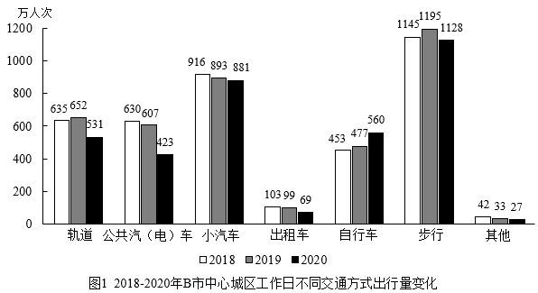

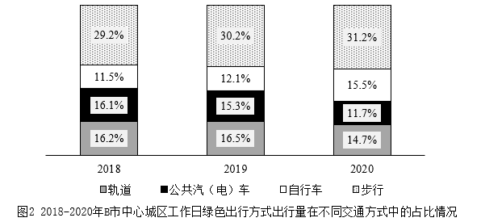

### 第 1 题　qid 11226608 · 数学运算

2019年，B市中心城区工作日通过小汽车、出租车、其他出行共有（    ）万人次。

- **A**. 950
- **B**. 992
- **C**. 1019
- **D**. 1025　✅

**答案**：D

**官方解析**

定位图1可得：2019年B市中心城区工作日通过小汽车出行893万人次，通过出租车出行99万人次，通过其他方式出行33万人次。则2019年，B市中心城区工作日通过小汽车、出租车、其他出行共有893+99+33=1025万人次。
故正确答案为D。

---

### 第 2 题　qid 11226609 · 数学运算

2018-2020年期间，B市中心城区工作日各种交通方式出行中，（    ）方式出行量一直增加。

- **A**. 步行
- **B**. 自行车　✅
- **C**. 出租车
- **D**. 轨道

**答案**：B

**官方解析**

定位图1可得2018-2020年，B市中心城区工作日通过步行、自行车、出租车、轨道交通方式出行量的相关数据。观察发现，2018-2020年期间，B市中心城区工作日仅有自行车出行量（2018年453万人次＜2019年477万人次＜2020年560万人次）符合一直增加的趋势。
故正确答案为B。

---

### 第 3 题　qid 11226611 · 数学运算

2020年，B市中心城区工作日选择自行车出行方式的人在绿色出行人群中的占比约为：

- **A**. 15.75%
- **B**. 16.33%
- **C**. 21.20%　✅
- **D**. 42.68%

**答案**：C

**官方解析**

根据题干“2020年······占比约为”，结合材料中给出2020年的相关数据，可判定本题为现期比重问题。定位图2可得：2020年B市中心城区工作日绿色出行方式出行量在不同交通方式的占比分别为：轨道，14.7%；公共汽（电）车，11.7%；自行车，15.5%；步行，31.2%。则2020年B市中心城区工作日绿色出行方式出行量在不同交通方式的占比共计14.7%+11.7%+15.5%+31.2%=73.1%，根据公式：比重，故所求为，只有C项符合。

故正确答案为C。

---

### 第 4 题　qid 11226612 · 数学运算

2020年B市中心城区工作日不同交通方式出行量中，年降幅率最大的是：

- **A**. 公共汽（电）车　✅
- **B**. 小汽车
- **C**. 轨道
- **D**. 其他

**答案**：A

**官方解析**

根据题干“2020年······，年降幅率最大的是”，可判定本题为一般增长率问题。定位图1可得2019年、2020年B市中心城区工作日不同交通方式的出行量。根据公式：增长率，可得2020年选项中各交通方式的年增速分别为：

公共汽（电）车：，即年降幅为；

小汽车：，即年降幅为；

轨道：，即年降幅为；

其他：，即年降幅为。

综上，2020年B市中心城区工作日不同交通方式出行量中，年降幅率最大的是公共汽（电）车。

故正确答案为A。

---

### 第 5 题　qid 11226613 · 数学运算

关于2018-2020年期间B市中心城区工作日不同交通出行方式，下列说法错误的是：

- **A**. 出行量先增后减的只有轨道、步行
- **B**. 2018年的绿色出行占比最低
- **C**. 步行在绿色出行中的占比一直上升，所以步行出行量一直在上升　✅
- **D**. 绿色出行的占比的变化为先增后减

**答案**：C

**官方解析**

A项：定位图1可知2018-2020年B市中心城区工作日不同交通方式出行量。观察可知，出行量先增后减的只有轨道、步行，正确；
B项：定位图2可知2018-2020年B市中心城区工作日绿色出行方式出行量在不同交通方式中的占比情况。则2018-2020年绿色出行占比分别为：2018年，29.2%+11.5%+16.1%+16.2%=73%；2019年，30.2%+12.1%+15.3%+16.5%=74.1%；2020年，31.2%+15.5%+11.7%+14.7%=73.1%。比较可知，2018年的绿色出行占比（73%）最低，正确；
C项：定位图1可知2018-2020年B市中心城区工作日步行出行量分别为：1145万人次、1195万人次、1128万人次。比较可知，2020年步行出行量下降，并非一直在上升，错误；
D项：定位图2可知2018-2020年B市中心城区工作日绿色出行方式出行量在不同交通方式中的占比情况。则2018-2020年绿色出行占比分别为：2018年，29.2%+11.5%+16.1%+16.2%=73%；2019年，30.2%+12.1%+15.3%+16.5%=74.1%；2020年，31.2%+15.5%+11.7%+14.7%=73.1%。比较可知，绿色出行的占比的变化为先增后减，正确。
本题为选非题，故正确答案为C。

---

## 材料 2

        根据相关数据报告显示，2024年春节档电影总票房达80.16亿元，同比增长18.5%。总观影人次1.63亿，同比增长26.4%。票房、观影人次及场次三项关键数据均创下我国影史新高。

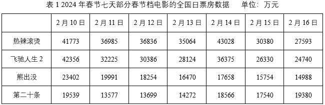

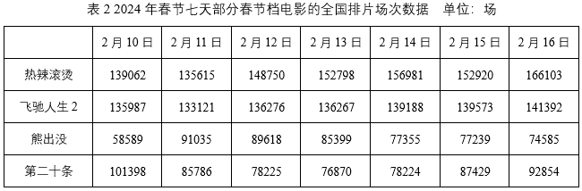

### 第 6 题　qid 11226619 · 数学运算

2024年春节档的平均票价比2023年春节档的平均票价：

- **A**. 降低了约3元　✅
- **B**. 降低了约1元
- **C**. 上涨了约1元
- **D**. 上涨了约3元

**答案**：A

**官方解析**

根据题干“2024年······平均票价比2023年······平均票价”，结合选项为“上涨/降低了+单位”，可判定本题为平均数的增长量问题。定位文字材料可知：2024年春节档电影总票房达80.16亿元（A），同比增长18.5%（a），总观影人次1.63亿（B），同比增长26.4%（b）。根据公式：平均数的增长量，平均票价，可得所求为元，即降低了约3.3元，与A项最接近。

故正确答案为A。

---

### 第 7 题　qid 11226621 · 数学运算

电影上映后，正常来说热度会逐渐降低，每一天的票房数量和前一天相比会呈递减的趋势，如果是某部电影当天的票房比前一天高，呈现上升趋势，行业内称之为“逆跌”。春节档的四部电影中，出现“逆跌”次数最多的电影是：

- **A**. 热辣滚烫
- **B**. 飞驰人生2
- **C**. 熊出没
- **D**. 第二十条　✅

**答案**：D

**官方解析**

定位表1可得2024年春节档四部电影的全国日票房数据。观察发现：
热辣滚烫，2月14日票房数据（43028万元）&gt;2月13日票房数据（35064万元），出现“逆跌”次数为1次；
飞驰人生2，2月14日票房数据（36375万元）&gt;2月13日票房数据（28124万元），出现“逆跌”次数为1次；
熊出没，2月14日票房数据（17658万元）&gt;2月13日票房数据（16470万元），出现“逆跌”次数为1次；
第二十条，2月12日票房数据（13699万元）&gt;2月11日票房数据（13577万元），2月13日票房数据（14272万元）&gt;2月12日票房数据（13699万元），2月14日票房数据（18566万元）&gt;2月13日票房数据（14272万元），2月16日票房数据（19380万元）&gt;2月15日票房数据（17540万元），出现“逆跌”次数为4次。
综上，春节档的四部电影中，出现“逆跌”次数最多的电影是第二十条。
故正确答案为D。

---

### 第 8 题　qid 11226622 · 数学运算

下图是某日春节档四部电影日票房数据的扇形统计图，该日最可能是：

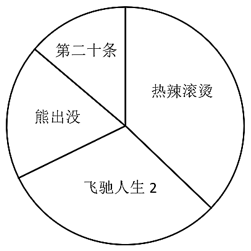

- **A**. 2月10日
- **B**. 2月12日　✅
- **C**. 2月14日
- **D**. 2月16日

**答案**：B

**官方解析**

根据题干“下图是某日春节档四部电影日票房数据的扇形统计图······”，结合材料已知各选项对应时间的相关数据，可判定本题为现期比重问题。定位统计表1可得2月10日、2月12日、2月14日、2月16日四部电影日票房数据。观察可知，扇形图中热辣滚烫面积比飞驰人生2的略大，可排除A项（2月10日热辣滚烫票房41773万元&lt;飞驰人生2票房42356万元）；扇形图中熊出没面积比第二十条的大，可排除C项（2月14日熊出没票房17658万元&lt;第二十条票房18566万元）、D项（2月16日熊出没票房14988万元&lt;第二十条票房19380万元）。
故正确答案为B。

---

### 第 9 题　qid 11226623 · 数学运算

院线排片中，为能从客户对不同电影的喜好取舍中，更好地把握市场变化，实现利益最大化，采用了当日的“日票房占比÷日排片占比”作为次日排片的考量数据。在全国范围内，2月16日四部电影的“日票房占比÷日排片占比”数据，数值最大的来自于影片：

- **A**. 热辣滚烫
- **B**. 飞驰人生2
- **C**. 熊出没
- **D**. 第二十条　✅

**答案**：D

**官方解析**

根据题干“······在全国范围内，2月16日四部电影的‘日票房占比÷日排片占比’数据，数值最大的来自于影片”，可判定本题为比值比较问题。定位表1可得2月16日四部电影日票房数据；定位表2可得2月16日四部电影排片场次数据。根据公式：比重，则某电影的“日票房占比÷日排片占比”，由于“”对于四部电影均一致，故只需比较“”即可，2月16日四部电影的“”分别为：

热辣滚烫：万元/场；

飞驰人生2：万元/场；

熊出没：万元/场；

第二十条：万元/场。

综上，对比2月16日四部电影的“日票房占比÷日排片占比”数据，数值最大的来自于影片第二十条。

故正确答案为D。

---

## 材料 3

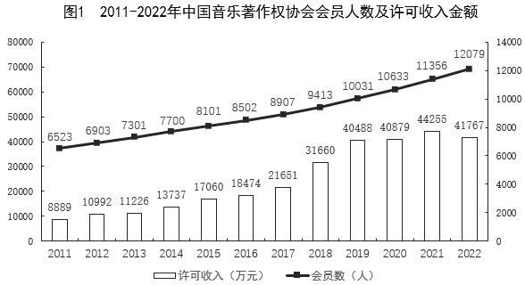

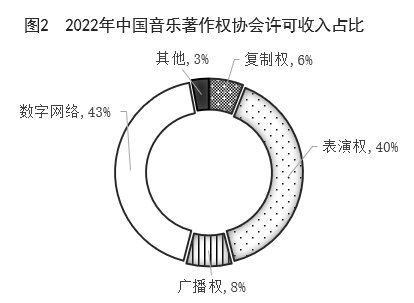

### 第 10 题　qid 11226982 · 数学运算

2022年，中国音乐著作权协会平均每名会员的许可收入约是2011年的（    ）倍。

- **A**. 0.9
- **B**. 2.5　✅
- **C**. 3.0
- **D**. 3.5

**答案**：B

**官方解析**

根据题干“2022年······约是2011年的······倍”，结合材料给出2022年和2011年相关数据，可判定本题为现期倍数问题。定位图1可得：2022年中国音乐著作权协会许可收入为41767万元，会员人数为12079人；2011年许可收入为8889万元，会员人数为6523人。根据公式：平均每名会员的许可收入，则所求倍数倍。

故正确答案为B。

---

### 第 11 题　qid 11226984 · 数学运算

关于2012-2022年中国音乐著作权协会会员人数及许可收入状况，能够从上述资料中推出的是：

- **A**. 2022年，数字网络许可收入不到1.6亿元
- **B**. 许可收入同比增量最大的年份，会员同比增长了600多人
- **C**. 如每年均保持2022年同比增量，2026年会员数将超过1.5万人
- **D**. 2016-2020年，许可总收入超过15亿元　✅

**答案**：D

**官方解析**

A项：定位图1可知：2022年中国音乐著作权协会许可收入为41767万元；定位图2可知：2022年数字网络许可收入占比43%。根据公式：部分=整体×比重，则2022年数字网络许可收入=41767×43%&gt;40000×40%=16000万元=1.6亿元，错误；

B项：定位图1可知2011-2022年各年份中国音乐著作权协会许可收入金额以及会员人数。根据公式：增长量=现期量-基期量，则2012-2022年中国音乐著作权协会许可收入金额同比增量分别为：

2012年，万元；

2013年，万元；

2014年，万元；

2015年，万元；

2016年，万元；

2017年，万元；

2018年，万元；

2019年，万元；

2020年，万元；

2021年，万元；

2022年，41767-44255&lt;0。

比较可知，中国音乐著作权协会许可收入金额同比增量最大的年份是2018年，其会员人数同比增量=9413-8907=506人，并非600多人，错误；

C项：定位图1可知：2021年和2022年中国音乐著作权协会会员人数分别为11356人、12079人。根据公式：增长量=现期量-基期量，则2022年同比增量=12079-11356=723人；根据公式：现期量=基期量+n×增长量，则2026年会员数=12079+（2026-2022）×723=12079+4×723=12079+2892&lt;15000人，即低于1.5万人，错误；

D项：定位图1可知2016-2020年各年份中国音乐著作权协会许可收入金额。则所求=18474+21651+31660+40488+40879&gt;18000+21000+31000+40000+40000=150000万元=15亿元，即超过15亿元，正确。

故正确答案为D。

---

### 第 12 题　qid 11226594 · 数学运算

在北京工作的小王被单位派遣去法国出差，已知法国（夏令时期间）比北京的时间晚6个小时。若某天公司要在北京时间晚上7时35分开一个线上会议，他从工作地点回到酒店参会要42分钟，若他在当地时间12时30分出发，则他会：

- **A**. 迟到20分钟
- **B**. 迟到23分钟
- **C**. 早到23分钟　✅
- **D**. 早到20分钟

**答案**：C

**官方解析**

因为法国（夏令时期间）比北京的时间晚6个小时，所以北京时间晚上7时35分相当于法国时间下午1时35分，即13时35分。根据题意他到达酒店的时间为12时30分+42分=13时12分，故他早到了35-12=23分钟。
故正确答案为C。

---

### 第 13 题　qid 11226599 · 数学运算

小宏准备在市区开一家咖啡店。固定投资：装修费25000元，设备费35000元；每月成本：原料费25000元，宣传费5000元，店面租金8000元，人工8000元，水电网络等杂费1000元。如果固定投资平摊至12个月，期望每月盈利20000元。按每杯咖啡平均售价15元计，每天（一个月以30天计算）要至少卖出（    ）杯咖啡才能够达成期望。

- **A**. 150
- **B**. 160　✅
- **C**. 170
- **D**. 180

**答案**：B

**官方解析**

根据题意可知，每月固定投资为元，所以每月总成本为5000+25000+5000+8000+8000+1000=52000元。设每天（一个月以30天计算）要至少卖出x杯咖啡才能够达成期望，根据公式：盈利=售价-成本，则可列式：，解得x=160。

故正确答案为B。

---

### 第 14 题　qid 11226978 · 数学运算

某公司研发一款饮料瓶，一开始瓶身为圆柱，高h=10cm，底面半径r=5cm。为了更为美观，则以上底面为球的大圆做一个半球，轴截面如图所示。则瓶子的体积约为（    ）。（精确到）

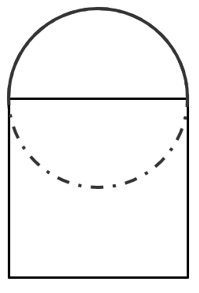

- **A**. 1440
- **B**. 1047　✅
- **C**. 930
- **D**. 865

**答案**：B

**官方解析**

根据题意，该饮料瓶由两部分组成，上半部分是半径为5cm的半球，根据公式：，则其体积为；下半部分是高为10cm，底面半径为5cm的圆柱，根据公式：，则其体积为。故该饮料瓶的体积为（取3.14）。

故正确答案为B。

---

### 第 15 题　qid 11226976 · 数学运算

一辆货车8：00从A地出发，在A、B两地之间往返行驶，出发时速度为n千米/小时，每次回到A地后，速度都增加0.5n千米/小时。已知该货车前两次到达A、B之间C地的时间分别为8：30和9：15，则其第四次到达C地的时间是：

- **A**. 10：30
- **B**. 10：35　✅
- **C**. 10：40
- **D**. 10：45

**答案**：B

**官方解析**

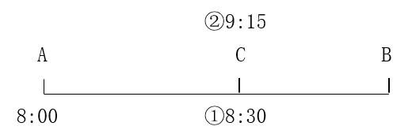

根据题意可知，该货车第一次到达C地的时间为8：30，则从A地到C地需行驶8：30-8：00=30分钟；第二次到达C地的时间为9：15，则从C地到B地再返回至C地需行驶9：15-8：30=45分钟，继续行驶返回至A地还需从C地驶到A地，故回到A地的时间为9：15+30分钟=9：45。回到A地后，速度变为n+0.5n=1.5n，根据路程不变，速度与时间成反比，速度前后之比为2：3，则时间前后之比为3：2。则该货车9：45从A地再次出发，第三次到达C地需用时分钟；继续行驶，到达B地后再返回C地需用时分钟，故其第四次到达C地的时间是9：45+20分钟+30分钟=10：35。

故正确答案为B。

---

### 第 16 题　qid 11226600 · 数学运算

一位攀岩者在练习攀岩，攀岩墙从下到上放置了若干个等距的标记点。该攀岩者在匀速攀爬了30秒后到第二个和第三个标记点之间，70秒后到了第四个和第五个标记点之间，那么匀速攀爬了120秒后该攀岩者会在（    ）标记点之间。

- **A**. 第五个和第六个
- **B**. 第六个和第七个
- **C**. 第七个和第八个
- **D**. 第八个和第九个　✅

**答案**：D

**官方解析**

设起始位置与第一个标记点之间、任意两个标记点之间的距离均为x，此人以v的速度匀速攀岩，根据题意可得：2x&lt;30v&lt;3x······①，4x&lt;70v&lt;5x······②。

方法一：化简①式，可得，化简②式，可得，联立①②两式，可得。匀速攀爬了120秒，则有，即在第八个和第九个标记点之间。

方法二：将①式×4，可得8x&lt;120v&lt;12x，则该攀岩者一定超过了第八个标记点，观察选项，只有D项满足。

故正确答案为D。

备注：本题对于在起点处是否放置标记点的理解有歧义，但是如果起点放置标记点，则根据题意可得：x&lt;30v&lt;2x······①，3x&lt;70v&lt;4x······②。分析可得，即120秒后该攀岩者会在第六个和第八个标记点之间，无法确定答案。

---

### 第 17 题　qid 11226977 · 数学运算

在某三国游戏中，魏蜀吴三国之间的一场战役需要制定兵力分配策略。假设魏国有50000名士兵，蜀国有30000名士兵，吴国有40000名士兵。每个国家都计划将其士兵分成两部分：一部分用于防守，另一部分用于进攻。如果魏国的进攻兵力是蜀国进攻兵力的三倍，而吴国的进攻兵力是蜀国进攻兵力的两倍，若要使得蜀、吴两国的进攻总兵力高于魏国的防守兵力，且蜀、吴两国防守总兵力也高于魏国的进攻兵力。那么满足要求的蜀国进攻兵力分配数可能为（    ）名。

- **A**. 5000
- **B**. 8000
- **C**. 11000　✅
- **D**. 14000

**答案**：C

**官方解析**

设蜀国进攻兵力为x名士兵，则魏国为3x名士兵，吴国为2x名士兵。根据题意，可列表如下：

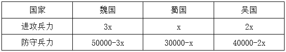

若要使得蜀、吴两国的进攻总兵力高于魏国的防守兵力，则x+2x&gt;50000-3x，整理可得6x&gt;50000，解得，排除A、B两项；且蜀、吴两国防守总兵力也高于魏国的进攻兵力，则，整理可得，解得，排除D项。

故正确答案为C。

---

### 第 18 题　qid 11226979 · 数学运算

在一个宁静的村庄里有三座古老的瞭望塔，分别位于村庄的A、B、C处，且由三条笔直的公路连接，这三条公路恰好构成一个以AC为底边的等腰三角形。村民们发现，塔C到塔A、B的距离之比恰为，且塔C到公路AB的最短距离为4公里，那么塔B、C之间的距离为（    ）公里。

- **A**. 
2

- **B**. 
5
　✅
- **C**. 

- **D**. 

**答案**：B

**官方解析**

如图所示，由C点向AB作垂线交AB于D点，由B点向AC作垂线交AC于E点，则CD为AB边上的高，BE为AC边上的高。设AC为2x公里，则BC为公里，因是以AC为底边的等腰三角形，则公里，公里。在直角三角形BEC中，根据勾股定理，可得：公里。根据三角形面积公式，则，可得：，解得，则公里。

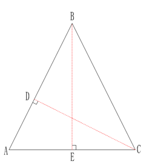

故正确答案为B。

---

### 第 19 题　qid 11226595 · 数学运算

甲参加公司团建，其中一个项目就是做手工风车，要将材料袋中的七个不同卡通头像贴在如图所示的七个圆点处。则做出来的风车一共的可能性有多少种？

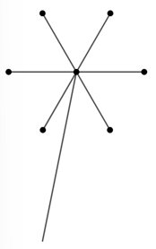

- **A**. 7
- **B**. 140
- **C**. 840　✅
- **D**. 5040

**答案**：C

**官方解析**

先从七个不同卡通头像贴中任选一个放在风车的中间圆点处，情况数为种；剩下六个不同卡通头像贴在外圈六个圆点位置进行环形排列，根据n个元素环形排列的情况数为，则情况数为种。分步用乘法，故所求情况数共7×120=840种。

故正确答案为C。

---

### 第 20 题　qid 11226604 · 数学运算

小李在游乐园娃娃机上抓玩偶玩，目前抓到玩偶的频率是，接下来小李又抓了两次，运气特别好都抓到了，这时小李抓到玩偶的频率提升到了，则小李一共抓了多少次？

- **A**. 30
- **B**. 40
- **C**. 50　✅
- **D**. 60

**答案**：C

**官方解析**

方法一：设初始小李抓到玩偶x次，根据“目前抓到玩偶的频率是”，可知初始抓了16x次。根据“接下来小李又抓了两次，运气特别好都抓到了，这时小李抓到玩偶的频率提升到了”，可列等式：，解得x=3。则小李一共抓了16x+2=16×3+2=50次。

方法二：设初始小李抓了x次，根据“接下来小李又抓了两次，运气特别好都抓到了”，可知小李后两次抓到玩偶的频率为1。根据线段法口诀“距离（频率之差）与量（抓的次数）成反比”可得，，解得x=48，则小李一共抓了48+2=50次。

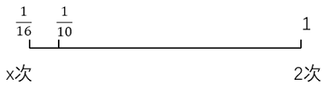

故正确答案为C。

---

### 第 21 题　qid 11226605 · 数学运算

有一个均匀的正二十面体形状的骰子，将，，······，这n个连续的自然数分别标到骰子的各个面上，每个面上只标1个数字，且标有数（i=1，2，······，n，n&gt;1）的面恰有个，那么这个骰子所有面上的数字之和可能为：

- **A**. 55
- **B**. 90　✅
- **C**. 108
- **D**. 139

**答案**：B

**官方解析**

由于骰子上标的数为连续自然数，根据“标有数（i=1，2，······，n，n&gt;1）的面恰有个”可知，标有相同数字的面的数量也为连续自然数，即构成公差为1的等差数列。根据公式：=中位数×项数，可知中位数×项数=20，20的约数有1、2、4、5、10、20。若项数为偶数，如项数=4、中位数=5，则无法得到4个连续的自然数，排除项数为偶数的情况。项数为奇数，且n&gt;1，则项数=5、中位数=4时可符合题干条件，即标记情况为：2个标数字2的面、3个标数字3的面、4个标数字4的面、5个标数字5的面、6个标数字6的面。则这个骰子所有面上的数字之和=2×2+3×3+4×4+5×5+6×6=90。

故正确答案为B。

---
