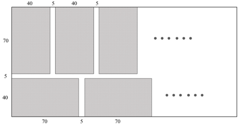
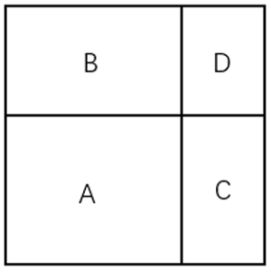
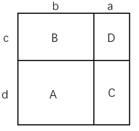

# 2025年四川省考/选调公务员录用考试《行测》试题（网友回忆版）

> 数量关系 · 10 题 · 四川 2025

## 第 1 题　qid 10297388 · 数学运算

甲、乙两条生产线生产同一种产品，且甲的效率是乙的1.5倍，现接到A、B两个订单。已知甲完成A订单和乙完成B订单均需要8小时，问甲完成B订单的用时比乙完成A订单的用时少多长时间？

- **A**. 6小时
- **B**. 6小时40分　✅
- **C**. 7小时20分
- **D**. 8小时

**答案**：B

**官方解析**

根据题意“甲的效率是乙的1.5倍”，赋值甲的效率为3、乙的效率为2，故A订单工作总量=3×8=24，B订单工作总量=2×8=16。则甲生产线完成B订单需要小时，乙完成A订单需要小时。故甲完成B订单的用时比乙完成A订单的用时少小时=6小时40分。

故正确答案为B。

---

## 第 2 题　qid 10297401 · 数学运算

教师从某班级学号为01～07的7名学生中随机抽出3名做值日，则这3名学生学号恰好为三个相邻自然数的概率为：

- **A**. 

　✅
- **B**. 

- **C**. 

- **D**. 

**答案**：A

**官方解析**

根据公式：概率，分析如下：

从7名学生中随机抽出3名做值日，不需要考虑顺序，则总的情况数为种情况；

这3名学生的学号恰好为三个相邻自然数的情况为：01-03，02-04，03-05，04-06，05-07，共5种情况。

综上，所求概率。

故正确答案为A。

---

## 第 3 题　qid 10297390 · 数学运算

某工匠计划在700×115厘米的钢板上裁剪若干大小为70×40厘米的钢片，且在裁剪时，每块钢片之间还应保留至少5厘米的间隔。问最多能裁剪出多少块？

- **A**. 23
- **B**. 24　✅
- **C**. 25
- **D**. 26

**答案**：B

**官方解析**

根据题意，若要使得裁剪出的钢片数最多，则需尽可能减少材料浪费。观察题干信息：钢片长+宽+间隔长=70+40+5=115cm，恰好与钢板宽度115cm相等，此时造成的浪费最少。如下图所示，将钢板分为700×70cm与700×40cm两块区域，钢片分别按照纵向与横向分布裁剪。

设第一行、第二行裁剪出的钢片最大数量分别为a、b个，可得：

，解得，

则a、b最大分别取15个、9个，最多可剪裁出15+9=24块。

故正确答案为B。

---

## 第 4 题　qid 10297393 · 数学运算

一块正方形花圃如下图所示。现将其划分为4个矩形，分别种植A、B、C、D四种作物。已知B、C的种植面积比为14：9，B、C的种植面积之和比A的种植面积大，则D的种植面积是A的：

- **A**. 

- **B**. 

- **C**. 

　✅
- **D**. 

**答案**：C

**官方解析**

由题可知：，，则。如下图所示，𝑎、𝑏、𝑐、𝑑分别表示对应边长，则，，，。

方法一：设A的种植面积为21x，则B、C的种植面积分别为14x、9x。14和21都有公因子7，令b=7，则d=3x，c=2x，a=3，又因a+b=c+d，即3+7=2x+3x，可得x=2，则a=3、b=7、c=4、d=6，故D的种植面积是A的。

方法二：赋值，，，则，故D的种植面积是A的。

故正确答案为C。

---

## 第 5 题　qid 10297384 · 数学运算

从5名男性和4名女性志愿者队伍中抽调6名志愿者去田径比赛、篮球比赛和跳水比赛做服务引导工作。田径比赛要求2名男性志愿者，篮球比赛要求男、女志愿者各1名，跳水比赛要求2名女性志愿者。问有多少种不同的抽调方式？

- **A**. 300
- **B**. 320
- **C**. 360　✅
- **D**. 400

**答案**：C

**官方解析**

根据题意，先从5名男性志愿者中选择2名去田径比赛，有种情况；再从剩余3名男性志愿者中选择1名，4名女性志愿者中选择1名去篮球比赛，有种情况；最后从剩余3名女性志愿者中选择2名去跳水比赛，有种情况，则有10×12×3=360种不同的抽调方式。

故正确答案为C。

---

## 第 6 题　qid 10297389 · 数学运算

某企业采购甲、乙和丙三种不同配置的电脑，已知甲、乙、丙各1台共2.3万元，2台甲加1台乙的总价比1台丙的单价高2.2万元。该企业最终决定采购1台甲、3台乙和7台丙，问采购总费用为多少万元？

- **A**. 6.6
- **B**. 7.1　✅
- **C**. 7.6
- **D**. 8.1

**答案**：B

**官方解析**

设甲、乙和丙三种不同配置的电脑单价分别为a万元、b万元和c万元，根据题意可列方程：a+b+c=2.3······①，2a+b-c=2.2······②
方法一：赋值b=0，即a+c=2.3······①，2a-c=2.2······②，解得a=1.5，c=0.8，可得所求a+3b+7c=1.5+3×0+7×0.8=7.1万元。
方法二：联立①×5-②×2可得：a+3b+7c=2.3×5-2.2×2=7.1，即采购1台甲、3台乙和7台丙的总费用为7.1万元。
故正确答案为B。

---

## 第 7 题　qid 10297400 · 数学运算

甲、乙两地受灾，政府从丙、丁两地分别调集100吨和60吨救灾物资。已知甲、乙两地各需救灾物资80吨，丙地到甲地、丙地到乙地、丁地到甲地、丁地到乙地的每吨运价之比为7：4：6：5。问总运输成本可能的最高值比最低值高：

- **A**. 不到10%
- **B**. 10%~15%之间　✅
- **C**. 15%~20%之间
- **D**. 20%以上

**答案**：B

**官方解析**

赋值丙地到甲地、丙地到乙地、丁地到甲地、丁地到乙地的每吨运价分别为7元/吨、4元/吨、6元/吨、5元/吨，设丙运往甲地的物资为x吨，则丙运往乙地的物资为（100-x）吨，丁运往甲地的物资为（80-x）吨，丁运往乙地的物资为（x-20）吨，由题意可知：，，，，解得：。总运输成本为，当x=80时，总运输成本最高为2×80+780=940元；当x=20时，总运输成本最低为2×20+780=820元，因此所求为，在B项范围内。

故正确答案为B。

---

## 第 8 题　qid 10297395 · 数学运算

在一次团体操表演中，演员方阵的成员需要贴上红色、黄色和白色三种颜色之一的背贴。一位演员看到贴红色背贴的演员是除自己之外所有演员的，另一位演员则看到贴红色背贴的演员是除自己之外所有演员的。问这次团体操的演员有多少人？

- **A**. 55
- **B**. 56　✅
- **C**. 110
- **D**. 111

**答案**：B

**官方解析**

根据题意可知，（总人数-1）既是5的倍数，又是11的倍数，结合选项可排除A、C两项。两位演员除自己之外看到红色背贴的比例不同，说明这两位演员一人为红色背贴、一人为非红色背贴；又因为两次比例的大小关系为 ，可知第二位演员是红色背贴，则等量关系为，，代入B、D两项进行验证。

代入B项，若总人数为56人，则红色背贴演员数为11人，且，等式成立，符合题意，当选；

代入D项，若总人数为111人，则红色背贴演员数为22人，但，不符合题意，排除。

注：考场上剩二代一，B项符合题意直接当选，可不验证D项。

故正确答案为B。

---

## 第 9 题　qid 10297404 · 数学运算

某农场采摘脐橙，每名工人的工作效率相同。8：00开始工作，每30分钟休息10分钟，11：50结束，正好完成当天任务的一半。下午从14：00开始工作，工人的数量增加了一半，且每30分钟休息5分钟。问完成当天任务的时间是：

- **A**. 16：15　✅
- **B**. 16：20
- **C**. 16：25
- **D**. 16：30

**答案**：A

**官方解析**

设上午工人数量为x人，则下午工人数量为人。根据每名工人的工作效率相同，且效率不变，赋值每名工人的工作效率为1。根据题意可得，上午工人每40分钟休息1次，到11：50共休息了次······30分钟，即上午工作时间为5×30+30=180分钟，则下午工作量=上午工作量=180x，下午工作时间为分钟=2小时，根据下午每30分钟休息5分钟，可得下午共休息分钟（最后一次30分钟结束时已完成任务不需要再休息），故完成当天任务的时间是16：15。

故正确答案为A。

---

## 第 10 题　qid 10297387 · 数学运算

甲、乙两地相距150千米。小张、小李分别于8：00和9：00开车从甲地匀速前往乙地。小张开了135千米被小李追上，且于10：30到达乙地。问小李的速度为多少千米/小时？

- **A**. 75
- **B**. 90
- **C**. 108　✅
- **D**. 120

**答案**：C

**官方解析**

由题可知，小张开车走完全程所需时间为2.5h，根据公式：速度，可得千米/小时。小张开135千米所用时间小时，小李比小张晚出发1小时，则到135千米时小李用时=2.25-1=1.25小时，故千米/小时。

故正确答案为C。

---
