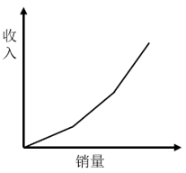
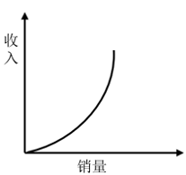
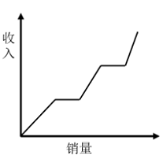
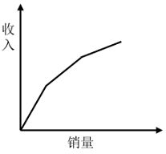

# 2025年国家公务员录用考试《行测》题（地市级网友回忆版）

> 数量关系 · 10 题 · 国考 2025

## 第 1 题　qid 19283740 · 数学运算

张某8：00开车从A地出发，在A、B两地之间往返行驶。8：30第一次到达A、B之间的C点时加速30%继续行驶，并于9：00第二次到达C点。问AC距离是BC距离的多少倍？

- **A**. 

- **B**. 

- **C**. 

　✅
- **D**. 

**答案**：C

**官方解析**

设张某出发时的速度为v，8：00从A地出发，8：30到达C点，则AC间的路程共用时30分钟。根据公式：路程=速度×时间，则AC距离为30v。8：30到达C点后，加速30%继续行驶，并于9：00第二次到达C点。则可知张某在BC间往返共用时30分钟，即单程用时15分钟，速度变为1.3v，则BC距离为。故AC距离是BC距离的倍。

故正确答案为C。

---

## 第 2 题　qid 19283726 · 数学运算

甲、乙、丙、丁四个部门共有210名员工，且甲部门员工数比丁部门多10人。现乙部门调动20名员工到丙部门且其剩余员工并入丁部门后，甲、丙、丁三个部门的员工数之比为3：3：4。问原乙部门有多少名员工？

- **A**. 41
- **B**. 46
- **C**. 51　✅
- **D**. 56

**答案**：C

**官方解析**

方法一：调动后，甲、丙、丁三个部门的员工数分别为名、63名、210-63-63=84名。则调动前，甲、丙、丁三个部门的员工数分别为63名、63-20=43名、63-10=53名，原乙部门有210-63-43-53=51名员工。

方法二：调动后，甲、丁两个部门的员工数分别为名、名。则调动前，甲、丁两个部门的员工数分别为63名、63-10=53名，可知乙部门并入丁部门的员工数为84-53=31名，原乙部门有20+31=51名员工。

故正确答案为C。

---

## 第 3 题　qid 19283932 · 数学运算

化工商店出售200千克某种试剂，前60千克打2折出售，之后60千克打5折出售，剩余部分原价出售。以下坐标图中，最能准确反映该试剂销量和销售收入之间关系的是：

- **A**. 

　✅
- **B**. 

- **C**. 

- **D**. 

**答案**：A

**官方解析**

根据题意可知，销量分为三段：前60千克、之后60千克和剩余的200-（60+60）=80千克，相对应的收入也分为三段：打2折、打5折和原价，排除B、C两项。出售60千克该种试剂打2折的收入一定低于打5折的收入，排除D项。
故正确答案为A。

---

## 第 4 题　qid 19283758 · 数学运算

某单位65名职工中，拥有甲、乙、丙三项认证中至少一项的职工正好占80%，没有甲认证的职工与有乙认证的职工人数一样多，仅有丙认证的职工有3人，三项认证都有的职工有6人，问有多少人仅拥有甲、乙两项认证？

- **A**. 10　✅
- **B**. 13
- **C**. 16
- **D**. 19

**答案**：A

**官方解析**

根据题意，该单位没有甲、乙、丙三项认证中任何一项的职工人数为65×（1-80%）=13人。如图所示，设仅有甲、乙两项认证的人数为x人，仅有乙、丙两项认证的人数为y人，仅有乙认证的人数为z人。则没有甲认证的职工人数为（z+y+3+13）人，有乙认证的职工人数为（z+y+x+6）人，根据题意可得：z+y+3+13=z+y+x+6，解得x=10，即仅有甲、乙两项认证的人数为10人。

故正确答案为A。

---

## 第 5 题　qid 19283924 · 数学运算

某竞赛由5道次序固定的判断题组成，参赛者起始为0分，每答对1题加1分，每答错1题扣1分。小王作答了所有试题，答完每道题时当前的得分都不低于1分。问他的答题情况有多少种不同的可能？

- **A**. 7
- **B**. 6　✅
- **C**. 4
- **D**. 3

**答案**：B

**官方解析**

根据题干“答完每道题时当前的得分都不低于1分”可知，第一题和第二题均答对，第三题分情况讨论：
①第三题答对，此时有3分，第四题和第五题不论是答对还是答错，均能保证答完每道题时当前的得分都不低于1分，故第四题和第五题答题情况均为2种，分步用乘法，有2×2=4种情况；
②第三题答错，此时还剩1分，所以第四题必须答对，第四题答对后有2分，则第五题不论答对还是答错均满足题干条件，有2种情况。
分类用加法，即共有4+2=6种情况。
故正确答案为B。

---

## 第 6 题　qid 19283934 · 数学运算

某种机械由3个A模块和2个B模块组成。甲车间每天可生产6个A模块或3个B模块，乙车间每天可生产1个A模块或2个B模块。现两车间合作生产40台该机械所需模块，问至少需要多少天？

- **A**. 24
- **B**. 26
- **C**. 28　✅
- **D**. 30

**答案**：C

**官方解析**

要使所需时间最少，则让两个车间分别生产相对效率更高的模块。甲车间相对于乙车间生产A模块的效率为，生产B模块的相对效率为，比较发现，甲车间生产A模块的相对效率更高，故先由甲车间生产A模块，乙车间生产B模块。甲车间生产A模块需要天，此时乙车间已生产B模块2×20=40个，还剩40×2-40=40个B模块由两车间共同生产，需要天，故至少需要20+8=28天。

故正确答案为C。

---

## 第 7 题　qid 19283729 · 数学运算

张、王、李、赵4人的平均年龄为28岁，张、王的年龄之和比李大25岁，李、赵的年龄之和比张大27岁。已知张比王大2岁，问他们4人中年龄最大的比最小的大几岁？

- **A**. 5
- **B**. 6　✅
- **C**. 3
- **D**. 4

**答案**：B

**官方解析**

根据题意可列方程组：，解得：王=27，张=29，李=31，赵=25。

因此4人中年龄最大的李（31岁）比最小的赵（25岁）大31-25=6岁。

故正确答案为B。

---

## 第 8 题　qid 19283930 · 数学运算

甲船在A港正东n海里，乙船在A港正南海里，两船相距120海里，同时出发向A港匀速行驶。已知乙船的速度是甲船的倍，比甲船早3小时到A港。问甲船的速度是多少海里/小时？

- **A**. 
10
　✅
- **B**. 
15

- **C**. 

- **D**. 

**答案**：A

**官方解析**

根据题意可知，，解得n=60，则甲船距离A港60海里，乙船距离A港海里。已知乙船的速度是甲船的倍，则，根据乙船比甲船早3小时到A港，可列式：，即，解得。

故正确答案为A。

---

## 第 9 题　qid 19283935 · 数学运算

小王计划在7天假期自学甲、乙两门在线课程，每门课程需要连学2整天。如在所有可能的安排中随机选择1种，不用学习的3天均不相邻的概率为：

- **A**. 

- **B**. 

- **C**. 

- **D**. 

　✅

**答案**：D

**官方解析**

根据公式：概率，分析如下：

甲、乙两门课程均需要占用相邻的2天，可用捆绑法，先将每门课程所占用的2天分别捆绑，再将这2个捆绑体和其它3天进行排序。因每“天”均相同，不用排序，而两门课程不同，需要排序，则总情况数种情况；

根据题意，不用学习的3天均不相邻，可用插空法，优先安排学习两门课程的时间，因两门课程不同，对两门课程进行排序有种情况，再将剩余3天插入两门课程安排好之后形成的3个空隙，因每“天”均相同不用再排序，有种情况，故满足要求的情况数=2×1=2种情况。

综上，所求概率。

故正确答案为D。

---

## 第 10 题　qid 19283938 · 数学运算

一个容器的下部分为高12厘米的倒立圆锥体，上部分为圆柱体，且圆锥和圆柱的底面半径相等。现匀速向容器中注入水，1分钟后液面高6厘米，又过30分钟后注满。问整个容器的高度为多少厘米？

- **A**. 22
- **B**. 22.5
- **C**. 23
- **D**. 23.5　✅

**答案**：D

**官方解析**

根据题意，该容器由圆柱体和倒立圆锥体组成，注入水后先注满圆锥体，再注满圆柱体。根据几何等比例放缩性质，在立体几何中，体积比等于相似比的立方，根据题意可知，，则相似比为1：2，故，因为注入水的流速相同，则，故注满圆锥体需要用时8分钟；水注满圆锥体后，再注满圆柱体需要用时1+30-8=23分钟，因圆锥体和圆柱体的底面半径相等，则二者的底面积相等，设圆锥体和圆柱体的底面积为S，圆柱体的高为厘米，根据公式：，，可得，解得厘米，则整个容器的高度为12+11.5=23.5厘米。

故正确答案为D。

---
