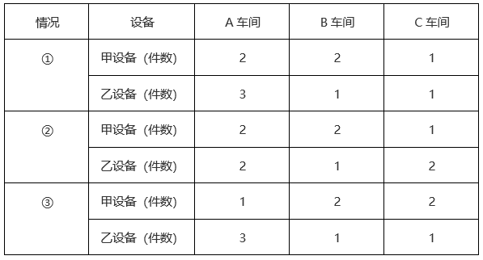
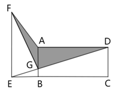
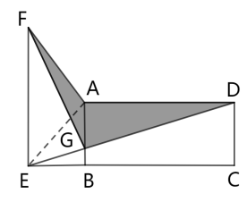
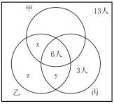

# 2025年国家公务员录用考试《行测》题（行政执法卷网友回忆版）

> 数量关系 · 10 题 · 国考 2025

## 第 1 题　qid 19283725 · 数学运算

甲、乙、丙3台收割机每小时均能收割2亩小麦，三台机器上午先后开始收割工作，12：00时甲收割的面积是乙的1.5倍，且比丙多收割6亩，16：00时3台收割机共收割了50亩，问乙是何时开始工作的？

- **A**. 6：00
- **B**. 7：00
- **C**. 8：00　✅
- **D**. 9：00

**答案**：C

**官方解析**

12：00至16：00，3台收割机均工作4小时，共收割亩小麦，则12：00之前3台收割机收割50-24=26亩小麦。设12：00之前乙收割机工作了x小时，收割面积为2x亩，根据题意可列等式：，解得x=4，即乙收割机在12：00之前工作了4小时，则乙是在8：00开始工作的。

故正确答案为C。

---

## 第 2 题　qid 19283726 · 数学运算

甲、乙、丙、丁四个部门共有210名员工，且甲部门员工数比丁部门多10人。现乙部门调动20名员工到丙部门且其剩余员工并入丁部门后，甲、丙、丁三个部门的员工数之比为3：3：4。问原乙部门有多少名员工？

- **A**. 41
- **B**. 46
- **C**. 51　✅
- **D**. 56

**答案**：C

**官方解析**

方法一：调动后，甲、丙、丁三个部门的员工数分别为名、63名、210-63-63=84名。则调动前，甲、丙、丁三个部门的员工数分别为63名、63-20=43名、63-10=53名，原乙部门有210-63-43-53=51名员工。

方法二：调动后，甲、丁两个部门的员工数分别为名、名。则调动前，甲、丁两个部门的员工数分别为63名、63-10=53名，可知乙部门并入丁部门的员工数为84-53=31名，原乙部门有20+31=51名员工。

故正确答案为C。

---

## 第 3 题　qid 19283729 · 数学运算

张、王、李、赵4人的平均年龄为28岁，张、王的年龄之和比李大25岁，李、赵的年龄之和比张大27岁。已知张比王大2岁，问他们4人中年龄最大的比最小的大几岁？

- **A**. 5
- **B**. 6　✅
- **C**. 3
- **D**. 4

**答案**：B

**官方解析**

根据题意可列方程组：，解得：王=27，张=29，李=31，赵=25。

因此4人中年龄最大的李（31岁）比最小的赵（25岁）大31-25=6岁。

故正确答案为B。

---

## 第 4 题　qid 19283731 · 数学运算

将甲、乙两种设备各5件全部分配给A、B、C三个车间，要求每个车间分配两种设备至少各1件，A车间分配的设备总数比其他任一车间都多，B车间分配的甲设备多于乙设备，问有多少种不同的分配方式？

- **A**. 3　✅
- **B**. 6
- **C**. 12
- **D**. 24

**答案**：A

**官方解析**

根据题意，符合要求的情况列表如下：

综上，共有3种不同的分配方式。

故正确答案为A。

---

## 第 5 题　qid 19283740 · 数学运算

张某8：00开车从A地出发，在A、B两地之间往返行驶。8：30第一次到达A、B之间的C点时加速30%继续行驶，并于9：00第二次到达C点。问AC距离是BC距离的多少倍？

- **A**. 

- **B**. 

- **C**. 

　✅
- **D**. 

**答案**：C

**官方解析**

设张某出发时的速度为v，8：00从A地出发，8：30到达C点，则AC间的路程共用时30分钟。根据公式：路程=速度×时间，则AC距离为30v。8：30到达C点后，加速30%继续行驶，并于9：00第二次到达C点。则可知张某在BC间往返共用时30分钟，即单程用时15分钟，速度变为1.3v，则BC距离为。故AC距离是BC距离的倍。

故正确答案为C。

---

## 第 6 题　qid 19283754 · 数学运算

小张每周一到周四夜跑，周五到周日休息，已知某年2月他夜跑17次，3月夜跑19次，问4月他夜跑多少次？

- **A**. 16　✅
- **B**. 17
- **C**. 18
- **D**. 19

**答案**：A

**官方解析**

由题意可知，小张每周夜跑4次，则任意连续的28天共夜跑次。2月前28天（2月1日-2月28日）夜跑16次，不足17次，故该年2月应为29天，最后1天（2月29日）再夜跑1次。3月有31天，后28天（3月4号-3月31日）共夜跑16次，前3天（3月1日-3月3日）夜跑19-16=3次，即2月29日-3月3日连续4天夜跑4次，则这4天只能是周一至周四。4月有30天，前28天夜跑16次，后2天分别为周五、周六，不夜跑，因此小张4月夜跑16次。

故正确答案为A。

---

## 第 7 题　qid 19283756 · 数学运算

某种商品在定价基础上打八折销售，打折之前每天卖40件，开始打折第一天起，每天都比前一天多卖10件。打折销售15天的利润总额与打折之前销售20天的利润总额相同，问这种商品的成本是定价的：

- **A**. 60%
- **B**. 64%　✅
- **C**. 70%
- **D**. 75%

**答案**：B

**官方解析**

设该商品的成本为x，且赋值该商品的定价为10，则打折前该商品每件的利润为10-x；打折后该商品每件的售价为10×0.8=8，利润为8-x。根据等差数列通项公式可知，打折销售第15天卖出该商品件；根据等差数列求和公式可知，该商品打折销售15天共计销售件。根据题意可列方程：（8-x）×1800=（10-x）×20×40，解得x=6.4。故这种商品的成本是定价的。

故正确答案为B。

---

## 第 8 题　qid 19283757 · 数学运算

某厂区如图所示，其中ABCD为矩形，ABEF为直角梯形，AB与DE相交于G点，其中阴影区域ADGF为涉密区域。已知AD、AF、AB长度分别为240米、150米、100米，问涉密区域的面积为多少万平方米？

- **A**. 1.2　✅
- **B**. 1.3
- **C**. 1.4
- **D**. 1.5

**答案**：A

**官方解析**

方法一：如下图所示，连接AE，根据“ABEF为直角梯形”，可知，和均以AG为底、EB为高，即两个三角形同底等高，则。由于ABCD为矩形且AD、AB长度分别为240米、100米，则所求涉密区域面积平方米=1.2万平方米。

方法二：设AG、BE的长度分别为x米、y米，则BG的长度为（100-x）米。根据“ABCD为矩形，ABEF为直角梯形”，则，，因此，则有，即，整理可得，故所求涉密区域面积平方米=1.2万平方米。

故正确答案为A。

---

## 第 9 题　qid 19283758 · 数学运算

某单位65名职工中，拥有甲、乙、丙三项认证中至少一项的职工正好占80%，没有甲认证的职工与有乙认证的职工人数一样多，仅有丙认证的职工有3人，三项认证都有的职工有6人，问有多少人仅拥有甲、乙两项认证？

- **A**. 10　✅
- **B**. 13
- **C**. 16
- **D**. 19

**答案**：A

**官方解析**

根据题意，该单位没有甲、乙、丙三项认证中任何一项的职工人数为65×（1-80%）=13人。如图所示，设仅有甲、乙两项认证的人数为x人，仅有乙、丙两项认证的人数为y人，仅有乙认证的人数为z人。则没有甲认证的职工人数为（z+y+3+13）人，有乙认证的职工人数为（z+y+x+6）人，根据题意可得：z+y+3+13=z+y+x+6，解得x=10，即仅有甲、乙两项认证的人数为10人。

故正确答案为A。

---

## 第 10 题　qid 19283762 · 数学运算

一个长方体零件最大面的面积是最小面的3倍，次大面的面积是最大、最小面面积平均值的。问该零件最小面的长是其宽的多少倍？

- **A**. 

- **B**. 

- **C**. 

　✅
- **D**. 

**答案**：C

**官方解析**

设该长方体零件的三条不同长度的棱长从长到短依次为a、b、c，则最大面的面积为ab、次大面的面积为ac、最小面的面积为bc，根据题意则有，根据①可得a=3c，代入②可得。

故正确答案为C。

---
