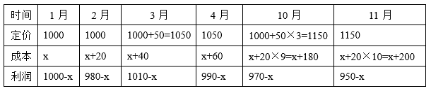
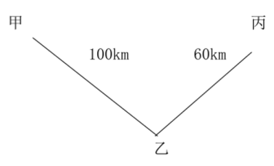
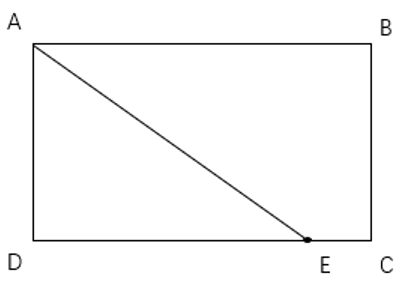
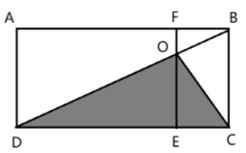
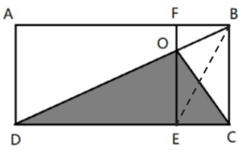
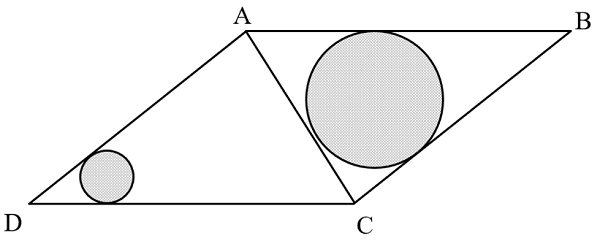
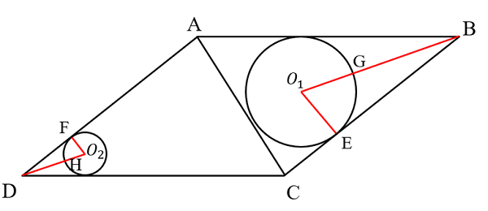

# 2025年天津市公务员录用考试《行测》题（网友回忆版）

> 数量关系 · 15 题 · 天津 2025

## 第 1 题　qid 10297070 · 数学运算

某水产养殖公司拥有若干幼体培育车间、育苗车间和藻类池。已知幼体培育车间的水体与育苗车间的水体之比为1：4，藻类池的水体是幼体培育车间水体的50%。若每水体需配备1名管理人员，则幼体培育车间需要的管理人员比育苗车间少12人。问该公司共配备了多少名管理人员？

- **A**. 25
- **B**. 24
- **C**. 23
- **D**. 22　✅

**答案**：D

**官方解析**

方法一：设幼体培育车间的水体为，则育苗车间的水体为，藻类池的水体为。根据“幼体培育车间需要的管理人员比育苗车间少12人”，可列方程：，解得x=800。则幼体培育车间的水体为，育苗车间的水体为，藻类池的水体为。故该公司共配备了名管理人员。

方法二：根据“幼体培育车间的水体与育苗车间的水体之比为1：4，藻类池的水体是幼体培育车间水体的50%”可得三车间的水体之比为1：2：8，则总水体为1+2+8=11的倍数，则由“每水体需配备1名管理人员”可得总管理人员数也为11的倍数，结合选项只有D选项符合。

故正确答案为D。

---

## 第 2 题　qid 10297074 · 数学运算

乡村振兴文明实践积分制度中，基础积分50分；民主评议活动积分中3项为每项10分，2项为每项5分；贡献积分有5项，每项10分。每项积分仅加一次。小李去年在民主评议活动和贡献积分中都有收获，总积分为130分。问小李至少获得了几项民主评议活动积分？

- **A**. 1
- **B**. 2
- **C**. 3　✅
- **D**. 4

**答案**：C

**官方解析**

根据题意可知，总积分（130）=基础积分（50）+民主评议活动积分+贡献积分。基础积分固定为50分，要想使得获得积分的民主评议活动项目尽可能少，则需民主评议活动的积分尽可能少，贡献积分尽可能多，即贡献积分获得满分5×10=50分，此时民主评议活动获得130-50-50=30分；民主评议活动项目有5分/项和10分/项两类，当获得10分/项的3项（3×10=30分）时，获得积分的民主评议活动项目最少。故小李至少获得了3项民主评议活动积分。
故正确答案为C。

---

## 第 3 题　qid 10297077 · 数学运算

某种商品今年1月的定价为1000元/吨，2月起由于每月原材料上涨导致每月成本增加20元/吨，3月、6月、9月、12月每月初定价在上月基础上向上调50元/吨。则本年度利润最高的月份和最低的月份分别是：

- **A**. 3月、10月
- **B**. 3月、11月　✅
- **C**. 4月、10月
- **D**. 4月、11月

**答案**：B

**官方解析**

方法一：设今年1月商品的成本为x元/吨。根据题意，可列表如下：

由表可知：3月的利润最高，11月的利润最低。

方法二：根据选项，最高利润只需比较3月与4月，根据题意，3月与4月的定价相同，而4月的成本更高，故4月的利润更低，排除C、D两项；同理，最低利润只需比较10月与11月，10月与11月的定价相同，而11月的成本更高，故11月的利润更低，排除A项。

故正确答案为B。

---

## 第 4 题　qid 10297078 · 数学运算

某超市销售甲、乙两种相同单价的商品。第一天甲的销量是乙的1.5倍，第二天乙打八折销售，销量比甲多500件。已知甲、乙两种商品两天的总销售额相等，甲两天共销售1400件，问乙第一天销售多少件？

- **A**. 600　✅
- **B**. 700
- **C**. 800
- **D**. 900

**答案**：A

**官方解析**

赋值甲、乙两种商品的单价均为10元，则第二天乙打八折的价格为10×0.8=8元。设乙第一天的销量为x件，则甲第一天的销量为1.5x件，甲第二天的销量为（1400-1.5x）件，乙第二天的销量为1400-1.5x+500=（1900-1.5x）件。根据“甲、乙两种商品两天的总销售额相等”，可列式：1400×10=10x+8×（1900-1.5x），解得x=600。因此乙第一天销售600件。
故正确答案为A。

---

## 第 5 题　qid 10297080 · 数学运算

某连锁餐厅甲、乙、丙三个店面2024年销售额总计为1000万元，利润总计为120万元。其中，甲店面的销售额是利润的10倍，是丙店面销售额的，乙店面的利润比甲店面多10万元且比丙店面少10万元。问乙店面的销售额是利润的多少倍？

- **A**. 6
- **B**. 6.25　✅
- **C**. 7
- **D**. 7.2

**答案**：B

**官方解析**

设2024年甲店面利润为x万元，则其销售额为10x万元，乙店面利润为（x+10）万元，丙店面利润为x+10+10=（x+20）万元，其销售额为万元。根据“甲、乙、丙三个店面2024年利润总计为120万元”，可得x+（x+10）+（x+20）=3x+30=120，解得x=30。又根据“甲、乙、丙三个店面2024年销售额总计为1000万元”，可得乙店面销售额=1000-10x-15x=1000-25×30=250万元，乙店面利润为30+10=40万元，则乙店面的销售额是利润的250÷40=6.25倍。

故正确答案为B。

---

## 第 6 题　qid 10297140 · 数学运算

企业将15个招聘名额分配到甲、乙、丙、丁四个分公司。要求每个分公司至少分1个名额，任意2个分公司分配名额数不同。甲分配的名额不能是最多，甲、乙分配的名额都不能是最少，丙比丁多分配1个名额。问有多少种不同的分配方式？

- **A**. 2
- **B**. 4　✅
- **C**. 7
- **D**. 9

**答案**：B

**官方解析**

任意2个分公司分配名额数不同，甲、乙分配的名额都不是最少，且丙比丁多1个，则丁为最少，丙为倒数第二；甲不能是最多，则乙为最多，甲为第二。对最少数量分类讨论如下：①丁为1时，丙为2，剩余12个分配名额供甲、乙分配，则甲、乙分配方案可为（3、9），（4、8），（5、7）三种，均满足题意；②丁为2时，丙为3，剩余10个分配名额供甲、乙分配，则甲、乙分配方案可为（4、6）一种，满足题意。其余均不满足题意，故共有4种不同的分配方式。
故正确答案为B。

---

## 第 7 题　qid 10297176 · 数学运算

从甲地到乙地为下坡路，从乙地到丙地为上坡路。小张从甲地开车经过乙地前往丙地，此后原路返回。其上坡速度是下坡的60%。已知他从甲地到乙地用时正好是去程全程用时的一半，则他返程全程用时比去程全程用时：

- **A**. 少不到10%
- **B**. 少10%以上
- **C**. 多不到10%
- **D**. 多10%以上　✅

**答案**：D

**官方解析**

方法一：赋值上坡速度为60km/h，下坡速度为100km/h，赋值去程从甲地到乙地时间为1h，则去程全程时间为2h。根据公式：S=VT，可知，，返程全程的时间，所以，在D项范围内。

方法二：根据比例行程，若S相同，则V与T成反比，可知甲地到乙地：；乙地到丙地：。根据题意，去程从甲地到乙地的时间为去程全程的一半，则设去程从甲地到乙地的时间为15x，全程时间为30x，返程从丙地到乙地的时间为9x，从乙地到甲地的时间为25x，全程时间为34x，故，在D项范围内。

故正确答案为D。

---

## 第 8 题　qid 10297192 · 数学运算

零售企业在某城市有10家门店，其中A、B、C区分别有5家、3家和2家，现选择其中的5家门店开展促销活动，要求每个区至少选择1家，问有多少种不同的选择方式？

- **A**. 不到200种　✅
- **B**. 200~399种之间
- **C**. 400~799种之间
- **D**. 不少于800种

**答案**：A

**官方解析**

题目要求每个区至少选择1家，则每个区的选择数量只能是（3，1，1）和（2，2，1）的组合。具体每个区选几家，需要分情况讨论。

如果按照（3，1，1）的组合选择，可选：①A区3家，B区1家，C区1家，有种情况；②A区1家，B区3家，C区1家，有种情况。相加共有60+10=70种情况。

如果按照（2，2，1）的组合选择，可选：①A区2家，B区2家，C区1家，有种情况；②A区1家，B区2家，C区2家，有种情况；③A区2家，B区1家，C区2家，有种情况。相加共有60+15+30=105种情况。

综合以上，共有70+105=175种情况，在A项范围内。

故正确答案为A。

---

## 第 9 题　qid 10297071 · 数学运算

某超市规定，消费达标可参加抽奖，分一等奖200元、二等奖100元和未中奖三种情形。已知小王消费共抽奖3次，若每次抽中一等奖和二等奖的概率分别为10%和20%，问小王共中奖恰好300元的概率在以下哪个范围内？

- **A**. 5%以下
- **B**. 5%~8%之间
- **C**. 8%~11%之间　✅
- **D**. 11%以上

**答案**：C

**官方解析**

根据题意，已知小王想要抽奖3次恰好中奖300元，分类如下：

（1）中3次二等奖（100元）：每次中二等奖概率相同，均为20%，则连续中3次的概率为20%×20%×20%=0.8%；

（2）中1次一等奖（200元）以及1次二等奖（100元），1次未中奖：每次抽中一等奖和二等奖的概率分别为10%和20%，则每次未中奖的概率为1-10%-20%=70%。因需要考虑3次抽奖的结果具体是在哪次发生，故列式为：。

综上所述，总概率为0.8%+8.4%=9.2%。

故正确答案为C。

---

## 第 10 题　qid 10297158 · 数学运算

甲和乙参加知识竞赛，每人均需作答1道理工类问题和1道人文类问题。甲作答两类问题的正确率分别为60%和40%，乙作答两类问题的正确率分别为50%和75%。问甲答对问题数量比乙多的概率在以下哪个范围内？

- **A**. 22%以下　✅
- **B**. 22%-25%之间
- **C**. 25-28%之间
- **D**. 28%以上

**答案**：A

**官方解析**

甲答对问题数量比乙多的情况有两种：
（1）甲答对1道（理工类对人文类错或理工类错人文类对），乙答对0道。甲答对1道的概率为60%x（1-40%）+（1-60%）x40%=60%×60%+40%×40%=52%，乙答对0道的概率为（1-50%）×（1-75%）=50%×25%=12.5%。分步用乘法，甲答对1道，乙答对0道概率为52%×12.5%=6.5%；
（2）甲答对2道，乙答对0道或1道（理工类对人文类错或理工类错人文类对）。甲答对2道的概率为60%×40%=24%，乙答对0道或1道的概率为12.5%+（1-50%）×75%+50%×（1-75%）=62.5%，也可以考虑反面求解，乙答对0道或1道概率=1-乙答对2道概率，即1-50%×75%=62.5%。甲答对2道，乙答对0道或1道的概率为24%×62.5%=15%。
分类用加法，甲答对问题数量比乙多的概率为6.5%+15%=21.5%，在A项范围内。
故正确答案为A。

---

## 第 11 题　qid 10297094 · 数学运算

某旅行团有游客15人，租用6辆车外出旅行，每辆车乘坐游客最多4人。已知每辆车至少乘坐1名游客，问乘坐2名游客的车辆至多有几辆？

- **A**. 1
- **B**. 2
- **C**. 3
- **D**. 4　✅

**答案**：D

**官方解析**

方法一：设乘坐1名游客的车有a辆，乘坐2名游客的车有b辆，乘坐3名游客的车有c辆，乘坐4名游客的车有d辆。根据题意可列式：a+b+c+d=6······①，a+2b+3c+4d=15······②，联立方程组，由②-①，得b+2c+3d=9。求b的最大值，将选项从大到小依次代入，代入D项，若b=4，则2c+3d=5，可取值c=d=1，代入①解得a=0，满足题干条件。
方法二：根据题意，每辆车至多乘坐4名游客，求乘坐2名游客的车辆至多有几辆。若6辆车均先乘坐2名游客，则各自空余2个座位。剩余15-2×6=3名游客无车乘坐，即剩余的3名游客最少需要安排到2辆车上，此时乘坐2名游客的车辆最多，为6-2=4辆。
故正确答案为D。

---

## 第 12 题　qid 10297095 · 数学运算

小区保安老张的值班时间是每星期一、二、四、六。某年4月1日老张休息，5月老张总共值班17次。则当年老张最后一次值班是在：

- **A**. 星期一
- **B**. 星期二
- **C**. 星期四　✅
- **D**. 星期六

**答案**：C

**官方解析**

根据题意可知：老张每周值班4天即4次。5月共31天，其中5月1-28日共28天为4整周，老张需值班4×4=16次，则剩余3天（5月29-31日）中老张需要值班1次，由题意可知，这3天为星期三、星期四、星期五或星期五、星期六、星期日。分情况讨论：

①若5月31日为星期五，则5月1日为星期三，所以4月1日为星期一，老张需要值班，与题干要求不符，排除；

②若5月31日为星期日，则5月1日为星期五，所以4月1日为星期三，老张休息，符合题干要求。由于6月1日至12月31日共：30+31+31+30+31+30+31=214天，则（个周期）······4（天），相当于5月31日星期日再过4天即为12月31日的星期四，这天恰好需要老张值班，因此当年老张最后一次值班是在星期四。

故正确答案为C。

---

## 第 13 题　qid 10297096 · 数学运算

一条长方形跑道ABCD中，AB长度是AD的1.5倍。小张从A点出发以9千米/小时的速度向B点方向匀速慢跑，40秒后尚未到达B点，距离B点还有35米。如他继续沿跑道匀速慢跑，再过1分钟后，他与A点的直线距离在以下哪个范围内？

- **A**. 不到135米
- **B**. 135~140米之间
- **C**. 140~145米之间　✅
- **D**. 超过145米

**答案**：C

**官方解析**

已知9千米/小时米/秒，根据s=vt，小张40秒后距离A点2.5×40=100米，则AB长度为100+35=135米。根据题干“AB长度是AD的1.5倍”，可得米。小张慢跑1分钟的距离为2.5×60=150米，根据跑前距离B点还有35米，BC长度为90米，150-35-90=25米，可得1分钟后小张到达CD边上E点且与C点距离为25米，如下图所示，与A、D两点构成直角三角形，其中AD=90米，DE=135-25=110米，根据勾股定理可得，则，因此米，则此时小张距离A点的直线距离在140~145米之间。

故正确答案为C。

---

## 第 14 题　qid 10297099 · 数学运算

某矩形农场ABCD如图所示，矩形区域ADEF为生产区，矩形区域BCEF为休闲区。现连接BD将两区域打通，与EF相交于O点。已知AF和FE的长度分别为600米和400米，问COD围成的三角形阴影区域面积为多少万平方米？

- **A**. 12　✅
- **B**. 15
- **C**. 16
- **D**. 18

**答案**：A

**官方解析**

连接BE，如下图所示。根据题意BCEF为矩形，则且BC=EF=400米，，那么与为同底等高的三角形，即，那么平方米，即12万平方米。

故正确答案为A。

---

## 第 15 题　qid 10297103 · 数学运算

某工业园区内一区域如下图所示，三角形ABC与ACD为两个面积相等的直角三角形，AB长度是BC的2倍。现在区域内划出如图两个圆形区域摆放花坛，两个圆形均与图中两条边相切。已知B点到大圆、D点到小圆上任一点的最短距离分别为AD长度的、，问大圆面积是小圆的多少倍？

- **A**. 3倍以下
- **B**. 3~3.5倍之间
- **C**. 3.5~4倍之间
- **D**. 4倍以上　✅

**答案**：D

**官方解析**

根据题意“三角形ABC与ACD为两个面积相等的直角三角形，AB长度是BC的2倍”，可得，则，连接、可得与两圆交点分别为G与H两点，则BG、DH分别为B、D两点距离两圆的最短距离，，，设大圆、小圆半径分别为R、r，则、，，，赋值AD=BC=10，则、，所以。

故正确答案为D。

---
