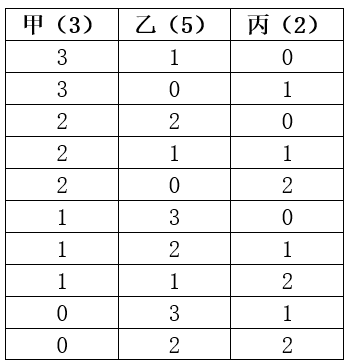

# 2025年宁夏公务员录用考试《行测》题（网友回忆版）

> 数量关系 · 10 题 · 宁夏 2025

## 第 1 题　qid 12882041 · 数学运算

甲和乙两条生产线的效率比为1：x，现共同生产一批设备12天后正好完成一半。此时甲的效率提升为原来的2x倍，乙的效率提升为原来的y倍后，又用了6天正好完成生产任务。问x和y的关系为：

- **A**. xy=1
- **B**. xy=2　✅
- **C**. x=2y
- **D**. x=3y

**答案**：B

**官方解析**

设甲和乙两条生产线的效率分别为1和x，根据“共同生产一批设备12天后正好完成一半”，可得：。根据“甲的效率提升为原来的2x倍，乙的效率提升为原来的y倍”，则甲生产线的效率变为2x，乙生产线的效率变为xy，根据“又用了6天正好完成生产任务”，可得：。联立①②，可得：（1+x）×12=（2x+xy）×6，化简得：xy=2。

故正确答案为B。

---

## 第 2 题　qid 13504316 · 数学运算

某购物平台推出每消费600元立减50元的活动，钟先生在该平台准备购买单价为500元的某款商品不超过10件，问他购买几件时平均每件的购买成本最低？

- **A**. 5
- **B**. 6　✅
- **C**. 8
- **D**. 9

**答案**：B

**官方解析**

方法一：根据题意，由于“每消费600元立减50元”，故要想平均每件的购买成本最低，则应让购买总价刚好为600的倍数。因为购买商品单价为500元，因此购买总价也应为500的倍数。故购买总价既是600的倍数又是500的倍数，则其应为600和500最小公倍数（3000）的倍数。因为购买件数不超过10件，所以购买总价不超过500×10=5000元，则当购买总价为3000元时，即购买件商品时，此时平均每件成本最低。

方法二：根据每消费600元立减50元，代入选项进行分析：

代入A项：若购买5件，则总价为500×5=2500元，······100，故可享受优惠50×4=200元，平均每件商品享受优惠元；

代入B项：若购买6件，则总价为500×6=3000元，，故可享受优惠50×5=250元，平均每件商品享受优惠元；

代入C项：若购买8件，则总价为500×8=4000元，······400，故可享受优惠50×6=300元，平均每件商品享受优惠元；

代入D项：若购买9件，则总价为500×9=4500元，······300，故可享受优惠50×7=350元，平均每件商品享受优惠元。

综上，当购买6件时，平均每件商品享受优惠最大，此时平均每件的购买成本最低。

故正确答案为B。

---

## 第 3 题　qid 13504397 · 数学运算

某产品甲、乙两个经销商第一季度销售总额为200万元。第二季度，甲、乙的销售额比第一季度分别高20%、25%，且甲的销售额比乙高44万元。问上半年甲的销售额比乙高多少万元？

- **A**. 72
- **B**. 76
- **C**. 80
- **D**. 84　✅

**答案**：D

**官方解析**

设甲第一季度销售额为a万元，则乙第一季度销售额为（200-a）万元，甲第二季度销售额为1.2a万元，乙第二季度销售额为1.25×（200-a）万元。根据题意可列式：1.2a-1.25×（200-a）=44，解得a=120，则甲第一季度销售额为120万元，乙第一季度销售额为200-120=80万元。故甲第一季度销售额比乙高120-80=40万元，根据题干甲第二季度销售额比乙高44万元，因此上半年甲的销售额比乙高40+44=84万元。
故正确答案为D。

---

## 第 4 题　qid 13504333 · 数学运算

五边形公园ABCDE的面积为4万平方米，其中ABCD为长方形，AB=0.75BC，且ADE为等腰直角三角形（为直角）。小张从D点出发在公园中慢跑，沿箭头所示方向先后经过B点、AE中点和DE中点后到达C点。问小张全程跑了多少米?

- **A**. 

- **B**. 

- **C**. 

　✅
- **D**. 

**答案**：C

**官方解析**

连接AD，设长方形长BC、AD为4x米，则宽AB、DC为3x米，则根据勾股定理可得长方形对角线BD米；根据为等腰直角三角形，三边比例关系为，可得米；则；解得x=50米，那么AB=CD=150米，AD=BC=200米，BD=250米。

由题意可得F、G分别为AE、DE中点，故米；过E点做AD垂线相交于H点，过G点做AD、BC垂线分别相交于I、J点，则EH=HD=100米，GI为的中位线，故米；那么在直角中，CJ=DI=50米，JG=IJ+GI=150+50=200米，根据勾股定理可得：米，同理可得：米；则所求距离米。

故正确答案为C。

---

## 第 5 题　qid 13504282 · 数学运算

小张和小赵分别从甲、乙两地同时出发前往对方的出发地。小张出发时的速度是小赵的一半，两人匀速行进1小时后迎面相遇。此后小张开始均匀加速，最终比小赵晚到达1小时。问小张到达时的速度是小赵到达时速度的多少倍？

- **A**. 

- **B**. 

- **C**. 

　✅
- **D**. 

**答案**：C

**官方解析**

根据题意，赋值小赵出发时每小时的速度为2，则小张出发时每小时的速度为1。两人同时从甲、乙两地出发，1小时后相遇，根据相遇公式：，可得。小赵从乙地到甲地全程用时为小时，则小张从甲地到乙地全程用时为1.5+1=2.5小时。小张从相遇后到达乙地用时为2.5-1=1.5小时，小张从相遇后到达乙地距离等于小赵1小时行进距离=2×1=2，则小张从相遇后到达乙地的平均速度为。根据公式：均匀加速运动的平均速度，可列式，解得小张达到乙地时的速度为，则小张到达时的速度是小赵到达时速度的倍。

故正确答案为C。

---

## 第 6 题　qid 13504531 · 数学运算

甲、乙、丙合作完成一项工程。如甲8天、乙6天、丙4天依次工作刚好可完工。现甲、乙合作6天后，剩下的工程丙恰好单独5天完工。已知甲的效率是乙的1.5倍，问丙单独完成需要多少天？

- **A**. 10　✅
- **B**. 15
- **C**. 20
- **D**. 30

**答案**：A

**官方解析**

由“甲的效率是乙的1.5倍”，可赋值甲的效率为3，则乙的效率为2。设丙的效率为a，根据题意可列式：8×3+6×2+4a=6×（3+2）+5a，解得a=6，即丙的效率为6，这项工程总量为6×（3+2）+5×6=60，则丙单独完成这项工程需要60÷6=10天。
故正确答案为A。

---

## 第 7 题　qid 13504532 · 数学运算

甲、乙、丙3名研究生本学期已阅读了159篇本专业的学术论文。已知甲的阅读量比乙的一半多28篇，丙的阅读量比甲和乙的平均阅读量多18篇。问乙本学期至少还要再阅读多少篇，阅读量才能比丙多50%以上？

- **A**. 42
- **B**. 48
- **C**. 54　✅
- **D**. 60

**答案**：C

**官方解析**

根据题意，设乙本学期已阅读2x篇，则甲本学期已阅读（x+28）篇，丙本学期已阅读篇。根据题意可列式：x+28+2x+1.5x+32=159，解得x=22，则乙本学期已阅读44篇，丙本学期已阅读65篇。设乙本学期还要阅读y篇即可比丙多50%以上，根据题意可列式：，解得y&gt;53.5，y最少为54。

故正确答案为C。

---

## 第 8 题　qid 13504267 · 数学运算

某公司甲部门男性员工比女性多2人，乙部门女性员工比男性多3人。已知甲、乙两部门女性员工共6人，问从甲、乙两部门中随机选出4人，恰好选到2名男员工和2名女员工的概率是：

- **A**. 

- **B**. 

　✅
- **C**. 

- **D**. 

**答案**：B

**官方解析**

设甲部门女性员工为x人，则甲部门男性员工有（x+2）人；乙部门女性员工有（6-x）人；乙部门男性员工有（6-x）-3=（3-x）人；甲、乙两个部门共有男性员工（x+2）+（3-x）=5人。

根据公式：概率，分析如下：

甲、乙两个部门共有5+6=11名员工，从中随机选出4人，总情况数种。

要求选出的4名员工恰好为2名男员工和2名女员工：从5名男员工中随机选出2名，有种情况；从6名女员工中随机选出2名，有种情况。则满足要求的情况数为种。

综上，所求概率。

故正确答案为B。

---

## 第 9 题　qid 13504535 · 数学运算

甲、乙、丙三个科室分别有3名、5名和2名党员。现有4个去党校学习的名额，要求至少分配给2个科室。问有多少种不同的名额分配方式？

- **A**. 9
- **B**. 10　✅
- **C**. 11
- **D**. 12

**答案**：B

**官方解析**

根据题意，只需将4个名额分给三个科室即可，可用枚举法列表如下：

共有10种分配方式。

故正确答案为B。

---

## 第 10 题　qid 13504275 · 数学运算

小王、小李参加某项知识竞赛答题，小王每题答对的概率相等，且均为小李的1.5倍。已知小王连续答对2题的概率比小李高0.2，问小王前2题全对且小李前2题全错的概率在以下哪个范围内？

- **A**. 不到0.05
- **B**. 0.05~0.08
- **C**. 0.08~0.11
- **D**. 0.11以上　✅

**答案**：D

**官方解析**

设小李答对每道题的概率为p，小王答对每道题的概率为1.5p，则小李连续答对2道题的概率为，小王连续答对2道题的概率为。

根据题干“小王连续答对2题的概率比小李高0.2”，则，解得p=0.4。

小王答对每道题的概率为1.5×0.4=0.6，前2题全对的概率为0.6×0.6=0.36；小李答对每道题的概率为0.4，前2题全错的概率为（1-0.4）×（1-0.4）=0.36，因此小王前2题全对且小李前2题全错的概率为0.36×0.36=0.1296，在D项范围内。

故正确答案为D。

---
