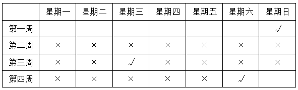
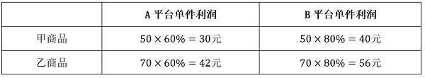
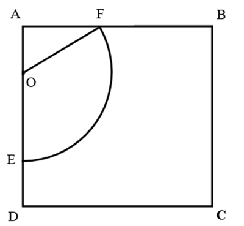

# 2025年山东省公务员录用考试《行测》试题（网友回忆版）

> 数量关系 · 10 题 · 山东 2025

## 第 1 题　qid 16157430 · 数学运算

为应对浒苔绿潮灾害，某市对海上浒苔进行打捞。初始打捞区域面积为150平方公里，第一天清理掉了20%，当晚由于浒苔漂移，致使原剩余打捞区域面积增加了15%。第二天清理掉了剩余面积的25%。问第二天清理完，剩余打捞区域面积约为多少平方公里?

- **A**. 114
- **B**. 104　✅
- **C**. 128
- **D**. 138

**答案**：B

**官方解析**

根据题意，第一天清理后浒苔剩余打捞区域面积=150×（1-20%）=120平方公里，当晚由于浒苔漂移， 剩余打捞区域面积增加至120×（1+15%）=138平方公里，第二天清理完，剩余打捞区域面积平方公里。

故正确答案为B。

---

## 第 2 题　qid 16157437 · 数学运算

某徒步爱好者以平均每小时6千米的速度爬山，爬到路程一半时停下来休息了15分钟，之后速度降为原来的二分之一，全程共用2.5小时。问该徒步爱好者爬山全程是多少千米？

- **A**. 9　✅
- **B**. 10
- **C**. 12
- **D**. 13.5

**答案**：A

**官方解析**

根据题意可知，前一半路程的速度千米/小时，后一半路程的速度千米/小时。根据等距离平均速度公式：，可得该徒步爱好者爬山的平均速度千米/小时，全程爬山的用时为小时。根据行程公式：s=vt，则该徒步爱好者爬山全程是4×2.25=9千米。

故正确答案为A。

---

## 第 3 题　qid 16157469 · 数学运算

某小区要安装若干电动车公共充电桩。由张师傅先施工5天，李师傅再施工9天就能全部完工。如果张师傅先施工7天，李师傅再施工6天，也能全部完工。现由张师傅和李师傅一起施工3天后，张师傅有新任务离开，剩余工作由李师傅单独完成。问李师傅还需几天能完工?

- **A**. 10
- **B**. 8
- **C**. 7
- **D**. 9　✅

**答案**：D

**官方解析**

根据题意可列式：5×张+9×李=7×张+6×李，化简可得：。赋值张师傅每天工作效率为3，李师傅每天工作效率为2，则总工程量=5×3+9×2=33。张师傅和李师傅一起施工3天一共做了（3+2）×3=15，则剩余工作还需时间天。

故正确答案为D。

---

## 第 4 题　qid 16157424 · 数学运算

某单位举办田径比赛，100米决赛将按半决赛成绩安排道次：前四名运动员，抽签排在3、4、5、6道；第五、第六名运动员，抽签排在7、8道；后两名运动员，抽签排在1、2道。问共有多少种安排方式？

- **A**. 48
- **B**. 72
- **C**. 96　✅
- **D**. 120

**答案**：C

**官方解析**

根据“前四名运动员，抽签排在3、4、5、6道”，可知前四名运动员的安排方式有种；根据“第五、第六名运动员，抽签排在7、8道”，可知第五、第六名运动员的安排方式有种；根据“后两名运动员，抽签排在1、2道”，可知后两名运动员的安排方式有种。分步用乘法，则一共有种安排方式。

故正确答案为C。

---

## 第 5 题　qid 14403678 · 数学运算

某社区小王、小刘参加宣传活动，已知小王隔9天参加一次，小刘只有在周末（星期六或者星期日）参加一次。某个星期日两人共同参加了宣传活动，在没有统一安排的前提下，问下一次最少再隔多少天两人共同参加宣传活动？

- **A**. 19　✅
- **B**. 20
- **C**. 21
- **D**. 22

**答案**：A

**官方解析**

方法一：根据题意，小王某个星期日参加活动后的情况列表如下，其中“√”代表去参加宣传活动，“×”代表不去参加宣传活动。

观察发现，小王下一次在周末参加宣传活动的时间是第四周的星期六，此时小刘也可以参加宣传活动，则从第一周的星期日到第四周的星期六，最少间隔7+7+5=19天。

方法二：根据“小王隔9天参加一次”可知，小王每10天参加一次宣传活动，则下一次两人共同参加宣传活动的时间为10n天后（n为正整数），间隔（10n-1）天，结合选项，只有A项符合。

故正确答案为A。

---

## 第 6 题　qid 16157426 · 数学运算

某商店在母亲节前夕花费288元购进了120支康乃馨。初期按获得50%的期望利润定价出售，当售出75%之后，剩余的康乃馨按定价打折促销。已知最终获得的总利润是初期期望获得总利润的85%，问康乃馨促销时打了几折?

- **A**. 7
- **B**. 7.5
- **C**. 8　✅
- **D**. 8.5

**答案**：C

**官方解析**

根据题意可知：每支康乃馨的进价元，康乃馨的定价=2.4×（1+50%）=3.6元。设打折促销的康乃馨为x元，根据“最终获得的总利润是初期期望获得总利润的85%”，可列方程：，解得x=2.88，则所求折扣，即打了8折。

故正确答案为C。

---

## 第 7 题　qid 16157485 · 数学运算

某社团组织40余名志愿者前往A地参与科普活动。若平均分为4组，则至少需要招募1名志愿者；若平均分为5组，则至少需要招募2名。若分为3组，要求每组有10余人且人数各不相同，问该分法中人数最多的与人数最少的组至少相差几人？

- **A**. 3　✅
- **B**. 2
- **C**. 4
- **D**. 5

**答案**：A

**官方解析**

根据题意 “平均分为4组至少需要招募1人、平均分为5组至少需要招募2人”，可得总人数+1是4的倍数、总人数+2是5的倍数，又因总人数为“40余名”，故总人数为43人。当分为3组时，若想使人数最多与最少的两组相差最小，则应使人数最多的组取最小值、人数最少的组取最大值。设人数最多的组至少有x人，则另外两组的人数分别为x-1、x-2，列方程得：x+(x-1)+(x-2)=43，解得：人，则人数最多的组至少为16人，剩余43-16=27人，当剩余两组人数为14、13时，即可符合题目要求，此时人数最多的与人数最少的组相差16-13=3人。

故正确答案为A。

---

## 第 8 题　qid 16157421 · 数学运算

某品牌有甲、乙两种商品在A、B两个跨境电商平台销售。甲商品和乙商品的成本分别为50元/件和70元/件，在A平台两种商品的售价均在成本基础上加价60%，在B平台的售价均在成本基础上加价80%。上个月A、B两个平台的利润均为123600元。已知乙商品在A平台上售出800件，所得利润是在B平台上的2倍。问甲、乙两种商品售出数量之比在下列哪个范围内？

- **A**. 低于3
- **B**. 3~4之间
- **C**. 4~5之间
- **D**. 高于5　✅

**答案**：D

**官方解析**

根据公式：利润=成本×利润率，可得甲、乙两种商品在A、B两个跨境电商平台销售的单件利润如下表：

根据乙商品在A平台上售出800件，可得乙商品在A平台上总利润为800×42=33600元，在B平台上总利润为33600÷2=16800元，乙商品在A、B两个平台共售出件。则甲商品在A平台上总利润为123600−33600=90000元，在B平台上总利润为123600−16800=106800元，甲商品在A、B两个平台共售出件。故甲、乙两种商品售出数量之比为，在D项范围内。

故正确答案为D。

---

## 第 9 题　qid 16157434 · 数学运算

山东某图书馆开展古籍数字化转化实验，每册转化成功率为90%。假设每册古籍数字化转化成功与否互不影响，现选择4册古籍进行数字化转化，问至少有3册转化成功的概率是多少？

- **A**. 65.97%
- **B**. 70.74%
- **C**. 94.77%　✅
- **D**. 99.63%

**答案**：C

**官方解析**

根据题意，至少有3册转化成功的情况可分类讨论如下： 

①有3册转化成功：概率；

②4册均转化成功：概率；

分类用加法，则所求的概率。

故正确答案为C。

备注：本题计算量较大，可结合选项，观察尾数和范围快速确定答案。

---

## 第 10 题　qid 16157428 · 数学运算

要建一个正方形农田，边长为36米，在其中一边的处安装一个喷灌装置，该装置的灌溉半径为18米，问该农田被灌溉的面积是多少？

- **A**. 不到380平方米
- **B**. 380~420平方米之间　✅
- **C**. 420~450平方米之间
- **D**. 450平方米以上

**答案**：B

**官方解析**

该农田被灌溉的面积如下图所示，即三角形OAF和扇形OEF的面积之和。根据题意可知，米，OF=18米，根据特殊三角形结论可知，，则米，平方米。由于，则，则平方米。则该农田被灌溉的面积平方米，在B项范围内。

故正确答案为B。

---
