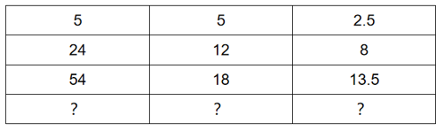
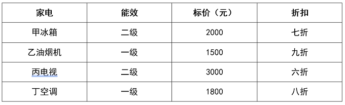
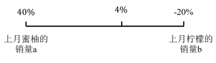
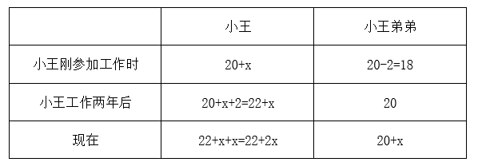

# 2025年广东省公务员录用考试《行测》题（网友回忆版）

> 数量关系 · 12 题 · 广东 2025

## 第 1 题　qid 12881926 · 数学运算

，，，，（    ）

- **A**. 

- **B**. 

　✅
- **C**. 

- **D**. 

**答案**：B

**官方解析**

观察分数数列特征，优先考虑反约分。原数列可转化为：，，，，发现分子分别为1，3，5，7，是公差为2的等差数列，下一项为9；分母分别为6，21，36，51，是公差为15的等差数列，下一项为66，则所求项。

故正确答案为B。

---

## 第 2 题　qid 12881927 · 数学运算

（    ）

- **A**. 55，11，5.5
- **B**. 40，10，2.5
- **C**. 75，15，10
- **D**. 60，15，12　✅

**答案**：D

**官方解析**

第一列与第二列结合看，可以发现5=5×1，24=12×2，54=18×3，故第四行第一项=第二项×4，排除A、C两项。第二列与第三列结合看，可以发现，，，故，只有D项符合。

故正确答案为D。

---

## 第 3 题　qid 12881928 · 数学运算

箱子里装有红、蓝、绿、白、黑五种颜色的小球各20个。如果从箱子里取出若干个小球，且确保其中有10个小球颜色相同，则至少要取出（    ）个小球。

- **A**. 56
- **B**. 51
- **C**. 50
- **D**. 46　✅

**答案**：D

**官方解析**

根据题干要求“确保······则至少······”，可判定为最不利构造题型。当红色、蓝色、绿色、白色、黑色各取9个球时为最不利情况，共需取5×9=45个球；此时再取1个球，可以确保有10个小球的颜色相同，则至少要取出45+1=46个球。
故正确答案为D。

---

## 第 4 题　qid 12881923 · 数学运算

某服务大厅设有若干个服务窗口，其中1个是快捷服务窗口，某日服务窗口的平均业务量为29单，其中快捷服务窗口的业务量为41单，其余窗口的平均业务量为28单，则服务大厅共有（    ）个窗口。

- **A**. 13　✅
- **B**. 14
- **C**. 15
- **D**. 16

**答案**：A

**官方解析**

设服务大厅共有n个窗口，根据题意可列方程为：41+（n-1）×28=29×n，解得n=13。
故正确答案为A。

---

## 第 5 题　qid 12881924 · 数学运算

父子两人在百米赛道上匀速跑步，两人从赛道起点同时出发，父亲跑到终点时，儿子距离终点还有40米，若父亲立即折返跑向赛道起点，则两人相遇时，儿子距离终点还有（    ）米。

- **A**. 35
- **B**. 30
- **C**. 25　✅
- **D**. 15

**答案**：C

**官方解析**

根据题干“父亲跑到终点时，儿子距离终点还有40米”可得，父亲跑完100米时，儿子跑了60米。根据“时间相同，路程与速度成正比”可得：；由于两人保持匀速，故在后续的40米相遇过程中，，则儿子距离终点的距离即为此过程中父亲所走的距离，米。

故正确答案为C。

---

## 第 6 题　qid 12881935 · 数学运算

甲、乙两个工程队合作实施某项工程，原计划30天完成，但工作5天后甲被抽调到其他工程，又过了15天该工程正好完成一半，此时丙工程队加入，3天后甲工程队返回，最终该工程比原计划提前2天完成，则丙工程队的效率是甲工程队的（    ）倍。

- **A**. 1.5
- **B**. 2
- **C**. 2.5
- **D**. 3　✅

**答案**：D

**官方解析**

根据题意可知：工作总量=30（甲+乙）=2×[5×（甲+乙）+15乙]，整理可得：20甲=10乙，即甲：乙=1：2。赋值甲、乙的效率分别为1、2，则工作总量=30×（1+2）=90。

根据题干“该工程比原计划提前2天完成”可知，实际完成该项工程需要30-2=28天，当丙工程队加入时，时间已经过了5+15=20天，即完成工程的后一半中乙、丙工程队的工作时间为28-20=8天，根据“3天后甲工程队返回”可知，甲工程队的工作时间为28-20-3=5天。

综上可列式：，整理可得：8×（2+丙）+5×1=45，解得：丙=3，则丙工程队的效率是甲工程队的倍。

故正确答案为D。

---

## 第 7 题　qid 12881931 · 数学运算

某单位计划在一块直角三角形的绿地周边栽种树木，先在3个顶点各栽种1棵，再从顶点开始每隔4米栽种1棵，如果两条直角边（包含顶点）分别栽种4棵和5棵，则该绿地周边一共栽种了（    ）棵树。

- **A**. 12　✅
- **B**. 13
- **C**. 14
- **D**. 15

**答案**：A

**官方解析**

根据两条直角边（包含顶点）分别栽种4棵和5棵树木，间隔距离为4米，根据两端植树可知段数=棵数-1，因此两条直角边长分别为：（4-1）×4=12米，（5-1）×4=16米，根据勾股定理可得斜边长米。根据两端都不植树公式：棵数，则斜边（不包含顶点）可栽种树木棵。综上，绿地周边一共栽种了4+5+4-1=12棵。

故正确答案为A。

---

## 第 8 题　qid 12881937 · 数学运算

某商场在售的四款家电产品能效、标价及折扣等信息如下表所示。根据补贴规则，二级能效的家电产品可获得最终销售价格15%的补贴，一级能效的家电产品可获得最终销售价格20%的补贴，如果家电产品的最终销售价格=标价×折扣，则购买以下家电中的（    ）获得的补贴金额最多。

- **A**. 甲冰箱
- **B**. 乙油烟机
- **C**. 丙电视
- **D**. 丁空调　✅

**答案**：D

**官方解析**

根据题意，要确定哪个家电的补贴金额最多，需要分别计算该产品的最终销售价格，再计算出对应的补贴金额：
甲冰箱（二级能效）：最终售价=2000×0.7=1400元；补贴金额：1400×15%=210元；
乙油烟机（一级能效）：最终售价=1500×0.9=1350元；补贴金额：1350×20%=270元；
丙电视（二级能效）：最终售价=3000×0.6=1800元；补贴金额：1800×15%=270元；
丁空调（一级能效）：最终售价=1800×0.8=1440元；补贴金额：1440×20%=288元。
比较补贴金额，丁空调的补贴金额最多。
故正确答案为D。

---

## 第 9 题　qid 12881932 · 数学运算

某企业技术部门有7名员工，其中，有3人只能提供软件支持，有2人只能提供硬件支持，另外2人能同时提供软、硬件支持。现该部门向甲、乙两个客户派驻技术团队，要求每个团队中正好有2人能提供软件支持、2人能提供硬件支持。则不同的派驻方式共有（    ）种。

- **A**. 30　✅
- **B**. 42
- **C**. 70
- **D**. 144

**答案**：A

**官方解析**

要求每个团队中正好有2人能提供软件支持、2人能提供硬件支持，对分队情况进行分类讨论：

（1）2个团队分别有3人：一队有1人能同时提供软、硬件支持，1人只能提供软件支持，1人只能提供硬件支持，有种情况；另一队选人情况与之相同，同时提供软、硬件支持的只剩一人不用选，只能提供硬件支持的也只剩一人不用选，只需从剩余的只能提供软件支持的2人中选1人，有种情况。故此时共有12×2=24种情况；

（2）2个团队分别有2人、4人：2人队有2人能同时提供软、硬件支持，有种情况；4人队有2人只能提供软件支持，2人只能提供硬件支持，有种情况；且分为甲、乙两个客户，需要考虑哪个客户是2人队，则此时共有种情况。

最后分类用加法，共有24+6=30种情况。

故正确答案为A。

---

## 第 10 题　qid 12881930 · 数学运算

某助农电商企业销售柠檬、蜜柚两种水果，由于季节变化，这个月蜜柚的销量比上月增加了40%，而柠檬的销量降低了20%，最终当月这两种水果的总销量比上个月增加4%，则蜜柚上月销量占这两种水果上月销量的（    ）。

- **A**. 60%
- **B**. 50%
- **C**. 40%　✅
- **D**. 30%

**答案**：C

**官方解析**

方法一：设上月蜜柚的销量为x，柠檬的销量为y。根据“这个月蜜柚的销量比上月增加了40%，而柠檬的销量降低了20%”，可知这个月蜜柚的销量为（1+40%）x=1.4x，柠檬的销量为（1-20%）y=0.8y。根据“当月这两种水果的总销量比上个月增加4%”，则有：，解得，所求。

方法二：根据“这个月蜜柚的销量比上月增加了40%，而柠檬的销量降低了20%”，及“这两种水果的总销量比上个月增加4%”，涉及增长率的混合，可以考虑使用线段法进行解答。设上月蜜柚的销量为a，柠檬的销量为b，根据线段法：距离与量成反比，可知，所求。

故正确答案为C。

---

## 第 11 题　qid 12881936 · 数学运算

小王参加工作时的年龄，和他弟弟现在的年龄相同，小王工作两年后，弟弟也正式参加工作，现在兄弟俩的年龄之和，正好是他们工龄之和的8倍。如果弟弟20岁正式参加工作，则小王比弟弟大（    ）岁。

- **A**. 3
- **B**. 4　✅
- **C**. 5
- **D**. 6

**答案**：B

**官方解析**

设小王弟弟现在的工龄为x年，则小王和他弟弟的年龄情况如下表：

则现在小王的工龄为（22+2x）-（20+x）=（2+x）年，根据“现在兄弟俩的年龄之和，正好是他们工龄之和的8倍”可得22+2x+20+x=8×（2+x+x），解得x=2，则小王比弟弟大20+x-18=2+x=4岁。

故正确答案为B。

---

## 第 12 题　qid 12881939 · 数学运算

3名求职者参加某企业的面试，每人在6道面试题中随机抽取2道题作答，则有且仅有1道题没有被任何人抽到的概率（    ）。

- **A**. 不到20%
- **B**. 在20%到25%之间
- **C**. 在25%到30%之间
- **D**. 超过30%　✅

**答案**：D

**官方解析**

根据公式：概率，分析如下：

根据题意，3人面试每人在6道面试题中随机抽取2道题作答，每人的选择有种情况，则总的情况数有种情况；

满足条件的情况数为有且仅有1道题没有被任何人抽到，则被抽取的5道题目情况数为种情况，每人2道题目且5道题目均被抽取则题目被抽取次数为（2,1,1,1,1），即其中一道题目被2名求职者各抽取1次，有情况数，从剩下4道题目中抽取2道题目补齐2名求职者剩余题目，并且有顺序，则满足条件的情况数为种情况。

综上，所求概率为：。

故正确答案为D。

---
