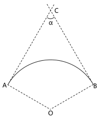
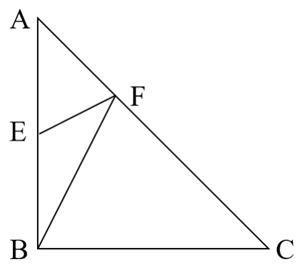
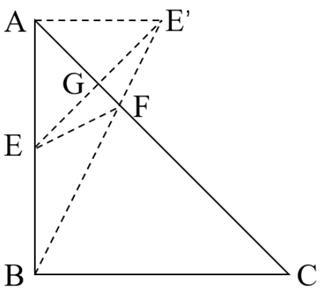
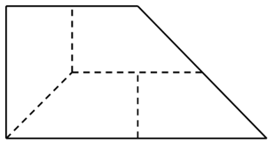
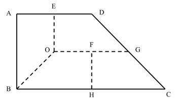

# 2025年新疆生产建设兵团面向社会招录公务员考试《行测》题（网友回忆版）

> 数量关系 · 10 题 · 新疆 2025

## 第 1 题　qid 13504430 · 数学运算

小明在网络二手交易平台按照每张150元的价格转手了两张珍藏版CD，其中一张盈利25%，另一张亏损25%，则小明转手这两张CD总的盈亏情况是：

- **A**. 不盈不亏
- **B**. 盈利20元
- **C**. 亏损20元　✅
- **D**. 亏损25元

**答案**：C

**官方解析**

每张CD转手价格为150元，则盈利25%的CD原价为元；亏损25%的CD原价为元。可得小明购买两张CD原价为120+200=320元，转手价格为150×2=300元，亏损了20元钱。

故正确答案为C。

---

## 第 2 题　qid 13504431 · 数学运算

某小区组织“情满金秋”柑橘采摘活动，参加人员按年龄分成老、中、青三组，老年组、中年组的人数之比为5：2，中年组、青年组的人数之比为3：4。老年组、中年组、青年组平均每人采摘速度之比为1：2：3。已知青年组共采摘80斤柑橘，那么三组人员一共采摘柑橘：

- **A**. 170斤　✅
- **B**. 212斤
- **C**. 255斤
- **D**. 298斤

**答案**：A

**官方解析**

根据题干“老年组、中年组的人数之比为5：2，中年组、青年组的人数之比为3：4”，则老年组、中年组、青年组的人数之比为15：6：8，设老年组、中年组、青年组的人数分别为15a、6a、8a，根据题干“老年组、中年组、青年组平均每人采摘速度之比为1：2：3”，设老年组、中年组、青年组平均每人采摘速度分别为b、2b、3b，由题意得，青年组一共采摘8a×3b=80，解得。老年组与中年组共采摘的柑橘重量为斤，故三组人员一共采摘的柑橘重量为90+80=170斤。

故正确答案为A。

---

## 第 3 题　qid 13504438 · 数学运算

某企业到A大学招聘，小张、小李和小王3位毕业生前去应聘。若小张、小李2人中至少有1人签约的概率是，小王签约的概率是，那么3人中至少有1人签约该企业的概率是多少？

- **A**. 

- **B**. 

- **C**. 

- **D**. 

　✅

**答案**：D

**官方解析**

方法一：由题意分类讨论可得：

则3人中至少有1人签约该企业的概率为：。

方法二：本题也可反向思考，即计算3人均未签约的概率，均未签约的概率，则3人中至少有1人签约该企业的概率。

故正确答案为D。

---

## 第 4 题　qid 12881895 · 数学运算

某风景区内有5个收费景点，门票分别为10元、10元、20元、20元、20元。老李花了40元购买门票，依次游览了不同景点。那么可能的游览方式有多少种？

- **A**. 6
- **B**. 18
- **C**. 24　✅
- **D**. 60

**答案**：C

**官方解析**

老李花了40元购买门票，依次游览了不同景点，分情况讨论：

分类一，游览2个门票为20元的景点：从3个门票为20元的景点中选出2个，考虑顺序，有种情况；

分类二，游览2个门票为10元的景点和1个门票为20元的景点：先从3个门票为20元的景点中选择1个，有3种情况；再将2个10元门票的景点全部选出，有1种情况；最后将选出的3个景点进行排序，有种情况。分步用乘法，共有3×6=18种情况。

分类用加法，所求总情况数=6+18=24种。

故正确答案为C。

---

## 第 5 题　qid 13504505 · 数学运算

高速公路某路段转向处靠近居民楼，为减少噪声需设置隔音板（如下图所示），安装隔音板范围为公路转向处的一段圆曲线（即从点A至点B圆弧），测控人员在过点A、B的两条切线的交点C处，测得从A到B转角为，若此圆曲线的半径OA=1km，则这段隔音板的安装长度为：

- **A**. 

- **B**. 

- **C**. 

　✅
- **D**. 

**答案**：C

**官方解析**

因为AC、BC与弧线相切，故、。已知，四边形OACB内角和为，则。根据弧长公式：弧长，则点A至点B弧长，即这段隔音板的安装长度为km。

故正确答案为C。

---

## 第 6 题　qid 13504547 · 数学运算

某研究机构对不同蔬果的代谢质量进行评分，分数越高代表代谢质量越高。现有13种蔬果，其中2种蔬果为5分，4种蔬果为4分，3种蔬果为3分，4种蔬果为2分，那么从中选取3种蔬果得分总和不低于13分的组合共有多少种？

- **A**. 21
- **B**. 19　✅
- **C**. 16
- **D**. 13

**答案**：B

**官方解析**

选取3种蔬果得分总和不低于13分，则分数组合有（5、5、4）、（5、5、3）、（5、4、4）三类情况，分类讨论情况数：

①选取两个5分、一个4分，有种情况；

②选取两个5分、一个3分，有种情况；

③选取一个5分、两个4分，有种情况。

则得分总和不低于13分的组合共有4+3+12=19种。

故正确答案为B。

---

## 第 7 题　qid 13504561 · 数学运算

在台风影响下，B、E两个受灾严重的村庄急需电力救援，村庄E位于AB中点处（如下图所示，为等腰直角三角形），电力救援部门需要在长为6公里的AC路段上确定临时送电站F的位置，从点F分别搭建两条电路FE与FB，要求这两条电路长度之和最小，则临时送电站F的位置距离点A：

- **A**. 
公里

- **B**. 
1.5公里

- **C**. 
2公里
　✅
- **D**. 
3公里

**答案**：C

**官方解析**

本题属于平面几何求最短路径问题，以AC为对称轴作E点的对称点（如下图），与AC交于点G，连接与AC交于点F，再连接EF、，则两条线路长度之和最小为。因为为等腰直角三角形，可得，则，可得，已知E为AB中点，则，，即公里。

故正确答案为C。

---

## 第 8 题　qid 13504500 · 数学运算

某农科所将一块上底长为20米的直角梯形状实验田划分为4个完全相同的区域（如下图所示），种上4个不同品种的玉米，产量分别为110、115、125和130千克。那么，该实验田玉米的平均产量为多少千克/平方米？

- **A**. 0.6
- **B**. 0.8　✅
- **C**. 1
- **D**. 1.25

**答案**：B

**官方解析**

如上图所示，结合题意可知AE+ED=20米，且四个梯形为全等梯形，则OE=ED=OF，AE=FH，由此可得AB=FH+OE=AE+ED=20米，BH=AE+OF=AE+ED=20米，BC=2×BH=40米。梯形ABCD的面积为平方米。该实验田玉米总产量为110+115+125+130=480千克，则该实验田玉米的平均产量为千克/平方米。

故正确答案为B。

---

## 第 9 题　qid 13504501 · 数学运算

某汽车生产基地计划生产燃油车和电动汽车2种不同的汽车，为了响应国家节能减排政策，总公司规定每生产一辆燃油车减去2个环保积分，生产一辆电动汽车增加3个环保积分，已知生产一辆燃油车、电动车的利润分别为2万元、1万元，该基地每月最多能生产3000辆汽车。那么环保积分总和不为负数的情况下，该基地一个月的最大利润是多少万元？

- **A**. 5200
- **B**. 5000
- **C**. 4800　✅
- **D**. 4000

**答案**：C

**官方解析**

根据题意，设生产电动车x辆，燃油车y辆，根据题意可得到：······①，且······②。因题目要求总利润最大，因此需要尽可能多的生产车辆，即x+y尽量大，让x+y=3000，则x=3000-y，代入②式可得：，解得。题目要求总利润最大，则要多生产利润较大的车辆，即多生产燃油车，也就是y取最大值1800，此时x=3000-1800=1200辆。则总利润最大为x+2y=1200＋2×1800=4800万元。

故正确答案为C。

---

## 第 10 题　qid 13504523 · 数学运算

某三层高的露天平台每层可视作圆柱体（如下图所示）。已知每层高5米，下层直径100米，中层直径80米，上层直径68米，现要对平台的外表面进行清洁维护，共需要维护多少平方米？

- **A**. 

　✅
- **B**. 

- **C**. 

- **D**. 

**答案**：A

**官方解析**

由图可知，平台的外表面是由三层平台的上表面和侧面组成的。三层平台的上表面相当于直径为100米的大圆面积，侧面则由三个圆柱体侧面积组成。由于大圆直径为100米，则半径为50米，三层平台的上表面面积；上层侧面积平方米；中层侧面积平方米；下层侧面积平方米。故共需要维护平方米。

故正确答案为A。

---
