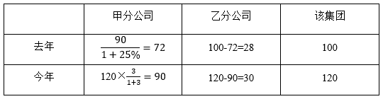
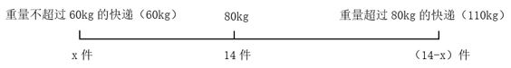
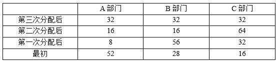

# 2025年江苏名校优生选调素质测试（网友回忆版）

> 数量关系 · 5 题 · 选调 2025

## 第 1 题　qid 19591673 · 数学运算

某电视台为了解观众对体育节目的喜好情况，随机采访了2000名观众。调查结果显示，30%的观众喜欢看篮球节目，40%的观众喜欢看足球节目，50%的观众对篮球节目和足球节目都不喜欢。请问，既喜欢看篮球节目又喜欢看足球节目（即两个节目都喜欢看）的观众有多少人？

- **A**. 100
- **B**. 200
- **C**. 300
- **D**. 400　✅

**答案**：D

**官方解析**

根据题意可知，喜欢看篮球节目的观众有2000×30%=600人，喜欢看足球节目的观众有2000×40%=800人，两个节目都不喜欢看的观众有2000×50%=1000人。根据两集合容斥原理公式：，可得：600+800-两个节目都喜欢看的观众=2000-1000，解得：两个节目都喜欢看的观众=400人。

故正确答案为D。

---

## 第 2 题　qid 19591664 · 数学运算

某建筑装修需要对边长为50cm的正方形瓷砖进行裁剪改造，现从瓷砖一角切下一个直角三角形。已知切下的三角形面积恰好为剩余部分面积的三分之一，若要使切下的直角三角形斜边长度最短，则该斜边的最短长度为多少cm？

- **A**. 
50
　✅
- **B**. 

- **C**. 

- **D**. 
40

**答案**：A

**官方解析**

根据题意可知，，则，即切下的直角三角形面积。设切下的直角三角形的两个直角边长度分别为a、b，可得：，则ab=1250，斜边长度。根据结论：，当a=b时，取最小值2ab。因此，斜边的最短长度cm。

故正确答案为A。

---

## 第 3 题　qid 19591667 · 数学运算

某集团共有甲、乙两个分公司。已知今年该集团的总营业额相较于去年增加了20%，且今年甲公司的营业额是乙公司的三倍。此外，甲公司今年的营业额较去年增加了25%。问乙公司今年的营业额相较于去年增加了多少?

- **A**. 小于4%
- **B**. 4%~6%
- **C**. 6%~8%　✅
- **D**. 大于8%

**答案**：C

**官方解析**

赋值去年该集团的总营业额为100，则今年该集团的总营业额为100×（1+20%）=120。根据题意，可列表如下：

因此，乙公司今年的营业额相较于去年增加了，在C项范围内。

故正确答案为C。

---

## 第 4 题　qid 19591665 · 数学运算

某快递站点有14件快递需要称重运输，经统计，这14件快递平均每件重量为80kg。已知最重的快递不超过110kg，在满足该条件的情况下，请问重量不超过60kg的快递最多有几件?

- **A**. 6
- **B**. 7
- **C**. 8　✅
- **D**. 9

**答案**：C

**官方解析**

方法一：设重量不超过60kg的快递最多有x件，则重量超过80kg的快递最少有（14-x）件。由于这14件快递平均每件重量为80kg，要求重量不超过60kg的快递最多，则不超过60kg的快递均取60kg；同理，重量超过80kg的快递最少，由于最重的快递不超过110kg，则重量超过80kg的快递均取110kg。根据题意可列式：60x+110×（14-x）=80×14，解得x=8.4，问最多，向下取整，即重量不超过60kg的快递最多有8件。

方法二：题目涉及平均数混合问题，可以考虑通过线段法求解。结合题意可画出如下线段图：

总快递数为14件，问重量不超过60kg的快递最多，则重量超过80kg的快递应最少。根据平均数混合口诀“偏向基数较大的”，量（快递数）不超过60kg的尽可能多、超过80kg的尽可能少，因此距离（平均重量与80kg的差距）不超过60kg的平均重量与80kg的差应尽可能小（接近），超过80kg的平均重量与80kg的差应尽可能大（远离），故不超过60kg的平均重量最大取值60kg，超过80kg的平均重量最大取值110kg。

根据“距离与量成反比”，则60kg的快递数：110kg的快递数=（110-80）：（80-60）=3：2，总快递数为14件，则60kg的快递数为，故重量不超过60kg的快递最多有8.4件，向下取整，即最多有8件。

故正确答案为C。

---

## 第 5 题　qid 19591668 · 数学运算

某公司新招聘96名员工，计划将他们分配到A、B、C三个部门。分配过程分为三次进行：第一次，从A部门分出一部分员工给B、C两个部门，使得B、C部门的人数各自增加一倍；第二次，从B部门分出一部分员工给A、C两个部门，使得A、C部门的人数各自增加一倍；第三次，从C部门分出一部分员工给A、B两个部门，使得A、B部门的人数各自增加一倍。经过三次分配后，三个部门的人数恰好相等。请问，最初A部门有多少名员工?

- **A**. 48
- **B**. 52　✅
- **C**. 56
- **D**. 64

**答案**：B

**官方解析**

经过三次分配后，三个部门的人数恰好相等，即均为人。根据题意，倒推如下表：

因此，最初A部门有52名员工。

故正确答案为B。

---
