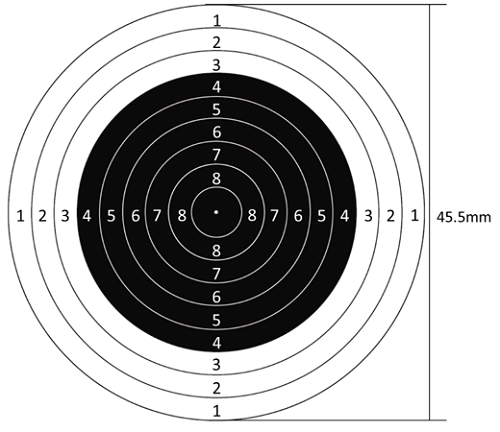
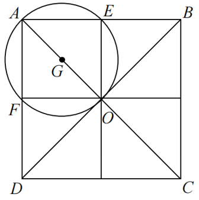
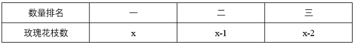

# 2025年江苏省公务员录用考试《行测》题（B类）（网友回忆版）

> 数量关系 · 18 题 · 江苏 2025

## 第 1 题　qid 11226496 · 数学运算

2.32，8.48，18.72，32.108，50.162，（    ）

- **A**. 72.243　✅
- **B**. 72.339
- **C**. 81.243
- **D**. 81.339

**答案**：A

**官方解析**

数列各项均为小数，优先考虑机械划分。整数部分形成数列：2，8，18，32，50，（    ），作差后得到新数列：6，10，14，18，（    ），是公差为4的等差数列，则整数部分下一项为50+18+4=72，排除C、D两项；小数部分形成数列：32，48，72，108，162，（    ），是公比为1.5的等比数列，则小数部分下一项为162×1.5=243，故所求项为72.243。
故正确答案为A。

---

## 第 2 题　qid 11226503 · 数学运算

0，，，，，（    ）

- **A**. 

- **B**. 

- **C**. 

- **D**. 

　✅

**答案**：D

**官方解析**

数列大部分为分数且选项均为分数，考虑分数数列。对数列进行反约分可得：，，，，，（    ）。分母部分为：2，5，10，17，26，（    ），可分别表示为，，，，，（    ），数列底数为：1，2，3，4，5，为连续自然数列，则所求项底数为6，指数均为2，修正项均为+1，则所求项分母部分为；分母部分减去分子部分得到数列：2，3，5，8，13，（    ），是简单递推和数列，下一项为8+13=21，则所求项分子部分为37-21=16。故所求项为。

故正确答案为D。

备注：原数列也可反约分为：，，，，，（    ），分子部分为：0，2，5，9，14，（    ），后项减前项可得：2，3，4，5，（    ），为连续自然数列，下一项为6，则所求项分子部分为14+6=20；分母部分为：2，5，10，17，28，（    ），后项减前项可得：3，5，7，11，（    ），观察发现，3+5-1=7，5+7-1=11，即第一项+第二项-1=第三项，下一项为7+11-1=17，则所求项分母部分为28+17=45。故所求项为。若按此思路答案为C。

按照就简原则和江苏命题规律，粉笔建议选D项。

---

## 第 3 题　qid 13319473 · 数学运算

，，14，，，（    ）

- **A**. 

- **B**. 

- **C**. 

　✅
- **D**. 
23

**答案**：C

**官方解析**

观察数列，有特殊符号“+”，考虑机械划分。原数列可转化为：，，，，，（    ）。“+”之前部分：5，7，11，13，17，（    ），是质数数列，则下一项为19；“+”之后部分：，，，，，（    ），根号下是合数数列，则下一项为。故所求项为。

故正确答案为C。

---

## 第 4 题　qid 13319470 · 数学运算

2024年11月17日，我国自主设计建造的首艘大洋钻探船“梦想”号正式入列，船上建有基础地质、海洋科学、地球物理等实验室。假设这三个实验室各有1项实验需连续重复进行40次。3项科学实验同时开始，且各实验室单次实验时长不变，若基础地质实验结束时，海洋科学实验还有8次未进行，地球物理实验还有16次未进行，则海洋科学实验结束时，地球物理实验尚需进行（    ）。

- **A**. 4次
- **B**. 8次
- **C**. 10次　✅
- **D**. 12次

**答案**：C

**官方解析**

由题意可知，基础地质实验结束时，海洋科学实验完成了40-8=32次，地球物理实验完成了40-16=24次，则在相同时间内海洋科学、地球物理两个实验室完成的实验次数之比为32：24=4：3。当海洋科学实验结束时，地球物理实验已完成次，尚需进行40-30=10次。

故正确答案为C。

---

## 第 5 题　qid 11226506 · 数学运算

在巴黎奥运会男子10米气步枪射击决赛中，江苏选手以252.2环的成绩夺得金牌并打破奥运会记录。10米气步枪射击比赛用的靶纸上有10个同心圆，其中最大圆的直径为45.5mm，相邻两个圆的直径均相差5mm（10环直径为0.5mm）。如果随机向靶纸射击且成绩不为零，那么命中6环及以上的概率：

- **A**. 小于0.15
- **B**. 介于0.15～0.25之间　✅
- **C**. 介于0.25～0.35之间
- **D**. 介于0.35～0.45之间

**答案**：B

**官方解析**

根据题意，靶纸上10个同心圆的直径构成首项为45.5mm、公差为-5mm的等差数列。根据等差数列通项公式：，则6环所处同心圆的直径为45.5+（6-1）×（-5）=20.5mm，半径为mm。根据公式：概率，总情况为随机向靶纸射击且未脱靶，其面积为（）；满足条件的情况为命中6环到10环，即处在6环所处同心圆中，其面积为（），则命中6环及以上的概率，在B项范围内。

故正确答案为B。

---

## 第 6 题　qid 11226492 · 数学运算

今年3月初，小李以月租1万元（月付）的价格租下店面，经营绿色节能家电，店面装修两个月花费11万元。第三个月开始营业，当月纯利润为3万元，若此后每月纯利润都比上月增长10%，则开始盈利的月份是：

- **A**. 6月
- **B**. 7月
- **C**. 8月　✅
- **D**. 9月

**答案**：C

**官方解析**

根据题意可知3月和4月未营业，租金和装修共花费1+1+11=13万元。5月开始营业，纯利润为3万元，且此后每月纯利润都比上月增长10%，所以6月纯利润=3×(1+10%)=3.3万元、7月纯利润=3.3×(1+10%)=3.63万元、8月纯利润=3.63×(1+10%)=3.993万元。3+3.3+3.63+3.993=13.923万元&gt;13万元，则从8月开始盈利。
故正确答案为C。

---

## 第 7 题　qid 11226495 · 数学运算

举办一次菊花展，将42盆某品种的菊花摆放成若干排。若从第二排开始，每一排的菊花盆数都比前一排多1盆，则摆放的方案有：

- **A**. 2种
- **B**. 3种　✅
- **C**. 4种
- **D**. 5种

**答案**：B

**官方解析**

方法一：根据题意，花盆的摆放盆数构成公差为1的等差数列。若数列项数为奇数，则中位数和项数都是正整数，根据公式：。将42进行因数分解，42=2×3×7=14×3=6×7=2×21。当项数为3时，中位数为14，可推出每排摆放的数量分别为13盆、14盆、15盆，满足题意；当项数为7时，中位数为6，可推出每排摆放的数量分别为3盆、4盆、5盆、6盆、7盆、8盆、9盆，满足题意；当项数为21时，中位数为2，但数列前几项有负数项，不满足题意。若数列项数为偶数，则，中位数非整数，根据，整理得：中间两项之和×项数=84，将84进行因数分解，84=2×2×3×7=21×4=7×12=3×28。当项数为4时，中间两项之和为21，数列中间两项为10、11，可推出每排摆放数量分别为9盆、10盆、11盆、12盆，满足题意；当项数为12时，中间两项之和为7，数列中间两项为3、4，但数列前几项有负数项，不满足题意；当项数为28时，中间两项之和为3，数列中间两项为1、2，但数列前几项有负数项，不满足题意。

综上，摆放的方案共有3种。

方法二：设第一排摆放盆，一共摆了n排（n&gt;1），则每排摆放数量分别为：，，，······，，根据等差数列求和公式：，可列式：，整理得：······①，由题意可知n和均为正整数，则n一定是84的因子，84的因子有1、2、3、4、6、7、12、14、21、28、42、84。除1外分别代入①式验证：

若n=2，不是整数，排除；

若n=3，，即摆放3排，每排的盆数分别为13、14、15，满足题意；

若n=4，，即摆放4排，每排的盆数分别为9、10、11、12，满足题意；

若n=6，不是整数，排除；

若n=7，，即摆放7排，每排的盆数分别为3、4、5、6、7、8、9，满足题意；

若n取12或更大值时，可得为负数，均排除。

综上，摆放的方案共有3种。

故正确答案为B。

注释：题干中“若干排”指的是2排及以上，故。

---

## 第 8 题　qid 11226491 · 数学运算

引导车引导运输车队前往某地，途经一座桥梁和一个隧道，引导车与运输车队速度一致，引导车的长度忽略不计。匀速通过800米长的桥梁，引导车需36秒，运输车队需45秒。通过隧道时车速比通过桥梁时下降25%，若引导车需60秒，则运输车队需：

- **A**. 69秒
- **B**. 70秒
- **C**. 72秒　✅
- **D**. 75秒

**答案**：C

**官方解析**

根据火车过桥公式：，可得通过桥梁时车速为米/秒，米。通过隧道时车速为米/秒，则米，运输车队通过隧道需要秒。

故正确答案为C。

---

## 第 9 题　qid 13319477 · 数学运算

某农场使用M、N两架无人机喷洒农药，先由M无人机工作2小时，再由N无人机工作5小时，可喷洒完整片农田；两架无人机同时工作1小时后，有三分之二的农田尚未喷洒。如果仅由M无人机喷洒农药，那么喷洒完整片农田需要（    ）。

- **A**. 3.5小时
- **B**. 4.5小时　✅
- **C**. 5小时
- **D**. 5.5小时

**答案**：B

**官方解析**

用M、N分别表示两架无人机的工作效率，根据题意可得：，化简得M：N=2：1。赋值M无人机的工作效率为2，N无人机的工作效率为1，则喷洒整片农田的工作量为2×2+5×1=9，仅由M无人机喷洒农药，那么喷洒完整片农田需要9÷2=4.5小时。

故正确答案为B。

---

## 第 10 题　qid 11226494 · 数学运算

某单位在边长为200米的正方形广场上组织一场招聘会，计划安排若干名工作人员提供咨询服务，每名工作人员入场后将分别随机站在一个位置上，其服务半径不超过米。若要确保咨询服务全覆盖，则至少需要安排工作人员：

- **A**. 4名　✅
- **B**. 5名
- **C**. 6名
- **D**. 7名

**答案**：A

**官方解析**

如下图所示，正方形广场ABCD边长为200米，则对角线AC、BD长度均为米，由于每名工作人员服务半径不超过米，要想安排的工作人员最少，则每名工作人员服务范围要尽量大，服务半径最大为米，则服务范围最大是一个直径为米的圆。将正方形广场分为4个完全相等的正方形区域，以左上正方形AEOF为例，其对角线AO为米。若1名工作人员站在AO的中点G上，其服务的范围为正方形AEOF的外接圆，恰好覆盖了4个顶点以及4条边。同理，再将3名工作人员分别安排在BO、CO、DO的中点上，就能确保咨询服务全覆盖，则至少需要安排4名工作人员。

故正确答案为A。

---

## 第 11 题　qid 13319472 · 数学运算

某单位组织45名员工参观第十五届中国国际航空航天博览会。其中，21人参观了新一代隐身战斗机歼-35A，22人参观了嫦娥六号取回的月背月壤样品，19人参观了大型无人机战舰“虎鲸”。所有员工中，这三种展览都未参观的有5人，至少参观两种的有12人，则这三种展览都参观的有（    ）。

- **A**. 7人
- **B**. 8人
- **C**. 9人
- **D**. 10人　✅

**答案**：D

**官方解析**

根据题意，设参观两种展览的员工有x人，参观三种展览的员工有y人。根据三集合容斥原理非标准型公式：A+B+C-满足两项-2×满足三项=总数-都不，可列式：21+22+19-x-2y=45-5，整理得：x+2y=22······①；根据“至少参观两种的有12人”，可得：x+y=12······②，①式减②式可得：y=10，故这三种展览都参观的有10人。
故正确答案为D。

---

## 第 12 题　qid 13319480 · 数学运算

一场演出的节目有舞蹈《水韵江苏》、歌曲《让世界充满爱》和《绣红旗》、小品《幸福一家人》、魔术《奇幻之旅》、杂技《力量》。若要求两首歌曲分别作为开头曲和结尾曲，舞蹈与杂技相邻演出，小品和魔术不能相邻演出，则节目演出的排列顺序有（    ）。

- **A**. 8种　✅
- **B**. 12种
- **C**. 18种
- **D**. 24种

**答案**：A

**官方解析**

根据题意，要求两首歌曲分别作为开头曲和结尾曲，有种情况；要求舞蹈与杂技相邻演出，故可先将舞蹈和杂技捆绑起来，由于演出有先后顺序，有种情况；要求小品和魔术不能相邻演出，可用插空法，先将舞蹈和杂技作为整体安排到两首歌曲中间，再将小品和魔术插入中间的2个空中，有种情况。分步用乘法，则共有2×2×2=8种节目演出的排列顺序。

故正确答案为A。

---

## 第 13 题　qid 11226493 · 数学运算

某配送中心负责若干个货箱的分配，如果将货箱平均分配给6个配送点，有3个无法分配；如果将货箱平均分配给11个配送点，恰好分完；如果将货箱平均分配给13个配送点，有2个无法分配。该配送中心负责分配的货箱总共可能有：

- **A**. 231个
- **B**. 429个
- **C**. 561个　✅
- **D**. 759个

**答案**：C

**官方解析**

根据题意可知，该配送中心负责分配的货箱总数减3后是6的整数倍，又是11的整数倍，减2后是13的整数倍，观察选项可知，均为11的整数倍，依次代入选项验证即可：

代入A项：；整数，不符合题意，排除；

代入B项：；整数，不符合题意，排除；

代入C项：；，符合题意，当选。无需验证剩余选项。

故正确答案为C。

---

## 第 14 题　qid 13319482 · 数学运算

用若干玫瑰花制作玫瑰花束，若每束8枝余3枝，9枝余5枝，如果将这些玫瑰花全部用完，制成数量各不相同的3束玫瑰花，那么数量最多的那一束至少有玫瑰花（    ）。

- **A**. 18枝
- **B**. 20枝
- **C**. 21枝　✅
- **D**. 23枝

**答案**：C

**官方解析**

设每束8枝有a束，每束9枝有b束，根据玫瑰花总枝数相同可列式：8a+3=9b+5，整理可得：8a=9b+2。根据奇偶特性可知，8a和2均为偶数，则9b为偶数，即b为偶数。根据要求数量最多的一束玫瑰花最少，那么玫瑰花总枝数要最少，即b取值要尽量小，分情况讨论：

若b=2，则a=2.5，不是整数，不符合题意；

若b=4，则a=4.75，不是整数，不符合题意；

若b=6，则a=7，符合题意，则此时玫瑰花总枝数最少为8×7+3=59枝。要使数量最多的一束玫瑰花枝数最少，则另外两束玫瑰花枝数要尽可能多，设数量最多的一束玫瑰花最少有x枝，又因3束玫瑰花枝数各不相同，可得玫瑰花枝数如下：

根据玫瑰花总共有59枝，可列式：x+x-1+x-2=59，解得，问最少，向上取整21枝。

故正确答案为C。

---

## 第 15 题　qid 13319486 · 数学运算

某地考古出土了一种呈长方体的青铜器，测得其长、宽、高分别为60cm、40cm、60cm。为了防止氧化，有关部门为其做个半球形的保护罩，则该保护罩（厚度忽略不计）的表面积至少为（    ）。

- **A**. 

- **B**. 

- **C**. 

　✅
- **D**. 

**答案**：C

**官方解析**

如图所示，使半球形保护罩既能罩住长方体又表面积最小，则长方体顶点A、B、C、D均与球面相切，O为底面中点，连接OA即为球体的半径。连接，则是长方形对角线的一半，且，，则根据勾股定理，，。因为三角形为直角三角形，且，则根据勾股定理，。根据公式：球体表面积，可得该保护罩的表面积为。

故正确答案为C。

备注： ①本题所求保护罩的表面积不包含底面。因为通常所说的“罩子”是没有底面的，即使罩子有底面，往往底面材质和罩子材质也不一样，会更厚一些，和题目中厚度忽略不计矛盾，故本题答案不能为A。

②由于本题的长方体是文物，因此不能随意调整摆放的情况，即不能以40cm为高算最值，故本题答案不能为D。

---

## 第 16 题　qid 11226498 · 数学运算

为了丰富居民的业余生活，区政府拟在花苑小区西面围墙外的空地上，修建一个矩形文化广场，广场的一边为小区围墙。现沿广场周边植树，相邻两棵树、最东边的树与围墙的间隔最多为4m，且远离围墙的两个角上都植树。已知围墙一侧无需植树，最终共植树63棵，那么文化广场的最大面积为：

- **A**. 7442
- **B**. 7848
- **C**. 8192　✅
- **D**. 8498

**答案**：C

**官方解析**

由题意可知，相邻两棵树、最东边的树与围墙的间隔取最大值4m时，文化广场的边长最大，此时文化广场的面积最大。设与围墙相垂直的两条边均植树x棵，则与围墙相垂直的边长均为4xm。由于围墙一侧无需植树且最终共植树63棵，则与围墙相平行的边植树63-2x+2=（65-2x）棵，则与围墙相平行的边长为。设文化广场的面积为，则，令y=0，解得，，当时，y取最大值。则文化广场的最大面积为。

故正确答案为C。

---

## 第 17 题　qid 13319483 · 数学运算

某5A级景区门票90元/人，教师免票、大学生半票，乘坐索道另付70元/人。某校教师和大学生共110人到该景区研学，若支付的门票和索道费共11750元，则参与研学的教师有（    ）。

- **A**. 6人
- **B**. 10人或20人
- **C**. 10人
- **D**. 6人或20人　✅

**答案**：D

**官方解析**

设参与研学的教师有x人，则参与研学的大学生有（110-x）人；设乘坐索道的有y人，则未乘坐索道的有（110-y）人。根据题意，大学生半票后为元/人，则门票费共元；索道费共70y元。根据“若支付的门票和索道费共11750元”，可列方程45×（110-x）+70y=11750，整理得14y-9x=1360。优先考虑代入选项进行验证，代入x=6，解得y=101，符合题意；代入x=10，解得，为非整数，不符合题意，排除；代入x=20，解得y=110，符合题意。综上，参与研学的教师有6人或20人。

故正确答案为D。

备注：此题表述不太严谨，可以选择乘坐索道也可以选择不乘坐索道，若更改表述为“若乘坐索道另付70元/人”，会更加严谨。

---

## 第 18 题　qid 13319485 · 数学运算

某科技园区计划铺设电缆联通A、B、C、D、E、F六栋办公楼，可以铺设电缆的线路如下图所示，每条边上的数字表示两栋楼之间线路的长度（单位：10米），则铺设电缆的总长度最短是（    ）。

- **A**. 280米
- **B**. 290米　✅
- **C**. 310米
- **D**. 350米

**答案**：B

**官方解析**

若要铺设电缆总长度最短，则铺设的线路应尽量少且每条线路的长度应尽量短。六栋办公楼，最少需要5条线路即可联通。最短路径优先，选择AB、AC、CF、BE、AD，此时六栋楼均被连通且铺设电缆的总长度最短，故所求为（4+5+6+7+7）×10=290米。
故正确答案为B。

---
