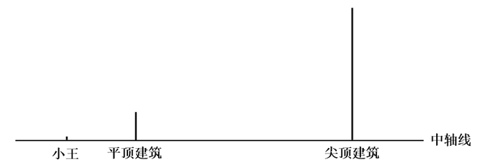
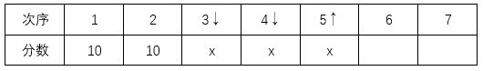
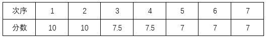
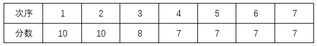
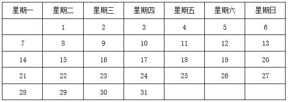

# 2025年江苏省公务员录用考试《行测》题（C类）（网友回忆版）

> 数量关系 · 19 题 · 江苏 2025

## 第 1 题　qid 11226690 · 数学运算

-4，-3，1，10，26，（    ）

- **A**. 38
- **B**. 51　✅
- **C**. 77
- **D**. 73

**答案**：B

**官方解析**

数列无明显特征，优先考虑多级数列。后项-前项可得新数列：1，4，9，16，（    ），新数列各项均为幂次数，可转化为，，，，（    ），底数为连续自然数列，指数均为2，则新数列下一项为，故所求项为26+25=51。

故正确答案为B。

---

## 第 2 题　qid 11226496 · 数学运算

2.32，8.48，18.72，32.108，50.162，（    ）

- **A**. 72.243　✅
- **B**. 72.339
- **C**. 81.243
- **D**. 81.339

**答案**：A

**官方解析**

数列各项均为小数，优先考虑机械划分。整数部分形成数列：2，8，18，32，50，（    ），作差后得到新数列：6，10，14，18，（    ），是公差为4的等差数列，则整数部分下一项为50+18+4=72，排除C、D两项；小数部分形成数列：32，48，72，108，162，（    ），是公比为1.5的等比数列，则小数部分下一项为162×1.5=243，故所求项为72.243。
故正确答案为A。

---

## 第 3 题　qid 11226696 · 数学运算

-2，0，1，，，（    ）

- **A**. 

- **B**. 

- **C**. 

- **D**. 

　✅

**答案**：D

**官方解析**

方法一：数列部分存在分数且选项均为分数，优先考虑分数数列。对数列进行反约分可得：，，，，，（    ），分子部分为：，0，1，3，7，（    ），后项减前项可得：，1，2，4，（    ），是公比为2的等比数列，则下一项为4×2=8，即分子的下一项为7+8=15；分母为，，1，2，4，（    ），是公比为2的等比数列，则分母的下一项为4×2=8。故所求项为。

方法二：观察数列无明显特征，考虑多级数列。后项-前项得到新数列：2，1，，，（    ），是公比为的等比数列，则下一项为。故所求项为。

方法三：观察数列无明显特征，考虑递推数列。观察发现：-2÷2+1=0，0÷2+1=1，，，规律为：第一项÷2+1=第二项，故所求项为。

故正确答案为D。

---

## 第 4 题　qid 13319473 · 数学运算

，，14，，，（    ）

- **A**. 

- **B**. 

- **C**. 

　✅
- **D**. 
23

**答案**：C

**官方解析**

观察数列，有特殊符号“+”，考虑机械划分。原数列可转化为：，，，，，（    ）。“+”之前部分：5，7，11，13，17，（    ），是质数数列，则下一项为19；“+”之后部分：，，，，，（    ），根号下是合数数列，则下一项为。故所求项为。

故正确答案为C。

---

## 第 5 题　qid 13319470 · 数学运算

2024年11月17日，我国自主设计建造的首艘大洋钻探船“梦想”号正式入列，船上建有基础地质、海洋科学、地球物理等实验室。假设这三个实验室各有1项实验需连续重复进行40次。3项科学实验同时开始，且各实验室单次实验时长不变，若基础地质实验结束时，海洋科学实验还有8次未进行，地球物理实验还有16次未进行，则海洋科学实验结束时，地球物理实验尚需进行（    ）。

- **A**. 4次
- **B**. 8次
- **C**. 10次　✅
- **D**. 12次

**答案**：C

**官方解析**

由题意可知，基础地质实验结束时，海洋科学实验完成了40-8=32次，地球物理实验完成了40-16=24次，则在相同时间内海洋科学、地球物理两个实验室完成的实验次数之比为32：24=4：3。当海洋科学实验结束时，地球物理实验已完成次，尚需进行40-30=10次。

故正确答案为C。

---

## 第 6 题　qid 13319471 · 数学运算

在巴黎奥运会男子10米气步枪射击决赛中，江苏选手以252.2环的成绩夺得金牌并打破奥运会纪录。10米气步枪射击比赛用的靶纸上有10个同心圆，最大圆的直径为45.5mm，相邻两个圆的直径均相差5mm（10环直径为0.5mm），如果随机向靶纸射击且未脱靶。那么命中6环到6.9环的概率（    ）。

- **A**. 小于0.1　✅
- **B**. 介于0.1~0.2之间
- **C**. 介于0.2~0.3之间
- **D**. 介于0.3~0.4之间

**答案**：A

**官方解析**

根据题意，靶纸如下图所示：

靶纸上10个同心圆的直径构成首项为45.5mm、公差为-5mm的等差数列。根据等差数列通项公式：，则6环所处同心圆的直径为45.5+（6-1）×（-5）=20.5mm，半径为mm；7环所处同心圆的直径为20.5-5=15.5mm，半径为mm。

根据公式：概率P，总情况为随机向靶纸射击且未脱靶，其面积为（）；满足条件的情况为命中6环到6.9环，即处在6环所在圆环中，其面积为（），则命中6环到6.9环的概率P，只有A项符合。

故正确答案为A。

---

## 第 7 题　qid 13319472 · 数学运算

某单位组织45名员工参观第十五届中国国际航空航天博览会。其中，21人参观了新一代隐身战斗机歼-35A，22人参观了嫦娥六号取回的月背月壤样品，19人参观了大型无人机战舰“虎鲸”。所有员工中，这三种展览都未参观的有5人，至少参观两种的有12人，则这三种展览都参观的有（    ）。

- **A**. 7人
- **B**. 8人
- **C**. 9人
- **D**. 10人　✅

**答案**：D

**官方解析**

根据题意，设参观两种展览的员工有x人，参观三种展览的员工有y人。根据三集合容斥原理非标准型公式：A+B+C-满足两项-2×满足三项=总数-都不，可列式：21+22+19-x-2y=45-5，整理得：x+2y=22······①；根据“至少参观两种的有12人”，可得：x+y=12······②，①式减②式可得：y=10，故这三种展览都参观的有10人。
故正确答案为D。

---

## 第 8 题　qid 13319476 · 数学运算

借景是古典园林建筑常用的构景手段之一，已知某景区中轴线（在同一水平面）上有两座相距200米的建筑物，其中一座建筑物为平顶，高度为23.7米；另一座建筑物为顶尖，高度为133.7米，其中顶尖的部分高度为22米。若身高为1.7米的小王从中轴线上某处看向平顶建筑物时，发现恰好能够看到尖顶建筑物的整个尖顶部分（如图所示）。则小王所站位置和平顶建筑物的直线距离为（    ）。

- **A**. 30米
- **B**. 40米
- **C**. 50米　✅
- **D**. 60米

**答案**：C

**官方解析**

根据题意可作图如下，令小王身高为BC、平顶建筑为DE、尖顶建筑为FH，过点C作垂线交ED于M点，过点E作垂线交FH于N点。平顶建筑（DE）、尖顶建筑（FH）、小王（BC）在同一水平面上，即，则。因此，，则······①。根据下图可知，EN=DF=200米，ME=DE-DM=DE-BC=23.7-1.7=22米，NG=FH-FN-GH=FH-DE-GH=133.7-23.7-22=88米，代入①式可得：，解得CM=50米，即BD=50米，故小王所站位置和平顶建筑物的直线距离为50米。

故正确答案为C。

---

## 第 9 题　qid 13319474 · 数学运算

为探访诗意乡村，聆听城市脉搏，父子两人报名参加半程马拉松，已知上坡路段父亲的速度是儿子的1.2倍，下坡路段父亲的速度是儿子的80%，其他路段两人速度相同，结果父子同时到达终点，若上、下坡路段的距离之比为1：2，则父亲上、下坡路段的速度之比为（    ）。

- **A**. 1：3
- **B**. 2：5
- **C**. 5：12
- **D**. 1：2　✅

**答案**：D

**官方解析**

设上坡路段儿子的速度为x，则父亲的速度为1.2x；设下坡路段儿子的速度为y，则父亲的速度为0.8y；赋值上、下坡路段的距离分别为1、2。根据“父子同时到达终点”，可列式：，化简可得：y=3x，则父亲上、下坡路段的速度之比为。

故正确答案为D。

---

## 第 10 题　qid 13319477 · 数学运算

某农场使用M、N两架无人机喷洒农药，先由M无人机工作2小时，再由N无人机工作5小时，可喷洒完整片农田；两架无人机同时工作1小时后，有三分之二的农田尚未喷洒。如果仅由M无人机喷洒农药，那么喷洒完整片农田需要（    ）。

- **A**. 3.5小时
- **B**. 4.5小时　✅
- **C**. 5小时
- **D**. 5.5小时

**答案**：B

**官方解析**

用M、N分别表示两架无人机的工作效率，根据题意可得：，化简得M：N=2：1。赋值M无人机的工作效率为2，N无人机的工作效率为1，则喷洒整片农田的工作量为2×2+5×1=9，仅由M无人机喷洒农药，那么喷洒完整片农田需要9÷2=4.5小时。

故正确答案为B。

---

## 第 11 题　qid 13319475 · 数学运算

某市正在深入推进“智改数转网联”升级行动计划，力争实现全市规模以上企业全覆盖。目前，全市规模以上企业2080家，其中未完成升级的规模以上企业比已完成升级的多0.6倍，那么已完成升级的规模以上企业有（    ）。

- **A**. 780家
- **B**. 800家　✅
- **C**. 1280家
- **D**. 1300家

**答案**：B

**官方解析**

设已完成升级的规模以上企业有x家，则未完成升级的规模以上企业有（1+0.6）x=1.6x家。根据题意可得：x+1.6x=2080，解得x=800。
故正确答案为B。

---

## 第 12 题　qid 13319478 · 数学运算

甲、乙两瓶质量和浓度均相同的酒精溶液，在甲瓶中加入20克水、乙瓶中加入50克浓度为30%的酒精溶液后，浓度仍然相等。若继续在甲瓶中加入30克纯酒精，溶液又恢复到最初浓度，则乙瓶酒精溶液最初的质量是（    ）。

- **A**. 100克　✅
- **B**. 110克
- **C**. 120克
- **D**. 150克

**答案**：A

**官方解析**

设甲、乙两瓶酒精溶液最初的质量均为m克，浓度均为n。根据题意可知：在甲瓶中加入20克水后，继续在甲瓶中加入30克纯酒精，溶液又恢复到最初浓度。结合公式：浓度，可列式：，解得n=60%；根据“在甲瓶中加入20克水、乙瓶中加入50克浓度为30%的酒精溶液后，浓度仍然相等”，可列式：。

方法一：根据公式：，可将方程化简为：，解得m=100。

方法二：方程正面求解比较复杂，可将选项代入验证，代入A项：，等式成立，符合题意，当选。

故正确答案为A。

---

## 第 13 题　qid 13319480 · 数学运算

一场演出的节目有舞蹈《水韵江苏》、歌曲《让世界充满爱》和《绣红旗》、小品《幸福一家人》、魔术《奇幻之旅》、杂技《力量》。若要求两首歌曲分别作为开头曲和结尾曲，舞蹈与杂技相邻演出，小品和魔术不能相邻演出，则节目演出的排列顺序有（    ）。

- **A**. 8种　✅
- **B**. 12种
- **C**. 18种
- **D**. 24种

**答案**：A

**官方解析**

根据题意，要求两首歌曲分别作为开头曲和结尾曲，有种情况；要求舞蹈与杂技相邻演出，故可先将舞蹈和杂技捆绑起来，由于演出有先后顺序，有种情况；要求小品和魔术不能相邻演出，可用插空法，先将舞蹈和杂技作为整体安排到两首歌曲中间，再将小品和魔术插入中间的2个空中，有种情况。分步用乘法，则共有2×2×2=8种节目演出的排列顺序。

故正确答案为A。

---

## 第 14 题　qid 13319486 · 数学运算

某地考古出土了一种呈长方体的青铜器，测得其长、宽、高分别为60cm、40cm、60cm。为了防止氧化，有关部门为其做个半球形的保护罩，则该保护罩（厚度忽略不计）的表面积至少为（    ）。

- **A**. 

- **B**. 

- **C**. 

　✅
- **D**. 

**答案**：C

**官方解析**

如图所示，使半球形保护罩既能罩住长方体又表面积最小，则长方体顶点A、B、C、D均与球面相切，O为底面中点，连接OA即为球体的半径。连接，则是长方形对角线的一半，且，，则根据勾股定理，，。因为三角形为直角三角形，且，则根据勾股定理，。根据公式：球体表面积，可得该保护罩的表面积为。

故正确答案为C。

备注： ①本题所求保护罩的表面积不包含底面。因为通常所说的“罩子”是没有底面的，即使罩子有底面，往往底面材质和罩子材质也不一样，会更厚一些，和题目中厚度忽略不计矛盾，故本题答案不能为A。

②由于本题的长方体是文物，因此不能随意调整摆放的情况，即不能以40cm为高算最值，故本题答案不能为D。

---

## 第 15 题　qid 13319481 · 数学运算

某场国际跳水比赛设有7名裁判，分别给运动员每一跳打分，所打分数均为0.5的整数倍，且最低为0分，最高为10分。运动员每一跳得分的具体计算规则为：去掉两个最高分和两个最低分，剩下的3个分数之和乘以难度系数即为这一跳的得分。若某运动员第一跳的难度系数为3.0，得分为66分，则7名裁判给这名运动员第一跳打分的平均数最多为（    ）。

- **A**. 7.5分
- **B**. 7.8分
- **C**. 8.0分　✅
- **D**. 8.2分

**答案**：C

**官方解析**

根据题意：中间三个分数之和×3=66，可知中间三个分数之和为22。要使7名裁判打分的平均数最多，则需让其他4名裁判打的分数尽量多。第一、第二高的两个分数最高可取10分，第六、第七高的分数最多可与第五高的分数相同，故应让第五高的分数尽量高。设第五高的分数为x，因为中间三个分数（第三、第四、第五）总和为定值22，若想第五高的分数x尽量高，则第三、第四高的分数应尽量低，列表构造如下：

则有3x=22，解得，因为裁判所打分数均为0.5的整数倍，故第五高的分数最高取7分。第六、第七高的分数最多也均可取7分。此时具体分数如下：

或者

此时7名裁判给这名运动员第一跳打分的平均数最多为分。

故正确答案为C。

---

## 第 16 题　qid 13319482 · 数学运算

用若干玫瑰花制作玫瑰花束，若每束8枝余3枝，9枝余5枝，如果将这些玫瑰花全部用完，制成数量各不相同的3束玫瑰花，那么数量最多的那一束至少有玫瑰花（    ）。

- **A**. 18枝
- **B**. 20枝
- **C**. 21枝　✅
- **D**. 23枝

**答案**：C

**官方解析**

设每束8枝有a束，每束9枝有b束，根据玫瑰花总枝数相同可列式：8a+3=9b+5，整理可得：8a=9b+2。根据奇偶特性可知，8a和2均为偶数，则9b为偶数，即b为偶数。根据要求数量最多的一束玫瑰花最少，那么玫瑰花总枝数要最少，即b取值要尽量小，分情况讨论：

若b=2，则a=2.5，不是整数，不符合题意；

若b=4，则a=4.75，不是整数，不符合题意；

若b=6，则a=7，符合题意，则此时玫瑰花总枝数最少为8×7+3=59枝。要使数量最多的一束玫瑰花枝数最少，则另外两束玫瑰花枝数要尽可能多，设数量最多的一束玫瑰花最少有x枝，又因3束玫瑰花枝数各不相同，可得玫瑰花枝数如下：

根据玫瑰花总共有59枝，可列式：x+x-1+x-2=59，解得，问最少，向上取整21枝。

故正确答案为C。

---

## 第 17 题　qid 13319483 · 数学运算

某5A级景区门票90元/人，教师免票、大学生半票，乘坐索道另付70元/人。某校教师和大学生共110人到该景区研学，若支付的门票和索道费共11750元，则参与研学的教师有（    ）。

- **A**. 6人
- **B**. 10人或20人
- **C**. 10人
- **D**. 6人或20人　✅

**答案**：D

**官方解析**

设参与研学的教师有x人，则参与研学的大学生有（110-x）人；设乘坐索道的有y人，则未乘坐索道的有（110-y）人。根据题意，大学生半票后为元/人，则门票费共元；索道费共70y元。根据“若支付的门票和索道费共11750元”，可列方程45×（110-x）+70y=11750，整理得14y-9x=1360。优先考虑代入选项进行验证，代入x=6，解得y=101，符合题意；代入x=10，解得，为非整数，不符合题意，排除；代入x=20，解得y=110，符合题意。综上，参与研学的教师有6人或20人。

故正确答案为D。

备注：此题表述不太严谨，可以选择乘坐索道也可以选择不乘坐索道，若更改表述为“若乘坐索道另付70元/人”，会更加严谨。

---

## 第 18 题　qid 13319490 · 数学运算

小张打羽毛球膝盖受伤，需每隔4天去医院做一次理疗，如果他7月2日去，则7月的理疗有1次在星期六、1次在星期日，其余都在工作日；如果他7月3日去，则7月的理疗只有1次在星期日，其余都在工作日，那么7月31日是（    ）。

- **A**. 星期四　✅
- **B**. 星期三
- **C**. 星期二
- **D**. 星期一

**答案**：A

**官方解析**

小张每隔4天去医院做一次理疗，即每5天做一次理疗。如果7月2日去做理疗，则7月做理疗的日期分别为2日、7日、12日、17日、22日、27日；如果7月3日去做理疗，则7月做理疗的日期分别为3日、8日、13日、18日、23日、28日，代入选项：

A项：7月31日是星期四，则7月日历如下表所示：

即7月2日为星期三，7日为星期一，12日为星期六，17日为星期四，22日为星期二，27日为星期日，满足“如果他7月2日去，则7月的理疗有1次在星期六、1次在星期日，其余都在工作日”的条件；7月3日为星期四，8日为星期二，13日为星期日，18日为星期五，23日为星期三，28日为星期一，满足“如果他7月3日去，则7月的理疗只有1次在星期日，其余都在工作日”的条件。满足所有条件，当选。其他选项无需验证。

故正确答案为A。

---

## 第 19 题　qid 13319485 · 数学运算

某科技园区计划铺设电缆联通A、B、C、D、E、F六栋办公楼，可以铺设电缆的线路如下图所示，每条边上的数字表示两栋楼之间线路的长度（单位：10米），则铺设电缆的总长度最短是（    ）。

- **A**. 280米
- **B**. 290米　✅
- **C**. 310米
- **D**. 350米

**答案**：B

**官方解析**

若要铺设电缆总长度最短，则铺设的线路应尽量少且每条线路的长度应尽量短。六栋办公楼，最少需要5条线路即可联通。最短路径优先，选择AB、AC、CF、BE、AD，此时六栋楼均被连通且铺设电缆的总长度最短，故所求为（4+5+6+7+7）×10=290米。
故正确答案为B。

---
